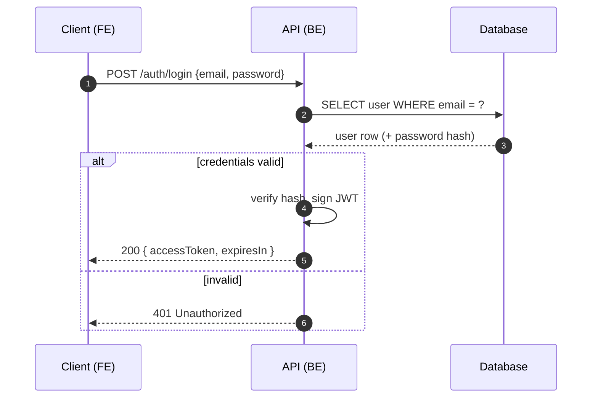
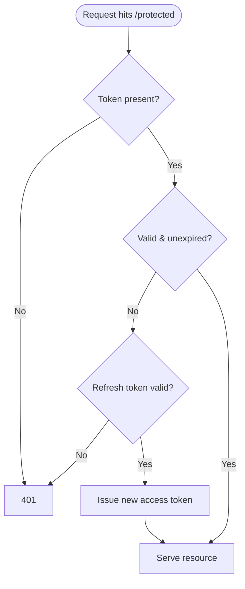
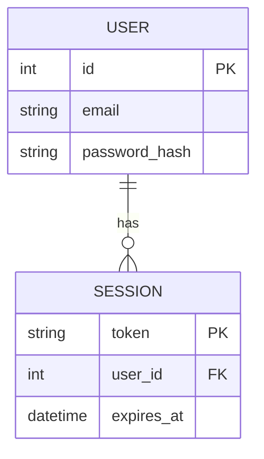
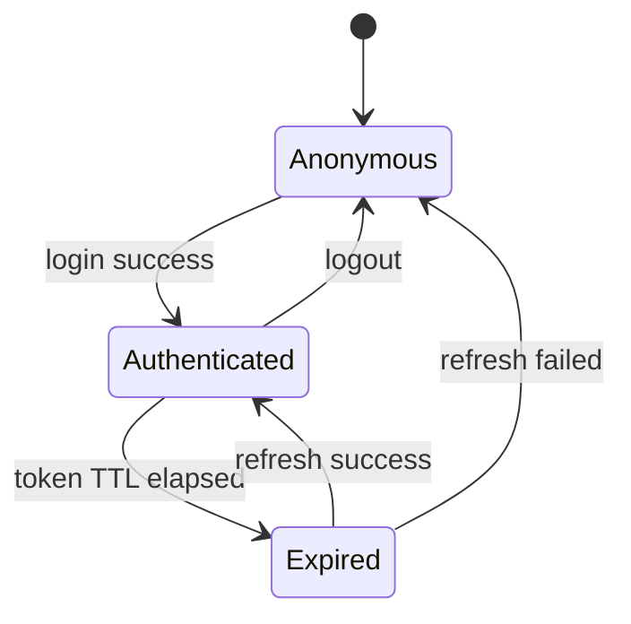
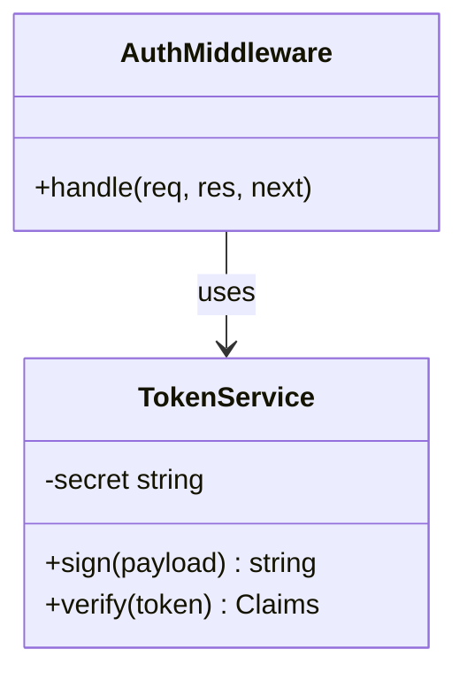

# Mermaid diagrams for code documentation

How to embed Mermaid in Markdown, which diagram type to reach for, and copy-pasteable syntax for each.

## Embedding mechanic

A Mermaid diagram is a fenced code block tagged `mermaid`. Renderers that support it (GitHub, GitLab,
Obsidian with the core Mermaid plugin, VS Code preview, MkDocs/Docusaurus with a plugin) render it as a
diagram. Plain renderers show it as a code block.

````markdown

````

**Portability:** Chrome "print to PDF" on a raw Markdown file does **not** render Mermaid — it prints the
code. If the doc's destination is PDF or any non-Mermaid renderer, pre-render with `mermaid-cli`
(`npx @mermaid-js/mermaid-cli -i diagram.mmd -o diagram.svg`) and embed the SVG/PNG as an image instead.

## Picking the diagram type

| You're showing… | Use | Why |
| --- | --- | --- |
| A request/response round-trip across services over time (login, checkout, API call) | `sequenceDiagram` | Shows ordered messages between actors — the natural fit for "how FE and BE talk" |
| Branching decision logic (valid? expired? authorized?) | `flowchart` / `graph TD` | Shows decisions and paths |
| A data model / tables and relationships | `erDiagram` | Entities, attributes, cardinality |
| A lifecycle with discrete states (session, order, job) | `stateDiagram-v2` | States and transitions |
| Class/module structure and relationships (OOP) | `classDiagram` | Fields, methods, inheritance |
| High-level system/component layout | `flowchart LR` | Boxes and connections at a glance |

For most features documented here (auth, payments, any endpoint-backed flow) you'll want a
**sequence diagram** for the round-trip and often a **flowchart** alongside it for the decision logic.

---

## Sequence diagram (most common pick)



- `->>` solid arrow (call), `-->>` dashed (response).
- `alt / else / end` for conditional branches; `loop ... end` for repetition; `Note over X: text` for asides.
- `autonumber` adds step numbers.

## Flowchart (decision logic)



- Directions: `TD`/`TB` top-down, `LR` left-right.
- Node shapes: `[box]`, `(rounded)`, `([stadium])`, `{diamond/decision}`, `[(database)]`, `((circle))`.
- Edge labels: `A -- label --> B` or `A -->|label| B`.

## ER diagram (data model)



- Cardinality: `||` exactly one, `o{` zero-or-many, `|{` one-or-many.
- Mark keys with `PK` / `FK`.

## State diagram (lifecycle)



## Class diagram (OOP structure)



---

## Gotchas

- **Reserved characters in labels.** Parentheses, colons, and quotes in node text can break parsing. Wrap
  the label in double quotes: `A["GET /users (paginated)"]`.
- **One diagram, one concern.** A 40-node flowchart is unreadable. Split into a high-level diagram plus
  focused sub-diagrams rather than one giant graph.
- **Validate.** If a diagram won't render, check for an unquoted special character or a stray arrow first —
  those are the usual culprits. `https://mermaid.live` is a quick way to test a block in isolation.
