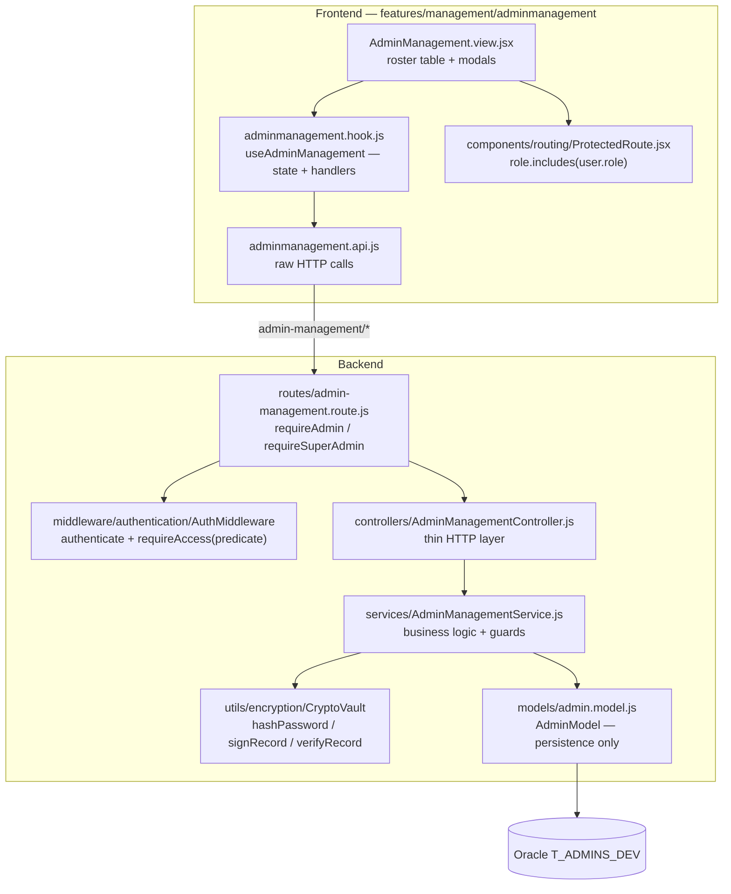
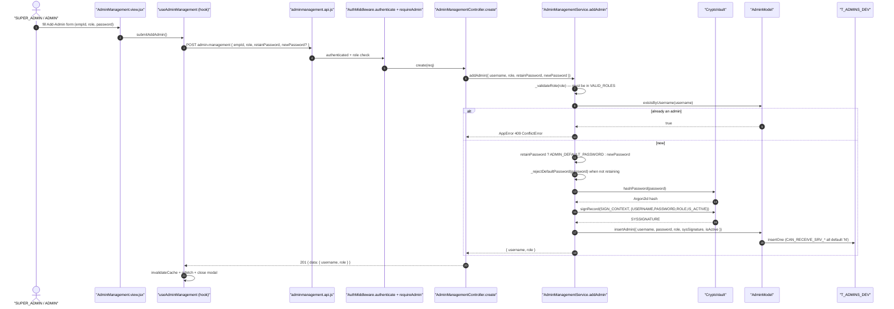
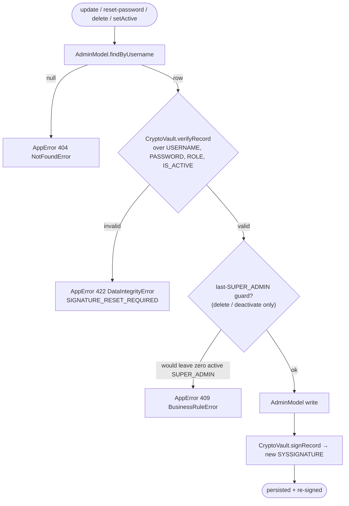
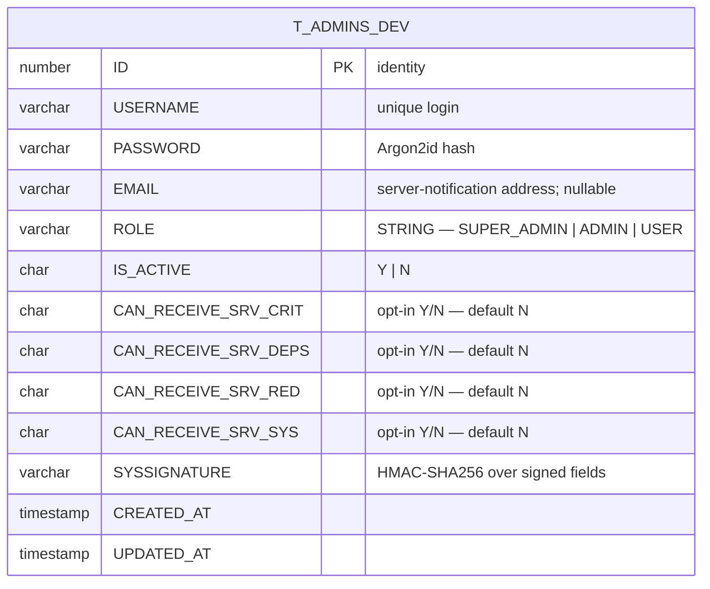

# Admin Management & RBAC — Technical Documentation

> **Scope:** how the CATHERINE template provisions privileged accounts and enforces role-based access control (RBAC) — the `T_ADMINS_DEV` table, its tamper-evident `SYSSIGNATURE`, the string role vocabulary (`SUPER_ADMIN` / `ADMIN` / `USER`), the admin-management CRUD path across both surfaces, and the `requireAccess(predicate)` mechanism that every protected route states inline.
> **Source:** `Backend/` (Node.js + Express v5 API) and `Frontend/` (React 19 + Vite SPA). Core is `Backend/src/controllers/AdminManagementController.js`, `Backend/src/services/AdminManagementService.js`, `Backend/src/models/admin.model.js`, `Backend/src/routes/admin-management.route.js`, `Backend/sql/03_alter_admins_notification_columns.sql`; the presentation layer is `Frontend/src/features/management/adminmanagement/` and `Frontend/src/components/routing/ProtectedRoute.jsx`.
> **Generated:** 2026-09-04. **Authority:** the code. Where `CLAUDE.md`, a JSDoc block, a source comment or a reference-view claim disagrees with the code, the code wins and the disagreement is recorded in [§7.5](#75-known-documentation-drift).
> **Rendering:** the ```mermaid fences below render in GitHub, GitLab, Obsidian and VS Code preview. A plain Markdown→PDF path (Chrome "print to PDF") will print them as code — pre-render with `npx @mermaid-js/mermaid-cli` if you need a PDF.

---

## 1. Overview

Privileged accounts live in a single Oracle table, `T_ADMINS_DEV`. Each row carries a `USERNAME`, an Argon2id `PASSWORD` hash, a **string** `ROLE`, an `IS_ACTIVE` flag (`'Y'`/`'N'`), an optional `EMAIL`, four `CAN_RECEIVE_SRV_*` notification opt-in flags, and an HMAC-SHA256 `SYSSIGNATURE` computed over a fixed field set. There is no numeric permission level stored on the row and no role table — the role **is** the string, and the canonical set the service accepts is exactly `["ADMIN", "SUPER_ADMIN", "USER"]` (`AdminManagementService.js` `VALID_ROLES`). Any other value is rejected with a `400` before it reaches the database (`AdminManagementService._validateRole`).

Every write to the table is guarded twice. First, the caller's `SYSSIGNATURE` is verified before the mutation runs — `AdminManagementService._fetchAndVerify` recomputes the HMAC over `{ USERNAME, PASSWORD, ROLE, IS_ACTIVE }` (`AdminModel.buildSignedFields`) and refuses the operation with a `422 DataIntegrityError` if the stored signature does not match. A row edited directly in the database therefore cannot be updated, deleted, or deactivated until its signature is repaired. Second, after every successful mutation the service re-signs the row with `CryptoVault.signRecord` so the signature stays valid across the change. The signature is namespaced to the table name (`SIGN_CONTEXT = "T_ADMINS_DEV"`) so it cannot be replayed against another table.

Authorization is not a fixed table either. `AuthMiddleware.requireAccess(predicate)` is a factory: each route states its own rule inline as a function of the decoded JWT's string `role`. The admin-management router mounts two predicates — `requireAdmin` (`role === "ADMIN" || role === "SUPER_ADMIN"`) applied to the whole router, and `requireSuperAdmin` (`role === "SUPER_ADMIN"`) overriding it on the permission-flags path (`admin-management.route.js:38-58`). On the frontend the equivalent gate is `ProtectedRoute role={[...]}`, whose check is a plain string membership test — `role.includes(user.role)` where `user.role` is `"SUPER_ADMIN" | "ADMIN" | "USER"` (`ProtectedRoute.jsx:54-55`).

Two safety invariants sit on top of the CRUD. The **last-super-admin guard** counts other active `SUPER_ADMIN` rows before a delete or a deactivation and refuses the operation with a `409` if it would leave zero (`AdminManagementService.deleteAdmin`, `AdminManagementService.setActive`). And the **default-password guard** rejects any new password equal to `ADMIN_DEFAULT_PASSWORD` (`_rejectDefaultPassword`, a CWE-1393 mitigation) so an operator can never *set* the reset default as a real credential.

The frontend feature follows the template's three-layer split: `adminmanagement.api.js` (raw HTTP), `adminmanagement.hook.js` (state + handlers, `useAdminManagement`), and `AdminManagement.view.jsx` (presentation). The view renders a roster table with per-row role, status, and integrity badges, and a set of confirmation modals for create / edit / reset-password / reset-signature / delete.

There is deliberately **no `/auth/register`** — accounts are provisioned only through this router (`Backend/CLAUDE.md` §Route Conventions).

---

## 2. Flow & Architecture

### 2.1 The layer map



The controller is a thin HTTP layer with no business logic and no direct DB access (`AdminManagementController.js` header) — it unpacks the request, calls the matching `AdminManagementService` method, and wraps the result in `sendSuccess`. All the rules — role validation, signature verify/re-sign, the guards — live in the service. The model only persists; the caller computes hashes and signatures and passes them in (`admin.model.js` header).

### 2.2 Creating an admin



Two facts are load-bearing. The password source is decided server-side: when `retainPassword` is true the row is seeded with `ADMIN_DEFAULT_PASSWORD` from the environment; only when it is false does a caller-supplied `newPassword` apply, and that value is run through `_rejectDefaultPassword` first. And the four `CAN_RECEIVE_SRV_*` opt-in flags are always inserted as `'N'` — a newly created admin is never silently subscribed to any server-notification channel (`admin.model.js` `insertAdmin`).

### 2.3 The signature gate on every mutating operation



`resetSignature` is the deliberate exception to the gate: it is the repair path. It fetches the row **without** verifying (`AdminManagementService.resetSignature`), recomputes the HMAC over the current field values, and writes the fresh `SYSSIGNATURE` — turning a `422`-rejected "tampered" row back into a usable one. Every other write goes through `_fetchAndVerify` first.

---

## 3. The admin table — `T_ADMINS_DEV`



The columns and their projection are in `admin.model.js` (`PROJECTION`, `insertAdmin`).

### 3.1 The signed field set — the tamper boundary

`SYSSIGNATURE` is an HMAC over **exactly** four columns: `{ USERNAME, PASSWORD, ROLE, IS_ACTIVE }` (`admin.model.js` `buildSignedFields`). This set is the tamper boundary. `EMAIL` and the four `CAN_RECEIVE_SRV_*` flags are deliberately **outside** it, so an operator can toggle a notification opt-in or set an address without re-signing the row — and, critically, an existing signature stays valid after those columns are added or changed (`AdminModel.setNotifyFlags` writes without recomputing). Widening the signed set is a breaking change that requires re-signing every row.

### 3.2 The additive migration — `03_alter_admins_notification_columns.sql`

A `T_ADMINS_DEV` created before `EMAIL` and the four opt-in flags were added to `01_schema.sql` will fail admin lookup with `ORA-00904: "CAN_RECEIVE_SRV_SYS": invalid identifier` — Oracle reports only the *first* invalid identifier, so that one error can hide all five missing columns (`03_alter_admins_notification_columns.sql` header). The migration is the fix: it is **additive only** — it never drops the table (re-running `01_schema.sql` would, destroying existing accounts and audit history) — and it is **idempotent**, checking `USER_TAB_COLUMNS` / `USER_CONSTRAINTS` before every `ADD`, so it is safe to run repeatedly and safe against an already-current table. Each opt-in column is added `CHAR(1) DEFAULT 'N' NOT NULL` (deny by default) with a matching `IN ('Y','N')` check constraint. Because none of the added columns are in the signed field set (§3.1), existing `SYSSIGNATURE`s remain valid and no row reads as tampered after the migration.

A fresh install does not need this file — `01_schema.sql` already declares every column.

---

## 4. The role vocabulary — roles are strings

The role is a **string**, never a number, everywhere it appears:

| Layer | Where | Values |
| ----- | ----- | ------ |
| Storage | `T_ADMINS_DEV.ROLE` | `SUPER_ADMIN`, `ADMIN`, `USER` |
| Service validation | `AdminManagementService.VALID_ROLES` | `["ADMIN", "SUPER_ADMIN", "USER"]` |
| JWT claim | `user.role` in the decoded token | the string above |
| Route predicate | `AuthMiddleware.requireAccess((user) => user.role === "SUPER_ADMIN")` | string compare |
| Frontend gate | `ProtectedRoute role={[ROLES.SADMIN]}` → `role.includes(user.role)` | string membership |
| Frontend constant | `App.jsx` `ROLES` | `{ SADMIN: "SUPER_ADMIN", ADMIN: "ADMIN", USER: "USER", ... }` |

The frontend `ROLES` object maps a short alias (`SADMIN`) to the wire string (`"SUPER_ADMIN"`); the *values* are the strings that must match `T_ADMINS_DEV.ROLE` and the JWT `user.role` (`App.jsx:47-58`). There is no numeric level involved in an admin-management authorization decision. (`authentication.md` documents a separate `userLevel` derived elsewhere for routes that choose to gate on a numeric threshold; admin-management does not.)

### 4.1 The `requireAccess` predicate mechanism

`AuthMiddleware.requireAccess(predicate, options)` returns a middleware that runs the predicate against the decoded JWT and either calls `next()` or raises an authorization error carrying `options.message`. The admin-management router uses it twice (`admin-management.route.js`):

```js
const requireAdmin = AuthMiddleware.requireAccess(
    (user) => user.role === "ADMIN" || user.role === "SUPER_ADMIN",
    { message: "Only ADMIN or SUPER_ADMIN accounts may access admin management." },
);

const requireSuperAdmin = AuthMiddleware.requireAccess(
    (user) => user.role === "SUPER_ADMIN",
    { message: "Only SUPER_ADMIN accounts may update admin permission flags." },
);
```

`requireAdmin` is applied to the entire router via `router.use(AuthMiddleware.authenticate, requireAdmin)`. The permission-flags route re-declares `AuthMiddleware.authenticate` and `requireSuperAdmin` on its own path so the stricter predicate overrides the router-level one for that endpoint only.

---

## 5. The HTTP contract

All routes require a valid JWT (`AuthMiddleware.authenticate`) and, at minimum, `requireAdmin`. The `:empId` path parameter is the admin's `USERNAME` in this template.

| Method | Path | Guard | Body / Params | Result |
| ------ | ---- | ----- | ------------- | ------ |
| `GET` | `admin-management` | `requireAdmin` | — | `{ data: enrichedAdmin[] }` |
| `POST` | `admin-management` | `requireAdmin` | `{ empId, role, retainPassword, newPassword? }` | `{ data: { username, role } }` (201) |
| `PUT` | `admin-management/:empId` | `requireAdmin` | `{ role, changePassword, newPassword? }` | `{ data: { username, role } }` |
| `PATCH` | `admin-management/:empId/reset-password` | `requireAdmin` | — | `{ data: { username } }` |
| `PATCH` | `admin-management/:empId/reset-signature` | `requireAdmin` | — | `{ data: { username } }` |
| `DELETE` | `admin-management/:empId` | `requireAdmin` | — | `{ data: { username } }` |
| `PATCH` | `admin-management/:empId/permissions` | `requireSuperAdmin` | `{ flags: { isActive? } }` | `{ data: { username, isActive } }` |

Each `GET /` row (`AdminManagementService.listAdmins`) is enriched with a per-row `signatureValid` boolean (the recomputed HMAC verdict), `isActive`, the four `canReceiveSrv*` flags as strings, and timestamps. The roster is shaped to `{ empId, empRole, ... }` for the view.

The `PATCH /:empId/permissions` endpoint in this template supports **only** the `isActive` toggle — the controller reads `flags?.isActive ?? "Y"` and calls `AdminManagementService.setActive`, ignoring any other flag key (`AdminManagementController.updatePermissions`). It is still `SUPER_ADMIN`-gated and still runs the last-super-admin guard through `setActive`.

### 5.1 Caching

The router reads the roster from the `adminList` cache store (TTL 600s) and invalidates it with a namespace wipe on every mutation (`admin-management.route.js`). The `reset-signature` invalidation matters specifically because the cached `GET /` response embeds the computed `signatureValid` verdict per row — without it a repaired signature keeps showing as tampered until the TTL expires. Password resets do not invalidate the cache because password hashes are never cached.

---

## 6. Frontend feature — `features/management/adminmanagement`

The feature is the standard three layers:

- **`adminmanagement.api.js`** — raw Axios calls only, no state. Each function returns the raw response (`list`, `create`, `update`, `resetPassword`, `resetSignature`, `remove`, `updatePermissions`).
- **`adminmanagement.hook.js`** — `useAdminManagement`, which owns the roster (`useRequest`), the modal open/close state (add, edit, reset-password, reset-signature, delete, permissions), the per-form state, and the submit handlers. Each handler calls the API, surfaces success/error via toast or an inline `ApiErrorAlert`, invalidates the cache key, and refetches. The hook also loads the current user (`AuthMiddleware.isAuth()`) for the `SUPER_ADMIN` gate on the UI.
- **`AdminManagement.view.jsx`** — presentation only; imports the hook (never the API file). It renders the roster table (username, role badge, status badge, integrity badge, actions) and the confirmation modals, wrapped in `ErrorBoundary`.

The frontend route mounts at `system/admin-management` and is gated `role={[ROLES.SADMIN]}` — i.e. `SUPER_ADMIN` only on the client (`App.jsx:255-259`). See [§7.5](#75-known-documentation-drift) for how that compares to the backend guard.

---

## 7. Security

### 7.1 Tamper-evident rows

Every write verifies `SYSSIGNATURE` first and re-signs after (§2.3). A row altered directly in the database is rejected at `422` on the next mutating operation until an operator explicitly repairs it via `reset-signature`. The list endpoint surfaces the same verdict per row so tampering is visible in the roster without an attempted write.

### 7.2 Auth before everything

The router applies `AuthMiddleware.authenticate` and the role predicate via `router.use()` before any cache read or controller runs — cached roster data is never served without a valid session (`admin-management.route.js` positional rationale). The frontend `ProtectedRoute` is a convenience gate only; the backend predicate is the real boundary.

### 7.3 Default-password guard (CWE-1393)

`_rejectDefaultPassword` refuses any new password equal to `ADMIN_DEFAULT_PASSWORD` on both create (`retainPassword: false`) and update (`changePassword: true`). `resetPassword` deliberately *sets* that default — it is the reset target, and the account is then expected to change it at next login (the login path flags default passwords; see `authentication.md`).

### 7.4 Last-super-admin guard

`deleteAdmin` and `setActive('N')` count other active `SUPER_ADMIN` rows (`AdminModel.countActiveByRole`, excluding the target) and refuse with a `409 BusinessRuleError` if the operation would leave zero — the system can never be locked out of its own highest role.

### 7.5 Known documentation drift

Documentation-only observations where source comments, sibling files, or `CLAUDE.md` disagree with the authoritative code. **No code was changed.** These are flagged for the owning engineers to route:

1. **Frontend role set is wider than the backend accepts.** `adminmanagement.hook.js:28` declares `VALID_ROLES = ["ADMIN", "SUPER_ADMIN", "APPROVER", "VIEWER", "ROBOT"]` and the view offers `APPROVER` / `VIEWER` role options plus a `ROBOT` tab (`AdminManagement.view.jsx:52-62`). The backend service accepts **only** `["ADMIN", "SUPER_ADMIN", "USER"]` (`AdminManagementService.js:25`) and rejects anything else with a `400`. Selecting `APPROVER`, `VIEWER`, or `ROBOT` in the UI will be refused by the API. This doc treats the backend `VALID_ROLES` as authoritative. *Owner: React / backend.*

2. **The `/search` employee endpoint the frontend calls does not exist.** `adminmanagement.api.js:24` calls `GET admin-management/search?q=…`, and both add-modal flows depend on it, but `admin-management.route.js` declares **no** `/search` route. This doc does not document a search capability. *Owner: backend / React.*

3. **Permission flags in the frontend are not supported by the backend.** The hook seeds and submits `canApproveReset` / `canApproveBilling` / `canReceiveBilling` / `canExportBilling` etc. (`adminmanagement.hook.js` `EMPTY_ADD_FLAGS`, `EMPTY_PERMISSIONS_FORM`), and the API JSDoc documents them, but the controller's `updatePermissions` reads **only** `flags?.isActive` and ignores every other key (`AdminManagementController.js:113-125`). The service's `_validateFlags` that referenced those keys is marked `@deprecated — template has no flags`. This doc documents only the `isActive` toggle. *Owner: React / backend.*

4. **Frontend admin-management route is stricter than the backend router.** The client gates `system/admin-management` as `role={[ROLES.SADMIN]}` — `SUPER_ADMIN` only (`App.jsx:255-259`) — while the backend router allows `ADMIN` **or** `SUPER_ADMIN` (`requireAdmin`, `admin-management.route.js:38-46`). An `ADMIN` is authorized by the API but cannot reach the page. This doc documents both guards as written. *Owner: React / backend.*

5. **`App.jsx` role comment says "numeric".** `App.jsx:4` describes `ROLES` as "numeric, universal", but the `ROLES` object holds **strings** (`SADMIN: "SUPER_ADMIN"`, etc., `App.jsx:51-58`) and `ProtectedRoute` compares strings (`ProtectedRoute.jsx:54-55`). Roles are strings; the comment is stale. *Owner: React.*

6. **MEAL-domain vocabulary in shared comments.** `admin-management.route.js` invalidation comments and `adminmanagement.api.js` JSDoc reference billing recipient selectors / billing stores. Those belong to a downstream domain, not the template capability; they are not reproduced in this doc. *Owner: docs / backend.*
