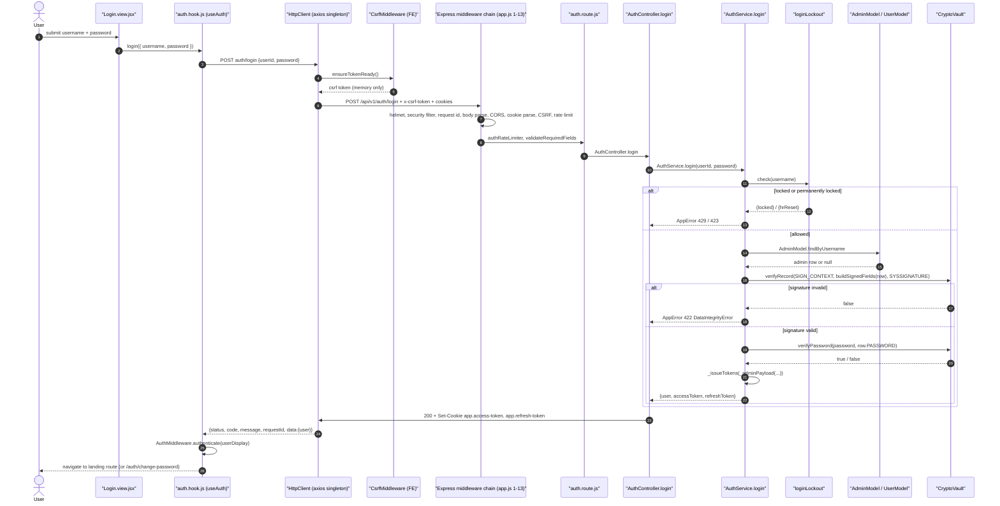
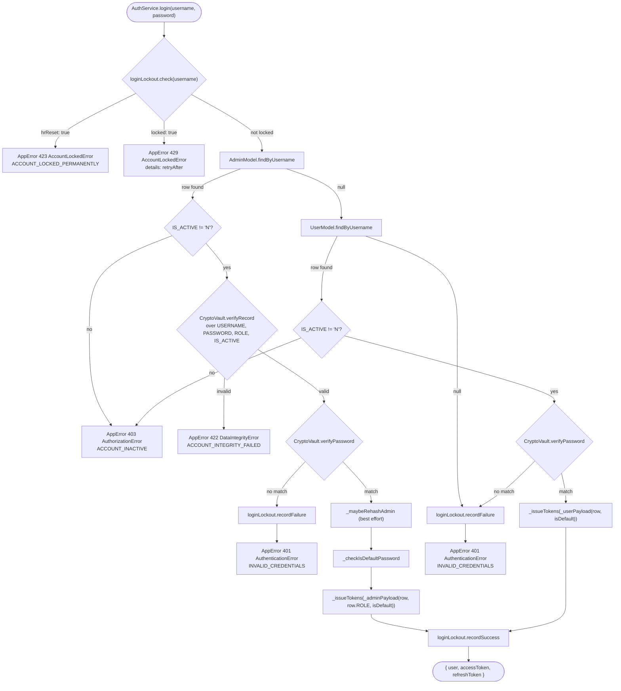
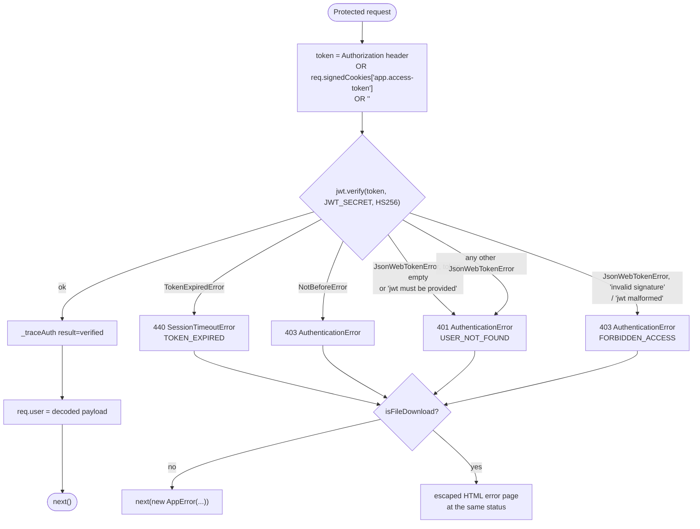
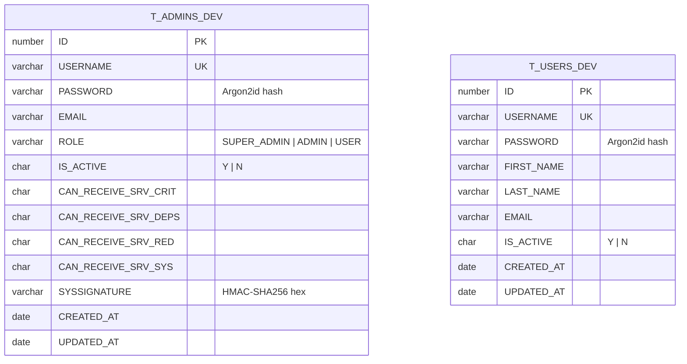
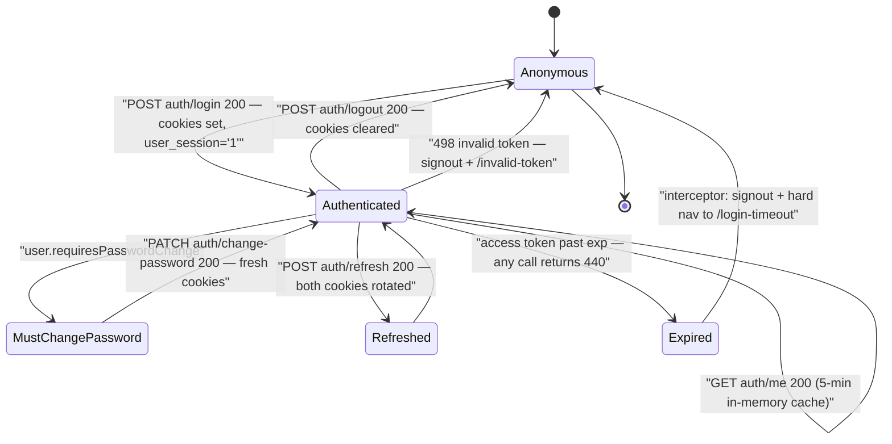

# Authentication & Authorization — Technical Documentation

> **Scope:** the whole sign-in / session / access-control path of the CATHERINE template, across both surfaces.
> **Source:** `Frontend/` (React 19 + Vite SPA) and `Backend/` (Node.js + Express v5 API).
> **Generated:** 2026-09-04. **Authority:** the code. Where `CLAUDE.md` disagrees with the code, the code wins and the disagreement is recorded in [§6.11](#611-known-documentation-drift).
> **Rendering:** the ```mermaid fences below render in GitHub, GitLab, Obsidian and VS Code preview. A plain Markdown→PDF path (Chrome "print to PDF") will print them as code — pre-render with `npx @mermaid-js/mermaid-cli` if you need a PDF.

---

## 1. Overview

The template ships a self-contained username/password login: no identity provider, no external directory. Credentials live in two Oracle tables — `T_ADMINS_DEV` for privileged accounts that carry an RBAC role, and `T_USERS_DEV` for ordinary accounts — and passwords are stored as Argon2id hashes. Every admin row additionally carries an HMAC-SHA256 `SYSSIGNATURE` over its identity-bearing columns, so a row edited directly in the database is refused at login *before* the password is ever compared.

A successful login returns no token to JavaScript. The server writes two signed, `HttpOnly`, `SameSite=Strict` cookies (a ~30-minute access token and a 7-day refresh token scoped to the refresh path) and returns only the decoded claim object so the UI can render a name and decide where to land. Every subsequent request carries the cookie automatically; the browser never holds a bearer credential the page can read.

Authorization is deliberately not a fixed table. `AuthMiddleware.requireAccess(predicate)` is a factory: each route states its own rule inline as a function of the decoded JWT — either against the string `role` (`SUPER_ADMIN` / `ADMIN` / `USER`) or against the numeric `userLevel` (3 / 2 / 1) that the service derives from it. The template ships the mechanism; a downstream project writes the policy.

Finally, the entire path runs unchanged with no database at all. `DEMO_MODE=true` swaps the two models' data source for an in-memory fixture store — the same service, the same Argon2 verify, the same signature check, the same JWT issuance.

---

## 2. Flow & Architecture

### 2.1 The login round trip



Two things in this diagram carry most of the design weight. The CSRF token is fetched and attached **before** the login request even leaves the browser (steps 4–6) — the sign-in POST is a state-changing request like any other and is not exempt from the double-submit gate. And the tokens produced at step 20 travel back in `Set-Cookie` only; the JSON body carries the claim object but never the token strings.

### 2.2 Credential resolution — the decision tree inside `AuthService.login`



Read the two `401` terminals together: an unknown username and a wrong password produce the *same* `INVALID_CREDENTIALS` message and the *same* status, and both call `recordFailure`. That is deliberate — a distinct "no such user" response is a username-enumeration oracle. Note also the ordering on the admin branch: **integrity before credentials**. A tampered row is rejected at `Sig` and never reaches `verifyPassword`, so an attacker who can write to the table cannot substitute a hash they control.

### 2.3 JWT verdict → HTTP status, in `AuthMiddleware._doAuthenticate`



The four-way split matters because the frontend reacts differently to each: `440` is the only status that means "your session simply ran out", and it is the one the SPA turns into a full-page takeover plus a local session teardown. A `403` here means the token was structurally wrong or forged — the same status the authorization predicate uses, which is why the frontend never treats a bare `403` as session-ending.

`authenticateForDownload` exists because a file-download route cannot usefully return JSON: the browser has navigated to it directly and there is no interceptor listening. The flag is chosen at route-definition time and is never derived from user input.

### 2.4 The credential store



There is **no foreign key between the two tables and no join**. `AuthService.login` probes `T_ADMINS_DEV` first and falls through to `T_USERS_DEV` only when no admin row matches; a username present in both authenticates as the admin. The signed field set is exactly four columns — `USERNAME`, `PASSWORD`, `ROLE`, `IS_ACTIVE` (`AdminModel.buildSignedFields`, `Backend/src/models/admin.model.js:30`). The four `CAN_RECEIVE_SRV_*` flags are deliberately **outside** the signature so toggling a notification opt-in does not require re-signing the row.

### 2.5 Browser session lifecycle



Note what is *not* on this diagram: there is no automatic refresh loop. `POST auth/refresh` exists and is fully implemented on both sides (`authApi.refresh`), but nothing in the shipped frontend calls it — no interceptor retry on `440`, no timer. In practice the access token expiring is a terminal event that lands the user on `/login-timeout`. See [§6.4](#64-the-refresh-endpoint-is-implemented-but-unused).

---

## 3. Frontend implementation

### 3.1 Files

| File | Responsibility |
| --- | --- |
| `Frontend/src/features/auth/Login.view.jsx` | Presentation only. Two-field form, shake-on-error animation, three mutually exclusive alert surfaces (rate-limit countdown, permanent lockout, integrity error) plus `<ApiErrorAlert>` for everything else. |
| `Frontend/src/features/auth/auth.hook.js` | `useAuth()` — the only place login/logout logic lives. Maps the form's `username` field to the backend's `userId`, owns `loading`/`error`/`integrityError`/`rateLimitSeconds`/`accountLocked`, and performs post-login navigation. |
| `Frontend/src/features/auth/auth.api.js` | Four thin `httpClient` calls: `login`, `logout`, `refresh`, `me`. No state, no React. |
| `Frontend/src/features/auth/Logout.view.jsx` | Fires `useAuth().logout()` once (`useRef` guard) and renders a full-page spinner. |
| `Frontend/src/features/auth/ChangePassword.view.jsx` + `changePassword.hook.js` / `.api.js` | Forced-rotation flow for accounts still on the system default password. |
| `Frontend/src/features/auth/roleRedirect.js` | `ROLE_LANDING_PATHS` / `getLandingPath(role)` — declares `/dashboard` for every role. **Currently unreferenced anywhere in `src/`.** |
| `Frontend/src/middleware/authentication/AuthMiddleware.js` | Static class. Cookie/localStorage helpers, `authenticate()`, `signout()`, and `isAuth()` with a 5-minute in-memory cache and concurrent-call de-duplication. |
| `Frontend/src/middleware/HttpClient.js` | The single Axios instance. `withCredentials: true`, 30 s timeout, CSRF injection, `X-Client-Username` traceability header, and the response interceptor that decides takeover vs inline. |
| `Frontend/src/middleware/security/CsrfMiddleware.js` | CSRF token lifecycle singleton — fetch with retry + backoff, scheduled pre-expiry refresh, in-memory storage only. |
| `Frontend/src/contexts/security/CsrfContext.jsx` | React wrapper: initialises the singleton once at app start and republishes token changes to any consumer via `useCsrf()`. |
| `Frontend/src/components/routing/ProtectedRoute.jsx` | Route guard. Calls `isAuth()`, then applies `role` (array membership) and/or `check` (predicate), and renders `<Outlet/>`, `<LoadingScreen/>` or `<Navigate to={redirectTo}/>`. |
| `Frontend/src/App.jsx` | Router. Declares the `ROLES` string map and wraps route groups in `<ProtectedRoute>`. |

### 3.2 Where session state actually lives

| Store | Key | Contents | Why there |
| --- | --- | --- | --- |
| HTTP-only cookie | `app.access-token` | Signed JWT, ~30 min | JavaScript cannot read it — XSS cannot exfiltrate the session (CWE-522). |
| HTTP-only cookie | `app.refresh-token` | Signed JWT, 7 d, `path=/api/v1/auth/refresh` | Path-scoped so it is not even sent on ordinary API calls. |
| Module memory | `_authCache` in `AuthMiddleware.js` | The full decoded user payload | Cleared on every page load, so a deleted cookie is always caught on the next reload. |
| `localStorage` | `user_session` | The literal string `"1"` | A non-PII "a session may exist" hint that lets `isAuth()` fast-fail without a network round trip. |
| `localStorage` | `user_display` | `{ firstName, lastName, userId }` | Read by `HttpClient` to build the `X-Client-Username` header. |
| `localStorage` | `session_exp` | Millisecond timestamp | Read by `useSessionWarning` to schedule the "your session is about to end" modal. |
| Module memory | `_token` in `CsrfMiddleware.js` | CSRF token | Never persisted — a persisted CSRF token defeats the double-submit pattern. |

### 3.3 The route guard

`ProtectedRoute` runs `isAuth()` on mount, then applies up to two checks in order:

```jsx
// Frontend/src/components/routing/ProtectedRoute.jsx:50-59
if (role && !role.includes(user.role)) { setStatus("denied"); return; }
if (check && !check(user))            { setStatus("denied"); return; }
```

`user.role` is a **string**. `App.jsx:51-58` defines the constants accordingly:

```jsx
const ROLES = { SADMIN: "SUPER_ADMIN", ADMIN: "ADMIN", USER: "USER", APPROVER: "APPROVER", VIEWER: "VIEWER", ROBOT: "ROBOT" };
```

Live guard groups in `App.jsx`:

| Routes | Guard |
| --- | --- |
| `auth/change-password` (line 245) | `role={[USER, ADMIN, SADMIN, APPROVER, VIEWER, ROBOT]}` |
| `dashboard` (line 250) | `role={[USER, ADMIN, SADMIN]}` |
| `system/logging-and-observability`, `system/admin-management`, `system/metrics` (line 255) | `role={[SADMIN]}` |

The guard is intentionally a *mechanism*: the `check` prop takes an arbitrary predicate over the decoded user, so a downstream project adds fine-grained rules without editing the component. `ProtectedRoute` re-verifies on every mount; do not cache a role decision above it.

### 3.4 What the frontend does with an auth failure

`useAuth().login`'s catch block branches on three statuses that the sign-in screen must render **in place**, because navigating away would destroy the form:

- `422` + `error.type === "DataIntegrityError"` → `integrityError` → amber "Account Issue Detected" alert.
- `429` → parses `error.details[].field === "retryAfter"` and starts a live countdown; the submit button is disabled until it reaches zero.
- `423` → `accountLocked` → red permanent-lockout alert; the button stays disabled.

That in-place behaviour is guaranteed by `SELF_HANDLED_ENDPOINTS` in `Frontend/src/constants/httpStatus.js:249`, which lists `auth/login`, `auth/refresh` and `auth/change-password`. See the companion document [`error-handling.md`](./error-handling.md) for the full takeover-vs-inline rule.

---

## 4. Backend implementation

### 4.1 Routes

All routes are mounted under `/api/v1` (`Backend/src/app.js:192`), and the auth router at `/auth` (`Backend/src/routes/index.js:29`).

| Method & path | Middleware, in order | Handler | Purpose |
| --- | --- | --- | --- |
| `POST /api/v1/auth/login` | `authRateLimiter` → `validateRequiredFields(["userId","password"])` | `AuthController.login` | Verify credentials, set both cookies, return the claim object. |
| `POST /api/v1/auth/refresh` | `authRateLimiter` | `AuthController.refresh` | Re-issue both tokens from a valid refresh token, re-reading the account. |
| `POST /api/v1/auth/logout` | `AuthMiddleware.authenticate` | `AuthController.logout` | Clear both cookies. |
| `GET /api/v1/auth/me` | `AuthMiddleware.authenticate` | `AuthController.me` | Return the decoded JWT payload. |
| `PATCH /api/v1/auth/change-password` | `authRateLimiter` → `authenticate` → `validateRequiredFields(["currentPassword","newPassword"])` | `AuthController.changePassword` | Rotate the password and re-issue both tokens with `requiresPasswordChange: false`. |

There is **no** `POST /auth/register`. `Backend/test/server/integration/auth/register.test.js:23` exists purely to assert the route is intentionally absent; account provisioning lives on the admin-management router.

Supporting endpoints the auth flow depends on (`Backend/src/routes/csrf.route.js`):

| Method & path | Auth | Purpose |
| --- | --- | --- |
| `GET /api/v1/csrf/token` | public (bootstrap) | Mint a CSRF token and set the HTTP-only secret cookie. |
| `POST /api/v1/csrf/refresh` | `AuthMiddleware.authenticate` | Rotate the token and secret cookie for an authenticated session. |
| `GET /api/v1/csrf/status` | public | Report CSRF configuration and whether the secret cookie is present. |

### 4.2 The middleware chain a login request traverses

`Backend/src/app.js` numbers its stack in comments and states "order matters — do not reorder". Read from the file, the numbered steps run **1 through 13**, with three lettered sub-steps inserted where a later mount point is mandatory:

| # | Mount | Module |
| --- | --- | --- |
| 1 | `app.use` | `defaultHelmet` — security headers |
| 2 | `app.use` | `defaultSecurityFilter` — block scanners/traversal early |
| 3 | `app.use` | `defaultTraceability.handle` — mint `req.id`, set `X-Request-ID`, patch `res.json`, open the AsyncLocalStorage context |
| 3a | `app.use` | `defaultAuditLog.handle` — DB persistence after `res.end` |
| 4 | `app.use` ×2 | `defaultBodyParser.jsonHandler`, `.urlencodedHandler` |
| 4a | `app.use` | `defaultTraceability.logIncoming` — the `[Incoming Request]` line, after parsing so it carries the body |
| 5 | `app.use` | `defaultResponseTime` |
| 5a | `app.use` | `defaultMetrics` |
| 6 | `app.use` | `defaultCompression` |
| 7 | `app.use` | `defaultCors` |
| 8 | `app.use` | `defaultCookieParser` — must precede CSRF so the secret cookie is readable |
| 9 | `app.use` | CSRF gate, wrapped in a path-exemption closure for `/api/v1/csrf` and `/api/v1/metrics/frontend` |
| 10 | `app.use` | `defaultErrorHandler.captureResponseBody` |
| 11 | `app.use` | `defaultIpFilter` |
| 12 | `app.use` | `defaultRateLimiter` |
| 13 | `app.use("/api", …)` | `defaultPreventRedirects` |

Then `app.use("/api/v1", routes)`, then the 404 catch-all, then the global error handler — "must be LAST".

Step 3 is the one that shapes every response body in this document: it replaces `res.json` with a wrapper that stamps `body.requestId = req.id` on **every** JSON response, success or error, without any controller needing to pass it.

### 4.3 `AuthService` — the credential authority

`Backend/src/services/auth.service.js` is a static class. Public surface: `login`, `refresh`, `getProfile`, `changePassword`, `accessCookieOptions`, `refreshCookieOptions`, `COOKIE_NAMES`.

**Claim construction.** `_adminPayload` / `_userPayload` build a normalised claim object; `_issueTokens` (line 352) turns it into the signed pair:

```js
const userPayload = {
    sub: String(claims.username),
    userId: String(claims.username),   // NOTE: the username, not a numeric id
    id: claims.id ?? null,
    username: claims.username,
    userLevel: AuthService._roleToUserLevel(claims.role),  // 3 / 2 / 1
    firstName, lastName, email,
    role: claims.role,
    loginSource: claims.loginSource,   // "admin" | "user"
    isDefaultPassword,
    requiresPasswordChange: isDefaultPassword,
};
```

The access token carries this whole object. The refresh token carries only `{ sub, type: "refresh" }` — minimum surface area, and the `type` discriminator is checked on the refresh path (line 99) so an access token cannot be replayed as a refresh token.

**Role mapping** (`_roleToUserLevel`, line 310): `SUPER_ADMIN → 3`, `ADMIN → 2`, everything else → `1`. Admin rows are signed with their `ROLE` string; `_userPayload` hardcodes `role: "USER"` for `T_USERS_DEV` accounts, which therefore always resolve to `userLevel: 1`.

**Refresh** re-reads the account rather than trusting the old claims, so a role change or a deactivation takes effect on the next refresh. On the admin branch it calls `_resolveRole` (line 287), which re-verifies the signature and, if it is broken, **degrades to `"USER"` instead of throwing** — defence in depth, so a tampered row cannot escalate through the refresh path.

### 4.4 Authorization — `requireAccess(predicate)`

`Backend/src/middleware/authentication/AuthMiddleware.js:362`. The factory returns a middleware that emits `401 AuthenticationError` when `req.user` is absent (i.e. `authenticate` was not mounted first) and `403 AuthorizationError` when the predicate returns false, with an optional custom `message`.

Both styles are in live use in the template:

```js
// String-role style — Backend/src/routes/admin-management.route.js:44
const requireAdmin = AuthMiddleware.requireAccess(
    (user) => user.role === "ADMIN" || user.role === "SUPER_ADMIN",
    { message: "Only ADMIN or SUPER_ADMIN accounts may access admin management." },
);

// Numeric-level style — Backend/src/routes/metrics.route.js:50
AuthMiddleware.requireAccess((user) => user.userLevel >= 2)
```

| Router | Predicate | Effective requirement |
| --- | --- | --- |
| `admin-management.route.js` (router-wide, line 61) | `role === "ADMIN" \|\| role === "SUPER_ADMIN"` | level ≥ 2 |
| `admin-management.route.js` `PATCH /:empId/permissions` | `role === "SUPER_ADMIN"` | level 3 |
| `audit-log.route.js` list / stats / stream / per-request logs | `["ADMIN","SUPER_ADMIN"].includes(role)` | level ≥ 2 |
| `audit-log.route.js` exports, delete range | `role === "SUPER_ADMIN"` | level 3 |
| `changelog.route.js` mutations | `role === "SUPER_ADMIN"` | level 3 |
| `metrics.route.js` snapshot / alerts / ack / notification status | `userLevel >= 2` | ADMIN or above |
| `metrics.route.js` summary | `userLevel >= 1` | any authenticated account |
| `metrics.route.js` notification test | `role === "SUPER_ADMIN"` | level 3 |

`validateRequiredFields` (line 404) sits alongside it and does more than presence checking: it **rejects objects and arrays outright** and string-coerces everything that survives, in place. That is the defence against operator injection — a body of `{"userId": {"$regex": ".*"}}` would otherwise reach `parseFilter` in the Oracle wrapper and be translated into a `REGEXP_LIKE`.

### 4.5 `CryptoVault` — hashing and the tamper-evident signature

`Backend/src/utils/encryption/CryptoVault.js` is one gateway over four `PASSWORD_HASH_MODE` strategies (`argon2` default, `bcrypt`, `plain`, `tripledes`) plus a generic HMAC record-signing API.

**Passwords.** In `argon2` mode the plaintext is first HMAC-SHA256'd with `ARGON2_PEPPER` (a *keyed transformation*, not the hash), then fed to `argon2.hash` with `type: argon2id` and the configured `memoryCost` / `timeCost` / `parallelism` / `hashLength` (defaults 19456 KiB / 2 / 1 / 32). `verifyPassword` sniffs a `$2a$` / `$2b$` prefix and falls back to bcrypt automatically, which is what makes a zero-downtime migration possible. `resolveMode` throws outright if `PASSWORD_HASH_MODE=plain` and `NODE_ENV=production`.

**The signature.** `buildPayload(context, fields)` sorts the keys alphabetically and joins them into `CONTEXT:K1=v1|K2=v2`, so call-site insertion order is irrelevant and a digest computed for one table cannot be replayed against another. `signData` is HMAC-SHA256 with `DATA_SIGNING_SECRET` (a *third* secret, deliberately distinct from `JWT_SECRET` and `ARGON2_PEPPER`). `verifySignature` rejects a length mismatch first, then compares with `crypto.timingSafeEqual`. `verifyRecord` returns `false` rather than throwing on a missing signature so callers degrade instead of crashing.

For an admin row the payload is therefore exactly:

```text
T_ADMINS_DEV:IS_ACTIVE=Y|PASSWORD=$argon2id$v=19$m=19456,t=2,p=1$…|ROLE=SUPER_ADMIN|USERNAME=admin
```

Changing `ROLE` from `USER` to `SUPER_ADMIN` in the database, or swapping in a password hash the attacker knows, breaks that digest — and the check runs *before* the password comparison.

### 4.6 Lockout

`Backend/src/middleware/authentication/LoginLockoutMiddleware.js` keeps per-username state in a 24-hour `CacheStore` (in-memory, per process):

```text
{ cycles, currentMax, failCount, lockUntil }
```

Defaults: 3 attempts, `incremental` mode, 30 000 ms base duration, ×2 multiplier, 3 max cycles, decrement 1. The published sequence is therefore 3 fails → 30 s lock → 2 fails → 60 s lock → 1 fail → 120 s lock → permanent (`hrReset: true` → HTTP 423). `currentMax` is floored at 1. `recordSuccess` deletes the key entirely.

`check()` is read-only apart from clearing an expired window, so the read path in `AuthService.login` cannot itself advance the counter.

### 4.7 `DEMO_MODE`

`Backend/src/config/demoMode.js` exports a single function — read as a function, not a cached constant, so it reflects `process.env` after `dotenv` loads and tests can toggle it at runtime:

```js
function isDemoMode() { return String(process.env.DEMO_MODE).toLowerCase() === "true"; }
```

Both models branch on it at the top of every method. `AdminModel.findByUsername` and `UserModel.findByUsername` read from `Backend/src/models/demo/demoStore.js` instead of an `OracleCollection`; the collection object is created lazily inside `col()`, so in demo mode **no Oracle pool is ever opened**.

The fixtures are not shortcuts. `demoStore._buildAccounts()` hashes the shared demo password with the real `CryptoVault.hashPassword` and signs each admin row with the real `CryptoVault.signRecord("T_ADMINS_DEV", …)` — so a demo login exercises the genuine Argon2 verify **and** the genuine signature check. Seeded accounts:

| Username | Table | Role | Notes |
| --- | --- | --- | --- |
| `admin` | `T_ADMINS_DEV` | `SUPER_ADMIN` | signed |
| `manager` | `T_ADMINS_DEV` | `ADMIN` | signed |
| `user` | `T_USERS_DEV` | (implicit `USER`) | no signature — users are not signed |

The shared password is the module constant `DEMO_PASSWORD` in `demoStore.js`. `DEMO_MODE=true` together with `NODE_ENV=production` is a **fatal boot violation** (`Backend/src/config/bootGuard.js:168-175`).

---

## 5. How frontend and backend connect (the contract)

### 5.1 Transport rules

| Concern | Rule |
| --- | --- |
| Base URL | `VITE_API_BASE_URL`, baked at build time, normalised to a trailing slash (`Frontend/src/config/apiBase.js`). A production build fails if it is unset or plain `http://` — `assertApiBaseUrl` in `Frontend/vite.config.js:32`. |
| Credentials | `withCredentials: true` on the Axios instance and `credentials: "include"` on every CSRF `fetch`. The browser attaches both auth cookies; nothing reads them. |
| CSRF | `x-csrf-token` header injected by the request interceptor on `POST`/`PUT`/`PATCH`/`DELETE`, except for `csrf/token`, `csrf/refresh`, `csrf/status`. The server also accepts `_csrf` or `csrfToken` in the body. |
| Traceability | `X-Client-Username: "<First Last>@<userId>"` (or `anonymous@unknown`) on everything except `csrf/token`. |
| Correlation | `X-Request-ID` response header **and** a root-level `requestId` in every JSON body. |
| Timeout | 30 s on Axios; 10 s on the three CSRF `fetch` calls (the boot path, where the user is staring at a spinner). |

### 5.2 `POST /api/v1/auth/login`

**Request**

```http
POST /api/v1/auth/login HTTP/1.1
Content-Type: application/json
x-csrf-token: <token from GET /csrf/token>
X-Client-Username: anonymous@unknown
Cookie: psifi.x-csrf-token=<http-only secret>

{ "userId": "admin", "password": "<redacted>" }
```

`userId` is the **username**, not a numeric id — `Login.view.jsx` labels the field "Username" and `auth.hook.js:42` renames it to `userId` at the boundary.

**Response — 200**

```http
HTTP/1.1 200 OK
X-Request-ID: 0078812966528-0448-0000
Set-Cookie: app.access-token=s%3A<jwt>.<sig>; Path=/; HttpOnly; Secure; SameSite=Strict; Max-Age=1800
Set-Cookie: app.refresh-token=s%3A<jwt>.<sig>; Path=/api/v1/auth/refresh; HttpOnly; Secure; SameSite=Strict; Max-Age=604800

{
  "status": "success",
  "code": 200,
  "message": "Login successful.",
  "requestId": "0078812966528-0448-0000",
  "data": {
    "user": {
      "sub": "admin", "userId": "admin", "id": 1, "username": "admin",
      "userLevel": 3, "firstName": null, "lastName": null, "email": null,
      "role": "SUPER_ADMIN", "loginSource": "admin",
      "isDefaultPassword": false, "requiresPasswordChange": false,
      "iat": 1788000000, "exp": 1788001800
    }
  }
}
```

The token strings never appear in the body — `login.test.js:140` asserts exactly that.

**Failure statuses**

| Status | `error.type` | Cause | Frontend reaction |
| --- | --- | --- | --- |
| `400` | `ValidationError` | Missing/non-string `userId` or `password`; `details[]` names the fields | inline |
| `401` | `AuthenticationError` | Unknown username **or** wrong password | inline (`<ApiErrorAlert>`) |
| `403` | `AuthorizationError` | `IS_ACTIVE = 'N'` | inline |
| `403` | — | CSRF gate rejected the request (non-envelope body) | inline |
| `413` | `PayloadTooLargeError` | Body over the parser limit | inline |
| `422` | `DataIntegrityError` | `SYSSIGNATURE` mismatch | inline, amber "Account Issue Detected" |
| `423` | `AccountLockedError` | All lockout cycles consumed | inline, permanent-lockout alert |
| `429` | `AccountLockedError` | Lockout window active; `details[0] = { field: "retryAfter", issue: "30" }` | inline countdown |
| `429` | `RateLimitExceeded` | `authRateLimiter` — 5 requests / 15 min per key; `details[0].issue` is `"<n> seconds"` | inline countdown |

### 5.3 `GET /api/v1/auth/me`

Sends nothing but the cookie. Returns the decoded JWT payload as `data` directly (not wrapped in `{ user }`):

```json
{ "status": "success", "code": 200, "message": "Data fetched successfully.",
  "requestId": "…", "data": { "sub": "admin", "userId": "admin", "userLevel": 3, "role": "SUPER_ADMIN", "…": "…" } }
```

This is the endpoint `AuthMiddleware.isAuth()` calls, and the shape difference matters: `isAuth` reads `response.data?.data` while `login` reads `response.data?.data?.user`.

`AuthService.getProfile` returns `decodedUser` unchanged — it does **not** re-read the database. Claims are as fresh as the access token; a role change mid-session takes effect on the next `login` or `refresh`, and every role-gated action is re-checked server-side at action time anyway.

### 5.4 `POST /api/v1/auth/refresh`

Reads the token from `req.signedCookies["app.refresh-token"]` **or** `Authorization: Bearer <token>`. Because the refresh cookie is path-scoped to `/api/v1/auth/refresh`, the browser only sends it to this exact endpoint.

| Status | Cause |
| --- | --- |
| `200` | Both cookies rotated; `data.user` is the fresh claim object |
| `401` | No token present at all, or the account no longer exists |
| `403` | Token invalid, expired, or missing `type: "refresh"` |

### 5.5 `POST /api/v1/auth/logout`

Requires a valid access token. Clears `app.access-token` at `path=/` and `app.refresh-token` at `path=/api/v1/auth/refresh` — the paths must match the ones used to set them or the cookies survive. Returns `{"status":"success","code":200,"message":"Logged out successfully.","requestId":"…","data":null}`.

`useAuth().logout` swallows any server error and clears local state regardless: a network failure must not leave the user apparently signed in.

### 5.6 `PATCH /api/v1/auth/change-password`

Body `{ currentPassword, newPassword }`. On success it re-signs the admin row, persists the new hash, issues a **fresh pair of cookies** with `requiresPasswordChange: false`, and returns the new claim object — so the browser session upgrades transparently with no re-login.

| Status | `error.type` | Cause |
| --- | --- | --- |
| `400` | `ValidationError` | Missing field, or `newPassword === ADMIN_DEFAULT_PASSWORD` |
| `401` | `AuthenticationError` | `currentPassword` wrong (hint: "The current password you entered is incorrect.") |
| `404` | `NotFoundError` | No account for the authenticated username |
| `422` | `DataIntegrityError` | `SYSSIGNATURE` broken — refuses to touch credentials on a tampered row |

### 5.7 The CSRF bootstrap

`GET /csrf/token` returns a **non-envelope** body — it predates and sits outside the standard response contract:

```json
{ "success": true, "token": "<64-byte token>", "cookieName": "psifi.x-csrf-token",
  "headerName": "x-csrf-token", "expiresIn": 300000, "expiresAt": "2026-09-04T10:05:00.000Z" }
```

TTL is 5 minutes (`TOKEN_TTL_MS`), token size 64. The secret is bound to a session identifier of `req.ip`. On failure the gate answers `403` with `{ success: false, message, code: "CSRF_TOKEN_INVALID", error }` — a *string* `code`, not a numeric status. `HttpClient` keys its one-shot retry on exactly that string (see [§6.9](#69-the-csrf-retry-allow-list-is-wider-than-the-backend)).

---

## 6. Technicalities

### 6.1 Token and cookie lifetimes

| Thing | Value | Source |
| --- | --- | --- |
| Access token `expiresIn` | `JWT_EXPIRES_IN`, default `"30m"` | `auth.service.js:370` |
| Access cookie `maxAge` | `_parseDuration(JWT_EXPIRES_IN)` — **derived from the same variable**, so the cookie and the JWT expire together | `auth.service.js:155` |
| Refresh token `expiresIn` | `JWT_REFRESH_EXPIRES_IN`, default `"7d"` | `auth.service.js:377` |
| Refresh cookie `maxAge` | Hardcoded `7 * 24 * 60 * 60 * 1000` | `auth.service.js:171` |
| Frontend session-warning clock | `VITE_SESSION_TIMEOUT_MS`, default 1 800 000 ms | `auth.hook.js:15` |

`_parseDuration` accepts only `^(\d+)([smhd])$` and **throws** on anything else. `JWT_EXPIRES_IN=1800` (a bare number, which `jsonwebtoken` would happily accept as seconds) crashes the login response instead. That is a fail-loud choice, not an oversight: a silently mis-parsed duration would produce a cookie and a token with different lifetimes.

The refresh cookie's `maxAge` is **not** derived from `JWT_REFRESH_EXPIRES_IN`. Raising that variable above 7 d leaves the cookie expiring first; lowering it below 7 d leaves a cookie the server will refuse.

Algorithm is pinned to `HS256` on both `sign` and every `verify` — `{ algorithms: ["HS256"] }` — which closes the `alg: none` / algorithm-confusion class (CWE-347).

### 6.2 Cookie flags, and why `secure` is not just `USE_HTTPS`

```js
// auth.service.js:147-148
const isProduction = process.env.NODE_ENV === "production";
const secure = process.env.USE_HTTPS === "true" || isProduction;
```

In production the cookies are always `Secure` regardless of `USE_HTTPS`, because the app may sit behind a TLS-terminating proxy where the server itself speaks HTTP while the external connection is encrypted. All four flags: `httpOnly: true`, `secure` (as above), `sameSite: "strict"`, `signed: true`.

`signed: true` means `cookie-parser` prepends an HMAC using `COOKIE_SECRET`. That is a second, independent integrity layer beneath the JWT signature, and it is what makes `AuthMiddleware._describeCredential` able to tell "the browser sent nothing" from "the browser sent a cookie whose HMAC failed" — `cookie-parser` puts a verified signed cookie in `req.signedCookies` and a tampered one in `req.cookies` as `false`.

`SameSite=Strict` survives the documented same-host / different-port deployment (SameSite ignores ports) but would silently drop the cookies if the frontend and API were served from different **hostnames**.

### 6.3 Credential precedence: header over cookie

`_doAuthenticate` reads `Authorization: Bearer` first and the signed cookie second. That is the standard convention and is exercised by `auth-bypass.test.js:200` ("prefers Authorization header over signed cookie"). The browser never uses the header path — it exists for server-to-server and automation callers.

Whatever the source, the sole security decision is `jwt.verify()`, a server-controlled cryptographic check. No branch keys off raw user-controlled data (CWE-807).

### 6.4 The refresh endpoint is implemented but unused

`authApi.refresh` exists, the route exists, the service rotates both cookies. Nothing calls it. There is no `401`/`440` retry-with-refresh branch in `HttpClient`'s response interceptor — a `440` goes straight to session teardown plus a hard navigation to `/login-timeout`. Practically: the access-token lifetime **is** the session lifetime, and `JWT_REFRESH_EXPIRES_IN` has no user-visible effect in the shipped SPA.

This is worth knowing before you tune `JWT_EXPIRES_IN` down: every reduction is a proportional increase in how often users are bounced to the sign-in screen.

### 6.5 The 5-minute `isAuth()` cache and its 440/498 escape hatch

`AuthMiddleware.isAuth()` caches the verified user in module memory for 5 minutes and de-duplicates concurrent callers behind `_pendingAuthRequest`. Module memory is cleared by any page load, so a cookie deleted out-of-band is always caught on the next reload.

The `catch` block has one unusual branch:

```js
// Frontend/src/middleware/authentication/AuthMiddleware.js:201-207
if (status === 498 || status === 440) {
    return new Promise(() => {});   // never resolves
}
```

`HttpClient`'s interceptor has already begun a hard navigation for those two statuses. Returning `false` here would make `ProtectedRoute` render `<Navigate to="/unauthorized"/>` for the few frames before the document is replaced — a wrong error screen flashing past. A never-resolving promise keeps the spinner on screen until the navigation lands. It is intentional and it is why `_lastAuthError` is not set on that path.

### 6.6 Transparent password rehashing

`_maybeRehashAdmin` (line 411) runs on every successful admin login. If `CryptoVault.needsRehash` says the stored hash used weaker Argon2 parameters than the current config, it re-hashes, **re-signs the row with the new hash**, persists both, and updates the in-memory row so the rest of the request stays consistent. The whole thing is wrapped in a try/catch that logs a warning — a rehash failure never blocks a login.

The re-signing is the subtle part: `PASSWORD` is inside `buildSignedFields`, so writing a new hash without a new signature would lock the account out on its *next* login with a `422`.

### 6.7 Forced rotation off the default password

`_checkIsDefaultPassword` verifies the stored hash against `ADMIN_DEFAULT_PASSWORD`. A match sets both `isDefaultPassword` and `requiresPasswordChange` on the claim object; `auth.hook.js:62` reads the latter and routes to `/auth/change-password` instead of the landing route. `changePassword` then refuses the default value as a new password with a `400 ValidationError`. Unset `ADMIN_DEFAULT_PASSWORD` and the check returns `false` — the feature disables itself rather than failing.

### 6.8 Lockout is per-process and in-memory

`LoginLockoutMiddleware` uses a `CacheStore`, not the database. Under `ENABLE_CLUSTERING` each worker keeps its own counters, so the effective attempt budget is multiplied by the worker count, and a restart clears every lockout. The same is true of `authRateLimiter`. This is adequate for the template's threat model (it raises the cost of online guessing) but it is not a durable account-lock feature.

### 6.9 The CSRF retry allow-list is wider than the backend

`HttpClient.js:37` allow-lists four codes for its one-shot refresh-and-retry:

```js
const CSRF_ERROR_CODES = ["CSRF_SECRET_MISSING", "CSRF_TOKEN_MISSING", "CSRF_TOKEN_INVALID", "CSRF_TOKEN_EXPIRED"];
```

A repo-wide search of `Backend/src` finds exactly **one** of these emitted: `CSRF_TOKEN_INVALID` (`CsrfMiddleware.js:248`). The other three are dead entries. The one code the backend *does* emit that is absent from the list — `NO_CSRF_SESSION` (`CsrfMiddleware.js:146`) — arrives with status `400`, so it would not enter the `status === 403` retry branch anyway. `requiresRefresh` (`HttpClient.js:112`) is likewise never set by this backend.

The allow-list is correct in spirit — it is deliberately not "retry any 403", which would mask genuine authorization failures behind a second doomed request — but three-quarters of it is aspirational.

### 6.10 Environment variables this feature depends on

| Variable | Required | Default | Effect |
| --- | --- | --- | --- |
| `JWT_SECRET` | yes, ≥32 chars | — | Signs and verifies both tokens. Boot-guarded. |
| `JWT_EXPIRES_IN` | no | `30m` | Access token + access cookie lifetime. Must match `^\d+[smhd]$`. |
| `JWT_REFRESH_EXPIRES_IN` | no | `7d` | Refresh token lifetime (cookie `maxAge` is hardcoded 7 d). |
| `COOKIE_SECRET` | yes, ≥32 chars | — | HMAC for signed cookies. Boot-guarded. |
| `CSRF_SECRET` | yes, ≥32 chars | — | `CsrfMiddleware` throws at construction if absent — in every environment. Boot-guarded. |
| `ARGON2_PEPPER` | yes in argon2 mode, ≥32 chars | — | Keyed pre-hash. Boot-guarded. |
| `DATA_SIGNING_SECRET` | yes, ≥32 chars | — | HMAC key for `SYSSIGNATURE`. Must differ from the other two. Boot-guarded. |
| `PASSWORD_HASH_MODE` | no | `argon2` | `argon2` \| `bcrypt` \| `plain` \| `tripledes`. `plain` throws in production. |
| `PASSWORD_ENCRYPTION_MODE` | conditionally | — | Required only when `PASSWORD_HASH_MODE` is weak; forces admin passwords to a strong mode. |
| `ARGON2_MEMORY_COST` / `_TIME_COST` / `_PARALLELISM` / `_HASH_LENGTH` | no | 19456 / 2 / 1 / 32 | Range-validated; out-of-range throws `RangeError`. |
| `ADMIN_DEFAULT_PASSWORD` | no | — | Enables the forced-rotation check. |
| `LOGIN_MAX_ATTEMPTS` / `_LOCKOUT_MODE` / `_LOCKOUT_DURATION_MS` / `_LOCKOUT_MULTIPLIER` / `LOGIN_MAX_LOCKOUT_CYCLES` / `LOGIN_RETRY_DECREMENT` | no | 3 / incremental / 30000 / 2 / 3 / 1 | Lockout policy. |
| `USE_HTTPS`, `NODE_ENV` | no | `false`, — | Together decide the cookie `Secure` flag. |
| `TRUST_PROXY` | no | `false` | Without it `req.ip` is the proxy's — which silently breaks rate limiting, IP filtering **and** the CSRF session identifier. |
| `DEMO_MODE` | no | `false` | Swaps both models to the in-memory store. Fatal in production. |
| `VITE_API_BASE_URL` | yes for a production FE build | — | Baked at build time; `assertApiBaseUrl` fails the build if unset or plain `http://`. |
| `VITE_SESSION_TIMEOUT_MS` | no | 1800000 | Session-warning clock only — does not affect the real token. |
| `VITE_DEFAULT_REDIRECT`, `VITE_ROBOT_REDIRECT` | no | see §6.11 | Post-login landing paths. |

### 6.11 Known documentation drift

The code is the authority. These are places where prose currently disagrees with it.

| # | Location | Says | Code actually does |
| --- | --- | --- | --- |
| 1 | `Frontend/CLAUDE.md` §6 | `const ROLES = { SADMIN: 3, ADMIN: 2, USER: 1 }` | `App.jsx:51-58` uses **strings**, and `ProtectedRoute.jsx:50` compares `role.includes(user.role)` against `user.role`, a string. Numeric role arrays would match nothing. |
| 2 | `Frontend/src/components/routing/ProtectedRoute.jsx:9` | "`role` — array of allowed role **numbers**, e.g. `[2, 3]`"; the examples use `user.userLevel >= ROLES.ADMIN` | Same as above. The inline comment at line 49 already documents the string behaviour; the top docblock was not updated. |
| 3 | `Backend/CLAUDE.md` §"Middleware Stack" | 13 `app.use` lines named `addRequestId`, `requestLogger`, `jsonParser`, `createIpFilter` … | None of those module names exist. The real stack (`app.js:115-183`) is 17 `app.use` calls across 13 numbered steps plus sub-steps 3a/4a/5a, and it **omits the CSRF gate entirely** — which is step 9 in the code. |
| 4 | `Backend/CLAUDE.md` §"Auth Routes (Standard)" | lists `POST /api/v1/auth/register` | No such route. `register.test.js` asserts its absence. `GET /auth/me` and `PATCH /auth/change-password` are missing from the list. |
| 5 | `Backend/CLAUDE.md` §"Validation" | "Validate all incoming request bodies using `zod` (preferred) or `express-validator`" | `zod` is not a dependency. The auth routes validate with `AuthMiddleware.validateRequiredFields`. |
| 6 | `Backend/src/controllers/auth.controllers.js:102-105` | `GET /auth/me` returns "the decoded JWT payload with permission flags refreshed from `T_ADMINS_DEV` at read time" | `AuthService.getProfile` (line 137) returns `decodedUser` unchanged. No database read occurs. |
| 7 | `Frontend/src/features/auth/auth.api.js:8` | `POST auth/login → { data: { user, accessToken } }` | The body carries `{ user }` only; the token is cookie-only, and `login.test.js:140` asserts the token string is absent from the body. |
| 8 | `Frontend/src/middleware/security/CsrfMiddleware.js:7-10` | `/csrf/token` and `/csrf/refresh` return `refreshIn`; `/csrf/status` returns `{ success, isValid, expiresAt }` | Neither token endpoint returns `refreshIn` (`_buildTokenResponse`, line 73). `/csrf/status` returns `{ success, status: {...}, message }` — there is no `isValid` field. |
| 9 | `Backend/src/constants/index.js:15` | the contract test is `test/unit/constants/httpStatusContract.test.js` | The file is `test/unit/constants/httpStatusCatalog.test.js`. |
| 10 | `Frontend/src/config/apiBase.js:12-13` | the production-build guard "belongs in `vite.config.js` and is **NOT** wired up in this template yet" | It is wired up — `assertApiBaseUrl` is defined at `vite.config.js:32` and called at line 170. |

---

## 7. Security

### 7.1 What is done well

| Control | Implementation | Class addressed |
| --- | --- | --- |
| Tokens unreachable from JS | `httpOnly` + `signed` cookies; the JSON body never contains a token | CWE-522, CWE-79 impact reduction |
| Password storage | Argon2id (OWASP first choice) + a server-side pepper applied via HMAC-SHA256 before hashing | CWE-916, CWE-256 |
| Algorithm pinning | `{ algorithms: ["HS256"] }` on every `jwt.verify` | CWE-347 |
| Secret separation | `JWT_SECRET`, `COOKIE_SECRET`, `CSRF_SECRET`, `ARGON2_PEPPER`, `DATA_SIGNING_SECRET` — one purpose each, all boot-guarded at ≥32 chars with placeholder detection | CWE-798, CWE-521 |
| Row-level tamper evidence | HMAC-SHA256 over `USERNAME\|PASSWORD\|ROLE\|IS_ACTIVE`, context-namespaced, timing-safe compare, checked before the password | CWE-565, CWE-345 |
| Privilege-escalation containment | `_resolveRole` degrades a broken-signature row to `"USER"` on the refresh path rather than trusting `ROLE` | CWE-269 |
| No user enumeration | Unknown username and wrong password return an identical 401 and both record a failure | CWE-204 |
| Brute-force cost | Per-username progressive lockout (429 → 423) plus a 5-per-15-min IP limiter on all four auth endpoints | CWE-307 |
| Operator-injection defence | `validateRequiredFields` rejects objects/arrays and string-coerces survivors before they reach the query builder | CWE-20, CWE-943 |
| CSRF | `csrf-csrf` double-submit; HTTP-only secret cookie, `SameSite=Strict`, enforced on all four mutating verbs; the token endpoints are the only exemptions | CWE-352 |
| Credential redaction in logs | `AuthMiddleware._describeCredential` returns presence/outcome/cookie **names** only — never a value, a fragment, or a length; `TraceabilityMiddleware.SENSITIVE_PATTERNS` redacts `password`, `token`, `auth`, `email`, names, etc. from every request log line | CWE-532, CWE-522 |
| Timing-safe comparison | `crypto.timingSafeEqual` in `verifySignature`, with a length check first | CWE-208 |
| Fail-closed boot | Missing/short/placeholder secrets, `DEMO_MODE` in production, and unset `CORS_ORIGINS` in production all `process.exit(1)` | CWE-1188 |
| HTML error escaping | `_authHtmlError` escapes `& < > " '` before interpolation on the download path | CWE-79 |

### 7.2 Residual risks and things to know before shipping

1. **Lockout and rate-limit state are per-process and in-memory.** Under clustering the effective attempt budget scales with worker count, and a deploy clears every lock. If durable account lockout is a requirement, it needs a shared store.
2. **The CSRF secret is bound to `req.ip`** (`getSessionIdentifier`, `CsrfMiddleware.js:37`). A client whose apparent IP changes mid-session — mobile handoff, a rotating egress NAT, or `TRUST_PROXY` left at `false` behind a load balancer — loses CSRF validity and every mutation starts failing 403. Setting `TRUST_PROXY` correctly is a security control here, not just a logging nicety.
3. **`getProfile` does not re-read the database.** A role downgrade or a deactivation does not take effect until the access token expires or a refresh happens. Every privileged route re-checks server-side at action time, so this is a staleness window on *display*, not on enforcement — but a deactivated admin keeps a usable session for up to `JWT_EXPIRES_IN`.
4. **`T_USERS_DEV` rows are not signed.** Only admin rows carry a `SYSSIGNATURE`. Direct database write access to `T_USERS_DEV` is undetected — acceptable because those accounts are always `userLevel: 1`, but it is an asymmetry worth stating.
5. **`PASSWORD_HASH_MODE=plain` and `tripledes` exist.** `plain` is blocked in production by `resolveMode`; `tripledes` is not, and it is reversible encryption, not hashing. `hashAdminPassword` routes admin passwords around it via `PASSWORD_ENCRYPTION_MODE`, but `AuthService` calls the generic `CryptoVault.hashPassword`/`verifyPassword`, not the `*AdminPassword` variants — so in `tripledes` mode admin passwords written by the change-password flow are encrypted, not hashed.
6. **`AuthMiddleware.signout()` is skipped in development** on the 440 and 498 error pages: `import.meta.env.VITE_ENV === "development" ? "" : AuthMiddleware.signout()` (`ClientErrorResponses.jsx:3028` and `:3120`). The CSRF token is cleared in both cases. This is a deliberate dev convenience; be sure `VITE_ENV` is not `development` in any deployed build.
7. **`ADMIN_DEFAULT_PASSWORD` sits in `.env`.** The example value is `Change@Me123`. `.env.example` already says to inject it from a secrets manager in production; the forced-rotation flow exists precisely because a shared default is a known-credential risk (CWE-1392).
8. **Stale copy on the sign-in screen.** `Login.view.jsx:158` and `:175` still instruct users to "contact HR" and to "Use your HRIS or eFeedback credentials" — text inherited from an earlier host system. It is cosmetic, but it misdirects a locked-out user of a standalone deployment.

---

## 8. Verification Q&A

Evidence is cited, not executed — every entry below is marked **not run** unless stated otherwise. Backend suites are Vitest + Supertest under `Backend/test/`.

> **Q:** Is a tampered `T_ADMINS_DEV` row rejected *before* its password is compared?
> **A:** Yes. `AuthService._loginAdmin` calls `CryptoVault.verifyRecord` at line 202 and throws `422 DataIntegrityError` at line 211; `verifyPassword` is not reached until line 218.
> **Evidence:** `Backend/test/server/integration/auth/login.test.js:256` — *"account integrity failure (tampered record) → 422"* asserts the status. `change-password.test.js:273` — *"returns 422 DataIntegrityError when SYSSIGNATURE is broken"* covers the same guard on the rotation path. The strict *ordering* (signature before password) is asserted only by reading the source. _Status: not run._

> **Q:** Does an expired access token produce 440 rather than 401?
> **A:** Yes. `_doAuthenticate` maps `TokenExpiredError` to `440 SessionTimeoutError`.
> **Evidence:** `Backend/test/server/security/auth-bypass.test.js:114` — *"returns 440 for an expired token"*; corroborated at `logout.test.js:128` and `change-password.test.js:218`. _Status: not run._

> **Q:** Does a forged or tampered token produce 403 rather than 401?
> **A:** Yes — that is the distinction the frontend relies on to avoid treating a bare 403 as session-ending.
> **Evidence:** `auth-bypass.test.js:105` (*"token signed with the wrong secret"*), `:130` (*"token with a tampered payload"*), `:88` (*"malformed Authorization header"*) — all assert 403 and all cite rule "M-11: tampered → 403". `:82` and `:96` assert 401 for a genuinely missing token. _Status: not run._

> **Q:** Is an unsigned (plain) cookie accepted?
> **A:** No. `cookie-parser` only populates `req.signedCookies` for a cookie whose HMAC verifies, so an unsigned cookie is invisible to `_doAuthenticate` and the request is treated as tokenless.
> **Evidence:** `auth-bypass.test.js:179` — *"returns 401 when an unsigned (plain) cookie token is provided"*; `:188` — *"returns 401 when cookie is signed with the wrong secret"*; `:166` confirms the positive case. _Status: not run._

> **Q:** Are the tokens really absent from the login response body?
> **A:** Yes.
> **Evidence:** `login.test.js:140` — *"does not expose the raw token values in the response body"* stringifies the body and asserts neither mock token appears. `:86` separately asserts both `Set-Cookie` headers carry `HttpOnly`. _Status: not run._

> **Q:** Is CSRF enforced on login, i.e. is the sign-in POST exempt?
> **A:** It is enforced; only `/api/v1/csrf/*` and `/api/v1/metrics/frontend` are exempt.
> **Evidence:** `login.test.js:275` — *"POST without CSRF token → 403"* and `:283` — *"POST with a forged CSRF token → 403"*. `logout.test.js:184` proves the gate fires even with a valid JWT. _Status: not run._

> **Q:** Does the progressive lockout actually escalate, and does it terminate in a permanent block?
> **A:** Yes — 3 fails → lock → 2 fails → lock → 1 fail → lock → permanent.
> **Evidence:** `Backend/test/server/unit/middleware/loginLockout.test.js:321` — *"3 fails → lock → 2 fails → lock → 1 fail → lock → HR-reset"*, with the component behaviours pinned separately at `:194` (duration grows in incremental mode), `:244` (`currentMax` decrements), `:269` (floor of 1), `:129` (`hrReset` after all cycles). `:367` and `:377` assert per-user isolation. `login.test.js:224` / `:241` assert the resulting 429 / 423 at the HTTP boundary. _Status: not run._

> **Q:** Can an access token be replayed as a refresh token?
> **A:** No. `AuthService.refresh` rejects any token whose payload lacks `type: "refresh"`.
> **Evidence:** `Backend/test/server/integration/auth/refresh.test.js:204` — *"access token used as refresh (missing type: 'refresh') → service throws 403"*. `:189`, `:225`, `:240` cover expired, malformed and wrong-secret refresh tokens. _Status: not run._

> **Q:** Does a refresh really rotate *both* cookies?
> **A:** Yes — the controller re-sets `app.access-token` and `app.refresh-token` on every successful refresh.
> **Evidence:** `refresh.test.js:91` — *"rotates both cookies — new access-token and refresh-token set"*; `:108` asserts both are `HttpOnly`. _Status: not run._

> **Q:** Does logout actually invalidate the cookies?
> **A:** It clears them client-side. There is **no server-side token revocation list** — a token captured before logout stays cryptographically valid until `exp`.
> **Evidence:** `Backend/test/server/integration/auth/logout.test.js:72` — *"clears the access-token cookie (Max-Age=0 or past Expires)"* asserts the clearing. **⚠ No test covers post-logout token reuse, and by design none could pass** — the token would still verify. *Proposed:* a test that captures the access token from a login, calls logout, then replays the token against `GET /auth/me` — it would document the current 200 as accepted behaviour, or motivate a denylist. _Status: not run._

> **Q:** Do adversarial credential payloads (SQLi, XSS, traversal) ever produce a 500?
> **A:** No.
> **Evidence:** `login.test.js:295-320` runs `'; DROP TABLE USERS; --`, `' OR 1=1--`, `<script>alert(1)</script>` and `../../../etc/passwd` through the endpoint and asserts `status !== 500` and `body.status === "error"` for each. _Status: not run._

> **Q:** Is Argon2id actually exercised, including the wrong-password rejection and the bcrypt auto-detect?
> **A:** Yes, but by a self-test rather than the main suite.
> **Evidence:** `Backend/src/utils/encryption/CryptoVault.js:1218-1639` is a self-test suite run with `node CryptoVault.js`; test groups 4, 5 and 8 cover Argon2 hash→verify, wrong-password rejection, bcrypt→Argon2 migration, and the full `signRecord`/`verifyRecord` matrix including mutated-field, wrong-context and null-signature rejection. `Backend/test/encryption/cryptosuite.test.js` and `Backend/test/server/unit/utils/cryptoVault.adminMode.test.js` cover the harnessed paths. _Status: not run._

> **Q:** Is the `DEMO_MODE` login path tested?
> **A:** **⚠ No test covers this.** `demoStore.js` is exercised indirectly by whatever suites run with `DEMO_MODE=true`, but there is no test that asserts `AdminModel.findByUsername` reads the fixture store, that the fixture signature verifies, or that no Oracle pool is opened.
> *Proposed:* a unit test that sets `DEMO_MODE=true`, calls `AuthService.login("admin", DEMO_PASSWORD)`, and asserts a `SUPER_ADMIN` claim object with `userLevel: 3` — plus a negative that a mutated fixture row is rejected 422. _Status: not run._

> **Q:** Does `ProtectedRoute` correctly gate on the string role?
> **A:** **⚠ No test covers this.** The only frontend test file outside `node_modules` is `Frontend/test/unit/money.test.js`; there is no `ProtectedRoute`, `AuthMiddleware` or `HttpClient` test.
> *Proposed:* a Testing Library test rendering `<ProtectedRoute role={["SUPER_ADMIN"]}/>` with `isAuth()` stubbed to return `{ role: "ADMIN" }`, asserting a redirect to `/unauthorized` — which would also have caught drift item #1 in §6.11. _Status: not run._

### Coverage summary

**Test-backed:** the JWT status matrix (401/403/440), signed-cookie enforcement and header precedence, token absence from the response body, CSRF enforcement on every auth verb, the full lockout escalation, refresh-token type discrimination and cookie rotation, cookie clearing on logout, the 422 integrity path at both entry points, adversarial input handling, and the Argon2 / HMAC primitives.

**Gaps:** (a) the *ordering* guarantee that the signature check precedes the password comparison is asserted only by reading the source; (b) post-logout token replay is untested and would currently succeed; (c) `DEMO_MODE` has no dedicated auth test; (d) the entire frontend auth surface — `ProtectedRoute`, `AuthMiddleware.isAuth`, `HttpClient`'s interceptor — is untested, which is exactly where two of the ten drift items in §6.11 live.

---

*Diagrams render in GitHub, GitLab, Obsidian and VS Code preview. For a PDF, pre-render the ```mermaid blocks with `npx @mermaid-js/mermaid-cli -i diagram.mmd -o diagram.svg` and embed the images.*
