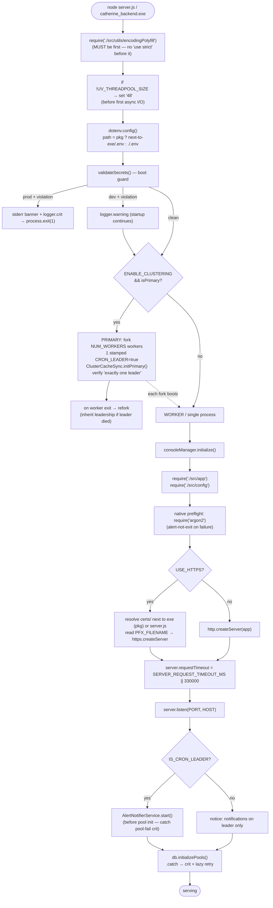
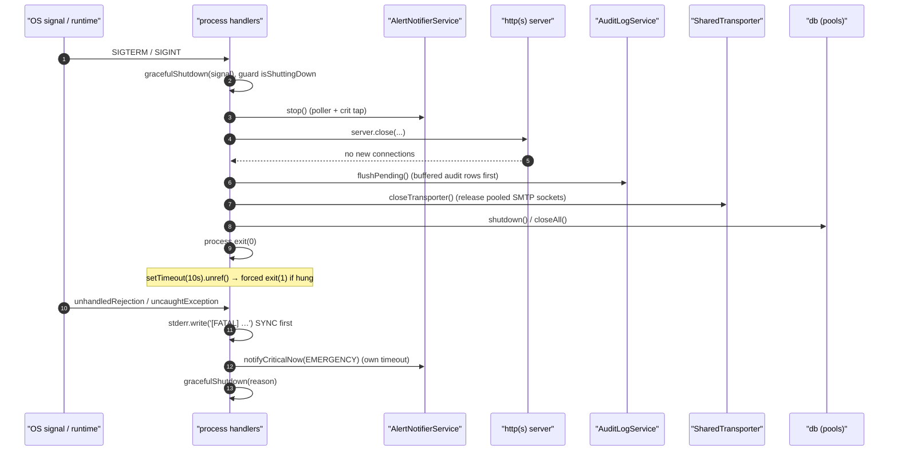

# Boot Sequence, Configuration & the PKG Build — Technical Documentation

> **Scope:** how the CATHERINE template starts — from the first `require` in `server.js`, through env loading and the fail-fast boot guard, clustering and cron-leader election, server creation and graceful shutdown — and how it is compiled to a single Windows executable with `@yao-pkg/pkg`, including the native binaries copied in after the build.
> **Source:** `Backend/server.js` (the surface-root entry point — **not** `src/`), `Backend/src/config/` (`index.js`, `bootGuard.js`, `database.js`, `demoMode.js`, `adapters/oracle.js`), the PKG configuration in `Backend/package.json`, and `Backend/scripts/postbuild-copy-natives.js`.
> **Generated:** 2026-09-04. **Authority:** the code. Where `Backend/CLAUDE.md` disagrees with the code, the code wins and the disagreement is recorded in [§10.1](#101-known-documentation-drift).
> **Rendering:** the ```mermaid fences below render in GitHub, GitLab, Obsidian and VS Code preview. A plain Markdown→PDF path (Chrome "print to PDF") prints them as code — pre-render with `npx @mermaid-js/mermaid-cli` if you need a PDF.

---

## 1. Overview

`Backend/server.js` is the process entry point (`package.json` `"main": "server.js"`, `"bin"` → `./server.js`, `pkg` scripts list `server.js`). It is deliberately at the surface root, not under `src/`, and the very first thing it does is not obvious application setup — it is two ordering-critical preludes that must happen before anything else touches an I/O path.

First it `require("./src/utils/encodingPolyfill")` — the comment states this **must be first**, applying encoding polyfills for the compiled environment. Because that require has to precede everything, `server.js` intentionally does **not** open with a `"use strict"` directive (a strict-mode directive cannot precede the polyfill require); each module under `src/` declares its own `"use strict"` instead.

Second, before any async I/O can create the libuv thread pool, it sizes that pool: if `UV_THREADPOOL_SIZE` is unset it is set to `"48"`. This is because `node-oracledb` in Thick mode runs **every** database call on a libuv worker thread, and the default pool of four threads would serialise concurrent Oracle work no matter how large the connection pool is. The value must be set before the first async I/O creates the pool, which is why it lives in code and not `.env` — a real OS environment variable can override it.

Only then does `server.js` load `.env` — from **next to the executable** in compiled builds (`process.pkg ? path.join(path.dirname(process.execPath), ".env") : ".env"`), because a service or scheduled task can launch the exe with its working directory anywhere (e.g. `System32`). Immediately after `dotenv.config()` it runs the **boot guard** (`validateSecrets()`), which fails the process closed in production if any secret is missing, too short, or still a template placeholder.

From there the process either forks a cluster of workers (with a single elected cron leader) or boots a single worker directly: it initialises the console manager, requires the Express `app` and the config adapter, runs a native-module preflight for `argon2`, creates an HTTP or HTTPS server, listens, eagerly initialises the Oracle pools (lazily-retried on failure), and installs graceful-shutdown and fatal-error handlers.

The whole thing is shipped as one `.exe` via `@yao-pkg/pkg` targeting `node18-win-x64` into `dist/`, after which `scripts/postbuild-copy-natives.js` copies the native `.node` addons (`oracledb`, `argon2`) that `pkg` cannot embed into the snapshot so the exe resolves them at runtime.

---

## 2. Flow & Architecture

### 2.1 Boot sequence



### 2.2 Graceful shutdown & fatal paths



---

## 3. `server.js` — the entry point

### 3.1 The two preludes (order is mandatory)

```js
require("./src/utils/encodingPolyfill");            // must be first
if (!process.env.UV_THREADPOOL_SIZE) {
    process.env.UV_THREADPOOL_SIZE = "48";          // before any async I/O
}
```

- **Encoding polyfill first.** Applied for the compiled (pkg) environment. Because it must precede everything, `server.js` cannot open with `"use strict"`; the file comment records this and notes each `src/` module declares its own strict directive.
- **libuv thread pool sizing.** `node-oracledb` (Thick mode) executes every DB call on a libuv worker thread; the default four threads serialise concurrent Oracle work (with `poolMax=20`, only four queries run at once). Sizing to `48` covers the sum of pool maxima plus headroom for `fs`/`crypto`/`dns`. It must be set before the pool is created (first async I/O) — hence it is code, not `.env` — and can be overridden by a real OS env var.

### 3.2 Env loading — next to the exe in compiled builds

```js
dotenv.config({
    path: process.pkg
        ? path.join(path.dirname(process.execPath), ".env")
        : ".env",
});
```

In a `pkg` build the working directory is unreliable (a service/scheduled task can start the exe from anywhere), so `.env` is resolved next to the executable. In normal Node it is the current directory's `.env`. This must happen before the boot guard, which reads `process.env` immediately.

### 3.3 The boot guard call site

```js
const { validateSecrets } = require("./src/config/bootGuard");
validateSecrets();
```

Runs **after** `dotenv.config()` but **before** any `app`/`db` require, so the process exits before opening pools or binding a port if configuration is unsafe. Detail in [§5](#5-bootguardjs--fail-fast-configuration).

### 3.4 Runtime configuration read from env

```js
const PORT = parseInt(process.env.PORT || "2106", 10);
const HOST = process.env.HOST || "0.0.0.0";
const USE_HTTPS = process.env.USE_HTTPS === "true";
const ENABLE_CLUSTERING = process.env.ENABLE_CLUSTERING === "true";
const NUM_WORKERS = parseInt(process.env.NUM_WORKERS || String(Math.max(1, os.cpus().length)), 10);
```

| Var | Default | Meaning |
| --- | ------- | ------- |
| `PORT` | `2106` | listen port |
| `HOST` | `0.0.0.0` | bind address (`0.0.0.0` = accessible on the LAN) |
| `USE_HTTPS` | `false` | HTTPS via PFX when `"true"` |
| `ENABLE_CLUSTERING` | `false` | fork a worker cluster when `"true"` |
| `NUM_WORKERS` | CPU count (min 1) | workers to fork when clustering |
| `TRUST_PROXY` | `false` | read in `app.js`; makes `req.ip` honour `X-Forwarded-For` |
| `SERVER_REQUEST_TIMEOUT_MS` | `330000` | per-request timeout ceiling (see [§3.7](#37-server-creation-http-vs-https)) |
| `PFX_FILENAME` | `server.pfx` | PFX file in `certs/` when `USE_HTTPS` |
| `PFX_PASSPHRASE` | `""` | PFX passphrase |
| `USE_HTTPS` cert dir | next-to-exe (pkg) / next-to-`server.js` | resolved at runtime, never at snapshot time |
| `CRON_LEADER` | (set by primary) | stamps exactly one worker as cron leader |
| `ENABLE_SERVER_NOTIFICATIONS` | (see service) | gates `AlertNotifierService` |

### 3.5 Clustering & cron-leader election

When `ENABLE_CLUSTERING="true"` and the process is the primary (`cluster.isPrimary ?? cluster.isMaster`), the primary forks `NUM_WORKERS` workers. **Exactly one** worker is stamped `CRON_LEADER="true"` at fork so that scheduled jobs run once, not once per worker.

The election **fails closed**: a worker is leader only when explicitly stamped, because a stray duplicate leader (jobs running N times) is worse than a stray zero-leader gap — but a zero-leader gap is also unacceptable (jobs would silently never run). The primary therefore *verifies* the invariant rather than assuming it:

- `_workerLeaderEnv` (a `Map` of `worker.id → "true"|"false"`) tracks every live worker's `CRON_LEADER` value.
- `ClusterRole.electionHealth([...values])` (pure) classifies the invariant after every fork/exit; a `critical` verdict (zero **or** more than one leader) is `logger.crit`-logged **and** sent out-of-band via `_notifyLeaderInvariantBreach` → `AlertNotifierService.notifyCriticalNow`, because a `logger.crit` raised in the primary would otherwise land only in the log file (the notifier's critical tap runs on the leader worker, not the primary).
- On worker `exit`, the slot is reforked; if the dead worker was the leader, its replacement inherits leadership. If the refork itself throws, that is `logger.crit`-logged (the cluster genuinely has zero leaders until the next retry).
- `ClusterCacheSync.initPrimary()` sets up the cross-worker cache-invalidation relay so a write on one worker invalidates every sibling's in-memory cache.

`_notifyLeaderInvariantBreach` uses `notifyCriticalNow` (not `start()`) on purpose — `start()` would also spin up the metrics poller and duplicate every digest — and swallows its rejection so a failed notification never crashes or blocks the primary.

### 3.6 Worker / single-process boot

The `else` branch runs for each forked worker and for a non-clustered process:

1. `consoleManager.initialize()` — process title, ASCII art, daily console clearing.
2. `require("./src/app")` (the Express app) and `require("./src/config")` (the DB adapter).
3. **Native-module preflight:** `require("argon2")` at boot. `argon2` loads its prebuilt `.node` via `node-gyp-build`, which resolves **outside** the pkg snapshot — a missing/mislocated `node_modules\argon2\prebuilds\win32-x64` next to the exe would otherwise only surface at the first password verify. This is **alert-not-exit**: it `logger.alert`s and continues, because the rest of the API still works — only argon2-hashed credential paths would fail.

### 3.7 Server creation — HTTP vs HTTPS

When `USE_HTTPS="true"`, the cert directory is resolved **at runtime** — next to the exe for pkg builds, next to `server.js` otherwise — never at snapshot time, so pkg's static analyser does not bake a build-machine path. The PFX filename comes from `PFX_FILENAME` (default `server.pfx`). If the PFX is missing, the process writes a `[FATAL]` line to **stderr synchronously** (so it is visible even if the logger's async queue has not flushed — a common compiled-build failure mode), `logger.crit`s, and `process.exit(1)`s. Otherwise `https.createServer` is used; when `USE_HTTPS` is false, `http.createServer`.

`server.requestTimeout` is set from `SERVER_REQUEST_TIMEOUT_MS` (a valid positive integer) or defaults to `330_000` ms. The comment notes that long-running guarded write paths (retry/batch DB retries plus awaited email dispatch) can legitimately exceed Node's default 300 s, and that any reverse proxy in front must independently set at least as large a read/proxy timeout.

### 3.8 Listen, notifier, and eager pool init

On `listen`, the process logs server info and (for `HOST=0.0.0.0`) LAN-access hints, then:

- Computes `IS_CRON_LEADER` via `ClusterRole.isCronLeader({ isWorker, cronLeaderEnv: process.env.CRON_LEADER })` (single-process mode has no `CRON_LEADER` env and always schedules).
- Starts `AlertNotifierService.start()` **only on the cron leader**, and **before** `db.initializePools()` — deliberately, so the critical-log tap is already subscribed when a pool-init failure (which is crit-logged) fires; starting it after a successful init would race and miss that exact event.
- Calls `db.initializePools()` if present; on failure it `logger.crit`s with a hint and relies on lazy retry on first request rather than crashing. The project-specific cron-job registration point is a documented placeholder inside the `.then()`.

### 3.9 Graceful shutdown & fatal handlers

`gracefulShutdown(signal)` is idempotent (`isShuttingDown` guard). It stops `AlertNotifierService`, calls `server.close(...)`, then inside the close callback flushes buffered audit rows (`AuditLogService.flushPending()`) **before** closing pools, closes the shared SMTP transporter (`SharedTransporter.closeTransporter()` — pooled sockets keep the event loop alive), closes the DB (`db.shutdown()` or `db.closeAll()`), and `process.exit(0)`. A `setTimeout(…, 10_000).unref()` forces `exit(1)` if shutdown hangs.

`SIGTERM` and `SIGINT` route to `gracefulShutdown`. `unhandledRejection` and `uncaughtException` each **write to stderr synchronously first** (the logger's write queue is async and a following shutdown would lose queued lines — the exact way compiled exes died silently), then best-effort `notifyCriticalNow` (with its own internal timeout), then `gracefulShutdown`.

---

## 4. `src/config/` — the configuration surface

### 4.1 `index.js` — the adapter factory

All app code imports the DB layer from here (`const db = require('./config')`). `createAdapter(engine)` resolves the engine in order **argument → `DB_TYPE` env → `"oracle"`** and `_loadAdapter` switches on it (only `oracle` is wired; the switch throws for anything else with guidance to add an adapter under `src/config/adapters/`). The module exports the default adapter's surface spread together with `createAdapter` and everything from `./database`.

### 4.2 `database.js` — the connection registry

Holds the `connections` registry. The template ships **one** connection, `appDb`, built from `APP_DB_USERNAME`, `APP_DB_PASSWORD`, a TNS connect string (`buildTNSConnectString(DB_HOST, DB_PORT, DB_APP_SERVICE_NAME)`), and `poolMin`/`poolMax` (defaults 5/20). Adding a connection is one entry here plus its env vars — no other file changes. `POOL_NAMES` is the frozen single source of truth for pool-name strings. The file explicitly forbids config modules from calling `dotenv` themselves (env is loaded once by `server.js`; re-loading would re-inject values a test deliberately unset).

### 4.3 `demoMode.js` — zero-database mode

`isDemoMode()` returns `String(process.env.DEMO_MODE).toLowerCase() === "true"`. When `DEMO_MODE=true`, authentication, audit logs, admin management and changelog are served from in-memory fixtures and **no Oracle pool is opened**. It is read as a function (not a cached const) so it reflects `process.env` after dotenv and can be toggled at runtime by tests.

### 4.4 `adapters/oracle.js` — the Oracle adapter

Merges the former `oracleEnvironment`, `oracleLoader` and `oracleConnectionPool` files. Highlights relevant to boot:

- **Client validation & PATH setup.** `validateOracleClient()` checks `ORACLE_INSTANT_CLIENT` exists and contains `oci.dll` plus the core i18n DLL under either name (`oraociei23.dll` or `oraociei.dll`, which differ across 23.x builds). `setupOracleEnvironment()` prepends the client path to `PATH`.
- **Compiled-env `.env` loader.** In `pkg` builds (`process.pkg` defined) `_loadEnvForCompiled()` reads `.env` from disk only — cwd then next-to-exe — and never via `path.join(__dirname, …)`, because pkg's static analyser would resolve that pattern and **bake the build machine's real secrets into every distributed exe** (CWE-798/CWE-540, confirmed by byte-scanning a build).
- **Thick vs Thin.** `_initOracleClient` attempts Thick mode whenever `ORACLE_INSTANT_CLIENT` is set (not only for compiled exes) because Thick mode supports all password verifier types; Thin rejects some. The loaded mode is logged.
- **Pool defaults.** `POOL_DEFAULTS` (poolMin 10, poolMax 50, increment 5, timeouts, `stmtCacheSize` 50, homogeneous). `fetchArraySize = 1000` to reduce round-trips on bulk reads.
- **Money-safe fetch.** A `NUMBER`-as-string fetch handler is defined (so exact decimals never round-trip through IEEE-754). Its wiring status is covered in the `oracle-mongo-wrapper.md` doc; it is out of scope here.

---

## 5. `bootGuard.js` — fail-fast configuration

`validateSecrets()` is the guard called from `server.js`. It builds a `violations[]` list and enforces:

- **Secret rules** (`SECRET_RULES`): `JWT_SECRET`, `CSRF_SECRET`, `COOKIE_SECRET`, `ARGON2_PEPPER`, `DATA_SIGNING_SECRET`, `CHANGELOG_ENCRYPTION_KEY` — each must be present, ≥ 32 chars (128-bit entropy floor), and not a known template placeholder. Comparison is done through `normalise()` (strips whitespace/`_`/`-`, lowercases) so trivial reformatting cannot bypass the placeholder check. `KNOWN_PLACEHOLDERS` lists the shipped `.env.example` values.
- **`DEMO_MODE` in production:** `DEMO_MODE=true` with `NODE_ENV=production` is a violation.
- **`CORS_ORIGINS` in production:** with `NODE_ENV=production`, CORS restricts to the explicit `CORS_ORIGINS` allow-list plus loopback, so an unset list would silently block every browser request from the deployed frontend. Unless `CORS_ALLOW_BROAD_PATTERNS=true` is set, an empty `CORS_ORIGINS` is a violation — fail loudly at boot rather than ship a silently dead deployment.
- **Money base-currency guard** (`validateMoneyConfig`): if `MONEY_BASE_CURRENCY` is set it must be a registered ISO 4217 code. The change-refusal guard is *armed* only once `MONEY_LEDGER_TABLES` is non-empty; when armed, an in-place base change (`previous != base`) is refused unless `MONEY_BASE_CURRENCY_MIGRATION=true` — a functional-currency change must be a new prospective epoch, not an edit that restates history. This guard is fatal in every environment when armed.

**Failure behaviour:** in production, any violation prints an unmissable stderr banner (drawn directly, since the logger may not be initialised), `logger.crit`s, and `process.exit(1)` — the server refuses to start. In development, violations are `logger.warning`-logged and startup continues for local convenience.

---

## 6. The PKG build

`package.json` defines the build:

```json
"build": "pkg . --out-path dist --targets node18-win-x64 --no-bytecode --public --public-packages=* && node scripts/postbuild-copy-natives.js",
"build:debug": "pkg . --out-path dist --targets node18-win-x64 --no-bytecode --public --public-packages=* --debug && node scripts/postbuild-copy-natives.js"
```

- **Compiler:** `@yao-pkg/pkg` `5.16.1` (devDependency) — the maintained fork of `pkg`.
- **Target:** `node18-win-x64` (also declared in the `pkg.targets` block). Output goes to `dist/`.
- **Flags:** `--no-bytecode --public --public-packages=*` ship readable JS rather than V8 bytecode; `--debug` on the debug variant adds pkg's verbose resolution trace.
- **`pkg.scripts`:** `src/**/*.js` and `server.js` — the code snapshotted into the exe.
- **`pkg.assets`:** JS/JSON/PNG/TTF/HTML under `src/`, plus selected `node_modules` payloads that must be readable at runtime (`axios`, `pdfkit`/`fontkit`, `oracledb/lib`, `nanoid`, `qrcode`/`dijkstrajs`/`pngjs`). Assets are embedded read-only in the snapshot.

Native C++ addons (`*.node`) **cannot** be embedded in the pkg snapshot and must sit on disk next to the exe — which is what the postbuild step handles.

---

## 7. `postbuild-copy-natives.js` — native binaries after the build

Runs automatically after `build` / `build:debug`. It:

1. Iterates `NATIVE_PACKAGES = ["oracledb", "argon2"]`.
2. Recursively finds every `*.node` under each package in `node_modules`.
3. Filters to the current platform using `PLATFORM_FILTERS` (`win32-x64`, `win-x64`, or a `*win32-x64.node` suffix), so no darwin/linux/arm binaries are copied.
4. Copies each surviving binary to `dist/node_modules/<relative path>`, **preserving the path under `node_modules/`** so Node's addon-resolution algorithm finds it next to the exe.

Adding a new native package is a one-line append to `NATIVE_PACKAGES`. This is the same on-disk layout the boot-time `argon2` preflight ([§3.6](#36-worker--single-process-boot)) checks for — `node_modules\argon2\prebuilds\win32-x64` next to the executable.

---

## 8. Boot-relevant environment variables

Grounded in the code read for this document. See `.env.example` for the full catalogue and safe defaults.

| Var | Read in | Effect |
| --- | ------- | ------ |
| `UV_THREADPOOL_SIZE` | `server.js` | libuv worker threads; defaults to `48` if unset (OS env var overrides) |
| `PORT` / `HOST` | `server.js` | listen port / bind address (defaults `2106` / `0.0.0.0`) |
| `USE_HTTPS`, `PFX_FILENAME`, `PFX_PASSPHRASE` | `server.js` | HTTPS via PFX from `certs/` |
| `SERVER_REQUEST_TIMEOUT_MS` | `server.js` | request-timeout ceiling (default `330000`) |
| `ENABLE_CLUSTERING`, `NUM_WORKERS`, `CRON_LEADER` | `server.js` | clustering + cron-leader election |
| `ENABLE_SERVER_NOTIFICATIONS` | `AlertNotifierService` (started in `server.js`) | server email notifications |
| `NODE_ENV` | `bootGuard.js`, `server.js` | prod ⇒ boot guard fails closed |
| `JWT_SECRET`, `CSRF_SECRET`, `COOKIE_SECRET`, `ARGON2_PEPPER`, `DATA_SIGNING_SECRET`, `CHANGELOG_ENCRYPTION_KEY` | `bootGuard.js` | must be ≥ 32 chars, non-placeholder |
| `CORS_ORIGINS`, `CORS_ALLOW_BROAD_PATTERNS` | `bootGuard.js` (also `CorsMiddleware`) | prod CORS allow-list guard |
| `DEMO_MODE` | `demoMode.js`, `bootGuard.js` | in-memory fixtures, no Oracle; forbidden in prod |
| `DB_TYPE` | `config/index.js` | adapter selection (default `oracle`) |
| `APP_DB_USERNAME`, `APP_DB_PASSWORD`, `DB_HOST`, `DB_PORT`, `DB_APP_SERVICE_NAME`, `APP_POOL_MIN`, `APP_POOL_MAX` | `database.js` | the `appDb` connection |
| `ORACLE_INSTANT_CLIENT` | `adapters/oracle.js` | Thick-mode client dir; prepended to `PATH` |
| `MONEY_BASE_CURRENCY`, `MONEY_LEDGER_TABLES`, `MONEY_BASE_CURRENCY_PREVIOUS`, `MONEY_BASE_CURRENCY_MIGRATION` | `bootGuard.js` | money base-currency guard |
| `TRUST_PROXY` | `app.js` (not `server.js`) | `req.ip` from `X-Forwarded-For` |

---

## 9. Security

- **Fail closed at the door.** The boot guard runs before any pool opens or any port binds. In production a placeholder secret, a too-short secret, `DEMO_MODE=true`, an unset `CORS_ORIGINS`, or an unsafe money-currency change refuses startup with an unmissable stderr banner — a misconfigured deployment never reaches a serving state.
- **Secrets stay out of the binary.** The compiled `.env` loader reads from disk next to the exe and deliberately avoids `path.join(__dirname, ".env")` because pkg would otherwise snapshot the build machine's real `.env` into every distributed exe (CWE-798 hard-coded credentials / CWE-540 information exposure) — a defect the file records as confirmed by byte-scanning a build.
- **Working-directory independence.** Resolving `.env` and `certs/` relative to `process.execPath` (not cwd) means a service started from `System32` still loads its real config and certificate rather than silently falling back to defaults.
- **Loud fatal paths.** Fatal handlers write to stderr synchronously before the async logger, so a boot failure or unhandled rejection can never exit silently (the historical compiled-exe failure mode). Cron-leader invariant breaches are both crit-logged and pushed out-of-band precisely because "zero leaders" is the state where nobody is watching the log.
- **Native-module honesty.** The `argon2` preflight surfaces a missing prebuilt addon at boot (alert), rather than letting the first credential verify fail in production with no obvious cause.
- **Single graceful teardown.** Shutdown flushes audit rows before closing pools and releases pooled SMTP sockets, so no security telemetry is lost and the process does not hang holding open sockets.

---

## 10. Appendix

### 10.1 Known documentation drift

Recorded per the authority rule: **the code wins**; each item is a place where `Backend/CLAUDE.md` does not match the boot/config/build source as read on 2026-09-04.

- **DB connection names.** `Backend/CLAUDE.md` (Database — OracleDB Adapter Rules) describes a "dual-pool pattern" with connections named `userAccount` and `unitInventory`. `src/config/database.js` ships exactly **one** connection, `appDb`; `userAccount`/`unitInventory` do not exist in the template registry. **The code is authoritative: one pool, `appDb`.** The `oracle.js` adapter's own docstring also lists backward-compatible shorthands `withDbConnection → withConnection('userAccount')` and `withDbConnectionUnit → withConnection('unitInventory')` (`adapters/oracle.js` header) — those shorthands reference connection names the shipped `database.js` does not register, so they would throw "Unknown connection" if called against the bare template.

- **Boot guard scope vs CLAUDE.md summaries.** The boot guard enforces more than secrets (it also guards `DEMO_MODE`, `CORS_ORIGINS` and the money base-currency in production). Where any CLAUDE.md summary describes the guard as secrets-only, the code is broader — read `bootGuard.js`'s `validateSecrets`/`validateMoneyConfig` for the full set.

### 10.2 Things noted but not asserted

- The internal behaviour of `AlertNotifierService`, `AuditLogService`, `SharedTransporter`, `consoleManager`, `clusterRole` and `encodingPolyfill` was read only as far as `server.js`/config reference them; their full contracts are out of scope for this document and should be read from their own files before changing them.
- `db.initializePools`, `db.shutdown`/`db.closeAll` are called via `typeof … === "function"` guards in `server.js`; this document describes the call sites and the adapter registry, not the pool-lifecycle internals of `adapters/oracle.js` beyond the boot-relevant sections in [§4.4](#44-adaptersoraclejs--the-oracle-adapter).
- The `.env.example` file was referenced by the code but not read in full for this pass; the env table in [§8](#8-boot-relevant-environment-variables) lists only variables observed directly in the source files named in the scope.
