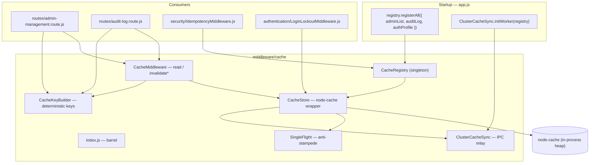
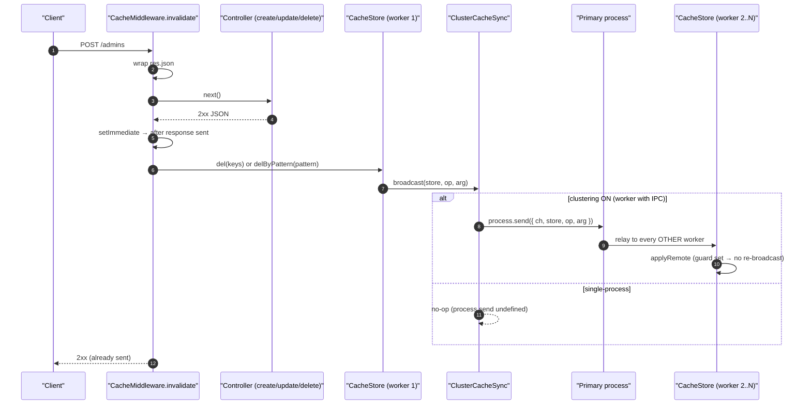
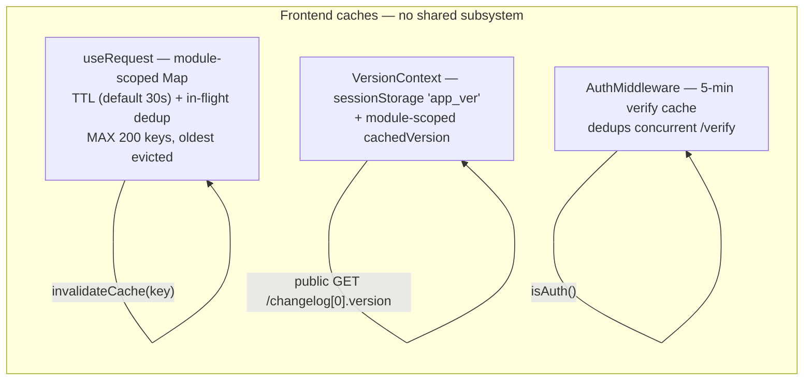

# Caching — Technical Documentation

> **Scope:** the backend cache subsystem (`Backend/src/middleware/cache/`) — the named-store registry, the read-through / invalidate Express middleware, deterministic key building, cross-worker invalidation over cluster IPC, and single-flight stampede protection — plus the small, deliberately independent caches on the frontend (the `useRequest` TTL cache, the version context cache, and the auth-verify cache).
> **Source:** `Backend/` (Node.js + Express v5 API) and `Frontend/` (React 19 + Vite SPA). Core is `Backend/src/middleware/cache/`; the frontend caches are `Frontend/src/hooks/useRequest.js`, `Frontend/src/contexts/version/VersionContext.jsx`, and `Frontend/src/middleware/authentication/AuthMiddleware.js`.
> **Generated:** 2026-09-04. **Authority:** the code. Where `CLAUDE.md`, a JSDoc block or a source comment disagrees with the code, the code wins and the disagreement is recorded in [§7.4](#74-known-documentation-drift).
> **Rendering:** the ```mermaid fences below render in GitHub, GitLab, Obsidian and VS Code preview. A plain Markdown→PDF path prints them as code — pre-render with `npx @mermaid-js/mermaid-cli` if you need a PDF.

---

## 1. Overview

The backend cache is an **in-process** cache. Every store wraps one `node-cache` instance; there is no Redis, no external cache tier. That single fact drives the whole design: a value cached by the worker that handled a read lives only in that worker's heap, so the hard problem the subsystem solves is not *storage* but *invalidation* — making sure that when one request mutates data, no worker (this one or a sibling under clustering) keeps serving the stale copy.

The subsystem is six classes behind one barrel (`middleware/cache/index.js`):

- **`CacheStore`** — the lowest-level building block: one named `node-cache` instance with `get`/`set`/`del`/`delByPattern`/`delWhere`/`flush`/`getOrSet`, structured logging, and stats. You never instantiate it directly.
- **`CacheRegistry`** (singleton `registry`) — a service-locator that creates and resolves stores by name. Registering a name twice throws; resolving an unknown name throws — both to turn a silent misconfiguration into a loud one.
- **`CacheKeyBuilder`** — fluent, *deterministic* key construction: parameters sorted alphabetically, nulls normalised, arrays sorted, over-long keys hashed. Two callers asking for the same data always produce the same key.
- **`CacheMiddleware`** — the Express factory: `read` (cache-aside on GET, with concurrent-miss coalescing) and `invalidate` / `invalidateOnFinish` / `invalidateWhere` (delete after a successful 2xx mutation).
- **`SingleFlight`** — domain-agnostic in-flight call coalescing (the Go `singleflight` pattern), used by `CacheStore.getOrSet` and, in a parallel form, by `CacheMiddleware.read`.
- **`ClusterCacheSync`** — relays every local *invalidation* to sibling cluster workers over the Node.js cluster IPC channel, so a write handled on worker 1 does not leave workers 2..N serving stale data until TTL.

Stores are registered once at startup in `app.js` (`registry.registerAll({...})`) and resolved by name wherever they are used. As shipped, three stores exist — `adminList`, `auditLog`, `authProfile` — and two route files use them (`admin-management.route.js`, `audit-log.route.js`); `IdempotencyMiddleware` and `LoginLockoutMiddleware` reach for the cache primitives directly for their own purposes.

The frontend has **no equivalent shared cache subsystem** — and deliberately so. It has three small, independent, purpose-built caches: `useRequest`'s module-scoped TTL cache with in-flight dedup, the version context's `sessionStorage`-backed version cache, and the auth middleware's 5-minute verify cache. None of them talk to each other.

---

## 2. Flow & Architecture

### 2.1 The layer map



### 2.2 A cached GET — hit, miss, and coalesced miss

```mermaid
sequenceDiagram
    autonumber
    participant C1 as "Client A"
    participant C2 as "Client B (concurrent)"
    participant MW as "CacheMiddleware.read"
    participant S as "CacheStore (node-cache)"
    participant CT as "Controller → Service → Oracle"

    C1->>MW: GET /admins
    MW->>MW: key = keyFn(req)
    MW->>S: store.get(key)
    alt HIT
        S-->>MW: cached value
        MW-->>C1: 200 + X-Cache: HIT
    else MISS — A becomes leader
        S-->>MW: undefined
        MW->>MW: register _inflight[store|key] = flight
        MW->>MW: set X-Cache: MISS; wrap res.json
        MW->>CT: next()
        C2->>MW: GET /admins (same key)
        MW->>S: store.get(key) → undefined
        MW->>MW: found leader flight → await it (resolve-only)
        CT-->>MW: JSON body (2xx)
        MW->>S: store.set(key, body, ttl)  (only on 2xx)
        MW-->>C1: 200 body + X-Cache: MISS
        MW->>MW: res 'close' → release() settles flight
        MW->>S: (follower) store.get(key) → value
        MW-->>C2: 200 body + X-Cache: COALESCED
    end
```

Three details make this safe. Only a **2xx** response is cached — the `res.json` override checks `res.statusCode` before `store.set`, so an error is never memoised. The leader's flight promise is **resolve-only** — it never rejects, and it is released on the response `close` event, which fires on both success and client abort, so followers are always freed. And if the leader failed to populate the key (an error or non-2xx), a waiting follower re-checks the cache, finds it empty, and falls through to run the controller itself, becoming the new leader.

### 2.3 Invalidation after a mutation — and across workers



Invalidation is **fire-and-forget after the response**: `invalidate` wraps `res.json`, and on a 2xx it schedules the delete with `setImmediate`, so the client already has its bytes. Errors in invalidation are logged, never surfaced. The cluster relay carries invalidations *only* — `del` and `delByPattern` are replayed as-is; `delWhere` and `flush` are both replayed as a **flush** of the store on siblings, because a predicate cannot cross a process boundary and over-invalidation (a cold read) is safe while under-invalidation (stale data) is not. Cache *population* is never synced — each worker fills its own cache from its own reads.

---

## 3. `CacheStore` — the store primitive

One `CacheStore` wraps one `node-cache`. Options: `ttl` (seconds, `0` = never expires), `checkPeriod` (expired-key sweep interval; auto-derived to `ttl/4` when omitted and `ttl > 0`), `maxKeys` (`-1` = unlimited). `useClones: false` — the store returns **references**, so callers must not mutate a cached value in place.

| Method | Behaviour | Cluster broadcast |
| --- | --- | --- |
| `get(key)` | returns value or `undefined` on miss; never throws | — |
| `set(key, value, [ttl])` | writes; per-entry TTL override | — (population is not synced) |
| `del(keys)` | delete one or many; returns count | `del` |
| `delByPattern(pattern)` | delete every key whose string *includes* `pattern` (plain substring, not regex); always broadcasts even when this worker matched nothing | `delByPattern` |
| `delWhere(predicate)` | delete every key satisfying a predicate | `flush` (predicate can't cross IPC) |
| `flush()` | remove all entries | `flush` |
| `getOrSet(key, loader, [ttl])` | cache-aside with single-flight; only caches non-`null`/non-`undefined` loader results; re-checks inside the flight | — |
| `stats()` | `{ name, keys, hits, misses, hitRate, ttl, maxKeys }` | — |

`getOrSet` is the service-layer (non-HTTP) entry point. It coalesces concurrent misses through its own `SingleFlight` instance so a burst of identical cold-key requests runs the loader **once**, not N times — the primary defence against a cache stampede saturating the connection pool.

---

## 4. `CacheRegistry` and the shipped stores

`registry` is a module-level singleton. `register(name, options)` throws if the name already exists; `resolve(name)` throws (listing the known names) if it does not; `registerAll(map)` registers a batch; `has(name)` tests membership; `flushAll` / `flush(name)` / `statsAll` operate globally.

Registered once in `app.js`:

| Store | `ttl` | `checkPeriod` | `maxKeys` | Purpose (from the `app.js` comments) |
| --- | --- | --- | --- | --- |
| `adminList` | 600 s | 120 s | 50 | Small admin roster; mutates only on admin CRUD; hard 50-key ceiling. |
| `auditLog` | 120 s | 30 s | 200 | Continuously-growing security telemetry; short TTL avoids stale telemetry while cutting Oracle pressure from admin polling. |
| `authProfile` | 30 s | 15 s | 10000 | Per-user `/auth/me` profile; fires on every page focus; 30 s staleness is harmless (role/active changes apply on next refresh). |

A copier adds project stores under the marked "Add project-specific cache stores below" block. `IdempotencyMiddleware` lazily registers its own store on first use (`registry.register(this._storeName, { ttl })`) rather than at boot.

---

## 5. `CacheKeyBuilder` — deterministic keys

Ad-hoc string concatenation produces two keys for the same data (parameter order differs) or collisions between "all" and "filtered" results (an optional parameter silently omitted). `CacheKeyBuilder` fixes that:

- parameters are **sorted alphabetically** → order-independent;
- `null`/`undefined` normalise to the literal `"null"`;
- arrays are sorted before joining → `[2,1,3]` and `[3,1,2]` give the same key;
- a key longer than `MAX_KEY_LENGTH` (200) is replaced by `prefix:h=<md5-16>`.

Two call styles: fluent (`CacheKeyBuilder.of("users").param("id", id).build()`) and the static shortcut used across the routes (`CacheKeyBuilder.build("auditLog", { type: "stats", fromDate, toDate })`). Example output: `"users:division=WH:month=01:year=2025"`.

---

## 6. `CacheMiddleware` — the Express factory

| Factory | Fires on | Use when |
| --- | --- | --- |
| `read(store, keyFn, [opts])` | GET (write verbs bypass) | Cache-aside a read. `opts`: `bypassMethods`, `ttl`, `setHeaders`, `coalesce`. Serves `X-Cache: HIT` / `MISS` / `COALESCED`. A throwing `keyFn` logs a bypass and calls `next()` — a key-build failure never breaks the request. |
| `invalidate(store, keyFn, [opts])` | 2xx **JSON** response (wraps `res.json`) | Delete after a mutation that responds with JSON. `keyFn` returns a key, an array, or `null` (no-op). `{ usePattern: true }` routes the return through `delByPattern`. Accepts a single store or an array of stores. |
| `invalidateOnFinish(store, keyFn, [opts])` | response `finish` event | The success response is **not JSON** — a file/streamed download (`workbook.xlsx.write(res)`), `res.send(buffer)`, `res.sendFile`. `res.json` never runs for those, so plain `invalidate` would silently skip. `finish` fires for both JSON and streams, so it is safe anywhere `invalidate` is. Register it **before** the controller. |
| `invalidateWhere(store, predicateFn)` | 2xx JSON response | Delete every key matching a predicate (via `delWhere`). |

The template's `admin-management.route.js` reads the admin list from `adminList` (`CacheKeyBuilder.build("adminList")`) and invalidates it with `usePattern` on every CRUD route. `audit-log.route.js` caches `/stats` (and the list / per-request views) keyed by date range, and invalidates the `auditLog` pattern on its one mutation — while its **binary export** routes are deliberately *not* cached (caching a binary stream would corrupt the response and waste memory per key).

---

## 7. Clustering, frontend caching & drift

### 7.1 `ClusterCacheSync` — cross-worker invalidation

Wired at both ends: the primary relays messages (`initPrimary`, in `server.js`) and each worker applies relayed operations (`initWorker(registry)`, in `app.js`, called **after** `registerAll` so every relayed store name resolves). It is a **no-op outside a cluster worker** — `broadcast` returns early when `process.send` is unavailable, so single-process mode carries zero overhead. A `_applyingRemote` re-entrancy guard stops a relayed operation from re-broadcasting (no message storms). IPC failures are swallowed — the worst case is one worker serving stale data until TTL, exactly the situation without sync. The `_cluster`/`_send`/`_canSend` indirections exist so unit tests can substitute fakes.

### 7.2 Frontend caches (independent, purpose-built)



- **`useRequest`** (`Frontend/src/hooks/useRequest.js`) — a request-dedup + TTL cache hook. The in-flight map and resolved cache are **module-scoped singletons**, so any number of components mounting the same key share one network call and one cached result. Default `staleTime` 30 s; opt-in `refetchOnFocus`; a passing `key = null` disables the request; the cache is bounded at `MAX_CACHE_SIZE = 200` with oldest-entry eviction; `invalidateCache(key)` (or `invalidateCache()` for all) busts it from outside a component.
- **`VersionContext`** (`Frontend/src/contexts/version/VersionContext.jsx`) — resolves the app version from the newest Version-History entry via the **public** `GET /api/v1/changelog`, so the badge is correct on the login screen too. It caches the resolved version in `sessionStorage` (`app_ver`) and a module-scoped `cachedVersion`, so a refresh shows the real version immediately instead of flashing the build-time fallback; an `initFiredRef` survives React Strict Mode's double-mount so only one request fires. Falls back to `config/appVersion.js` on network failure.
- **`AuthMiddleware`** (`Frontend/src/middleware/authentication/AuthMiddleware.js`) — caches the `/verify` result for 5 minutes and deduplicates concurrent verify calls.

These do not participate in the backend registry, `ClusterCacheSync`, or `CacheKeyBuilder`; they are separate mechanisms that happen to share the word "cache".

### 7.3 Environment variables this feature depends on

| Variable | Required | Default | Effect |
| --- | --- | --- | --- |
| `ENABLE_CLUSTERING` | no | `false` | When `true`, the app runs multiple workers, so `ClusterCacheSync` becomes active and relays invalidations across them. Off ⇒ every cache method's broadcast is a no-op. |

Store TTLs, `checkPeriod`, and `maxKeys` are **constructor options passed in `app.js`**, not environment variables — there is no `CACHE_TTL`-style global env var (mirrors the note in `Backend/.env.example` for the idempotency window: TTL is a constructor option, documented for discoverability, not a tunable env var).

### 7.4 Known documentation drift

The code is the authority. These are places where prose disagrees with it.

| # | Location | Says | Code actually does |
| --- | --- | --- | --- |
| 1 | `Backend/src/middleware/cache/index.js:12` (barrel header) | `CacheMiddleware — Express middleware factory (read / invalidate / invalidateWhere)` | The class also exports **`invalidateOnFinish`** (`CacheMiddleware.js:275`), which the header omits. It is the correct tool for non-JSON/streamed success responses, so the omission understates the API. |
| 2 | `Backend/src/middleware/cache/CacheMiddleware.js:187-189` (JSDoc for `invalidate`) | "For pattern-based invalidation, call `store.delByPattern(pattern)` inside a custom middleware — **or** pass `{ usePattern: true }`" | Accurate, but the surrounding usage example at `:19-40` and `index.js:31-40` shows `invalidate(usersStore, () => null, { usePattern: true })` returning `null` — with `usePattern` a `null` return is a **no-op** (the `target == null` guard fires first), so the `{ usePattern: true }` on that example line has no effect. Cosmetic; the pattern only does anything when the `keyFn` returns a substring. |
| 3 | `Backend/src/middleware/cache/ClusterCacheSync.js:8-16`, `CacheStore.js` comments | Comments refer to "a financial system" / "stale financial data" as the reason invalidation must cross workers | This is a **template**, not a financial product. The invariant (stale reads across workers are a correctness bug, not a perf trade-off) is correct and portable; the "financial" framing is inherited vocabulary that does not describe CATHERINE itself. Recorded so a copier does not infer a finance domain that isn't there. |
| 4 | `Backend/src/middleware/cache/CacheRegistry.js:20-22`, `index.js:19-24` (usage examples) | Examples register stores named `sessions`, `users`, `reports`, `tokens` | The stores actually registered in `app.js:80-102` are `adminList`, `auditLog`, `authProfile`. The example names are illustrative and do not exist at runtime — `registry.resolve("users")` would throw `store "users" is not registered`. |

---

## 8. Security

### 8.1 What is done well

| Control | Implementation | Class addressed |
| --- | --- | --- |
| Only successful responses are cached | `read`'s `res.json` override checks `2xx` before `store.set` | avoids caching/replaying error or auth-failure bodies |
| Errors never memoised or leaked | invalidation runs in `setImmediate` after the response; failures are logged, not surfaced | CWE-209 (info exposure), availability |
| Deterministic keys prevent cross-tenant bleed | `CacheKeyBuilder` sorts params and normalises nulls, so "all" and "filtered" never collide | CWE-524 (cache) / logic correctness |
| Cross-worker staleness closed | `ClusterCacheSync` relays every invalidation; over-invalidates rather than under-invalidates | stale-data correctness |
| Fail-loud registry | duplicate register / unknown resolve throw | CWE-665 (improper initialization) |
| Bounded key growth | `maxKeys` per store; `useRequest` caps at 200 with eviction | CWE-400 (uncontrolled resource consumption) |
| Long keys hashed, not truncated | `CacheKeyBuilder` md5-fingerprints keys > 200 chars | avoids accidental key collision |

### 8.2 Residual risks and things to know before shipping

1. **`useClones: false` returns references.** A caller that mutates a cached object in place corrupts the entry for every subsequent reader in that process. This is a performance choice; treat cached values as immutable.
2. **The key function is the tenancy boundary.** `CacheMiddleware.read` caches whatever the controller returns under whatever `keyFn` produces. If a response varies by user/role but the key does not include that dimension, one user's response is served to another. Any per-user cached route (e.g. `authProfile`/`/auth/me`) **must** key on the user identity. This is the highest-value review item for any new cached route.
3. **Invalidation is fire-and-forget.** A crash between the response and the `setImmediate` delete leaves a stale entry until TTL. For a `ttl: 0` (never-expire) store this means until the next explicit invalidation — prefer a finite TTL as a backstop.
4. **`delByPattern` is a plain substring match.** A pattern that is a substring of an unrelated key deletes that key too. Namespacing prefixes carefully avoids accidental over-deletion.
5. **Cluster IPC failures are swallowed.** Correct for availability, but under a flapping IPC channel a sibling can serve stale data until TTL with no error surfaced. A finite TTL bounds the exposure.

---

## 9. Verification Q&A

Evidence is cited, not executed — every entry is marked **not run** unless stated otherwise. Backend suites are Vitest (`npm test` → `vitest run`).

> **Q:** Are error responses ever cached?
> **A:** No — `read` only `store.set`s when `res.statusCode` is 2xx. **Evidence:** `CacheMiddleware.js:165-171`. _Status: not run._

> **Q:** Do concurrent misses on one key run the controller more than once?
> **A:** No (with `coalesce`, the default) — the first request is the leader, the rest await its flight and serve the cached value (`X-Cache: COALESCED`). **Evidence:** `CacheMiddleware.js:121-157`; `SingleFlight.js:36-45`. _Status: not run._

> **Q:** Does a follower recover if the leader fails to populate the key?
> **A:** Yes — it re-checks the cache, finds it empty, and runs the controller itself. **Evidence:** `CacheMiddleware.js:130-138`. _Status: not run._

> **Q:** Are invalidations propagated across cluster workers?
> **A:** Yes when clustering is on — `del`/`delByPattern` replayed as-is, `delWhere`/`flush` replayed as a store flush; a no-op single-process. **Evidence:** `ClusterCacheSync.js:33-114`; `CacheStore.js:92,131,149`. _Status: not run._

> **Q:** Can the same store name be registered twice by mistake?
> **A:** No — `register` throws. **Evidence:** `CacheRegistry.js:52-58`. _Status: not run._

> **Q:** Is the frontend `useRequest` cache bounded?
> **A:** Yes — `MAX_CACHE_SIZE = 200`, oldest entry evicted on overflow. **Evidence:** `Frontend/src/hooks/useRequest.js:74-87`. _Status: not run._
