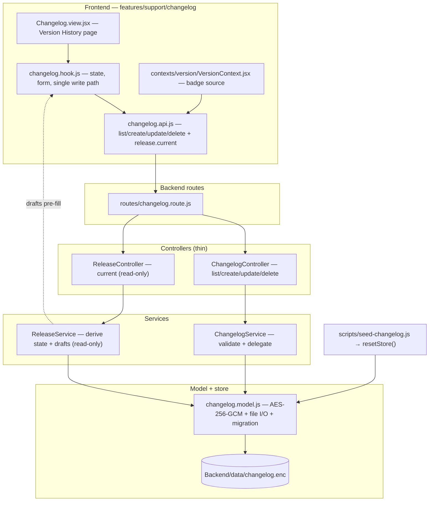
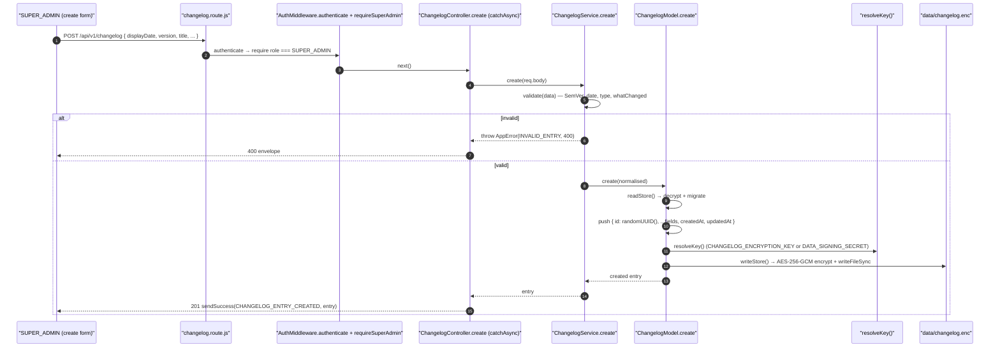
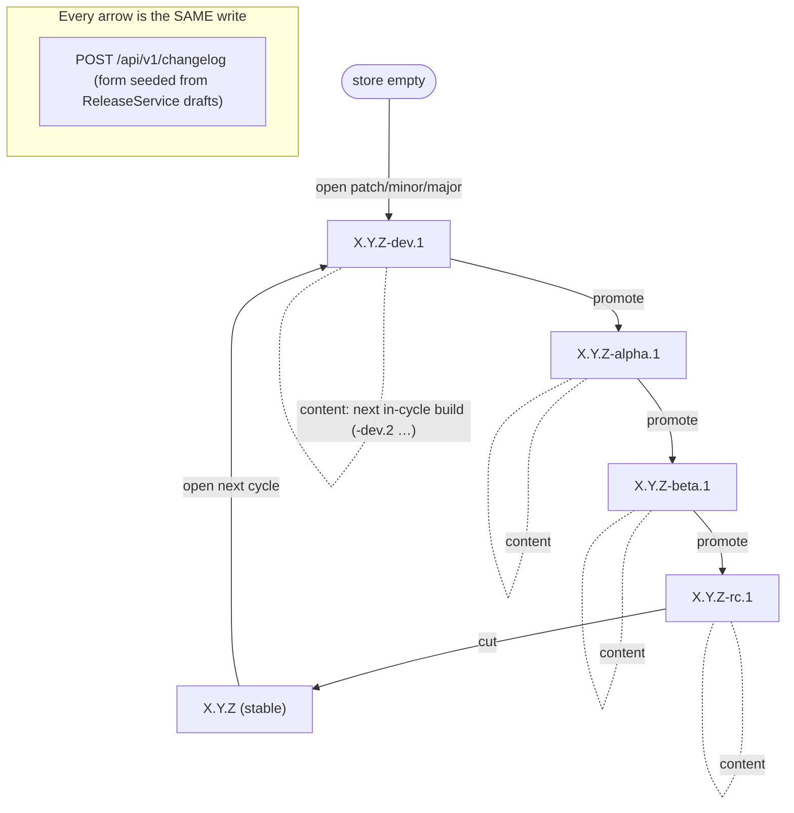

# Changelog & Releases — Technical Documentation

> **Scope:** the changelog + release-train capability — the encrypted on-disk store (`Backend/data/changelog.enc`), the thin controllers (`ChangelogController`, `ReleaseController`), the validation/business layer (`ChangelogService`, `ReleaseService`) and the encrypted model (`changelog.model.js`), the public read / SUPER_ADMIN write route surface, and the frontend Version History page (`Frontend/src/features/support/changelog/`) plus the version badge it feeds.
> **Source:** `Backend/` (Node.js + Express v5 API) and `Frontend/` (React 19 + Vite SPA). Core is `Backend/src/models/changelog.model.js`, `Backend/src/services/{ChangelogService,ReleaseService}.js`, `Backend/src/controllers/{ChangelogController,ReleaseController}.js`, `Backend/src/routes/changelog.route.js`; the frontend is `Frontend/src/features/support/changelog/` and `Frontend/src/contexts/version/VersionContext.jsx`.
> **Generated:** 2026-09-04. **Authority:** the code. Where `CLAUDE.md`, a JSDoc block or a source comment disagrees with the code, the code wins and the disagreement is recorded in [§7.4](#74-known-documentation-drift).
> **Rendering:** the ```mermaid fences below render in GitHub, GitLab, Obsidian and VS Code preview. A plain Markdown→PDF path prints them as code — pre-render with `npx @mermaid-js/mermaid-cli` if you need a PDF.

---

## 1. Overview

The changelog is the one user-facing feature in this template that persists structured data **without a database**. Its entries live in a single AES-256-GCM encrypted file, `Backend/data/changelog.enc`, resolved next to the running process (`<projectRoot>/data/` in dev, next to the `.exe` in a compiled pkg build). There is no Oracle table, no wrapper collection — just an encrypted JSON blob the model reads, decrypts, migrates, and re-encrypts on every write.

Two capabilities sit on that store. The **changelog** proper is a CRUD surface over entries, each a structured record: a display date, a SemVer version (optionally with a release-stage pre-release tag), a title, a headline message, a `whatChanged` bullet tree, a type, and author lists. The **release train** is a *derived, read-only* layer on top: `ReleaseService` reads the highest-precedence version in the store, works out where it sits on the stage ladder `dev → alpha → beta → rc → stable`, and returns the **draft entries** each possible transition would produce — so the UI can pre-fill the create form. Crucially there is **one write path**: every entry, whether an ordinary content build or a release milestone marker, is created through `POST /api/v1/changelog`. `ReleaseController` never writes; it only supplies the pre-fill.

The read side is **public** — `GET /api/v1/changelog` needs no authentication, so the Version History page renders on the login screen and the version badge is correct everywhere before a user signs in. Every mutating route and the release-state route are **SUPER_ADMIN only**. The frontend `VersionContext` leans on that public read: it fetches the newest entry once, derives the app version and its stage badge from that entry's SemVer tag, and caches it in `sessionStorage`.

The whole layering is deliberately thin-controller: controllers marshal HTTP and delegate; `ChangelogService` owns all validation; `ChangelogModel` owns encryption and file I/O; `ReleaseService` owns the pure SemVer/stage arithmetic.

---

## 2. Flow & Architecture

### 2.1 The layer map



### 2.2 A write — validate, encrypt, persist



Every failure funnels through `catchAsync` → the global error handler (see [`error-handling.md`](./error-handling.md)); `ChangelogService`/`ChangelogModel` never hand-build a response. A validation failure is `AppError(CHANGELOG_ERRORS.INVALID_ENTRY, 400)`; a decrypt/encrypt failure is `AppError(CHANGELOG_ERRORS.STORE_UNAVAILABLE, 503)`; a missing entry is `AppError(CHANGELOG_ERRORS.ENTRY_NOT_FOUND, 404)`.

### 2.3 The release train — derived, one write path



`ReleaseService.getState()` reads the highest-precedence version (`_top`, comparing every entry by SemVer 2.0.0 precedence — core numerically, then `dev<alpha<beta<rc<stable`, then iteration), then returns `{ hasTarget, version, core, stage, iter, label, nextActions, drafts }`. `drafts.content` is the next in-cycle build (for the plain "New Entry" action; `null` on a stable/empty store), and `drafts.promote` / `drafts.cut` / `drafts.open` are the transition pre-fills. The UI seeds the create form from one of these and posts it — the transition *is* a normal create.

---

## 3. The encrypted store — `Backend/src/models/changelog.model.js`

### 3.1 Encryption

| Fact | Value |
| --- | --- |
| Algorithm | `aes-256-gcm` |
| IV | 12 random bytes per write |
| On-disk format | JSON `{ iv, authTag, ciphertext }`, all hex-encoded |
| Key source (primary) | `CHANGELOG_ENCRYPTION_KEY` — must be a 64-char hex string (→ 32 bytes) |
| Key source (fallback) | first 32 bytes of `sha256(DATA_SIGNING_SECRET)` when the primary is absent and `DATA_SIGNING_SECRET.length >= 32` |
| No key | `resolveKey()` throws at write/read time |
| Auth tag | verified on decrypt (`setAuthTag`) — a tampered file fails to decrypt |

`writeStore` encrypts the full `{ entries }` object and `writeFileSync`s it; `readStore` decrypts, JSON-parses, migrates, and — if any entry was migrated — re-writes. A decrypt failure is logged and surfaced as `STORE_UNAVAILABLE` (503).

### 3.2 The store path in dev vs compiled builds

In a pkg build `__dirname` points to the read-only snapshot (`C:\snapshot\...`), where `mkdir`/`writeFile` fail. So `PROJECT_ROOT` is `path.dirname(process.execPath)` under `process.pkg`, and `path.resolve(__dirname, "../..")` otherwise — the encrypted store always lives in a writable `data/` next to the running artifact.

### 3.3 Entry shape and migration

An entry carries `id` (`crypto.randomUUID()`), `displayDate` (`YYYY-MM-DD`), `version` (SemVer with optional stage tag), `title`, `message`, `whatChanged` (`{ text, items? }[]`), `type`, `authors[]`, `coAuthors[]`, `createdAt`, `updatedAt`. On read, `migrateEntry` is idempotently applied: a legacy `summary` string is rewritten to `message` + an empty `whatChanged`, and a missing `whatChanged` is defaulted to `[]`.

### 3.4 Model API

| Method | Behaviour |
| --- | --- |
| `listAll()` | all entries, sorted newest `displayDate` first, tie-broken by `createdAt` |
| `findById(id)` | one entry or `ENTRY_NOT_FOUND` (404) |
| `create(data)` | assigns `id` + timestamps, pushes, writes |
| `update(id, data)` | partial update over an **allow-list** of fields; bumps `updatedAt`; `ENTRY_NOT_FOUND` (404) if absent |
| `delete(id)` | removes by id; `ENTRY_NOT_FOUND` (404) if nothing removed |
| `resetStore(entries)` | wipes and re-writes from scratch — **for `scripts/seed-changelog.js` only**, never a request handler |

---

## 4. Validation — `Backend/src/services/ChangelogService.js`

All validation lives in the service; controllers stay thin. `validate(data, requireAll = true)` enforces:

- **Required (on create):** `displayDate`, `version`, `title`, `message`, `type` — else `MISSING_FIELDS` (400).
- **Date:** `displayDate` must match `^\d{4}-\d{2}-\d{2}$`.
- **Type:** one of `breaking`, `feat`, `fix`, `patch`, `perf`, `refactor`, `security`, `test`, `docs`, `chore`, `release`.
- **Version:** anchored SemVer `^\d+\.\d+\.\d+(?:-(?:dev|alpha|beta|rc)(?:\.\d+)+)?$` — accepts `1.4.0`, `1.19.0-dev.1`, `1.19.0-beta.2`, `1.19.0-rc.1`; **rejects** `1.19.0-foo`, `1.19.0-beta` (no iteration), `1.19`, `v1.4.0`. The restriction to the known stage ladder with a required numeric iteration is a deliberate CWE-20 anchored input validation — no unbounded wildcard.
- **`whatChanged`:** must be an array when provided.

`validate` returns a normalised object (trimmed strings; `authors`/`coAuthors` accepted as an array *or* a comma-separated string and split into a clean array). `update` passes `requireAll = false` for partial updates.

---

## 5. The release train — `Backend/src/services/ReleaseService.js`

Read-only, pure SemVer arithmetic. Key helpers:

- `parseVersion(v)` → `{ major, minor, patch, stage, iter }`; a bare version is `stage: "stable", iter: 0`.
- `compareVersion(a, b)` → SemVer 2.0.0 precedence: core numerically, then `STAGE_ORDER` (`dev 0 < alpha 1 < beta 2 < rc 3 < stable 4`), then iteration.
- `bumpCore(p, "patch"|"minor"|"major")` and `composeVersion(p)` build the next version string.
- `_top()` scans every entry and returns the highest-precedence parsed version (`null` on empty store).
- `_openDrafts(base)` builds the three "open next cycle" drafts (patch/minor/major), each a fresh `-dev.1`.

`getState()` returns the current target plus `nextActions` and `drafts`:

| Current stage | `nextActions` | Drafts supplied |
| --- | --- | --- |
| empty store | `["open"]` | `open` (patch/minor/major → `-dev.1`); `content: null` |
| `dev` \| `alpha` \| `beta` | `["promote"]` | `promote` (advance one stage → `-<next>.1`) + `content` (next in-cycle build) |
| `rc` | `["cut"]` | `cut` (→ stable, plain core) + `content` |
| `stable` | `["open"]` | `open` (next cycle); `content: null` — a new cycle must be opened first |

The frontend mirrors the stage vocabulary in `Frontend/src/config/appVersion.js` (`STAGE_META`, `parseStageFromVersion`) so the badge and the number always agree.

---

## 6. Route surface & the frontend

### 6.1 Routes — `Backend/src/routes/changelog.route.js`

| Method & path | Auth | Handler |
| --- | --- | --- |
| `GET /api/v1/changelog` | **PUBLIC** (read-only) | `ChangelogController.list` |
| `GET /api/v1/changelog/release/current` | authenticate + SUPER_ADMIN | `ReleaseController.current` |
| `POST /api/v1/changelog` | authenticate + SUPER_ADMIN | `ChangelogController.create` (201) |
| `PUT /api/v1/changelog/:id` | authenticate + SUPER_ADMIN | `ChangelogController.update` |
| `DELETE /api/v1/changelog/:id` | authenticate + SUPER_ADMIN | `ChangelogController.delete` |

The literal `/release/current` route is declared **before** the parameterised `/:id` routes, so it is never shadowed by the `:id` matcher. The public list deliberately returns only committed entries; release-train drafts are derived separately by the SUPER_ADMIN-only `/release/current`.

### 6.2 Frontend — `Frontend/src/features/support/changelog/`

The feature follows the three-layer pattern: `changelog.api.js` (HTTP through `HttpClient`, CSRF auto-injected: `list`, `create`, `update`, `delete`, and `release.current`), `changelog.hook.js` (state, modals, and the **single write path** — the form is seeded from either "New Entry" or a Release Control action, both supplied as drafts by `GET /changelog/release/current`, then posted through `create`), and `Changelog.view.jsx` (the Version History page). `whatChanged` is edited as a textarea and (de)serialised to the structured tree (2-space indent = nested item). The backend owns the version/stage rules; the hook just seeds and posts.

### 6.3 The version badge — `VersionContext`

`VersionProvider` fetches `changelogApi.list()` once on mount (the public endpoint), takes `res.data.data[0].version` as the current version, and derives the stage badge from its SemVer tag via `parseStageFromVersion`. It caches the resolved version in `sessionStorage` (`app_ver`) and a module-scoped variable so a refresh shows the real version immediately instead of flashing the build-time fallback (`config/appVersion.js`); an `initFiredRef` survives Strict Mode's double-mount so only one request fires. On network failure it falls back to the build-time `APP_VERSION`/`APP_STAGE`. (See [`caching.md`](./caching.md) §7.2 for this cache's place among the frontend caches.)

---

## 7. Operations, config & drift

### 7.1 Seeding and inspecting the store

`node scripts/seed-changelog.js` wipes and re-seeds via `ChangelogModel.resetStore(entries)`; the store is created empty on first read if the file is absent. `scripts/dump-changelog.js` decrypts and dumps the store for inspection (`scripts/changelog-dump.json`). Both need the same key material the runtime uses.

### 7.2 Environment variables this feature depends on

| Variable | Required | Default / fallback | Effect |
| --- | --- | --- | --- |
| `CHANGELOG_ENCRYPTION_KEY` | recommended | falls back to `sha256(DATA_SIGNING_SECRET)` | 64-char hex → the AES-256-GCM key for `changelog.enc`. Validated at boot (`bootGuard.js` `SECRET_RULES`, min length 32). |
| `DATA_SIGNING_SECRET` | required (system-wide) | — | Its `sha256` is the changelog key fallback when `CHANGELOG_ENCRYPTION_KEY` is unset. |

With neither key resolvable, `resolveKey()` throws and any changelog read/write fails — the feature cannot operate without key material.

### 7.3 Error contract

| Condition | `AppError` | Status |
| --- | --- | --- |
| Missing required fields | `VALIDATION_ERRORS.MISSING_FIELDS` | 400 |
| Bad date / type / SemVer / `whatChanged` | `CHANGELOG_ERRORS.INVALID_ENTRY` | 400 |
| Entry id not found | `CHANGELOG_ERRORS.ENTRY_NOT_FOUND` | 404 |
| Decrypt / encrypt failure | `CHANGELOG_ERRORS.STORE_UNAVAILABLE` | 503 |

### 7.4 Known documentation drift

The code is the authority. These are places where prose disagrees with it.

| # | Location | Says | Code actually does |
| --- | --- | --- | --- |
| 1 | `Backend/src/models/changelog.model.js:15` (entry-shape comment) | `displayDate string YYYY-MM-DD (adjusted: Sat→Fri, Sun→Mon)` | **No weekend adjustment exists.** `ChangelogService.validate` only checks the `YYYY-MM-DD` shape and passes `displayDate` through unchanged; `changelog.model.js` stores it verbatim. There is no `getDay`/weekend logic anywhere in the changelog code. A Saturday date is stored as a Saturday. |
| 2 | `Backend/src/models/changelog.model.js:22` (entry-shape comment) | `type string breaking\|feat\|fix\|patch\|perf\|refactor\|security\|docs\|chore` | The accepted set is **larger**: `ChangelogService.js:16-28` also allows `test` and `release`. The model header omits both — `release` is load-bearing (it is the type every release-train marker uses). |
| 3 | `Backend/src/models/changelog.model.js:14-16` (entry-shape comment) | "Stage (dev\|alpha\|beta\|rc\|stable) is DERIVED from this tag — there is no separate stage field" | Correct for the *persisted* entry, but `ReleaseService.draft(...)` returns a transient `stage` field inside the **drafts** the create form seeds from (`ReleaseService.js:117`). It is informational and not persisted (the create path never stores `stage`), but a reader of the drafts payload will see a `stage` key the entry itself never keeps. |
| 4 | `Backend/src/controllers/ChangelogController.js:26,50,58` (JSDoc) | Mutations are "SADMIN only" | The role the route actually checks is `SUPER_ADMIN` (`changelog.route.js:27` `user.role === "SUPER_ADMIN"`). "SADMIN" is shorthand for the same role, but the literal string in code is `SUPER_ADMIN`; there is no `SADMIN` role value. |

---

## 8. Security

### 8.1 What is done well

| Control | Implementation | Class addressed |
| --- | --- | --- |
| Data at rest is encrypted + authenticated | AES-256-GCM with a random per-write IV and a verified auth tag | CWE-311 (missing encryption), CWE-312 (cleartext storage), tamper detection |
| Key material validated at boot | `bootGuard.js` `SECRET_RULES` enforces min length and rejects placeholders | CWE-521 (weak credentials) |
| Writes are SUPER_ADMIN only | `AuthMiddleware.authenticate` + `requireAccess(role === SUPER_ADMIN)` on every mutation | CWE-862 (missing authorization) |
| Partial updates are allow-listed | `update` only copies fields from an explicit `ALLOWED` array | CWE-915 (mass assignment) |
| SemVer input is anchored | the version regex rejects arbitrary pre-release tags | CWE-20 (improper input validation) |
| Single write path | release transitions go through the same validated `POST` — no unvalidated back door | logic integrity |
| Failures never leak internals | all errors funnel through `AppError` + the global handler | CWE-209 (information exposure) |
| Store path is pkg-safe | resolved next to the executable, never the read-only snapshot | availability / write-integrity |

### 8.2 Residual risks and things to know before shipping

1. **The fallback key derives from `DATA_SIGNING_SECRET`.** When `CHANGELOG_ENCRYPTION_KEY` is unset, the changelog key is `sha256(DATA_SIGNING_SECRET)` — so rotating `DATA_SIGNING_SECRET` silently makes an existing `changelog.enc` undecryptable (503 on read). Set a dedicated `CHANGELOG_ENCRYPTION_KEY` in any environment where the signing secret may rotate.
2. **Whole-file read/write, no locking.** Every write decrypts, mutates, and re-encrypts the entire file with `writeFileSync`. Two concurrent writes can race and lose an entry (last-writer-wins). Fine for a low-frequency, single-author changelog; a copier who expects concurrent editors needs a lock or a real store. **Escalation:** a concurrency-safe rewrite is a backend design decision, flagged not fixed here.
3. **The public read exposes version/stage information.** `GET /changelog` is intentionally unauthenticated, so anyone can see the app's version history and current stage. That is a product decision (the badge must render pre-login); if version disclosure is sensitive, gate the endpoint — note the frontend `nav.config.jsx` already carries a version-disclosure policy for the badge chrome.
4. **`resetStore` is destructive.** It wipes the store; it is guarded only by convention ("scripts only"). Keep it out of any request path.

---

## 9. Verification Q&A

Evidence is cited, not executed — every entry is marked **not run** unless stated otherwise. Backend suites are Vitest; frontend uses MSW handlers (`Frontend/test/helpers/msw/handlers/changelog.handlers.js`).

> **Q:** Is the changelog readable without authentication?
> **A:** Yes — `GET /api/v1/changelog` has no auth middleware; mutations do. **Evidence:** `changelog.route.js:31-70`. _Status: not run._

> **Q:** Can a non-SUPER_ADMIN create/update/delete an entry?
> **A:** No — every mutation runs `authenticate` + `requireSuperAdmin` (`user.role === "SUPER_ADMIN"`). **Evidence:** `changelog.route.js:27,50-70`. _Status: not run._

> **Q:** Is a garbage SemVer version rejected?
> **A:** Yes — the anchored regex rejects `1.19.0-foo`, `1.19.0-beta` (no iteration), `1.19`, `v1.4.0`. **Evidence:** `ChangelogService.js:36,88-95`. _Status: not run._

> **Q:** Does a tampered `changelog.enc` fail closed?
> **A:** Yes — GCM auth-tag verification fails on decrypt, surfaced as `STORE_UNAVAILABLE` (503). **Evidence:** `changelog.model.js:90-95,153-160`. _Status: not run._

> **Q:** Can an update overwrite fields that aren't user-editable (e.g. `id`, `createdAt`)?
> **A:** No — `update` copies only the `ALLOWED` fields. **Evidence:** `changelog.model.js:248-267`. _Status: not run._

> **Q:** Does the release train ever write on its own?
> **A:** No — `ReleaseService`/`ReleaseController` are read-only; every transition is a normal `POST /changelog`. **Evidence:** `ReleaseController.js:6-31`; `ReleaseService.js:14-16`. _Status: not run._

> **Q:** Is a Saturday `displayDate` shifted to Friday as the model comment claims?
> **A:** No — no weekend-adjustment code exists (drift row 1). **Evidence:** `ChangelogService.js:74-77`, absence of `getDay` in the changelog sources. _Status: not run._
