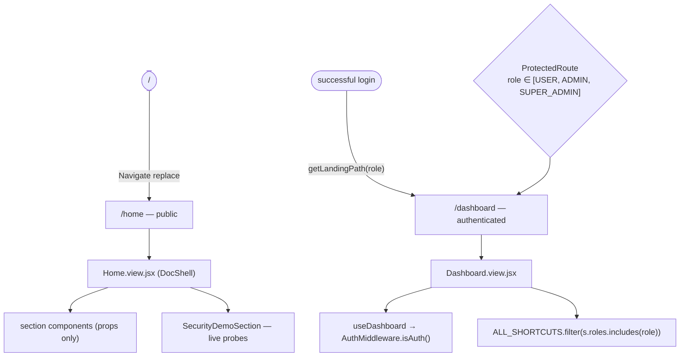
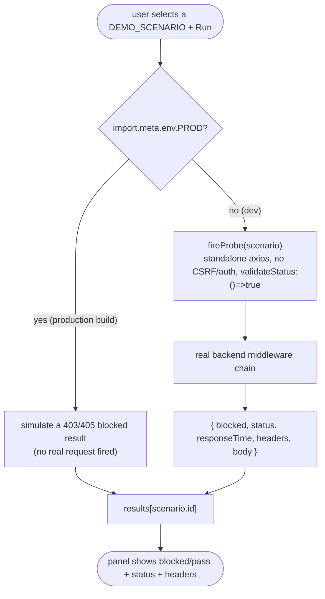

# Dashboard & Home — Technical Documentation

> **Scope:** the two landing surfaces of the CATHERINE template — the public **Home** page (a long-form, section-based introduction to the template with a live security demo) and the authenticated **Dashboard** (a role-aware landing that renders a greeting and the feature shortcuts the signed-in role is allowed to reach).
> **Source:** `Frontend/` (React 19 + Vite SPA). Core is `Frontend/src/features/dashboard/Dashboard.view.jsx`, `Frontend/src/features/dashboard/dashboard.hook.js`, `Frontend/src/features/home/Home.view.jsx`, `Frontend/src/features/home/home.hook.js`, `Frontend/src/features/home/securityDemo.hook.js`, `Frontend/src/features/home/securityDemo.api.js`, and the `Frontend/src/features/home/components/` section components. Routing is in `Frontend/src/App.jsx`.
> **Generated:** 2026-09-04. **Authority:** the code. Where `CLAUDE.md`, a JSDoc block or a source comment disagrees with the code, the code wins and the disagreement is recorded in [§5.4](#54-known-documentation-drift).
> **Rendering:** the ```mermaid fences below render in GitHub, GitLab, Obsidian and VS Code preview. A plain Markdown→PDF path (Chrome "print to PDF") will print them as code — pre-render with `npx @mermaid-js/mermaid-cli` if you need a PDF.

---

## 1. Overview

The template mounts two landing surfaces at opposite ends of the auth boundary. **Home** (`/home`) is public and is the app's default route — `/` redirects to `/home` (`App.jsx`). **Dashboard** (`/dashboard`) is the single authenticated landing every valid role is sent to after login (`features/auth/roleRedirect.js` — every role maps to `/dashboard`), and it is gated to `USER` / `ADMIN` / `SUPER_ADMIN` on the client (`App.jsx`).

Home is a static, narrative page. Its hook (`home.hook.js` `useHome`) returns pure content — section registry, threat statistics, attack-demo cards, defense-layer cards, middleware steps, roadmap items, FAQ, and next-links — with no API calls. The view (`Home.view.jsx`) composes a `DocShell` (article body + "On this page" scroll-spy rail) out of sibling section components, each of which receives its data via props and imports neither the hook nor any API file. The one interactive part is the **live security demo**: a panel that fires representative malicious requests at the running backend and shows whether each was blocked, proving the middleware chain works.

Dashboard is a thin, role-aware surface. Its hook (`dashboard.hook.js` `useDashboard`) resolves the current user from the auth cache (`AuthMiddleware.isAuth()`) and exposes `{ user, loading }`. The view (`Dashboard.view.jsx`) renders a personalized greeting and filters a shortcut list by the user's **string** role — each shortcut declares which roles may see it, and `ALL_SHORTCUTS.filter((s) => s.roles.includes(role))` decides what appears. There is no placeholder data: a role with no matching shortcuts sees an explicit empty state, never a `—`.

Both surfaces follow the template's feature conventions. Dashboard uses the two-layer shape it needs (`dashboard.hook.js` + `Dashboard.view.jsx`; no API layer because it reads only the auth cache). Home uses `home.hook.js` + `Home.view.jsx` plus a dedicated `securityDemo.hook.js` / `securityDemo.api.js` pair for the one feature that talks to the network. Both views are wrapped in `ErrorBoundary`.

---

## 2. Flow & Architecture

### 2.1 The two surfaces relative to auth



### 2.2 Dashboard render

```mermaid
sequenceDiagram
    autonumber
    actor U as "Authenticated user"
    participant R as "React Router (/dashboard)"
    participant PR as "ProtectedRoute"
    participant V as "Dashboard.view.jsx"
    participant H as "useDashboard"
    participant A as "AuthMiddleware.isAuth()"

    U->>R: navigate /dashboard
    R->>PR: role ∈ [USER, ADMIN, SUPER_ADMIN]?
    PR-->>V: allowed (else redirect /unauthorized)
    V->>H: useDashboard()
    H->>A: isAuth()
    A-->>H: user (role, firstName, lastName) | null
    H-->>V: { user, loading }
    alt loading
        V-->>U: Skeleton greeting + card grid
    else resolved
        V->>V: role = user.role; shortcuts = ALL_SHORTCUTS.filter(s.roles.includes(role))
        V-->>U: greeting + shortcut grid (or empty state)
    end
```

The shortcut filter is a plain string-membership test against the role, mirroring `ProtectedRoute`'s `role.includes(user.role)`. `ROLE_LABELS` maps the role string to a human label for the subtitle; an unmapped role falls back to the raw string (`Dashboard.view.jsx`).

### 2.3 Live security demo probe



The production simulation is a deliberate safeguard: in a production build the demo returns a *simulated* blocked response instead of firing real malicious HTTP, so it cannot trip `SecurityFilterMiddleware` into blocking the visitor's own (or a shared proxy) IP after ~10 hits (`securityDemo.hook.js` `useSecurityDemo`, the `isProduction` branch).

---

## 3. Home page

### 3.1 Composition

`Home.view.jsx` renders a dismissible promo `Banner`, a `HeroSection`, and a `DocShell` whose `sections` (from `useHome`) drive the "On this page" scroll-spy rail. The body is a sequence of section components separated by gradient dividers:

| # | Section component | Content source (from `useHome`) |
| - | ----------------- | ------------------------------- |
| 1 | `IntroductionSection` | — |
| 2 | `CybersecuritySection` | `threatStats` |
| 3 | `SecurityDemoSection` | `attackDemos` (+ `useSecurityDemo`) |
| 4 | `ArchitectureSection` | `middlewareSteps`, `defenseLayers` |
| 5 | `TechStackSection` | — |
| 6 | `BenchmarksSection` | — |
| 7 | `RoadmapSection` | `roadmapItems` |
| 8 | `FaqSection` | `faqItems` |
| 9 | `SourcesSection` | — |
| — | `WhereToGoNext` | `nextLinks` |

Each section component receives its data via props and imports neither the hook nor an API file (`Home.view.jsx` header) — the view is the only place `useHome` is called.

### 3.2 Static content hook

`useHome()` returns memoized static content: the `sections` registry, a hero `announcement` string, `threatStats` (each with a verifiable authoritative source URL), `attackDemos`, `defenseLayers`, `middlewareSteps`, `roadmapItems`, `faqItems`, and `nextLinks`. It makes no network calls (`home.hook.js` header). `BADGE_STATUS` is exported for the roadmap's status metadata; the view renders the actual JSX.

### 3.3 The security demo pair

The demo is a normal two-layer feature slice:

- **`securityDemo.api.js`** — a **standalone** axios instance, deliberately without the app's CSRF/auth interceptors and with `withCredentials: false`, so the probes go out as unauthenticated, un-tokened requests that the middleware chain will treat as hostile. `validateStatus: () => true` means it never throws — the panel inspects `4xx`/`5xx` responses directly. `fireProbe(scenario)` returns a structured `{ success, blocked, status, statusText, responseTime, headers, body }`.
- **`securityDemo.hook.js`** — `useSecurityDemo()` owns the selected scenario, per-scenario results, and the loading flag, and exposes `runProbe`. `DEMO_SCENARIOS` is a catalogue organised by category (Baseline, Headers, Injection, XSS, Traversal, Scanner, Method, Auth, CSRF, Payload, RCE, Recon), each entry naming the CWE it exercises and the `expect: "pass" | "block"` outcome. In production `runProbe` simulates the result (§2.3).

---

## 4. Dashboard page

### 4.1 The hook

`useDashboard()` (`dashboard.hook.js`) resolves the current user via `AuthMiddleware.isAuth()` inside an effect with a `cancelled` guard, and returns `{ user, loading }`. It has no API layer of its own — the auth cache is the only data source.

### 4.2 The view

`Dashboard.view.jsx` reads `{ user, loading }`, derives `role`, `firstName`, `lastName`, and a `fullName` (falling back to `"there"`), and computes `shortcuts = ALL_SHORTCUTS.filter((s) => s.roles.includes(role))`. While loading it shows a `Skeleton` greeting and card grid. Resolved, it renders:

- a gradient-accented **greeting** (`ROLE_LABELS[role]` subtitle + `"CATHERINE Template"`),
- a **Quick Access** grid of `ShortcutCard`s (icon, label, description → navigate to `path`), or an explicit empty state when no shortcut matches the role,
- a **Sign out** shortcut linking to `/user/logout`.

`ALL_SHORTCUTS` as shipped points at `/system/admin-management` and `/system/logging-and-observability` (both `SUPER_ADMIN`-only), `/about/changelog`, and `/auth/change-password` (all roles). Each card's `roles` array is the client-side visibility gate; the destinations enforce their own access via their own `ProtectedRoute` guards.

### 4.3 Routing & role landing

- `/` → `Navigate replace` to `/home` (public).
- `/home` → `HomeView` (public).
- `/dashboard` → `DashboardView` behind `ProtectedRoute role={[ROLES.USER, ROLES.ADMIN, ROLES.SADMIN]}` (`App.jsx`).
- Post-login destination for **every** role is `/dashboard` (`roleRedirect.js` `ROLE_LANDING_PATHS`); an unknown role falls back to the `USER` path, which is also `/dashboard`.

Roles are strings throughout: `ROLES` maps aliases to wire strings (`SADMIN: "SUPER_ADMIN"`, `ADMIN: "ADMIN"`, `USER: "USER"`, …) and the guards compare strings (`ProtectedRoute.jsx` `role.includes(user.role)`).

---

## 5. Security & correctness notes

### 5.1 Public vs authenticated boundary

Home is intentionally public — it is the marketing/introduction surface and reads no protected data. Dashboard is behind `ProtectedRoute`; an unauthenticated visit redirects (default `/unauthorized`). The shortcut filter is a UI convenience only — each linked destination re-enforces access on arrival, so hiding a card is not the security control.

### 5.2 The demo cannot self-harm in production

The single network-touching feature (the security demo) is sandboxed in production builds so it never fires real hostile traffic that would get the visitor's IP blocked; it fires real probes only in dev where a temporary self-block is harmless (`securityDemo.hook.js`). The probe client carries no credentials and no CSRF token by design — that is what makes the probes representative of an outside attacker.

### 5.3 No placeholder data

Dashboard renders only real auth-cache data or intentional navigation; a role with no shortcuts gets an explicit empty message, not a fabricated value (`Dashboard.view.jsx` header + empty-state branch).

### 5.4 Known documentation drift

Documentation-only observations. **No code was changed.**

1. **Dashboard shortcuts vs. the route guard.** `ALL_SHORTCUTS` includes a `roles` array listing `APPROVER` / `VIEWER` / `ROBOT` for the Change-Password card (`Dashboard.view.jsx`), and `ROLE_LABELS` maps those extra roles — but the `/dashboard` route itself is gated to only `[USER, ADMIN, SUPER_ADMIN]` (`App.jsx`). An `APPROVER` / `VIEWER` / `ROBOT` account (were one to exist) could not reach `/dashboard` to see those shortcuts. Backend `T_ADMINS_DEV` also accepts only `SUPER_ADMIN` / `ADMIN` / `USER` (see `admin-management-and-rbac.md` §7.5), so those extra roles are not provisionable in the template as shipped. This doc documents the guard and the shortcut list as written and flags the mismatch. *Owner: React.*
2. **No confirmed defects between the Home/Dashboard code and its own JSDoc.** The `useHome` / `useDashboard` / `useSecurityDemo` return shapes and the section-composition contract match the views as read. *No owner action required.*
