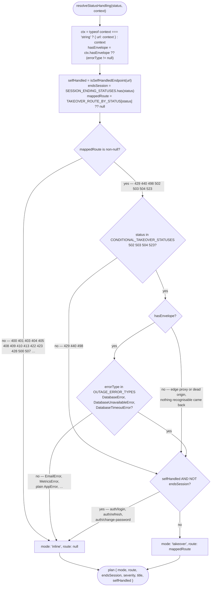
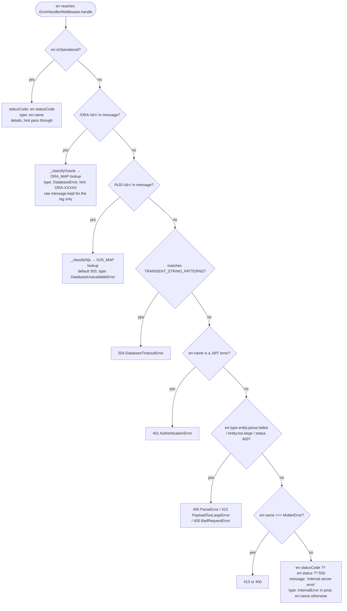
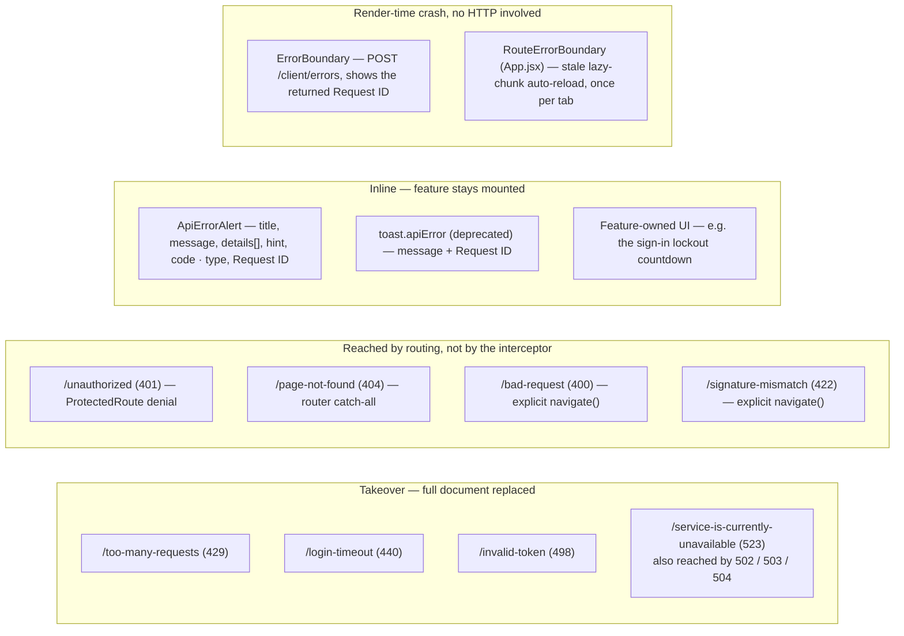

# Error Handling & the HTTP Status Contract — Technical Documentation

> **Scope:** how a failure becomes a status code on the server, an envelope on the wire, and a screen in the browser — and the single rule that decides whether that screen replaces the page or stays inside the feature.
> **Source:** `Frontend/` (React 19 + Vite SPA) and `Backend/` (Node.js + Express v5 API).
> **Generated:** 2026-09-04. **Authority:** the code. Where `CLAUDE.md` or a JSDoc block disagrees with the code, the code wins and the disagreement is recorded in [§6.10](#610-known-documentation-drift).
> **Rendering:** the ```mermaid fences below render in GitHub, GitLab, Obsidian and VS Code preview. A plain Markdown→PDF path prints them as code — pre-render with `npx @mermaid-js/mermaid-cli` if you need a PDF.

---

## 1. Overview

Every failure in this template funnels through one server-side classifier and comes back in one envelope shape. Services and controllers never build error responses by hand: they `throw new AppError(message, statusCode, { type, details, hint })`, `catchAsync` forwards the rejection to Express, and the global `ErrorHandlerMiddleware` turns it — along with Oracle `ORA-` codes, driver `NJS-` codes, JWT errors, body-parser errors and anything unexpected — into `{ status, code, title, message, requestId, error }`. The raw database message, the SQL and the stack stay in the log; the client gets a sanitised, machine-stable label.

On the browser side one Axios interceptor sees every one of those envelopes, and one function decides what the UI does with it. **That decision — takeover vs inline — is the point of this document.**

A *takeover* replaces the whole document with a full-page error screen. It is right when the current view genuinely cannot continue: the session is gone, the whole client is being throttled, or the origin is not answering. It is catastrophically wrong for everything else, because `window.location.replace` is a full document load — router state, component state and any half-typed form are destroyed. A backend uses `401`, `403`, `409`, `422` and `423` for *business-rule* failures ("you may not perform this action", "that password doesn't match", "this record is already closed"), and hard-navigating on those loses the user's work to show them what is, semantically, a validation message. So those statuses are deliberately **not** takeovers, and the takeover set is kept small, explicit and conditional.

---

## 2. Flow & Architecture

### 2.1 The decision — `resolveStatusHandling(status, context)`



Every branch here exists because of a specific failure it prevents. The `Cond`/`Type` pair exists because this backend overloads `502`/`503`/`504` with service-level meanings — a failed mail send is a `502`, an unavailable metrics store is a `503` — and a feature that opens its own modal on one of those would lose that context to a hard navigation. The `Env` branch exists because an edge proxy or a dead origin answers with HTML or nothing at all: the *absence* of a `status: "error"` field is itself the signal that no service handled the request, so it takes over. The `Self` branch exists because the sign-in screen renders its own lockout countdown, and a takeover would strip away the exact context a locked-out user needs — but it deliberately cannot suppress `endsSession`, because a dead token on the sign-in screen still has to clear local state.

### 2.2 A failing request, end to end

```mermaid
sequenceDiagram
    autonumber
    participant F as "Feature hook"
    participant C as "HttpClient interceptor"
    participant T as "TraceabilityMiddleware (step 3)"
    participant R as "Route + controller"
    participant CA as "catchAsync"
    participant S as "Service"
    participant EH as "ErrorHandlerMiddleware.handle"
    participant LG as "logger"

    F->>C: httpClient.get("some/resource")
    C->>T: GET /api/v1/some/resource
    T->>T: req.id = snowflake.nextId(); set X-Request-ID; patch res.json
    T->>R: next()
    R->>CA: controller (wrapped)
    CA->>S: await service call
    S-->>CA: throw AppError / ORA- / NJS- / TypeError
    CA->>EH: next(err)
    EH->>EH: _classify(err)
    alt statusCode >= 500
        EH->>LG: logger.error(rawMessage, {stack, path, method, ip, requestId})
    else statusCode < 500
        EH->>LG: logger.warning(rawMessage, {path, method, requestId})
    end
    EH->>T: res.status(code).json({status,code,title,message,requestId,error})
    T->>T: res.json wrapper stamps body.requestId = req.id
    T-->>C: HTTP response
    C->>C: error.requestId = data.requestId ?? headers['x-request-id']
    C->>C: plan = resolveStatusHandling(status, {url, errorType, hasEnvelope})
    alt plan.endsSession
        C->>C: AuthMiddleware.signout(); CsrfMiddleware.clearToken()
    end
    alt plan.mode === "takeover"
        C->>C: stashErrorPagePayload({code,title,message,requestId,retryAfter})
        C->>C: window.location.replace(plan.route)
    else inline
        C-->>F: Promise.reject(error)
        F->>F: setApiError(extractApiError(err, fallback))
    end
```

Two ordering facts in this diagram are load-bearing. First, the traceability wrapper stamps `requestId` onto the body *after* the error handler wrote it (steps 12–13), so a correlation id is present on **every** JSON response without any handler passing one. Second, the status-handling block in the interceptor runs **before** the CSRF retry: a dead or tampered token must never be mistaken for a CSRF failure, and a rate-limited request must never be retried — the limiter counts every request in its window, so a retry extends the very block it is escaping.

### 2.3 Server-side classification — the priority ladder



The ladder is ordered by specificity, and the last rung is the one that protects the client: an unclassified error keeps whatever explicit status it carried but its **message is replaced** with the flat string `"Internal server error"`, and the original goes to the log as `rawMessage`. `_classifyOracle` does the same for database errors — the client sees `"Unique constraint violated."`, the log sees the full `ORA-00001: unique constraint (SCHEMA.PK_X) violated` with the SQL and bind values.

### 2.4 The takeover payload hand-off

```mermaid
sequenceDiagram
    autonumber
    participant I as "HttpClient interceptor"
    participant SS as "sessionStorage (utils/storage.js)"
    participant B as "Browser"
    participant P as "Error page (ClientErrorResponses)"

    I->>SS: stashErrorPagePayload({code,title,message,requestId,retryAfter})
    Note over SS: key "app.errorPage.payload" — never throws;<br/>a private-mode browser losing the message must not<br/>escalate into losing the error page too
    I->>B: window.location.replace(plan.route)
    Note over B: FULL document load — React Router state does NOT survive
    B->>P: mount error screen
    P->>SS: consumeErrorPagePayload() in a lazy useState initialiser
    SS-->>P: payload, then REMOVE the key and memoise the result
    P->>P: reject payload unless String(payload.code) === String(pageCode)
    P->>P: title = first usable of state.title, serverError.title, payload.title, titleProp, default
    P-->>B: render server's own words + click-to-copy Request ID
```

`window.location.replace` — not `assign` — so a takeover screen never becomes a Back-button trap that returns the user to the failed request. The read is *once against storage* (a stale payload must never caption a later, unrelated failure) but *memoised per document* (an error screen has two readers: `useErrorOverrides` wants title/message, the 429 screen also wants `retryAfter`/`requestId`; without the memo the first reader would clear the payload and the second would get `null`). A hard navigation creates a new document and therefore a fresh module, so the memo cannot outlive the navigation that produced it.

### 2.5 Where an error can surface



Eight full-page screens exist, but only four are ever reached by the response interceptor. `ERROR_PAGE_ROUTES` (`httpStatus.js:106`) lists all eight; `TAKEOVER_ROUTE_BY_STATUS` (line 135) is the smaller set the interceptor navigates to. The presence of a key in the first does **not** imply automatic navigation.

---

## 3. Frontend implementation

### 3.1 Files

| File | Responsibility |
| --- | --- |
| `Frontend/src/constants/httpStatus.js` | The single source of truth. `HTTP_STATUS_TITLES`, `getStatusTitle`, `ERROR_PAGE_ROUTES`, `TAKEOVER_ROUTE_BY_STATUS`, `CONDITIONAL_TAKEOVER_STATUSES`, `OUTAGE_ERROR_TYPES`, `SESSION_ENDING_STATUSES`, `STATUS_SEVERITY`, `getStatusSeverity`, `SELF_HANDLED_ENDPOINTS`, `isSelfHandledEndpoint`, `resolveStatusHandling`. |
| `Frontend/src/middleware/HttpClient.js` | The response interceptor — attaches `error.requestId`, applies the plan, performs session teardown and hard navigation, and owns the one-shot CSRF retry. |
| `Frontend/src/utils/storage.js` | `ERROR_PAGE_PAYLOAD_KEY`, `stashErrorPagePayload`, `consumeErrorPagePayload`, `resetErrorPagePayloadCache`. Deliberately **not** inside `HttpClient` — importing `HttpClient` from an error view would pull Axios and its module-scope singleton into the one bundle that must stay loadable when the API is unreachable. |
| `Frontend/src/views/errors/ClientErrorResponses.jsx` | All eight full-page screens plus the shared `ErrorLayout` and the `useErrorOverrides` resolver. ~3 900 lines, the vast majority decorative SVG. |
| `Frontend/src/components/feedback/ApiErrorAlert.jsx` | The inline renderer for an error envelope: title, message, `details[]` as a field list, `hint` in italics, and a metadata footer of `code · type` plus the Request ID. |
| `Frontend/src/components/feedback/RequestIdTag.jsx` | The one click-to-copy Request ID implementation, shared by `ApiErrorAlert`, `ErrorBoundary` and the error screens. Renders `null` when the id is falsy, so callers never wrap it in a conditional. Owns layout and behaviour only — colour/size come from `className`. |
| `Frontend/src/components/ui/toast.utils.js` | `extractApiError(err, fallbackMsg)` — normalises an Axios error into the `ApiErrorAlert` shape — and the `toast` façade over `react-toastify`. |
| `Frontend/src/components/feedback/ErrorBoundary.jsx` | Catches render errors, ships them to `POST /client/errors` via `clientLogger`, and displays whichever Request ID it can get. |
| `Frontend/src/App.jsx` | Routes the eight error pages (lines 262-269) and defines `RouteErrorBoundary` for stale-lazy-chunk failures. |

### 3.2 The status catalogue

`HTTP_STATUS_TITLES` in `httpStatus.js:48` carries **22 entries**, byte-identical to `HTTP_STATUS_TITLES` in `Backend/src/constants/responses/index.js:20`:

| | Codes |
| --- | --- |
| 2xx | 207 Multi-Status |
| 4xx | 400 Bad Request · 401 Unauthorized Access · 403 Forbidden Access · 404 Not Found · 405 Method Not Allowed · 408 Request Timeout · 409 Conflict Detected · 410 Gone Permanently · 413 Payload Too Large · 422 Unprocessable Entity · 423 Locked Resource · 428 Precondition Required · 429 Too Many Requests · 440 Session Timeout · 498 Invalid Token |
| 5xx | 500 Internal Server Error · 502 Bad Gateway · 503 Service Unavailable · 504 Gateway Timeout · 507 Insufficient Storage · 523 Origin Unreachable |

The backend's `HTTP_STATUS` object (`Backend/src/constants/index.js:21`) declares **26** codes — the same 22 plus `200`, `201`, `202` and `204`, which have no title because `sendSuccess` carries no `title` field at all.

`getStatusTitle` falls back by category and is identical on both sides, so an offline-generated title can never disagree with a server-generated one:

```js
if (HTTP_STATUS_TITLES[code]) return HTTP_STATUS_TITLES[code];
if (code >= 500) return "Server Error";
if (code >= 400) return "Client Error";
if (code >= 300) return "Redirect";
return "Error";
```

The frontend map exists as a **fallback** for responses that never reached the server — a network error, a DNS failure, an Axios timeout — because an alert with a blank heading reads as a bug in the app rather than a failure to reach it.

### 3.3 Severity

`STATUS_SEVERITY` (`httpStatus.js:194`) maps 21 codes to an `<Alert variant>`. The choices that matter:

| Codes | Severity | Why |
| --- | --- | --- |
| `409`, `423`, `428`, `429` | `warning` | Each describes a state the user can resolve — wait for the lock, confirm the precondition, retry later. Painting a recoverable, *expected* outcome in danger red trains users to stop reading red, and the states that do need attention lose their signal. |
| `440` | `warning` | An expired session is normal, not an alarm. |
| `404`, `408`, `410`, `413` | `warning` | Client-correctable. |
| `400`, `401`, `403`, `422`, `498`, all 5xx | `danger` | Something is genuinely wrong. |

`getStatusSeverity` fills the gaps: unmapped `≥ 500` → `danger`, unmapped `≥ 400` → `warning`, anything else → `info`. **`207` is deliberately absent from the table** and therefore resolves to `info` through that final branch — a partial success is information, not a failure. `ApiErrorAlert` adds one more default of its own: when `error.code` is `null` entirely (a network failure with no response), the tone is `danger`.

### 3.4 The response interceptor, step by step

`Frontend/src/middleware/HttpClient.js:99-189`:

1. **Attach the correlation id** — `error.requestId = data.requestId ?? headers['x-request-id'] ?? null`, so every catch block can display it without parsing headers.
2. **Resolve the plan** from `resolveStatusHandling(status, { url, errorType: data?.error?.type ?? null, hasEnvelope: data?.status === "error" })`.
3. **Session teardown** if `plan.endsSession`: `AuthMiddleware.signout()` + `CsrfMiddleware.clearToken()`.
4. **Takeover** if `plan.mode === "takeover"`: stash the payload (including `retryAfter`, pulled from `error.details[].field === "retryAfter"` or the `Retry-After` header, **for 429 only**), then `window.location.replace(plan.route)`, then still reject so any local `finally` runs.
5. **Invariant guard**: `if (plan.endsSession) return Promise.reject(error);`. Today every session-ending status also has a takeover route, so this line is unreachable. It stands so that adding a session-ending status *without* a route can never fall through into the retry below — re-sending a request whose credential the server has just rejected is never the right move.
6. **CSRF retry**: on a `403` whose `data.code` is in `CSRF_ERROR_CODES`, for a mutating method, once only (`originalRequest._retry`), after `CsrfMiddleware.forceRefresh()`.

`_navigate(url)` is factored out as its own one-line method purely so tests can stub the single side effect a jsdom environment cannot perform — `window.location` is not assignable there.

### 3.5 `useErrorOverrides` — how an error page gets the server's words

`ClientErrorResponses.jsx:157`. Priority, highest first:

1. `location.state.title` / `.subtitle` — an explicit caller override.
2. `location.state._serverError.title` / `.message` — the server, arriving via a **soft** navigation (`ProtectedRoute` passes the envelope as `<Navigate state={{ _serverError }}>`).
3. The stashed payload's `title` / `message` — the server, arriving via a **hard** navigation.
4. `titleProp` / `subtitleProp` — a route-level prop.
5. The component's own hardcoded copy.

Three accuracy rules, each a bug this resolver used to have: only a **non-empty string** counts (`??` alone happily renders `""`, producing a blank heading — worse than the fallback it skipped); a **non-string is ignored**, never rendered (React throws "Objects are not valid as a React child" on an object, which would white-screen the one page whose job is to survive a failure); and the stashed payload must **name this page's code**, because within one document a soft navigation between error screens would otherwise caption a 440 with a message stashed for a 503.

### 3.6 The 429 screen

The only error page with interactive content. It resolves its countdown from — most authoritative first — router state, the stashed payload, an explicit prop, then a 60-second fallback. `parseRetrySeconds` uses `Number.parseInt` rather than `Number()` deliberately, because the backend is not consistent about the format: the rate limiter sends `"252 seconds"` while the account lockout sends a bare `"30"` and the `Retry-After` header is a plain integer. `Number()` would yield `NaN` on the first and silently fall back to the default.

The countdown never fires a request of its own — an automatic retry is exactly what keeps a rate limit engaged. The "Try again" button is disabled until the timer reaches zero, and the on-screen advice says so.

### 3.7 `ErrorBoundary` — failures with no HTTP response

A render crash has no envelope and no status. `ErrorBoundary` still produces a Request ID from one of two sources: `error.requestId`, if the crash came from an error the interceptor had already tagged; otherwise the id returned by `clientLogger.error()`, which POSTs the crash to `/api/v1/client/errors` and reads the `requestId` off *that* response.

`POST /client/errors` is auth-gated (`Backend/src/routes/client.route.js:22`) so anonymous traffic cannot pollute the log stream — which means a render crash on the sign-in screen is **not** forwarded, and the dev-only `console.error` in `clientLogger.js` is the only local signal. The dev-only `<pre>` in the fallback prints `error.message`, never the stack.

`App.jsx` adds a second, narrower boundary: `RouteErrorBoundary` sits inside the `<Suspense>` and catches stale dynamic-import failures (a new deploy rotated the hashed chunk filenames after this tab loaded `index.html`). It auto-reloads **once per tab session**, guarded by a `sessionStorage` key, so a genuinely broken deploy cannot trap the tab in a reload loop.

---

## 4. Backend implementation

### 4.1 `AppError`

`Backend/src/constants/errors/index.js:13`. A thin `Error` subclass with four additions:

```js
this.name = opts.type || "AppError";   // becomes error.type on the wire
this.statusCode = statusCode;          // default 500
this.isOperational = true;             // the classifier's first-rung test
this.details = opts.details;           // [{ field, issue }] — rendered as a list by ApiErrorAlert
this.hint = opts.hint;                 // one line of guidance
```

`isOperational` is what separates "a failure we anticipated and classified" from "a crash". Only the former passes its own message through to the client unchanged.

The message strings themselves live in the same file as frozen constant groups — `AUTH_ERRORS`, `VALIDATION_ERRORS`, `GENERAL_ERRORS`, `ADMIN_ERRORS`, `METRICS_ERRORS`, `AUDIT_LOG_ERRORS`, `CHANGELOG_ERRORS`, `NOTIFICATION_ERRORS`. The three-bucket rule is stated at the top of `constants/responses/index.js`: response helpers and success strings live in `responses/`, thrown error strings in `errors/`, log-line templates in `messages/`.

### 4.2 `catchAsync`

`Backend/src/utils/catchAsync.js`:

```js
function catchAsync(fn) {
    return (req, res, next) => {
        try {
            Promise.resolve(fn(req, res, next)).catch(next);
        } catch (err) {
            next(err);
        }
    };
}
```

The `Promise.resolve(...).catch(next)` handles a rejected async function. The surrounding `try/catch` handles a *synchronous* throw before the first `await` — which `Promise.resolve` would not catch, because the exception escapes before a promise exists. Without the wrapper an unhandled rejection escapes Express entirely and, under the `server.js` process handlers, takes the process with it.

### 4.3 The response helpers

`Backend/src/constants/responses/index.js`.

```js
function sendSuccess(message, data = null, code = 200, requestId = null) {
    return { status: "success", code, message, requestId, data };
}

function sendError(message, code = 500, opts = {}) {
    return {
        status: "error",
        code,
        title: getStatusTitle(code),   // auto-derived; callers never supply it
        message,
        requestId: opts.requestId ?? null,
        error: {
            type: opts.type ?? "AppError",
            ...(opts.details ? { details: opts.details } : {}),
            ...(opts.hint ? { hint: opts.hint } : {}),
            ...(opts.stack && process.env.NODE_ENV !== "production" ? { stack: opts.stack } : {}),
        },
    };
}
```

Note the fourth parameter of `sendSuccess`: in practice **no controller passes it**, and it does not matter — `TraceabilityMiddleware` overwrites `body.requestId` on every JSON response anyway. The parameter is vestigial.

`sendError` is the helper for controllers that need a non-throwing error shape; the global handler builds its own body inline.

### 4.4 `ErrorHandlerMiddleware`

`Backend/src/middleware/errorHandling/ErrorHandlerMiddleware.js`. Three responsibilities, all bound in the constructor:

**`handle(err, req, res, next)`** — classify, log, respond.

```js
if (statusCode >= 500) logger.error(rawMessage ?? err.message,   { statusCode, stack: err.stack, path, method, ip, requestId: req.id });
else                   logger.warning(rawMessage ?? err.message, { statusCode, path, method, requestId: req.id });
```

The 500-threshold split is the level rule: a 4xx is an *expected bad path*, not an application error, so it is a warning and carries no stack. Only 5xx gets `logger.error` and the stack.

The response body is built inline and is the authoritative error shape:

```js
{
  status: "error",
  code: statusCode,
  title: getStatusTitle(statusCode),
  message,                              // sanitised
  requestId: req.id ?? null,
  error: { type, ...(details && {details}), ...(hint && {hint}), ...(isDev && {stack: err.stack}) }
}
```

**`notFoundHandler`** — the 404 catch-all mounted just before `handle`. It emits `{ status, code: 404, title, message: "Route <METHOD> <url> not found", error: { type: "NotFoundError", hint } }`. The literal omits `requestId`; the traceability `res.json` wrapper supplies it, so the shape on the wire is complete.

**`captureResponseBody`** — mounted at step 10 of the chain, it buffers the outgoing body into `res.locals.body` for the audit logger. Two memory-safety exemptions: SSE streams (`Accept: text/event-stream`) are skipped entirely because they never end, and the capture is capped at 64 KiB with `"[response body too large — capture skipped]"` substituted past that.

### 4.5 The database classifiers

| Map | File | Entries | Default when the code is unknown |
| --- | --- | --- | --- |
| `ORA_MAP` | `errorHandling/OraCode.js` | 66 status-carrying entries, verified against Oracle's official error help | `500` / `"A database error occurred."` |
| `NJS_MAP` | `errorHandling/NjsCode.js` | 5 (`NJS-040`, `500`, `501`, `503`, `510`) | `503` / `"A database connection error occurred."` |
| `TRANSIENT_STRING_PATTERNS` | `errorHandling/NjsCode.js` | 1 — `/timed out getting connection/i` → `504 DatabaseTimeoutError` | — |

`ORA_MAP` spans `400`, `401`, `403`, `404`, `408`, `409`, `422`, `423`, `500`, `503`, `504`, `507`. The `NJS-` map exists because driver-level failures — pool exhaustion, a connection closed at the client — never carry an `ORA-` code and used to fall through to a generic 500. The string-pattern rung catches the one adapter-level race that carries neither code.

The `type` each classifier stamps is exactly what the frontend keys its conditional takeover on: `DatabaseError` from the ORA path, `DatabaseUnavailableError` from the NJS path, `DatabaseTimeoutError` from the string path. Renaming one silently disables the outage screen — which is why `httpStatusCatalog.test.js:268` pins the name.

### 4.6 Middleware that builds its own envelope

Two places emit an error body without going through `handle`, because they short-circuit before the route:

**`RateLimiterMiddleware`** (`security/RateLimiterMiddleware.js:80` and `:232`) sets a `Retry-After` header and returns a hand-built body that **does** conform to the envelope — `status`, `code`, `title: getStatusTitle(429)`, `message`, `error: { type: "RateLimitExceeded", details: [{ field: "retryAfter", issue: "<n> seconds" }] }`. `requestId` is supplied by the traceability wrapper. The `authRateLimiter` instance overrides `onLimit` with its own message but keeps the same shape.

**`CsrfMiddleware`** (`security/CsrfMiddleware.js:85`, `:141`, `:245`) does **not** conform. Its bodies are `{ success: boolean, message, code: "<STRING>", error }`:

| Situation | Status | Body |
| --- | --- | --- |
| Validation failed | `403` | `{ success: false, message: "CSRF validation failed", code: "CSRF_TOKEN_INVALID", error }` |
| Refresh with no secret cookie | `400` | `{ success: false, message: "…", code: "NO_CSRF_SESSION" }` |
| Token generation / status failure | `500` | `{ success: false, message, error }` |
| Token issued | `200` | `{ success: true, token, cookieName, headerName, expiresIn, expiresAt }` |

This is the documented exception to the envelope, and it has a real downstream consequence — see [§6.6](#66-the-csrf-shape-is-the-one-hole-in-the-envelope).

### 4.7 The catalogue's reserved codes

`Backend/src/constants/index.js` annotates four codes as reserved, and a repo-wide search of `Backend/src` confirms none of them is emitted by application code:

| Code | Why it is in the catalogue |
| --- | --- |
| `410 Gone` | An upstream proxy/CDN can inject it. |
| `498 Invalid Token` | The frontend renders a dedicated page for it and treats it as session-ending. **The backend never sends it** — `AuthMiddleware` maps a tampered token to `403`, not `498`. |
| `523 Origin Unreachable` | Cloudflare-style edge failure — injected before any request reaches this server. |
| `207 Multi-Status` | Produced by `BatchGuard.httpStatusFor` (`utils/resilience/BatchGuard.js:224`) for a partially-successful guarded batch write. The machinery exists; no shipped route returns it today. |

That `498` is unreachable server-side is worth internalising: the `/invalid-token` screen and the 498 branch in `AuthMiddleware.isAuth` are defence for a status only an edge component could produce.

---

## 5. How frontend and backend connect (the contract)

### 5.1 The success envelope — exactly five keys

```json
{
  "status": "success",
  "code": 200,
  "message": "Data fetched successfully.",
  "requestId": "0078812966528-0448-0000",
  "data": { }
}
```

`data` may be `null`, an object, or an array. There is **no `title` on a success response** — `httpStatusCatalog.test.js:367` asserts it stays undefined.

### 5.2 The error envelope

```json
{
  "status": "error",
  "code": 422,
  "title": "Unprocessable Entity",
  "message": "Account integrity check failed. Please contact support.",
  "requestId": "0078812966528-0448-0000",
  "error": {
    "type": "DataIntegrityError",
    "details": [{ "field": "newPassword", "issue": "Choose a password different from the system default." }],
    "hint": "Check the URL and HTTP method.",
    "stack": "…"
  }
}
```

| Field | Always present | Notes |
| --- | --- | --- |
| `status` | yes | Literally `"error"`. The frontend uses `body.status === "error"` as its `hasEnvelope` probe — an edge proxy or a dead origin cannot produce it. |
| `code` | yes | Mirrors the HTTP status. |
| `title` | yes | **Auto-derived server-side** from `getStatusTitle(code)`. Never supplied by a caller. |
| `message` | yes | Human-readable and sanitised. Never the raw DB message. |
| `requestId` | yes | Injected by `TraceabilityMiddleware`; also on the `X-Request-ID` header. |
| `error.type` | yes | Machine-stable label — `AuthenticationError`, `AuthorizationError`, `ValidationError`, `DataIntegrityError`, `AccountLockedError`, `NotFoundError`, `RateLimitExceeded`, `DatabaseError`, `DatabaseUnavailableError`, `DatabaseTimeoutError`, `ParseError`, `PayloadTooLargeError`, `BadRequestError`, `SessionTimeoutError`, `InternalError`. |
| `error.details` | no | `[{ field, issue }]`. `ApiErrorAlert` renders it as a bulleted field list. |
| `error.hint` | no | One line of guidance, italic in the alert. |
| `error.stack` | no | Present **only** when `NODE_ENV === "development"` on the global-handler path. `extractApiError` never reads it (CWE-209). |

### 5.3 Status → UI reaction, complete table

| Status | Title | Severity | Takeover route | Session-ending | Emitted by `Backend/src`? |
| --- | --- | --- | --- | --- | --- |
| `207` | Multi-Status | `info` (fallback) | — | — | `BatchGuard` utility only |
| `400` | Bad Request | `danger` | — | — | yes |
| `401` | Unauthorized Access | `danger` | — | — | yes |
| `403` | Forbidden Access | `danger` | — | — | yes |
| `404` | Not Found | `warning` | — | — | yes |
| `405` | Method Not Allowed | `danger` | — | — | Express |
| `408` | Request Timeout | `warning` | — | — | ORA path |
| `409` | Conflict Detected | **`warning`** | — | — | yes |
| `410` | Gone Permanently | `warning` | — | — | reserved (proxy) |
| `413` | Payload Too Large | `warning` | — | — | yes |
| `422` | Unprocessable Entity | `danger` | — | — | yes |
| `423` | Locked Resource | `warning` | — | — | yes |
| `428` | Precondition Required | `warning` | — | — | no |
| `429` | Too Many Requests | `warning` | `/too-many-requests` | no | yes |
| `440` | Session Timeout | `warning` | `/login-timeout` | **yes** | yes |
| `498` | Invalid Token | `danger` | `/invalid-token` | **yes** | reserved (edge) |
| `500` | Internal Server Error | `danger` | — | — | yes |
| `502` | Bad Gateway | `danger` | `/service-is-currently-unavailable` **if outage type** | no | yes |
| `503` | Service Unavailable | `danger` | `/service-is-currently-unavailable` **if outage type** | no | yes |
| `504` | Gateway Timeout | `danger` | `/service-is-currently-unavailable` **if outage type** | no | yes |
| `507` | Insufficient Storage | `danger` | — | — | ORA path |
| `523` | Origin Unreachable | `danger` | `/service-is-currently-unavailable` **if outage type or no envelope** | no | reserved (edge) |

**The 401/403/409/422/423 row group is the whole argument of this document.** All five are business-rule statuses in this system — `401` on a wrong current password, `403` on a denied `requireAccess` predicate, `409` on a duplicate key, `422` on a broken record signature, `423` on a locked account — and all five stay inline.

### 5.4 The eight full-page routes

`Frontend/src/App.jsx:262-269`:

| Route | Code | Reached by |
| --- | --- | --- |
| `/unauthorized` | 401 | `ProtectedRoute` denial (soft nav, carries `state._serverError`) |
| `/bad-request` | 400 | explicit `navigate()` |
| `/login-timeout` | 440 | interceptor takeover (hard nav) |
| `/invalid-token` | 498 | interceptor takeover (hard nav) |
| `/page-not-found` | 404 | router catch-all `path="*"` |
| `/service-is-currently-unavailable` | 523 | interceptor takeover for 502/503/504/523 (hard nav) |
| `/signature-mismatch` | 422 | explicit `navigate()` |
| `/too-many-requests` | 429 | interceptor takeover (hard nav) |

All eight are listed in `BARE_ROUTES` (`App.jsx:63`), so no navbar, sidebar, breadcrumb, footer or session-warning modal renders on them.

### 5.5 Worked examples

**A validation failure stays in the form.**

```
PATCH /api/v1/auth/change-password  →  400
{ "status":"error", "code":400, "title":"Bad Request",
  "message":"The new password cannot be the same as the system default password. Choose a unique password.",
  "requestId":"…",
  "error":{ "type":"ValidationError",
            "details":[{"field":"newPassword","issue":"Choose a password different from the system default."}] } }
```
`resolveStatusHandling(400, …)` → `mappedRoute` is `null` → `{ mode:"inline", severity:"danger", title:"Bad Request" }`. The hook calls `extractApiError` and renders `<ApiErrorAlert>` above the form. The form keeps its values.

**A service-level 502 stays in the feature.**

```
POST /api/v1/metrics/notifications/test  →  502
{ "status":"error","code":502,"title":"Bad Gateway","message":"We couldn't send the test notification email…",
  "requestId":"…","error":{"type":"EmailError"} }
```
`502` is in `CONDITIONAL_TAKEOVER_STATUSES`; `hasEnvelope` is `true`; `"EmailError"` is not in `OUTAGE_ERROR_TYPES` → `conditionOk` is `false` → **inline**. The feature's own modal survives.

**A genuine outage takes over.**

```
GET /api/v1/audit-logs  →  503
{ "status":"error","code":503,"title":"Service Unavailable",
  "message":"Database connection pool is exhausted. Please retry shortly.","requestId":"…",
  "error":{"type":"DatabaseUnavailableError","hint":"Transient database failure — the operation may be retried."} }
```
`hasEnvelope` is `true` and the type **is** an outage type → takeover to `/service-is-currently-unavailable`, carrying the server's own title, message and Request ID across the hard navigation.

**A dead origin also takes over.** An edge proxy answers `523` with an HTML body. `body.status` is not `"error"` → `hasEnvelope` is `false` → the conditional short-circuits to takeover. The screen falls back to its own copy because there was nothing to carry.

---

## 6. Technicalities

### 6.1 Why `requestId` is injected rather than passed

`TraceabilityMiddleware.handle` (step 3 of the chain) replaces `res.json`:

```js
const originalJson = res.json.bind(res);
res.json = function (body) {
    if (body && typeof body === "object" && !Buffer.isBuffer(body)) body.requestId = req.id;
    return originalJson(body);
};
```

Every JSON response — `sendSuccess`, the global handler, `notFoundHandler`, the rate limiter, and even the non-envelope CSRF bodies — gets a `requestId` with no handler change. It runs at step 3 precisely so that a malformed-JSON `400` raised by the body parser at step 4 still has an id, an ALS log context and an audit row.

The id itself is a Snowflake: `{timestamp13}-{machine4}-{seq4}`, time-sortable, collision-free across instances, pure JS so it survives PKG compilation.

### 6.2 Sanitisation: what the client sees vs what the log sees

| Path | Client `message` | Log |
| --- | --- | --- |
| `AppError` | the thrown message, verbatim | same, at warning or error by status |
| ORA | `ORA_MAP[code].msg`, plus `hint: "ORA-01017"` | `rawMessage` = the full driver message including SQL and binds |
| NJS | `NJS_MAP[code].msg` | `rawMessage` = full driver message |
| unclassified | the flat string `"Internal server error"` | `rawMessage` = `err.message` + stack |

`error.type` on the fallback rung is `"InternalError"` in production and `err.name` otherwise — so a production client cannot even fingerprint the internal exception class.

### 6.3 The two stack-exposure conditions do not agree

| Emitter | Condition |
| --- | --- |
| `ErrorHandlerMiddleware.handle:49` | `process.env.NODE_ENV === "development"` |
| `constants/responses/index.js:106` (`sendError`) | `process.env.NODE_ENV !== "production"` **and** `opts.stack` was passed |

The global handler is the stricter of the two: only literal `development` gets a stack. `sendError` would also emit one under `NODE_ENV=test` or an unset `NODE_ENV`. In practice the exposure is nil because no caller passes `opts.stack`, but the two conditions should be reconciled rather than left to coincidence. `httpStatusCatalog.test.js:355` pins only the production case.

### 6.4 `getStatusTitle` is duplicated, not shared, and that is deliberate

The frontend cannot import from the backend, so the map and the fallback ladder exist twice. What keeps them honest is `Backend/test/unit/constants/httpStatusCatalog.test.js`, which does a **repo-wide source scan** of `Backend/src`: it parses every `new AppError(msg, <status>, …)` and every `res.status(<n>)`, resolves `HTTP_STATUS.KEY` references, and fails if any emitted status is outside the catalogue or any emitted 4xx/5xx lacks a title. It also pins the number of *runtime-computed* status sites at ≤ 1 — the known one being `AuthMiddleware`'s JWT branch — so a second, unreviewed dynamic site cannot appear unnoticed.

The scan is one-directional. There is **no test asserting the frontend's copy of the map matches the backend's** — see §8.

### 6.5 The unreachable JWT rung in the classifier

Rung 3 of `_classify` maps `TokenExpiredError` to `401`. `AuthMiddleware._doAuthenticate` maps the same error to `440` and wraps it in an `AppError` before calling `next()`, so it lands on rung 1 and never reaches rung 3. `AuthService.refresh` likewise catches its own `jwt.verify` failure and throws a `403 AppError`.

So rung 3 is currently dead code — and if a future code path ever did let a raw `TokenExpiredError` reach the handler, it would produce a `401`, contradicting the `440` contract that the frontend's `SESSION_ENDING_STATUSES` depends on. Worth aligning rung 3 to `440` before that happens.

### 6.6 The CSRF shape is the one hole in the envelope

A CSRF rejection carries `code: "CSRF_TOKEN_INVALID"` — a **string** where the envelope promises a number. That is intentional and load-bearing for the retry (`HttpClient.js:111` reads `data.code` and matches it against `CSRF_ERROR_CODES`), but it has a knock-on effect when the retry does not resolve the failure and the error reaches a feature's catch block:

```js
// toast.utils.js:28-37
const code = data?.code ?? err?.response?.status ?? null;   // → "CSRF_TOKEN_INVALID"
title:    data?.title ?? getStatusTitle(code)               // → "Error"
severity: getStatusSeverity(code)                           // → "info"
```

`getStatusSeverity("CSRF_TOKEN_INVALID")` finds no table entry, and the string comparisons `>= 500` / `>= 400` are both false, so it falls through to `info`. A CSRF failure therefore renders as a **blue, informational** alert titled **"Error"** with the code shown as `CSRF_TOKEN_INVALID` — not as the `danger`-toned "Forbidden Access" a 403 should produce.

`resolveStatusHandling` is unaffected (`403` has no takeover route either way), so this is a presentation defect, not a routing one. The clean fix is for `CsrfMiddleware` to emit the standard envelope with a numeric `code: 403` and move the string discriminator into `error.type`; the frontend allow-list would move with it.

### 6.7 `error.details` carries two incompatible `retryAfter` formats

| Producer | `details[0].issue` |
| --- | --- |
| `RateLimiterMiddleware` (both instances) | `"252 seconds"` |
| `AuthService.login` account lockout | `"30"` |
| `Retry-After` header | `252` |

Every frontend consumer already copes — `auth.hook.js:80` and `parseRetrySeconds` both use `parseInt`, which stops at the first non-digit — and `ClientErrorResponses.jsx:3237` documents the inconsistency in a warning comment. It is nonetheless a contract wart: `details[].issue` is typed as free text, so a consumer that reached for `Number()` would silently get the 60-second fallback.

### 6.8 The response-body capture has two exemptions and a cap

`captureResponseBody` monkey-patches `res.write` and `res.end` so the audit logger can record what was sent. SSE requests (`Accept: text/event-stream`) are skipped outright — buffering a stream that never terminates is an unbounded memory leak. Everything else is capped at 64 KiB, past which `res.locals.body` becomes the literal marker `"[response body too large — capture skipped]"` rather than a truncated fragment that would look like valid JSON.

### 6.9 Failures with no envelope at all

Three classes reach a catch block with `error.response === undefined`:

| Class | What `resolveStatusHandling` sees | Result |
| --- | --- | --- |
| Axios 30 s timeout | `status` is `undefined` → `mappedRoute` null | inline; `extractApiError` yields `code: null`, `title: null`, `severity: "info"` from `getStatusSeverity(null)`, and `ApiErrorAlert`'s own `?? "danger"` default applies because `error.code == null` |
| DNS / network failure | same | same |
| CSRF bootstrap failure | rejected by the **request** interceptor with `new Error("CSRF token required but unavailable")` | the request never leaves the browser; there is no `error.response` at all |

The CSRF `fetch` calls have their own 10-second `AbortSignal.timeout` for a reason spelled out in the source: `fetch` has **no** default timeout, so a backend that accepts the TCP connection but never responds leaves the promise pending forever — it neither resolves nor rejects, the retry/backoff loop never fires, and `main.jsx`'s CSRF gate is stranded on a loading screen permanently, because it only leaves that state on `isInitialized` or `error` and a pending promise produces neither.

### 6.10 Known documentation drift

| # | Location | Says | Code actually does |
| --- | --- | --- | --- |
| 1 | `Backend/src/constants/responses/index.js:70` | `@returns {{ status, code, message, data }}` for `sendSuccess` | Returns **five** keys — `requestId` sits between `message` and `data`. The JSDoc is stale. |
| 2 | `Backend/src/constants/responses/index.js:93` | `sendError`'s `@param` for `opts` documents `type`, `details`, `hint`, `stack` | The body also reads `opts.requestId` (line 101), which is undocumented. |
| 3 | `Backend/src/constants/index.js:15` | the contract test is `test/unit/constants/httpStatusContract.test.js` | The file is `test/unit/constants/httpStatusCatalog.test.js`. |
| 4 | `Frontend/CLAUDE.md` §13.4 | `resolveStatusHandling(status, type)` | The second parameter is a **context object** `{ url, errorType, hasEnvelope }` (a bare string is accepted and treated as `{ url }`). Passing an error *type* as the second argument would be read as a URL. |
| 5 | `Frontend/CLAUDE.md` §13.4 | `440 → /session-expired` | The route is `/login-timeout` (`ERROR_PAGE_ROUTES[440]`, `App.jsx:264`). No `/session-expired` route exists. |
| 6 | `Frontend/CLAUDE.md` §13.4 | lists `CSRF_ERROR_CODES` alongside `SELF_HANDLED_ENDPOINTS` as an input to the inline decision | `CSRF_ERROR_CODES` lives in `HttpClient` and drives only the one-shot retry. `resolveStatusHandling` never sees it. |
| 7 | `Frontend/src/constants/httpStatus.js:301` | the `@example` for a business 502 names a feature endpoint path | That path does not exist in this template — a leftover from the source project. The example is still *behaviourally* correct. |
| 8 | `Frontend/src/components/feedback/RequestIdTag.jsx:11` | "`EmailFailureModal`" is one of the three call sites | No such component exists under `Frontend/src`. The live call sites are `ApiErrorAlert`, `ErrorBoundary` and `ClientErrorResponses`. |

---

## 7. Security

### 7.1 What the error path gets right

| Control | Implementation | Class addressed |
| --- | --- | --- |
| No stack traces to clients in production | `handle` emits `error.stack` only when `NODE_ENV === "development"`; `extractApiError` never reads the field even if present | CWE-209, CWE-497 |
| No SQL, bind values or driver internals to clients | `_classifyOracle` / `_classifyNjs` substitute a mapped message and keep the original in `rawMessage` for the logger only | CWE-209, CWE-200 |
| No internal exception class names in production | fallback rung stamps `type: "InternalError"` when `NODE_ENV === "production"` | CWE-209 |
| Secrets and PII redacted from every log line | `TraceabilityMiddleware.SENSITIVE_PATTERNS` — `password`, `token`, `secret`, `apikey`, `auth`, `otp`, `pin`, `cvv`, `ssn`, `privatekey`, `creditcard`, plus `email`, names, `phone`, `address`, `dob` | CWE-532, CWE-359 |
| Non-enumerating auth errors | unknown username and wrong password share one 401 message | CWE-204 |
| Bounded response capture | SSE exempt, 64 KiB cap on the audit body buffer | CWE-400, CWE-770 |
| Bounded reload on a stale deploy | `RouteErrorBoundary` auto-reloads once per tab, `sessionStorage`-guarded | CWE-835 |
| No auto-retry against a rate limit | the takeover branch runs before the retry branch; the 429 countdown fires no request | CWE-770 |
| Storage failures cannot escalate | `stashErrorPagePayload` wraps every storage call in `safe()` — a private-mode browser loses the *message*, never the error page | availability |
| Error ingestion is auth-gated | `POST /client/errors` requires a valid token, so anonymous traffic cannot flood the log stream | CWE-770 |
| Error-page bundle stays loadable offline | the payload helpers live in `utils/storage.js`, not `HttpClient`, so the error views never pull Axios and its module-scope singleton | availability |
| No unhandled rejections | `catchAsync` covers both async rejection and pre-`await` synchronous throw | CWE-248 |

### 7.2 Residual risks

1. **The error `message` is rendered as text, and it originates server-side.** `ApiErrorAlert` puts `error.message`, `error.hint` and each `details[].issue` straight into JSX. React escapes them, so this is not an XSS vector — but any handler that interpolates *user input* into an `AppError` message is echoing that input back. `notFoundHandler` does exactly that (`Route ${req.method} ${req.originalUrl} not found`), which is safe in JSON + React and would not be if a consumer ever rendered it as HTML. `AuthMiddleware._authHtmlError` — the one place the backend *does* emit HTML — escapes `& < > " '` explicitly for this reason.
2. **The `error.type` string is a public taxonomy.** It is deliberately machine-stable so the frontend can branch on it, which also means it tells an attacker which subsystem failed (`DatabaseUnavailableError` vs `EmailError` vs `ValidationError`). That is an accepted trade: the frontend cannot make a correct takeover decision without it.
3. **The Request ID is shown to end users and is copyable.** That is the design — it is the single most useful thing a user can quote to support. It is a Snowflake, so it leaks a millisecond timestamp and a machine id, but no session, user or data reference.
4. **Client-error ingestion accepts whatever the browser sends.** `POST /client/errors` is auth-gated and rate-limited by the default limiter, but the payload is attacker-controlled for any authenticated user. Treat those log entries as untrusted input wherever they are rendered.
5. **A `403` with a non-numeric `code` renders as a low-severity "Error".** §6.6. The user-visible consequence is a security-relevant failure presented in the least alarming tone the palette has.
6. **Log volume is a denial-of-service surface.** Every 4xx writes a warning line with the path, method and request id; every 5xx additionally writes a stack. An unauthenticated flood of 404s produces one log line per request. `SecurityFilterMiddleware` (step 2) and the rate limiter (step 12) sit in front of the logger for exactly this reason, but the ordering means a request blocked at step 2 is still traced at step 3.

---

## 8. Verification Q&A

Evidence is cited, not executed — every entry is marked **not run** unless stated otherwise.

> **Q:** Does every error response actually carry the four contract fields?
> **A:** Yes.
> **Evidence:** `Backend/test/server/integration/error-handling.test.js:23` — *"every error response has status, code, message, error fields"* — and `:28` — *"error.type is always a string"*. _Status: not run._

> **Q:** Does an unknown route produce a 404 JSON envelope rather than a 405 or an HTML page?
> **A:** Yes, for every method.
> **Evidence:** `error-handling.test.js:7` — *"GET unknown path returns 404 JSON with error shape"* — and `:15` — *"POST unknown path returns 404 not 405"*. _Status: not run._

> **Q:** Can a status code be emitted that the catalogue does not know about?
> **A:** No — a repo-wide source scan fails the build if one appears.
> **Evidence:** `Backend/test/unit/constants/httpStatusCatalog.test.js:316` — *"emits no status outside the catalogue"* — parses every `new AppError(...)` and `res.status(...)` in `Backend/src`, resolving `HTTP_STATUS.KEY` references. `:325` additionally requires every emitted 4xx/5xx to have a title, and `:311` guards against the scanner silently breaking by asserting it finds > 50 files and > 100 emission sites. _Status: not run._

> **Q:** Is `title` really auto-derived, and identical to the catalogue on every code?
> **A:** Yes.
> **Evidence:** `httpStatusCatalog.test.js:345` — *"stamps the catalogue title onto every error envelope"* — loops all 22 titles through `sendError` and asserts `body.title === HTTP_STATUS_TITLES[code]` plus `body.status === "error"` and `body.error.type === "AppError"`. `:224` asserts `getStatusTitle` agrees with the map for every entry, and `:232` pins the category fallbacks (451 → "Client Error", 599 → "Server Error", 302 → "Redirect", 0 → "Error"). _Status: not run._

> **Q:** Does a success envelope ever carry a `title`?
> **A:** No.
> **Evidence:** `httpStatusCatalog.test.js:367` — *"keeps success envelopes title-free"* asserts `body.title` is `undefined` and `body.code` is 201. _Status: not run._

> **Q:** Can a stack trace leak in production?
> **A:** Not through `sendError`.
> **Evidence:** `httpStatusCatalog.test.js:355` — *"never leaks a stack in production"* — sets `NODE_ENV=production`, passes `opts.stack: "SECRET TRACE"`, and asserts both `body.error.stack === undefined` and that the serialised body does not contain the marker. **⚠ The global handler's own `isDev` branch is not covered by this test** — it is a different condition (`=== "development"` rather than `!== "production"`). _Status: not run._

> **Q:** Is the outage-type contract between the two sides actually pinned, or is it a convention?
> **A:** It is pinned from the backend side.
> **Evidence:** `httpStatusCatalog.test.js:268` — *"labels driver-level failures with an outage type the frontend can key on"* — asserts `TRANSIENT_STRING_PATTERNS` still produces `"DatabaseTimeoutError"`, with a comment naming `OUTAGE_ERROR_TYPES` as the reason. `:278` — *"never maps an ORA code to 502"* — protects the rule that 502 is reserved for service-level failures that must stay inline. `:294` — *"maps every ORA 503/504 to a connectivity or availability failure"* — regex-checks every such entry so a future business error parked on 503 cannot silently start taking the page over. _Status: not run._

> **Q:** Are all ORA / NJS / transient statuses inside the catalogue?
> **A:** Yes.
> **Evidence:** `httpStatusCatalog.test.js:241`, `:250`, `:259` — one test per map. _Status: not run._

> **Q:** Does `catchAsync` catch a *synchronous* throw before the first `await`?
> **A:** Yes — the `Promise.resolve(...)` alone would not.
> **Evidence:** `Backend/test/server/unit/utils/catchAsync.test.js` exists and covers the wrapper. **⚠ I have not read its individual assertions**, so I cannot state which of the two paths it pins. _Status: not run._

> **Q:** Does the NJS classifier map driver errors correctly?
> **A:** Covered.
> **Evidence:** `Backend/test/server/unit/middleware/errorHandlerNjs.test.js` is dedicated to that rung. _Status: not run._

> **Q:** Does `resolveStatusHandling` return `inline` for a business 502 and `takeover` for an outage 503?
> **A:** By the code, yes — the conditional branch at `httpStatus.js:315` is unambiguous.
> **Evidence:** **⚠ No test covers this.** The only frontend test file outside `node_modules` is `Frontend/test/unit/money.test.js`. The single most important decision function in the frontend error path is unverified.
> *Proposed:* a pure unit suite over `resolveStatusHandling` — one case per row of the §5.3 table, plus the four conditional permutations (outage type / business type / no envelope / self-handled), plus `440` on `auth/login` asserting `endsSession: true` **and** `mode: "takeover"` (self-handling must not suppress a session teardown). It needs no DOM and no mocks. _Status: not run._

> **Q:** Do the frontend and backend title maps actually match byte-for-byte?
> **A:** They do today — I compared `Frontend/src/constants/httpStatus.js:48-74` against `Backend/src/constants/responses/index.js:20-46` and all 22 entries are identical.
> **Evidence:** **⚠ No automated test enforces this.** `httpStatusCatalog.test.js` scans only `Backend/src`; its file header calls itself "the backend half of the status-code contract", and the frontend half was never written. The comment at `Backend/src/constants/index.js:12-16` claims a contract test fails when the three places disagree — it does not, and it names a filename that does not exist (§6.10 #3).
> *Proposed:* a frontend test that reads the backend file, extracts the object literal, and deep-equals it against the imported `HTTP_STATUS_TITLES` — a cross-repo read is acceptable in a monorepo and is the only thing that would make the "single source of truth" claim true. _Status: not run._

> **Q:** Does the sessionStorage hand-off survive a hard navigation, and is it read exactly once?
> **A:** By the code, yes — read-once against storage, memoised per document, and `resetErrorPagePayloadCache` exists purely so tests can run many navigations in one document.
> **Evidence:** **⚠ No test covers this**, despite `resetErrorPagePayloadCache` being documented as existing *for tests* (`utils/storage.js:126-135`) — a test helper with no test. _Status: not run._

> **Q:** Does `ErrorBoundary` display a Request ID for a pure render crash?
> **A:** By the code, yes, via `clientLogger.error(...)`'s returned id.
> **Evidence:** **⚠ No test covers this.** _Status: not run._

### Coverage summary

**Test-backed (backend):** the four-field error contract, the 404 catch-all shape, catalogue completeness enforced by a repo-wide source scan, `title` derivation across all 22 codes, the title-free success envelope, production stack suppression through `sendError`, the ORA/NJS/transient status membership, the ORA→502 prohibition and the ORA 503/504 availability rule, and the outage-type names the frontend keys on.

**Gaps:** (a) **the entire frontend half is untested** — `resolveStatusHandling`, the interceptor's takeover/session-teardown branches, `extractApiError`, `useErrorOverrides`, the payload hand-off and `ErrorBoundary` all have zero coverage, and the two most consequential drift items in §6.10 (#4 and #5) live in prose describing exactly those functions; (b) there is no cross-side test that the two title maps agree, so the "single source of truth" is currently a convention plus a one-directional scan; (c) the global handler's `isDev` stack branch is not covered, and its condition differs from the one that *is* covered; (d) `resetErrorPagePayloadCache` is a test affordance with no test using it.

---

*Diagrams render in GitHub, GitLab, Obsidian and VS Code preview. For a PDF, pre-render the ```mermaid blocks with `npx @mermaid-js/mermaid-cli -i diagram.mmd -o diagram.svg` and embed the images.*
