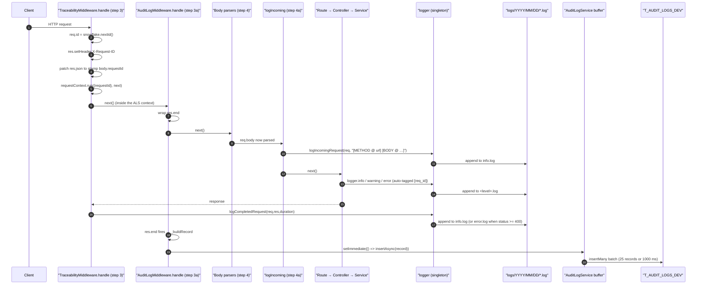
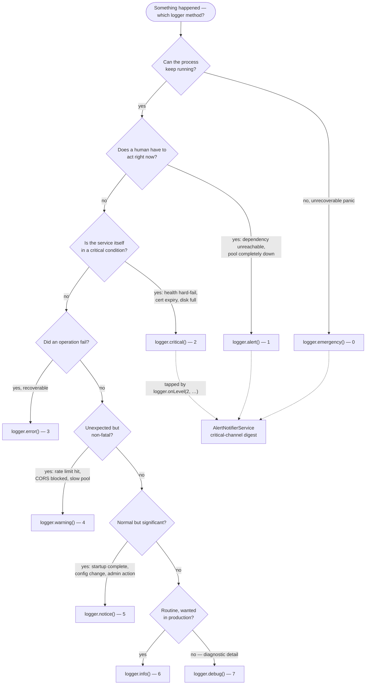
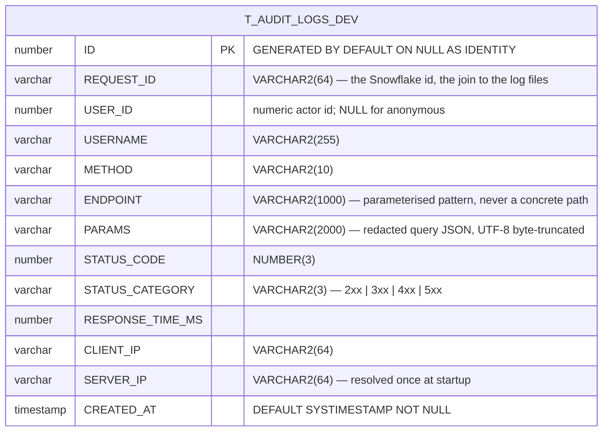
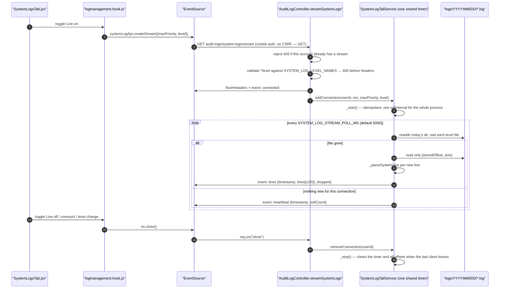
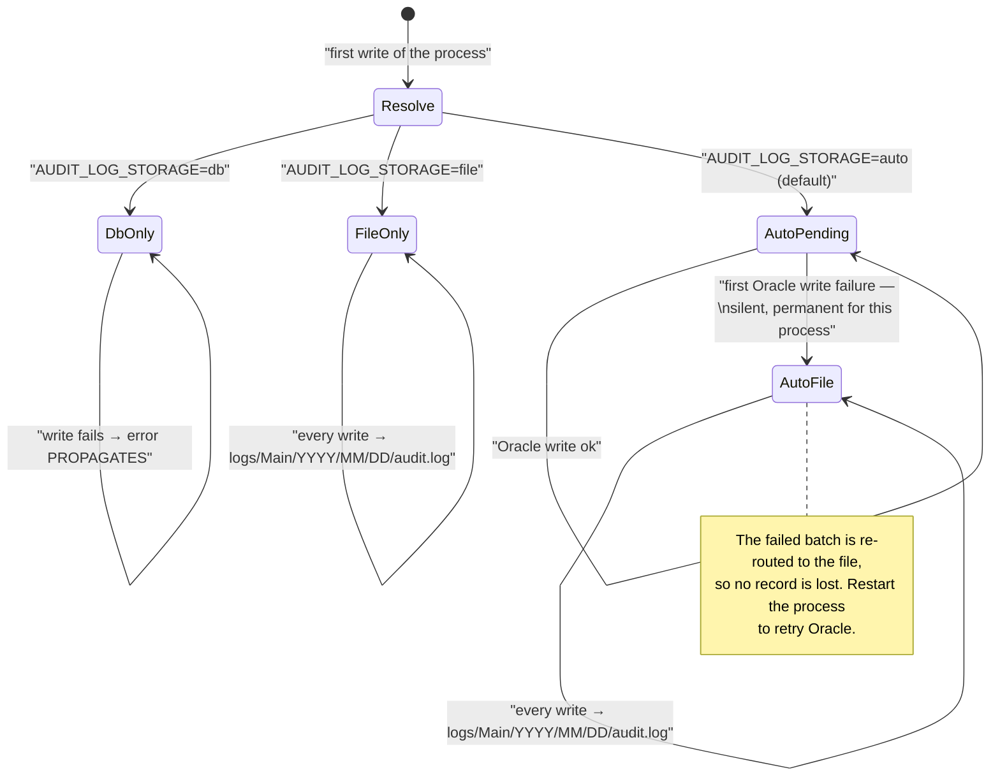

# Logging & Audit — Technical Documentation

> **Scope:** the two observability *records* the CATHERINE template writes for every request — the RFC 5424 log files on disk and the per-request audit row in Oracle — plus the browse, trace, live-tail, export and retention surfaces built on top of them.
> **Source:** `Frontend/` (React 19 + Vite SPA) and `Backend/` (Node.js + Express v5 API).
> **Generated:** 2026-09-04. **Authority:** the code. Where `CLAUDE.md` disagrees with the code, the code wins and the disagreement is recorded in [§6.12](#612-known-documentation-drift).
> **Rendering:** the ```mermaid fences below render in GitHub, GitLab, Obsidian and VS Code preview. A plain Markdown→PDF path (Chrome "print to PDF") will print them as code — pre-render with `npx @mermaid-js/mermaid-cli` if you need a PDF.

---

## 1. Overview

Every request through this API produces **two independent records**, written by two different middleware at two different points in the chain, into two different stores. The first is a set of plain-text lines in `logs/YYYY/MM/DD/<level>.log` — one file per RFC 5424 severity — written by a hand-rolled logger with a millisecond timestamp, a machine identifier, a PID, a captured callsite, and the request's correlation id. The second is a single structured row in `T_AUDIT_LOGS_DEV` carrying method, canonical endpoint pattern, status code, duration, client IP and actor, written fire-and-forget *after* the response has already gone out.

The two are joined by one value: the **request id**. `TraceabilityMiddleware` mints a Snowflake id at step 3 of the middleware chain, sets it as `X-Request-ID`, stamps it into every JSON body, and opens an `AsyncLocalStorage` context so that every `logger.*` call anywhere downstream carries `[<request id>]` without a single call site passing it. Given one audit row an operator can pull back every log line that request produced — that is the whole design.

Redaction happens twice, with two deliberately different lists. `TraceabilityMiddleware.SENSITIVE_PATTERNS` redacts credentials *and* PII from the log lines (a substring match over normalised keys). `AuditLogMiddleware` uses a narrower, two-tier list scoped to credentials only, because the audit `PARAMS` column is forensic evidence and over-redaction there is a silent loss nobody notices until an incident.

The frontend surface is one page — `Logging & Observability` at `system/logging-and-observability`, `SUPER_ADMIN`-only — with an `Audit Logs` tab split into two sub-tabs that read from the two stores: **User Traffic** (DB-backed: stats, filterable table, per-request trace modal) and **System** (file-backed: RFC 5424 level browse plus an SSE live tail). Two independent SSE connections may be open at once.

---

## 2. Flow & Architecture

### 2.1 One request, two records



Two orderings in this diagram are load-bearing and are commented as such in `app.js`. `TraceabilityMiddleware.handle` must run **above** the body parsers, because a malformed-JSON `400` is raised *by* the parser — mount `handle` any lower and such a request loses its request id, its ALS context and its audit row. But the `[Incoming Request]` *line* must be emitted **below** them, or it prints `[BODY @ req.body is undefined]` on every POST while the matching `[Request Complete]` line shows the real body. The split into `handle` (step 3) and `logIncoming` (step 4a) is the resolution; `handle` calls `next()` from *inside* `requestContext.run()`, so everything below still runs in the context (`TraceabilityMiddleware.js:149-177`).

The audit write is the last thing to happen. `res.end` is called first, then the record is built, then `setImmediate` schedules the buffer push — so the client already has its bytes before any of this runs (`AuditLogMiddleware.js:241-247`).

### 2.2 Choosing a level



The numeric priority is the filter: **a record at level N is written when `N <= currentLevel`** (`logger.js:726`). `LOG_LEVEL=INFO` (the default, numeric 6) therefore emits 0–6 and suppresses `DEBUG`. Lower number = more severe = harder to silence.

The dotted edges matter operationally: levels 0–2 are tapped by `logger.onLevel(2, …)` (`logger.js:171-179`) and turn into e-mail. Reaching for `logger.critical()` where `logger.error()` is correct sends mail; see [`metrics-and-observability.md`](./metrics-and-observability.md) §4.5 for the loop guard that keeps that from feeding back on itself.

### 2.3 The audit store



`Backend/sql/01_schema.sql:149-164`. There is **no foreign key to `T_ADMINS_DEV` or `T_USERS_DEV`** — the audit trail must survive an account being deleted, so `USER_ID`/`USERNAME` are denormalised copies, not references.

Exactly three indexes back the three access patterns (`sql/01_schema.sql:175-177`):

| Index | Columns | Serves |
| --- | --- | --- |
| `IX_AUDIT_CREATED_AT` | `(CREATED_AT DESC)` | the list's default ordering, every date-range filter, and `getLatestCreatedAt()` — the SSE poller's `ORDER BY CREATED_AT DESC FETCH FIRST 1 ROW` (`audit.log.model.js:192-197`) |
| `IX_AUDIT_STATUS_CAT` | `(STATUS_CATEGORY)` | `GROUP BY STATUS_CATEGORY` in the stats aggregate (`audit.log.model.js:233-242`) |
| `IX_AUDIT_USER_ID` | `(USER_ID)` | `GROUP BY USER_ID` for the unique-user count (`audit.log.model.js:243-246`) |

Nothing indexes `USERNAME`, `CLIENT_IP` or `REQUEST_ID`, and the `search` filter builds an `$or` of `$regex` clauses over exactly those three columns (`AuditLogService.js:231-235`) — a full scan by construction. See [§6.9](#69-the-search-filter-is-a-full-scan).

### 2.4 The System sub-tab live tail



The tail reads **deltas, never whole files**. A file seen for the first time in a session starts at `offset = size` (skip the backlog — this is a *live* tail); a file that appears mid-session, e.g. a fresh `_1` rotation file, starts at `offset = 0` because all of it is new; a file whose size drops below the stored offset is reset to 0 (`SystemLogTailService.js:236-251`). At midnight the resolved directory path changes, every offset is discarded, and the next tick re-initialises as if fresh (`:201-207`).

### 2.5 Where an audit record actually lands



`audit.log.model.js:55-94`. The template ships `auto`, so a deployment with no `T_AUDIT_LOGS_DEV` table still keeps an audit trail — as JSON lines in a text file that the read methods can scan. The downgrade is **silent by design** (`:88-91`); `AuditLogModel.storageInfo()` (`:306-308`) is the only way to see which mode is live.

---

## 3. Frontend implementation

### 3.1 Files

| File | Responsibility |
| --- | --- |
| `Frontend/src/features/management/logsmanagement/LogsManagement.view.jsx` | Page shell. Five top-level tabs (Overview, Metrics, Audit Logs, Health, Log Retention), a controlled `activeTab` so an alert can pivot into a pre-filtered log view, and the trace modal mounted at the root so it overlays any tab. |
| `…/logmanagement.hook.js` | Every piece of state and every fetch for the page: stats range, table filters, pagination, the trace modal, the delete stepper, the System sub-tab's browse state, and **both** SSE lifecycles. 684 lines; the view is presentation-only. |
| `…/logsmanagement.api.js` | Two namespaces. `auditLogApi` (list/stats/requestLogs/exports/delete + the traffic `EventSource`) and `systemLogApi` (browse + the tail `EventSource`). |
| `…/components/AuditLogsPageTab.jsx` | The `Audit Logs` tab. Hosts the nested `User Traffic | System` sub-tabs and the 1D…ALL date-range presets. |
| `…/components/AuditStatsRow.jsx` | Aggregate cards for the selected range (availability, error rates, unique users, avg response time). |
| `…/components/AuditLogTable.jsx` | The filterable, paginated DB table; owns `getStatusCodeStyle`, the convention `metricsStyles.js` and `SystemLogsTab` both follow. |
| `…/components/RequestLogsModal.jsx` | The trace modal — every log line for one `REQUEST_ID`, plus the per-request Excel export. |
| `…/components/SystemLogsTab.jsx` | The file-backed `System` sub-tab: level select, date picker, search, pagination, and the Live toggle. `getLevelStyle` (`:31-50`) maps each RFC 5424 level to a pill colour. |
| `…/components/DeleteLoggingTab.jsx` | The three-step Log Retention stepper: export Excel → export ZIP → confirm destructive delete. |
| `…/components/OverviewPageTab.jsx`, `MetricsPageTab.jsx`, `TrafficChartsSection.jsx`, `DependenciesTab.jsx`, `FrontendVitalsTab.jsx` | The Overview and Metrics tabs — documented in [`metrics-and-observability.md`](./metrics-and-observability.md). |

### 3.2 State that matters

| State | Where | Notes |
| --- | --- | --- |
| `statsKey` / `listKey` | `logmanagement.hook.js:141-142` | Cache keys for `useRequest` are built as **primitive strings**. An array key would compare by reference, miss the cache every render, and loop forever — the comment says so. |
| `activeAuditSubTab` | `:123` | Controlled at hook level so the System browse fetch is gated by `{ enabled: activeAuditSubTab === "system" }` (`:185`). Real file I/O across up to eight level files must not fire just because the page mounted. |
| `sysLiveRows` | `:134`, capped at `MAX_LIVE_SYSTEM_ROWS = 500` (`:73`) | Newest-first; oldest dropped past the cap. |
| `trafficSeries` | `:316`, capped at `MAX_TRAFFIC_POINTS = 30` (`:30`) | Per-tick **deltas** of the cumulative counters, not the counters themselves. |
| `prevTotalsRef` | `:321` | The delta baseline. Nulled on stream close (`:408`) so re-opening a backgrounded tab never emits a phantom spike from the counter gap. |
| `esRef` / `sysEsRef` | `:319`, `:136` | Two independent `EventSource` handles. The server tracks them in two separate registries, so one account can hold both. |

### 3.3 Two sub-tabs, two stores

`User Traffic` reads `T_AUDIT_LOGS_DEV` through `GET /audit-logs` and `GET /audit-logs/stats`. `System` reads the log *files* through `GET /audit-logs/system-logs`. They answer different questions and neither can answer the other's: an audit row tells you a request happened and how it ended; only the log lines tell you what the code did in between.

The `System` level filter is one `Select` driving two mutually exclusive request params (`logmanagement.hook.js:40-70`). Values `"0".."7"` mean a `maxPriority` ceiling ("Notice & above"); values prefixed `"lvl:"` mean an exact `level` that overrides the ceiling server-side. `_parseSystemLevelFilter` returns exactly one of the two as defined and the other as `undefined`.

Switching the date away from today automatically turns Live off (`:196-200`) — the server only ever tails *today's* directory.

### 3.4 SSE lifecycle and the Page Visibility API

The traffic stream is torn down when the tab is backgrounded and re-opened when it returns (`:412-425`), freeing the server connection and the poll slot. On return it also fires a catch-up `refetchStats()` / `refetchList()`. A `cancelled` flag guards every callback against a late frame arriving after unmount (`:344`, `:384`).

`onError` on either stream sets its live flag to `false` rather than retrying — the browser's own `EventSource` reconnect is left to do its job, and a genuine failure (a `409` because a stream is already open, or the server's `POLL_FAILED` event) surfaces as "not live" instead of a silent retry storm.

---

## 4. Backend implementation

### 4.1 `logger.js` — the file surface

`Backend/src/utils/logger.js` exports a class and a **singleton** (`:1043`). Everything in `src/` uses the singleton; `console.*` is banned in production code.

**Levels** (`:31-40`) are the RFC 5424 eight, numbered 0–7 with `EMERGENCY` at 0. The v5 upgrade renamed the old four: `ERROR 0→3`, `WARN 1→ WARNING 4`, `INFO 2→6`, `DEBUG 3→7`. Public methods: `emergency`, `alert`, `critical`, `error`, `warning`, `notice`, `info`, `debug`, plus three `@deprecated` short aliases — `emerg` (`:758`), `crit` (`:790`) and `warn` (`:821`). See [§6.2](#62-loggerwarn-is-a-deprecated-alias-and-so-are-emerg-and-crit).

**Files.** `LOG_BASE_DIR` is `logs/` next to the executable under `pkg`, else under `process.cwd()` (`:69-71`) — a Windows service can start the exe with cwd anywhere, including `System32`. The daily directory is `logs/YYYY/MM/DD` (`:454-457`) in `Asia/Manila`, and the filename is the lowercased level: `logs/2026/09/04/warning.log`. At 50 MB (`:23`) it rolls to `warning_1.log`, up to `_999`, then a timestamped escape hatch (`:427-449`).

**Timestamps** use `Intl.DateTimeFormat("en-CA", …)` with `hourCycle: "h23"` — *not* `hour12: false`, because some ICU builds map that to the h24 cycle and render midnight as hour `24`, which breaks parsing and sorts the first hour of the day last. That bug was observed in the PKG-compiled production exe (`:106-110`). Milliseconds come from `Date` directly, not ICU, so the PKG build has no ICU dependency for them (`:270-272`).

**The line format** (`:482-493`):

```text
[HOST (S) 10.0.0.4] [2026-09-04 14:22:07.418] [WARNING] [PID:14232] [AuthService.login @ src/services/auth.service.js:214] [FUNC] [0078812966528-0448-8401] - Account locked | META: {"username":"[REDACTED]"}
```

**No truncation.** `MAX_SAFESTR_LENGTH` reads `LOG_MAX_SAFESTR_LENGTH` and defaults to **`Infinity`** (`:94-96`), so `#safeStringify` (`:334-336`) never cuts. Set a number only if a specific deployment needs it. Circular structures degrade to `[Circular Reference]` rather than throwing (`:319-333`).

**Callsite capture.** When `meta.function`/`file`/`line` are absent and `LOG_CALLSITE` is not `"false"`, the logger throws away an `Error`, walks its stack past every frame containing `logger.js`, and parses the first foreign frame into function / shortened path / line (`:572-609`, `:378-422`). Paths are shortened to start at `src/` (`:285-302`).

**Write path.** `log()` (`:725-737`) filters by level, injects the callsite, captures the request id from the ALS store **now** (`:733`) — because by the time the queue drains, the context may belong to a different request — fires the level tap, then pushes to a queue drained sequentially by `#processWriteQueue` (`:653-666`), so concurrent writers never interleave partial lines. A write failure logs to `console.error` and is swallowed: the logger can never recurse into itself.

### 4.2 `TraceabilityMiddleware` — id, context, redaction

`Backend/src/middleware/traceability/TraceabilityMiddleware.js`.

- **Request id** — `req.id = snowflake.nextId()` (`:125`). Format `0078812966528-0448-8401`: 13 digits ms-since-2024-epoch, 4-digit machine id, 4-digit tail mixing a crypto nonce with the per-ms sequence (`utils/snowflake.js:16-34`). Fixed width, lexicographically sortable, fits `VARCHAR2(64)`. Pure JS — no WASM, no ESM-only dependency, so it survives `pkg` compilation.
- **`X-Request-ID`** response header (`:126`) for non-JSON consumers.
- **`res.json` patch** (`:139-145`) stamps `body.requestId = req.id` on every JSON body, success or error, with no controller involvement. This is why the success envelope's `requestId` key is always populated.
- **ALS context** — `requestContext.run({ requestId }, () => …)` wraps `next()` (`:149-177`). `TraceabilityMiddleware.restoreContext` (`:192-195`) exists for stream-driven middleware (multer/busboy) whose completion callbacks are created on async resources that predate the `run()` and therefore lose the store.
- **Redaction** — `SENSITIVE_PATTERNS` (`:13-39`) is a flat substring list over a normalised key (`lowercase`, strip `-_ `): credentials (`password`, `token`, `secret`, `apikey`, `auth`, `otp`, `pin`, `cvv`, `ssn`, `privatekey`, `creditcard`, `cardnumber`) **and** PII (`email`, `firstname`, `lastname`, `fullname`, `phone`, `phonenumber`, `address`, `dateofbirth`, `dob`). Applied to query params and to `POST`/`PUT`/`PATCH` body keys in `createRequestMessage` (`:197-240`).
- **No body truncation.** A non-sensitive object value is `JSON.stringify`'d in full: *"Cutting the body defeats traceability; disk space is cheaper than an unreproducible incident"* (`:225-227`).

### 4.3 `AuditLogMiddleware` — step 3a

`Backend/src/middleware/traceability/AuditLogMiddleware.js`. Skips when `AUDIT_LOG_ENABLED=false`, when the path is `/health` (unless `AUDIT_LOG_EXCLUDE_HEALTH=false`), when the path matches `AUDIT_LOG_EXCLUDE_PATHS` (default `/api/v1/audit-logs` — self-exclusion, or the observability page floods its own table), and for every `OPTIONS` preflight (`:225-236`).

`_buildRecord` (`:252-296`) has two non-obvious normalisations:

- **`ENDPOINT` is the canonical route label**, produced by the same `resolveRouteLabel(req)` that RED metrics use, with the `METHOD ` prefix stripped (`:265-268`). So the column stores `/api/v1/audit-logs/:requestId/logs`, never a concrete id. That keeps grouping meaningful *and* keeps identifiers out of the table (CWE-200).
- **`USER_ID` is coerced to a number or `null`** (`:275-280`). JWT `userId` claims are commonly strings; `insertMany` types each column from the first non-null sample, so one string in a batch of numbers trips `NJS-011` and loses the whole batch.

`_sanitizeParams` (`:319-331`) **redacts rather than drops**, so an auditor can still tell a sensitive param was present. The key list is deliberately *not* `TraceabilityMiddleware`'s (`:52-58`): it is credentials-only, and it is two-tier —

| Tier | Match | Fragments |
| --- | --- | --- |
| 1 (`:71-84`) | substring of the normalised key | `token`, `password`, `passwd`, `pwd`, `secret`, `apikey`, `credential`, `privatekey`, `bearer`, `jwt`, `signature`, `authorization` |
| 2 (`:86`) | whole token after camelCase/separator split | `auth`, `session`, `pin`, `otp`, `mfa`, `salt` |

Tier 2 exists because substring matching on those would blind the log gratuitously: `author` contains `auth`, `possession` contains `session`, `opinion` contains `pin`, `footprint` contains `otp`, `basalt` contains `salt`. `authToken` tokenises to `["auth","token"]` and matches; `author` tokenises to `["author"]` and does not (`:170-179`). Bare `hash`, `key` and `sig` are dropped from both tiers on purpose — the reasoning is written out at `:42-68`.

The value is then JSON-serialised and truncated to **2000 UTF-8 *bytes***, not characters (`truncateUtf8Bytes`, `:124-134`). The column is `VARCHAR2(2000)` and on an AL32UTF8 database with `NLS_LENGTH_SEMANTICS = BYTE` that is 2000 bytes; a naïve `.slice(2000)` of CJK or emoji text is up to 8000 bytes and is rejected with `ORA-12899`. The cut point is walked back off any UTF-8 continuation byte so a character is never split.

### 4.4 `AuditLogService`

`Backend/src/services/AuditLogService.js` — a static class, and the only place that touches both stores.

**Batched persistence** (`:102-175`). `insertAsync` pushes to a module-level buffer and flushes when it reaches `FLUSH_MAX = 25` (`:112`) or after `FLUSH_INTERVAL_MS = 1000` (`:115`), whichever comes first. One `insertMany` round-trip instead of N. The timer is `unref()`'d so an idle buffer never holds the process open, and `server.js:443` calls `flushPending()` during graceful shutdown so a `SIGTERM` does not lose the last second of records. A flush failure logs a `warning` and swallows — a DB hiccup must never disturb an HTTP response that already completed.

**`getStats`** (`:269-342`) computes the availability SLI with 4xx **excluded from the denominator**: `serviced = total − clientError`, `successRate = (success + redirect) / serviced`. A 4xx means the service correctly rejected bad input, not that it failed. `clientErrorRate` and `serverErrorRate` are reported separately as independent shares of *total* traffic, so availability is deliberately **not** `1 − serverErrorRate` — the comment at `:304-310` says so explicitly.

**`getRequestLogs`** (`:357-439`) sweeps every level file in one day's directory for lines containing `[<requestId>]`, then sorts them by embedded timestamp with a **phase-aware tiebreak** — `[Incoming Request]` ranks 0, `[Handling Request]`/`[FUNC]` rank 1, `[Request Complete]` ranks 2 — so legacy second-precision lines never render as Incoming → Complete → FUNC (`:421-433`). Files over **10 MB are skipped entirely** here (`:400-406`).

**`getSystemLogs`** (`:580-729`) is the browse endpoint and takes the opposite decision: it reads a **tail window** of the last `SYSTEM_LOG_MAX_READ_BYTES` (default 5 MB, `:57`) per file rather than skipping an oversized one, because a busy day's `info.log` routinely exceeds 10 MB and skipping it blanks exactly the day an operator needs. The first, possibly partial, line of a truncated read is dropped, and the file is named in the response's `truncatedFiles[]` (`:672-677`). Rows are merged across files, filtered, sorted newest-first, and offset-paginated at ≤200/page.

**Path safety.** `date` is regex-validated to `^\d{4}-\d{2}-\d{2}$`, and then the joined path is resolved and prefix-checked against the base anyway — defence in depth against CWE-22 (`:605-621`). `exportToZip` goes further and `lstat`s each file (not `stat`) so a symlink is never followed, rejecting anything that is not a plain file inside the resolved directory (`:1030-1052`, CWE-59).

**`deleteRange`** (`:1086-1188`) deletes the DB rows first, then removes each day's directory — with a retry after 250 ms and an explicit `stat` verification afterwards, because Windows `EPERM`/`EBUSY` from an AV scanner or an open handle makes `fs.rm({force:true})` return without actually removing anything. Days that survive are returned in `failedDays[]` and surfaced as a toast (`logmanagement.hook.js:574-578`).

### 4.5 Routes

Mounted at `/api/v1/audit-logs` (`routes/index.js:35`). Every route is `GET` except the range delete.

| Method & path | Access | Cache | Handler |
| --- | --- | --- | --- |
| `GET /stats` | ADMIN or SUPER_ADMIN | `auditLog` store, key `type=stats:fromDate:toDate` | `AuditLogController.getStats` |
| `GET /export/excel` | SUPER_ADMIN | never | `exportExcel` |
| `GET /export/logs` | SUPER_ADMIN | never | `exportLogs` |
| `GET /stream` | ADMIN or SUPER_ADMIN | never | `stream` (SSE) |
| `GET /system-logs` | ADMIN or SUPER_ADMIN | never | `getSystemLogs` |
| `GET /system-logs/stream` | ADMIN or SUPER_ADMIN | never | `streamSystemLogs` (SSE) |
| `GET /` | ADMIN or SUPER_ADMIN | `auditLog` store, key encodes all seven query dimensions | `getList` |
| `GET /:requestId/export/trace` | SUPER_ADMIN | never | `exportTraceExcel` |
| `GET /:requestId/logs` | ADMIN or SUPER_ADMIN | `auditLog` store, key `requestId:type=requestLogs` | `getRequestLogs` |
| `DELETE /` | SUPER_ADMIN | invalidates the whole `auditLog` namespace | `deleteRange` |

Two orderings are enforced by comment and by construction. **Every static-segment route is declared before `/:requestId/logs`** (`audit-log.route.js:47-51`), or Express would match the literal `stats`, `export`, `stream` and `system-logs` segments as `requestId` values. And **the cache read runs after `authenticate` + `requireAccess`, never before** (`:42-45`) — serving a cached page to an unauthorised caller is CWE-639.

Three surfaces are deliberately uncached: the two SSE streams (an event stream must never be cached) and `GET /system-logs`, because *"a stale cache could hide the exact NOTICE/CRITICAL line an operator is chasing right now"* (`:146-149`).

### 4.6 The two SSE pollers

Both follow the same shape — **one timer per process, not one per connection** — and both live in separate registries so a user can hold both open.

| | Traffic stream | System tail |
| --- | --- | --- |
| Registry | `_auditConnections` Map (`AuditLogController.js:58`) | `SystemLogTailService._connections` (`:81`) |
| Interval | `SSE_POLL_INTERVAL_MS = 5000` (`:44`) | `SYSTEM_LOG_STREAM_POLL_MS`, default 5000 (`:104-106`) |
| Work per tick | one `ORDER BY CREATED_AT DESC FETCH FIRST 1` + one metrics snapshot, fanned out in memory | `readdir` + `stat` per level file, delta reads only |
| Events | `connected`, `heartbeat`, `update`, `error` | `connected`, `heartbeat`, `lines`, `error` |
| Duplicate connection | `409 ConflictError` (`:350-354`) | `409 ConflictError` (`:449-453`) |
| Failure ceiling | 5 consecutive errors → `error` event `POLL_FAILED`, clear all, stop (`:195-203`) | same, `MAX_CONSECUTIVE_ERRORS = 5` (`:388-405`) |

Neither `stream` nor `streamSystemLogs` is wrapped in `catchAsync` (`audit-log.route.js:124-127`, `:168-169`): once the connection is upgraded to an event stream, an HTTP error response crashes with write-after-end. Errors are surfaced as SSE `error` events instead, and the only pre-upgrade rejections (`401`, `409`, and the System stream's invalid-`level` `400`) are written as raw JSON *before* `flushHeaders()`.

`_safeSend` calls `res.flush()` when it exists (`AuditLogController.js:91-93`, `SystemLogTailService.js:369`) — `CompressionMiddleware` (step 6) patches gzip onto the response, and without an explicit flush every SSE event sits in the gzip buffer until it fills.

The per-tick cap on the tail is `MAX_ROWS_PER_TICK = 200` (`SystemLogTailService.js:65`); the remainder is reported as a `dropped` count rather than silently lost, and the frontend accumulates it into a visible counter (`logmanagement.hook.js:258`).

---

## 5. How frontend and backend connect (the contract)

### 5.1 Transport rules

| Concern | Rule |
| --- | --- |
| Base URL | `httpClient` for JSON; `API_BASE_URL_TRIMMED` for the two `EventSource` URLs (`logsmanagement.api.js:2, 37, 100`) — Axios cannot consume an SSE stream. |
| Credentials | `withCredentials: true` on the Axios instance and on both `EventSource` constructors, so the HTTP-only JWT cookie travels automatically. |
| CSRF | Injected on `DELETE /audit-logs` only — every other route here is a `GET`, and the double-submit gate only enforces on state-changing verbs. |
| Timeouts | 30 s default; **120 s** explicitly on the three binary exports (`logsmanagement.api.js:11-13`) — generating a 100 000-row workbook is genuinely long-running. |
| Correlation | `X-Request-ID` header **and** a root-level `requestId` in every JSON body. |
| Envelope | Success is exactly five keys: `{ status, code, message, requestId, data }` (`constants/responses/index.js:72-80`). Errors add `title`. See [`error-handling.md`](./error-handling.md) §5.1. |

### 5.2 `GET /api/v1/audit-logs`

**Request** — `?page=&pageSize=&fromDate=&toDate=&method=&statusCategory=&search=`. Defaults: `page=1`, `pageSize=20`, capped server-side at **100** (`AuditLogService.js:200`).

**Response — 200**

```json
{
  "status": "success",
  "code": 200,
  "message": "Audit logs fetched successfully.",
  "requestId": "0078812966528-0448-8401",
  "data": {
    "rows": [
      { "ID": 41822, "REQUEST_ID": "0078812966528-0448-8401", "USER_ID": 1,
        "USERNAME": "admin", "METHOD": "GET", "ENDPOINT": "/api/v1/metrics",
        "PARAMS": null, "STATUS_CODE": 200, "STATUS_CATEGORY": "2xx",
        "RESPONSE_TIME_MS": 14, "CLIENT_IP": "10.0.0.9", "SERVER_IP": "10.0.0.4",
        "CREATED_AT": "2026-09-04T06:22:07.418Z" }
    ],
    "total": 41822, "page": 1, "pageSize": 20, "totalPages": 2092
  }
}
```

`400 ValidationError` when `fromDate >= toDate` or either is unparseable (`AuditLogService.js:202-208`).

### 5.3 `GET /api/v1/audit-logs/stats`

`?fromDate=&toDate=`. Defaults to the last 30 days, `toDate` clamped to end-of-day (`:269-275`).

```json
{ "total": 41822, "success": 38010, "redirect": 12, "clientError": 3702,
  "serverError": 98, "uniqueUsers": 14, "avgResponseTime": 47,
  "successRate": 99.7, "clientErrorRate": 8.9, "serverErrorRate": 0.2,
  "fromDate": "2026-08-05T00:00:00.000Z", "toDate": "2026-09-04T15:59:59.999Z" }
```

Read `successRate` as **availability** (4xx excluded from the denominator) and the two `*ErrorRate` values as **traffic shares** of the total. They are different denominators on purpose; they will not reconcile arithmetically.

### 5.4 `GET /api/v1/audit-logs/:requestId/logs`

`?date=YYYY-MM-DD`. `requestId` must match the Snowflake shape `^\d{13}-\d{4}-\d{4}$` **or** the legacy `^req_[A-Za-z0-9_-]{1,30}$` (`:359-370`) — the legacy form is still accepted so historical rows written before the Snowflake migration remain traceable.

```json
{ "data": { "requestId": "0078812966528-0448-8401",
            "lines": ["[HOST (S) 10.0.0.4] [2026-09-04 14:22:07.401] [INFO] …", "…"] } }
```

`400` on a malformed id or date. A day with no directory returns `lines: []`, not a `404`.

### 5.5 `GET /api/v1/audit-logs/system-logs`

| Param | Default | Notes |
| --- | --- | --- |
| `date` | today (Asia/Manila) | `^\d{4}-\d{2}-\d{2}$` |
| `maxPriority` | `5` (NOTICE and above) | integer 0–7; **ignored when `level` is given** |
| `level` | — | exact level name, case-insensitive; `warn` accepted as an alias for `warning` |
| `page` / `pageSize` | `1` / `50` | pageSize capped at 200 |
| `search` | — | case-insensitive substring on the parsed message, capped at 100 chars |

```json
{ "data": {
    "rows": [{ "ts": "2026-09-04 14:22:07.418", "level": "WARNING",
               "machine": "HOST (S) 10.0.0.4", "pid": 14232,
               "location": "AuthService.login @ src/services/auth.service.js:214",
               "phase": null, "method": "FUNC",
               "requestId": "0078812966528-0448-8401",
               "message": "Account locked", "meta": "{\"username\":\"[REDACTED]\"}" }],
    "total": 128, "page": 1, "pageSize": 50, "totalPages": 3,
    "truncatedFiles": ["info.log"] } }
```

`400` on an invalid date, an unknown `level`, or a `maxPriority` outside 0–7. A line that does not match the expected shape is **kept**, not dropped: every structured field becomes `null` except `level` (from the filename) and `message` (the raw trimmed line) — `_parseSystemLine` never throws (`AuditLogService.js:464-547`).

### 5.6 The two event streams

**`GET /api/v1/audit-logs/stream`** — no query params.

```text
event: connected
data: {"timestamp":"2026-09-04T06:22:00.000Z","pollIntervalMs":5000}

event: heartbeat
data: {"timestamp":"…","pollCount":7,"metrics":{"red":{…},"totals":{…},"system":{…},"rates":{…}}}

event: update
data: {"timestamp":"…","metrics":{…}}
```

`update` fires only when `MAX(CREATED_AT)` has advanced past this connection's baseline; the baseline itself is locked in on the connection's *first* tick, so a client never receives a replay of history it has not asked for (`AuditLogController.js:175-181`). Both event types carry the metrics payload, so the live charts keep updating even when no new audit rows arrive.

**`GET /api/v1/audit-logs/system-logs/stream?maxPriority=&level=`**

```text
event: connected
data: {"timestamp":"…","maxPriority":5}

event: lines
data: {"timestamp":"…","lines":[{…parsed row…}],"dropped":0}

event: heartbeat
data: {"timestamp":"…","pollCount":12}
```

Both streams answer `409 { status:"error", code:409, message:"…already open for this account.", error:{type:"ConflictError"} }` — a raw body, not the standard envelope, because it is written before the response is upgraded.

Per-connection dispatch is filtered at **file granularity**, never by the line's own embedded `[LEVEL]` bracket (`SystemLogTailService.js:268-284`), so the tail and the browse endpoint can never disagree about which level a line belongs to.

### 5.7 Exports and the retention delete

| Endpoint | Content-Type | Filename |
| --- | --- | --- |
| `GET /export/excel?fromDate=&toDate=` | `…spreadsheetml.sheet` | `audit-logs-<from>-to-<to>.xlsx` — two sheets: *Audit Records* (≤100 000 rows) + *Summary* |
| `GET /export/logs?fromDate=&toDate=` | `application/zip` | `server-logs-<from>-to-<to>.zip`, entries pathed `YYYY/MM/DD/<file>.log` |
| `GET /:requestId/export/trace?date=` | `…spreadsheetml.sheet` | `trace-<safeId>-<date>.xlsx` — *Request Summary* + *Log Trace* |
| `DELETE /?fromDate=&toDate=` | JSON | `{ deletedRows, deletedDays, failedDays[] }` |

Every filename component is regex-sanitised before interpolation into `Content-Disposition` (`AuditLogController.js:268`, `:284-285`, `:301-302`) — a header-injection guard, since the id and dates come from the request.

The trace export is the one export that can `404`: it requires a matching audit **row**, not just log lines (`AuditLogService.js:884-889`).

---

## 6. Technicalities

### 6.1 The request id is a Snowflake, not a random string

`snowflake.nextId()` produces `{13-digit ms since 2024-01-01}-{4-digit machine}-{4-digit tail}` (`utils/snowflake.js:16-34`). Three properties are being bought: it sorts chronologically as a plain string, it survives `pkg` compilation (pure JS, no WASM, no ESM-only import), and it is collision-free across instances via the machine segment — derived from `SNOWFLAKE_MACHINE_ID`, else hashed from the first non-internal IPv4, else `PID % 1024`. The tail mixes a crypto nonce with the per-millisecond sequence so consecutive ids are visually distinct rather than all ending `0000`.

### 6.2 `logger.warn` is a deprecated alias — and so are `emerg` and `crit`

`warn(...)` simply calls `warning(...)` (`logger.js:821-823`) and is marked `@deprecated`, *"will be removed in v6"*. The same is true of `emerg()` → `emergency()` (`:754-760`) and `crit()` → `critical()` (`:786-792`). All new call sites must use the canonical long names.

Two things to know. First, the alias is a *method* alias only — the level key written into the file and used for the file name is always the canonical `WARNING` / `EMERGENCY` / `CRITICAL`. Second, `critical()` carries an explicit comment about why: an earlier version passed the lowercase string `"critical"`, which missed both the `LEVELS` lookup (bypassing the level filter entirely) and the `COLORS` lookup (rendering white), and wrote the literal lowercase word into log lines (`:779-782`).

Live code still uses the deprecated aliases — `MetricsService.js:176`, `:227`, `:271`, `:336`, `:366` all call `logger["crit"]`. Functionally correct, stylistically stale.

### 6.3 Nothing is truncated, on purpose

Three separate places could have truncated and deliberately do not:

- `LOG_MAX_SAFESTR_LENGTH` defaults to `Infinity` (`logger.js:94-96`).
- Request/response body values in the trace line are stringified in full (`TraceabilityMiddleware.js:225-227`).
- The audit `PARAMS` column *is* capped, but at 2000 **bytes** and only because the Oracle column is `VARCHAR2(2000)` — it is a storage constraint, not an editorial one, and it redacts rather than drops so the shape survives.

The stated reasoning is that disk is cheaper than an unreproducible incident. If a deployment genuinely needs a cap, `LOG_MAX_SAFESTR_LENGTH` is the one knob.

### 6.4 Callsite capture costs an `Error` per log line

`#injectCallSite` (`logger.js:572-609`) constructs `new Error()` on **every** call that does not already carry `meta.function`/`file`/`line`, purely to read `.stack`. That is the single most expensive thing the logger does. `LOG_CALLSITE=false` disables it. It is on by default because a log line that says *what* happened but not *where* is half a log line.

The frame is chosen by skipping the first two stack entries and then finding the first line that does not mention `logger.js` — with three separators checked (`utils/logger.js`, `\utils\logger.js`, `/utils/logger.js`) so it works on Windows and POSIX alike.

### 6.5 The write queue is sequential, and that is the concurrency model

`writeQueue` + `isWriting` (`logger.js:127-128`, `:653-666`) serialise every `fs.appendFile`. Two consequences: partial lines can never interleave, and the logger is a single-writer bottleneck per process. Under clustering each worker has its own singleton, its own queue, and its own `appendFile` calls into the *same* daily files — POSIX `O_APPEND` makes small appends atomic, which is what keeps that safe.

The request id is captured at **enqueue** time (`:733`), not at drain time, precisely because the drain happens later and may run under a different request's ALS context.

### 6.6 The audit write is fire-and-forget, and the tests have to stub it

`setImmediate(() => AuditLogService.insertAsync(record))` (`AuditLogMiddleware.js:245`) is not awaited by anything. In `Backend/test/server/setup.js:48-51` a global `beforeAll` stubs `AuditLogService.insertAsync` for the entire suite, and the comment explains why: without it, every one of the ~3000 test requests would try to acquire a real Oracle connection with a 15 s connect timeout and 3 retries, and the background retry loop starves the event loop until unrelated requests start timing out. Suites that specifically test `AuditLogService` layer their own `vi.spyOn` on top of that outer stub.

This is worth knowing before you write a test that asserts on audit rows: the default environment has no audit persistence at all.

### 6.7 Two redaction lists, and the difference is the point

`TraceabilityMiddleware.isSensitiveKey` redacts PII (`email`, names, `phone`, `dob`) as well as credentials, because a log *line* is free-text telemetry with a long retention. `AuditLogMiddleware.isSensitiveParamKey` does not, because the audit `PARAMS` column is forensic evidence — an over-redacted audit row is a silent data loss nobody notices until they need it. The audit list is explicitly documented as *not* reusing the traceability list for exactly this reason (`AuditLogMiddleware.js:52-58`).

`isSensitiveKey` and `redactValue` are exported from `TraceabilityMiddleware` (`:251-252`) so a future consumer of `res.locals.body` can redact captured *response* JSON with identical rules rather than re-implementing the matching.

### 6.8 Observability excludes itself, in three places

| Exclusion | Where | Why |
| --- | --- | --- |
| `/api/v1/audit-logs` from the audit table | `AuditLogMiddleware.js:221` (`AUDIT_LOG_EXCLUDE_PATHS`) | the page polls its own list every SSE tick — self-referencing flood |
| `/api/v1/audit-logs` + `/api/v1/metrics` from RED metrics | `routeLabel.js:67-71` (`METRICS_EXCLUDE_PATHS`) | observer effect; and `/stream`'s `res.finish` fires only on close, so its "duration" is the whole session and would poison p95/p99/apdex |
| `OPTIONS` from both | `AuditLogMiddleware.js:236`, `routeLabel.js:249` | preflights are answered before routing, so `req.route` is never set and they would all aggregate as `UNMATCHED` |
| `/health` from log lines and audit rows | `LOG_EXCLUDE_HEALTH`, `AUDIT_LOG_EXCLUDE_HEALTH` | a liveness probe every few seconds is pure noise |

### 6.9 The `search` filter is a full scan

`AuditLogService.getList` builds `$or: [{USERNAME:{$regex}}, {CLIENT_IP:{$regex}}, {REQUEST_ID:{$regex}}]` (`:231-235`), plus an exact `USER_ID` equality only when the term is all digits — because `$regex` is invalid on a `NUMBER` column (`:236-241`). None of those three columns is indexed, so a search over a large table is a `REGEXP_LIKE` full scan behind a `120 s` cache TTL.

The input *is* hardened against ReDoS: trimmed, sliced to 100 characters, and every regex metacharacter escaped (`:223-229`, CWE-1333). If search performance becomes a problem the fix is an index or a different predicate, not removing the escape.

### 6.10 `getRequestLogs` skips big files; `getSystemLogs` truncates them

The same codebase makes opposite calls for a reason. A request trace is a needle hunt — if `info.log` is over 10 MB the day is pathological and scanning it inline would block the event loop, so it is skipped (`:400-406`). A system browse is a "show me what happened" view — skipping the biggest file blanks exactly the day the operator cares about, so it reads the last 5 MB and *tells the client* which files were truncated (`:554-559`, `:672-677`).

Both are per-file caps read at call time, so a deployment can raise `SYSTEM_LOG_MAX_READ_BYTES` without a code change; the 10 MB trace cap is a hard-coded constant with no env override.

### 6.11 Environment variables this feature depends on

| Variable | Required | Default | Effect |
| --- | --- | --- | --- |
| `LOG_LEVEL` | no | `INFO` | RFC 5424 ceiling. Accepts all eight names case-insensitively, plus legacy `WARN` → `WARNING` (`logger.js:120-121`). |
| `ENABLE_CONSOLE_LOGS` | no | on unless `NODE_ENV=production` | `"false"` forces off; `"true"` or `DOCKER_CONTAINER=true` forces on (`logger.js:80-85`). |
| `LOG_MAX_SAFESTR_LENGTH` | no | **`Infinity`** | Serialised-value cap. Leave unset for no truncation. |
| `LOG_CALLSITE` | no | `true` | Function/file/line capture. `false` skips the per-line `new Error()`. |
| `LOG_EXCLUDE_HEALTH` | no | `false` | `true` drops `/health` from log lines. |
| `LOG_EXCLUDE_URLS` | no | — | Comma-separated substrings; matching URLs produce no log lines. |
| `SNOWFLAKE_MACHINE_ID` | no | hashed IPv4, else `PID % 1024` | 0–1023. Set it explicitly in a multi-host deployment. |
| `AUDIT_LOG_ENABLED` | no | `true` | `false` disables DB persistence; file logs continue. |
| `AUDIT_LOG_EXCLUDE_HEALTH` | no | `true` | Excludes `/health` from audit rows. |
| `AUDIT_LOG_EXCLUDE_PATHS` | no | `/api/v1/audit-logs` | Comma-separated path prefixes. |
| `AUDIT_LOG_STORAGE` | no | `auto` | `db` \| `file` \| `auto`. See [§2.5](#25-where-an-audit-record-actually-lands). |
| `AUDIT_LOG_TABLE` | no | `T_AUDIT_LOGS_DEV` (`T_AUDIT_LOGS` in production) | Table-name override. |
| `SYSTEM_LOG_MAX_READ_BYTES` | no | `5242880` | Tail-window size per file for `GET /system-logs`. **Undocumented in `.env.example`** — see [§6.12](#612-known-documentation-drift). |
| `SYSTEM_LOG_STREAM_POLL_MS` | no | `5000` | Live-tail poll interval. **Undocumented in `.env.example`.** |
| `METRICS_EXCLUDE_PATHS` | no | `/api/v1/audit-logs,/api/v1/metrics` | Shared with RED metrics; parsed once at module load. |
| `TRUST_PROXY` | no | `false` | Without it `req.ip` is the proxy's, so `CLIENT_IP` is wrong on every audit row. |
| `AUDIT_LOG_RETENTION_DAYS` | — | `90` in `.env.example` | **No consumer exists.** The only automatic retention purge in the codebase is `ALERT_LOG_RETENTION_DAYS` for the alert table. Audit retention is manual, through the Log Retention tab. |

### 6.12 Known documentation drift

The code is the authority. These are places where prose currently disagrees with it.

| # | Location | Says | Code actually does |
| --- | --- | --- | --- |
| 1 | `Backend/CLAUDE.md:24`, `:954` | "Request traceability (unique `X-Request-Id` per request via `nanoid`)" | `TraceabilityMiddleware.js:125` calls `snowflake.nextId()`. `nanoid` has been replaced; `src/utils/nanoidLoader.js` still exists but **nothing in `src/` requires it**. The header name is also `X-Request-ID` (all caps `ID`), not `X-Request-Id`. |
| 2 | `Backend/CLAUDE.md:23` | "custom logger with daily file rotation, **microsecond precision**, and no truncation" | Timestamps are **millisecond** precision — `String(now.getMilliseconds()).padStart(3,"0")` (`logger.js:272`), rendered as `.418`. Rotation is *daily directories* plus *50 MB size-based* file rollover, not daily file rotation. "No truncation" is correct. |
| 3 | `Backend/CLAUDE.md:339-346` (RFC 5424 table) | recommends `logger.emerg(...)` and `logger.crit(...)` as the canonical calls | Both are `@deprecated` aliases (`logger.js:754-760`, `:786-792`). The canonical methods are `logger.emergency(...)` and `logger.critical(...)`. The table names the *levels* `EMERG`/`CRIT`; the code's level keys are `EMERGENCY`/`CRITICAL`. |
| 4 | `Backend/.env.example:245` | `AUDIT_LOG_RETENTION_DAYS=90  # planned — retention delete job (not in v1 scope)` | Accurate but easy to misread: no code reads this variable at all. Grep confirms the only match outside `.env.example` is none. |
| 5 | `Backend/.env.example` | — | `SYSTEM_LOG_MAX_READ_BYTES` and `SYSTEM_LOG_STREAM_POLL_MS` are both live, both consumed (`AuditLogService.js:641`, `SystemLogTailService.js:105`), and **neither appears in `.env.example`**. |
| 6 | `Frontend/CLAUDE.md:959` | "**Live examples:** `LogsManagement.view.jsx` (Logging tab), `RFIDManagement.view.jsx` (RFID Masterfile tab)." | `RFIDManagement.view.jsx` does not exist anywhere under `Frontend/src/`. It is a leftover reference to a removed domain feature. |
| 7 | `AuditLogService.js` header comment on `PARAMS` (`sql/01_schema.sql:169`) | "Sanitised query params JSON (sensitive keys **stripped**, truncated to 2000)" | Sensitive keys are **redacted, not stripped** — the key survives with the value `"[REDACTED]"` (`AuditLogMiddleware.js:298-317` documents the deliberate change). The 2000 is bytes, not characters. |
| 8 | `AuditLogService.exportToZip` | archives `logs/YYYY/MM/DD/*.log` | In `AUDIT_LOG_STORAGE=file` / `auto-file` mode the audit trail lives at `logs/Main/YYYY/MM/DD/audit.log` (`audit.log.file.model.js:59-61`), which is **not** under the day directory the ZIP walks — so the "server logs" export silently omits the file-mode audit trail. `deleteRange` is unaffected (the file model handles its own day-directory removal). |

---

## 7. Security

### 7.1 What is done well

| Control | Implementation | Class addressed |
| --- | --- | --- |
| Credential redaction in log lines | `SENSITIVE_PATTERNS` over normalised keys — 15 credential fragments plus 9 PII fragments; applied to query params and to every `POST`/`PUT`/`PATCH` body key | CWE-532, CWE-359 |
| Credential redaction in audit `PARAMS` | Two-tier matcher; redacts the value, keeps the key so the request shape survives | CWE-532, CWE-200 |
| No identifiers in `ENDPOINT` | Canonical parameterised route label (`/:requestId/logs`), never the concrete path; unmatched requests aggregate under `UNMATCHED` | CWE-200, CWE-400 (label cardinality) |
| Path traversal defence, read side | `date` regex-validated **and** the resolved path prefix-checked against the base (`AuditLogService.js:605-621`) | CWE-22 |
| Symlink defence, export side | `fs.lstat` (never `stat`), `isFile()` check, and a resolved-prefix check before every `archive.file` | CWE-59, CWE-22 |
| ReDoS defence on search | Trim → 100-char slice → escape every regex metacharacter before it reaches `$regex` | CWE-1333 |
| Operator-injection defence | The `$or` is built server-side from escaped strings; `USER_ID` equality only when the term is all digits, because `$regex` on a `NUMBER` column is invalid | CWE-943, CWE-20 |
| Authorisation before cache | `authenticate` → `requireAccess` → `CacheMiddleware.read` → controller, in that order on every cached route | CWE-639 |
| Destructive operations gated twice | `DELETE /audit-logs` requires `SUPER_ADMIN` **and** a valid CSRF token; the UI adds a three-step stepper with an explicit confirmation checkbox | CWE-352, CWE-285 |
| Header-injection defence on downloads | Every interpolated `Content-Disposition` component is regex-sanitised (`[^A-Za-z0-9_-]` / `[^0-9\-]`) | CWE-113 |
| Log integrity under failure | Sequential write queue; a failed write falls back to `console.error` and never recurses into the logger | CWE-778 (partial) |
| Byte-accurate column budget | `truncateUtf8Bytes` walks back off UTF-8 continuation bytes | prevents `ORA-12899` and `U+FFFD` corruption |

### 7.2 Residual risks and things to know before shipping

1. **Log files are plaintext on disk with no access control of their own.** They contain redacted request bodies, but redaction is a *key-name* heuristic: a sensitive value under an unrecognised key name (`x`, `payload`, `data`) is written in full. Filesystem permissions on `logs/` are the real control.
2. **`ADMIN` can read every audit row and every log line.** `GET /`, `/stats`, `/:requestId/logs`, `/system-logs` and both streams are `ADMIN`-or-above; only the exports and the delete are `SUPER_ADMIN`. Log lines routinely contain other users' request shapes. If your deployment has many `ADMIN`s, tighten these predicates.
3. **`deleteRange` is unrecoverable and has no dry-run.** It deletes DB rows *first*, then day directories. A partial failure leaves rows gone and files present, reported only via `failedDays[]`. There is no audit row recording that the deletion happened — the request that performs it is on the excluded path list.
4. **The `auto` → `file` storage downgrade is silent and permanent for the process.** A deployment whose Oracle table is dropped keeps serving `200`s while quietly writing its audit trail to a text file that the ZIP export does not archive (drift #8). `AuditLogModel.storageInfo()` is the only signal.
5. **The audit trail is append-only by convention, not by grant.** Nothing in the schema prevents `UPDATE`/`DELETE` on `T_AUDIT_LOGS_DEV` by the application user — indeed `deleteRange` requires that grant. A tamper-evident audit trail would need either a separate append-only DB user or a row signature like the one `T_ADMINS_DEV` carries (see [`authentication.md`](./authentication.md) §4.5).
6. **No log integrity check.** Unlike admin rows, log lines and audit rows carry no HMAC. Someone with filesystem or DB write access can edit history undetectably.
7. **Anonymous requests write `USER_ID: null`, `USERNAME: null`.** Only `CLIENT_IP` identifies them — and `CLIENT_IP` is `req.ip`, which is the *proxy's* address unless `TRUST_PROXY` is set correctly. Misconfigured, every audit row records the load balancer.
8. **The `Excel` export caps at 100 000 rows** (`AuditLogService.js:764`) with no indication in the response that truncation occurred. A range wider than that silently exports a prefix.

---

## 8. Verification Q&A

Evidence is cited, not executed — every entry below is marked **not run** unless stated otherwise. Backend suites are Vitest + Supertest under `Backend/test/`.

> **Q:** Does `logger.warn` still work after the RFC 5424 rename?
> **A:** Yes — it is a deprecated alias that delegates to `warning()`.
> **Evidence:** `Backend/test/server/unit/utils/logger.test.js:18` — *"retains warn() as a deprecated backward-compatible alias for warning()"*. `:7` asserts all eight canonical level methods exist. _Status: not run._

> **Q:** Does a 4xx/5xx completion get logged at `ERROR` rather than `INFO`?
> **A:** Yes. `logCompletedRequest` picks the level from `res.statusCode >= 400` (`logger.js:881`), and it attaches `statusCode` + `durationMs` so an entry in `error.log` is diagnosable.
> **Evidence:** `logger.test.js:122` — *"logCompletedRequest uses ERROR level for 4xx/5xx status"*. _Status: not run._

> **Q:** Are the audit-log routes actually role-gated, or does `authenticate` alone let any account through?
> **A:** Gated. Reads require `ADMIN`/`SUPER_ADMIN`; exports and the delete require `SUPER_ADMIN`.
> **Evidence:** `Backend/test/server/integration/audit-log/audit-log.test.js:125` (*"returns 403 for APPROVER"* on `/stats`), `:357` (*"returns 403 for ADMIN (SUPER_ADMIN only route)"* on `/export/excel`), `:423` (same for `/export/logs`), `:473` (same for the trace export), `:542` (same for `DELETE`). `:133`, `:212`, `:303`, `:371`, `:430`, `:560` cover the unauthenticated 401. `:138` and `:568` assert `440` for an expired token. _Status: not run._

> **Q:** Is `DELETE /audit-logs` protected by CSRF as well as by role?
> **A:** Yes, both.
> **Evidence:** `audit-log.test.js:525` — *"returns 403 when CSRF token is absent (even with valid auth)"* — and `:533` — *"returns 403 when CSRF token is forged"*. `:503` is the positive case with a valid token. _Status: not run._

> **Q:** Do the static-segment routes get captured by `/:requestId/logs`?
> **A:** No — declaration order prevents it.
> **Evidence:** `audit-log.test.js:729` — *"/stats is NOT captured by /:requestId/logs — getStats is called, not getRequestLogs"* — and `:737` for `/export/excel`. Both assert on which service method was invoked, not just on the status. _Status: not run._

> **Q:** Does the `search` param survive regex metacharacters without a 500?
> **A:** Yes — the term is escaped before it reaches `$regex`.
> **Evidence:** `audit-log.test.js:654` — *"returns 200 when search param contains regex-special characters"*; `:633` (plain string), `:642` (numeric string, which additionally triggers the `USER_ID` equality branch), `:671` (search + date range), `:662` (the param is forwarded to the service). The whole `describe` at `:620` is a named regression suite. _Status: not run._

> **Q:** Does every audit-log response carry the correlation id?
> **A:** Yes, including the binary exports.
> **Evidence:** `audit-log.test.js:146`, `:244`, `:310`, `:376` (*"X-Request-ID is present even on binary response"*), `:581`, `:693`. _Status: not run._

> **Q:** Does the `auto` storage mode really fall back to the file model on the first Oracle failure, and stay there?
> **A:** Yes — the downgrade is permanent for the process lifetime.
> **Evidence:** `Backend/test/server/unit/models/auditLogStorage.test.js` covers the mode state machine; `auditLogFileModel.test.js` covers the JSON-lines writer and its read/scan methods. _Status: not run._

> **Q:** Do the stats category counts reconcile with the total?
> **A:** They do, and an inflated total is a deliberate visible signal of uncategorised rows rather than a silently dropped request.
> **Evidence:** `Backend/test/server/unit/models/auditLogReduce.test.js` exercises `_reduceCategoryGroups` as a pure function, including the `CHAR`-padded `'4xx   '` trim guard (`audit.log.model.js:290-294`). _Status: not run._

> **Q:** Is the two-tier `PARAMS` redaction tested — specifically that `author` is *not* redacted while `authToken` is?
> **A:** **⚠ No test covers this.** There is no `AuditLogMiddleware` unit test anywhere under `Backend/test/`.
> *Proposed:* a table-driven unit test over `AuditLogMiddleware._isSensitiveParamKey` asserting `true` for `access_token`, `myAPIKey`, `pinCode`, `session_id` and `false` for `author`, `authorName`, `pinned`, `footprint`, `basalt`, `rowHash`, `sortKey`, `eSign` — every one of which is named in the design comment at `:26-70` and none of which is currently pinned by a test. _Status: not run._

> **Q:** Is `truncateUtf8Bytes` correct for multi-byte input — does it ever emit `U+FFFD`?
> **A:** **⚠ No test covers this.** The function is exercised only indirectly through `_sanitizeParams`, which has no test either.
> *Proposed:* assert that a 700-character CJK string truncates to ≤2000 bytes, that the result round-trips through `Buffer.from(x,"utf8").toString("utf8")` unchanged, and that it contains no `�`. _Status: not run._

> **Q:** Does the SSE live tail read only the delta, and does it survive a midnight rollover and a file rotation?
> **A:** **⚠ No test covers this.** There is no `SystemLogTailService` test file. (`Backend/test/unit/ScopedSsePoller.test.js` exists but targets a different, generic poller.)
> *Proposed:* point a `SystemLogTailService` instance at a temp fixture directory via its `{ logBaseDir }` constructor option — which exists precisely for this (`SystemLogTailService.js:73-78`) — then (a) append lines and assert only the new ones dispatch, (b) truncate a file below its stored offset and assert the reset to 0, (c) change the resolved day directory and assert offsets are discarded. _Status: not run._

> **Q:** Is the `getSystemLogs` path guard effective against `date=../../..`?
> **A:** **⚠ No test covers this**, though the guard is doubled (regex + resolved-prefix check) and `getSystemLogs` takes an explicit `{ logBaseDir }` parameter specifically so a test can point it at a fixture without mutating a global (`AuditLogService.js:571-578`).
> *Proposed:* assert `400 AUDIT_LOG_INVALID_DATE_FORMAT` for `date` values `"../../etc"`, `"2026-09-04/.."`, and `"2026-9-4"`. _Status: not run._

> **Q:** Does the frontend correctly gate the System sub-tab fetch behind visibility?
> **A:** **⚠ No test covers this.** The only frontend test file outside `node_modules` is `Frontend/test/unit/money.test.js`; there is no `logmanagement.hook` test.
> *Proposed:* render the hook with a stubbed `systemLogApi.list`, assert it is not called while `activeAuditSubTab === "user-traffic"`, then assert exactly one call after switching to `"system"` — which would pin the `{ enabled: … }` guard at `logmanagement.hook.js:185`. _Status: not run._

### Coverage summary

**Test-backed:** the logger's level surface and the `warn` alias; the `ERROR`-on-4xx/5xx completion rule; the full authorisation matrix across all ten audit routes (401/403/440); CSRF enforcement on the range delete; route-ordering correctness for every static segment; the `search` regression suite including regex metacharacters; `X-Request-ID` presence on JSON and binary responses; the storage-mode state machine and the file fallback model; the stats reconciliation arithmetic.

**Gaps:** (a) `AuditLogMiddleware` has no unit test at all — the two-tier redaction matcher and the UTF-8 byte truncation, both of which are intricate and both of which fail silently when wrong, are unpinned; (b) `SystemLogTailService` has no test, so delta reading, rotation reset and midnight rollover are asserted only by reading the source; (c) the `getSystemLogs` traversal guard is untested despite the code being explicitly shaped to make that test easy; (d) the entire frontend surface — both SSE lifecycles, the visibility gating, the delta-bucket baseline logic — is untested.

---

*Diagrams render in GitHub, GitLab, Obsidian and VS Code preview. For a PDF, pre-render the ```mermaid blocks with `npx @mermaid-js/mermaid-cli -i diagram.mmd -o diagram.svg` and embed the images.*
