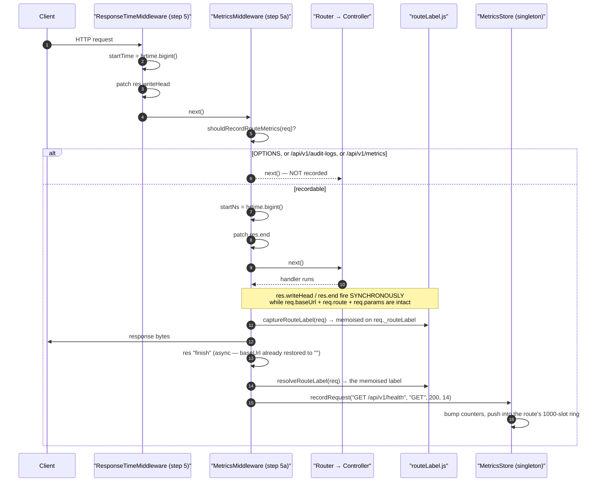
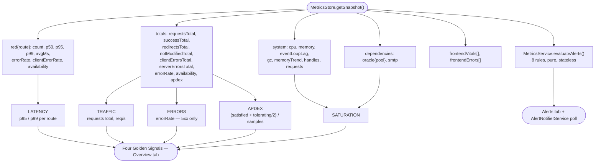
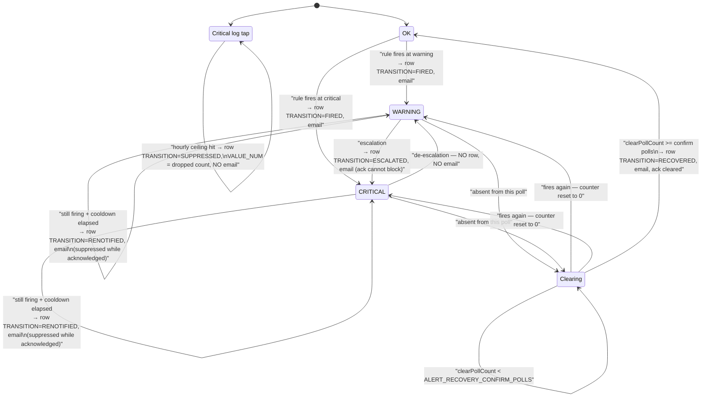
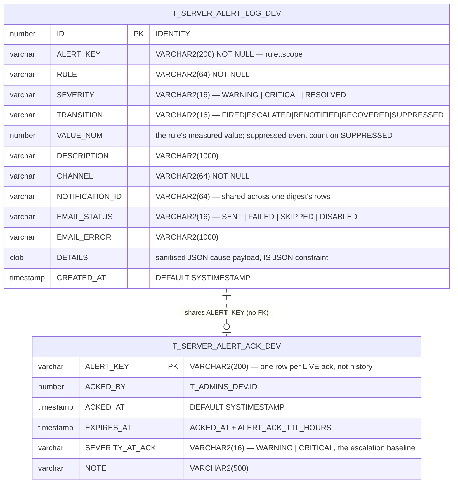

# Metrics & Observability — Technical Documentation

> **Scope:** the in-process metrics pipeline — RED collection, the golden signals, system/GC/leak telemetry, the alert rule engine, alert state transitions and acknowledgement, and the unauthenticated frontend telemetry sink.
> **Source:** `Frontend/` (React 19 + Vite SPA) and `Backend/` (Node.js + Express v5 API).
> **Generated:** 2026-09-04. **Authority:** the code. Where `CLAUDE.md` disagrees with the code, the code wins and the disagreement is recorded in [§6.12](#612-known-documentation-drift).
> **Rendering:** the ```mermaid fences below render in GitHub, GitLab, Obsidian and VS Code preview. A plain Markdown→PDF path (Chrome "print to PDF") will print them as code — pre-render with `npx @mermaid-js/mermaid-cli` if you need a PDF.

---

## 1. Overview

The template measures itself with **no external dependency** — no Prometheus, no StatsD, no agent. `MetricsStore` is a singleton that holds per-route ring buffers of durations, a handful of cumulative counters, and three background probes (a 10-second system poller, a `setImmediate` event-loop-lag probe, and a `perf_hooks` GC observer). `getSnapshot()` sorts the buffers on *read*, so the write path — `recordRequest(route, method, status, ms)` — stays a few increments and one array push.

Everything the dashboard shows is derived from that one snapshot. **RED** (Rate, Errors, Duration) is per route. The **golden signals** are the four tiles on the Overview tab, assembled from the same numbers: Latency from the p95/p99 percentiles, Traffic from `requestsTotal`, Errors from the 5xx-only error rate, and Saturation from heap utilisation, event-loop lag and Oracle pool utilisation. Apdex is accumulated in the same pass that computes percentiles.

The alert engine is a pure function over that snapshot. `MetricsService.evaluateAlerts()` runs eight rules and returns an array — it holds no state and remembers nothing between calls, so `GET /metrics/alerts` and the notification poller can both call it freely. State lives one layer up, in `AlertNotifierService`, which diffs each poll's result against the previous one per alert *identity* (`rule::scope`) and e-mails only on **transitions**. `T_SERVER_ALERT_LOG_DEV` records those transitions — `FIRED`, `ESCALATED`, `RENOTIFIED`, `RECOVERED`, `SUPPRESSED` — and never a row per poll tick, because a steady-state alert polled every 60 seconds would otherwise append 1440 identical rows a day.

Frontend telemetry closes the loop. `webVitals.js` collects LCP/CLS/FID/INP from the browser's native `PerformanceObserver` (no npm package), `frontendMetrics.js` buffers them plus uncaught errors, and both are POSTed to `/api/v1/metrics/frontend` with `keepalive` fetch — **unauthenticated and CSRF-exempt**, because the whole point is to measure the login page before any session exists.

---

## 2. Flow & Architecture

### 2.1 One request becomes a RED sample



The whole reason `captureRouteLabel` exists is the timing gap in this diagram. `req.route.path` is only the leaf segment registered on the sub-router (`/save`), and the full pattern is `req.baseUrl + req.route.path`. But by the time the async `"finish"` event fires, Express has unwound the router stack and restored `req.baseUrl` to `""` — so a finish-time read collapses every router's `/` into `GET /` and every `/verify` into `POST /verify` (`routeLabel.js:12-20`). Capturing inside the synchronous `res.end`/`res.writeHead` override fixes it; `resolveRouteLabel` falls back to a reconstruction from `req.originalUrl` when capture never ran (`:136-161`), which is the error path.

Steps 5 and 5a are ordered deliberately in `app.js:136-143`: metrics collection must run **after** `ResponseTimeMiddleware` so both measure from the same request-start origin, and `MetricsMiddleware` keeps its own per-route ring buffers for p50/p95/p99, which `ResponseTimeMiddleware` does not provide.

### 2.2 Golden signals from one snapshot



The one arithmetic decision worth internalising: **client errors are excluded from availability and from `errorRate`.** `computeRates` (`MetricsStore.js:179-187`) defines `serviced = total − clientErrors`, then `availability = (serviced − serverErrors) / serviced` and `errorRate = serverErrors / serviced`. A `400`/`401`/`403`/`404`/`422` means the service did its job by rejecting bad input; folding those into an availability SLI makes a scanner sweep look like an outage. `clientErrorRate = clientErrors / total` is reported alongside, on a *different denominator*, so 4xx storms stay visible without polluting the SLI. Consequence: `availability` is **not** `1 − clientErrorRate`, and the two rates do not sum to anything meaningful.

`304 Not Modified` is tracked as its own class, separate from real 3xx redirects (`:87-94`): a `304` is a successful cache revalidation, and conditional GETs from a polling dashboard would otherwise dominate the "Redirect" bar.

### 2.3 Alert state transitions



Four rules encoded here, all in `AlertNotifierService._pollTick` (`:322-452`):

- **Escalation is immediate**, never cooldown-gated (`:387-389`). A `WARNING → CRITICAL` is new information.
- **De-escalation sends nothing** (`:390-391`). The eventual recovery digest covers it; an "it got slightly better" e-mail is noise.
- **Recovery requires `ALERT_RECOVERY_CONFIRM_POLLS` consecutive clear polls** (default 3, `:267-269`). This is the anti-flap hysteresis: a metric hovering on a threshold would otherwise alternate fired/recovered every minute.
- **Re-notify is cooldown-gated** at `ALERT_EMAIL_COOLDOWN_MIN` (default 30, `:259-261`), and it is the *only* branch an acknowledgement can silence (`:396-401`).

`SUPPRESSED` belongs to a different path entirely — the critical logger tap, not the metrics poll. When more than `CRITICAL_MAX_EMAILS_PER_HOUR` digests have already gone out in the last hour, the buffered window is dropped, **one** row is written with `VALUE_NUM` set to how many events were dropped, and the count is carried forward so the next successful digest can say *"N further events were suppressed"* (`:706-733`). One row per suppressed *window*, not per suppressed event — otherwise storm control would defeat itself.

### 2.4 Frontend telemetry — the unauthenticated path

```mermaid
sequenceDiagram
    autonumber
    participant B as Browser
    participant WV as "webVitals.js (PerformanceObserver)"
    participant FM as "frontendMetrics.js buffer"
    participant API as "POST /api/v1/metrics/frontend"
    participant MW as "Middleware chain"
    participant SV as "MetricsService.ingestFrontendMetrics"
    participant ST as "MetricsStore FIFOs (max 500 each)"

    Note over B,FM: main.jsx line 32-35 — BEFORE any provider,<br/>before CSRF init, before auth
    B->>FM: frontendMetrics.init(API_BASE_URL)
    B->>WV: initWebVitals(cb)
    WV->>WV: observe largest-contentful-paint, layout-shift,<br/>first-input, event (durationThreshold 16)
    B->>WV: page hidden / first input
    WV->>FM: recordVital("LCP", 1840, "good")
    B->>FM: window "error" / "unhandledrejection" → recordError(...)
    FM->>FM: recordError flushes IMMEDIATELY; vitals wait for<br/>20 items or the 30 s timer
    FM->>API: fetch POST, keepalive: true, no auth header, no CSRF header
    API->>MW: helmet → security filter → traceability → audit(skipped? no) → body parse …
    MW->>MW: step 9 CSRF gate — path is in CSRF_EXEMPT_PATHS, skipped
    MW->>MW: frontendIngestLimiter — 30 req/min per IP
    MW->>SV: MetricsController.ingestFrontend(req.body)
    SV->>SV: must be an array, non-empty, <= 50 items
    SV->>ST: recordFrontendVital / recordFrontendError
    SV-->>B: 200 {status, code, message, requestId, data:null}
```

Three exemptions make this work, and each is justified in place:

1. **No auth** — `metrics.route.js:74-78` mounts the route with no `AuthMiddleware`. The endpoint exists to measure pre-auth pages.
2. **CSRF-exempt** — `app.js:164` lists `/api/v1/metrics/frontend` alongside `/api/v1/csrf`. The rationale at `:157-161`: a `keepalive` fetch on the page-unload path cannot attach the `x-csrf-token` header, and CSRF protects *session-riding* mutations — this endpoint has no session to ride. Abuse is bounded by the dedicated limiter instead.
3. **Its own rate limiter** — a `RateLimiterMiddleware` instance at 30 req/min, separate from the global one (`metrics.route.js:31-35`).

`recordError` flushes immediately rather than waiting for the threshold or the timer (`frontendMetrics.js:226-230`), because a crash that blanks the tab never gets another chance; `keepalive: true` is what makes that safe on unload.

### 2.5 The alert tables



`Backend/sql/01_schema.sql:200-259`. The relationship is by convention only — **there is no foreign key**, because the two tables have opposite lifecycles: the log is append-only history that outlives everything, the ack table holds *at most one row per currently-acknowledged alert* and rows are deleted on unacknowledge, recovery, TTL expiry and escalation override.

Four `CHECK` constraints pin the enums (`:215-218`), including `CK_SAL_DETAILS_JSON CHECK (DETAILS IS JSON)` — a malformed cause payload is rejected by the database, not silently stored. Two indexes (`:227-228`): `(CREATED_AT DESC)` for the default history page and `(RULE, CREATED_AT DESC)` for the per-rule filter.

---

## 3. Frontend implementation

### 3.1 Files

| File | Responsibility |
| --- | --- |
| `Frontend/src/features/management/metrics/Metrics.view.jsx` | The standalone Observability Dashboard at `system/metrics`. Five tabs: Overview, RED Metrics, System, Alerts (with a live count in the label), Health. Presentation only; one `const hook = useMetrics()` and no destructuring at view level. |
| `…/metrics.hook.js` | All state and every fetch. Six `useRequest` calls at `staleTime: 30_000` (snapshot, summary, alerts, health/live, health/ready, notification status), plus the alert-history sub-fetch gated behind `{ enabled: alertsView === "history" }`, plus the acknowledge/unacknowledge/test-send mutations. Also exports seven pure formatters. |
| `…/metrics.api.js` | Eleven thin `httpClient` calls. No state, no React. `healthReady` uses `validateStatus: s === 200 \|\| s === 503` so a 503 renders the per-dependency breakdown instead of throwing. |
| `…/components/RedMetricsTab.jsx` | The per-route table: Route, Requests, Error Rate, p50, p95, p99, Avg. Rows arrive pre-sorted by p95 descending from the hook. |
| `…/components/OverviewTab.jsx`, `SystemTab.jsx`, `AlertsTab.jsx`, `HealthTab.jsx` | The other four tabs. `HealthTab` is also reused by the Logging & Observability page. |
| `…/components/AlertHistoryTab.jsx`, `AckAlertModal.jsx`, `NotificationStatusPanel.jsx` | The Alerts area's `Active \| History` toggle, the acknowledge confirm modal, and the notification-config panel (masked recipients, SMTP health, recent sends, SUPER_ADMIN test-send). |
| `…/metricsStyles.js` | Eleven range→Tailwind-class functions, one per metric family, plus `PILL_BASE`, `textCls` and `badgeCls`. |
| `Frontend/src/utils/webVitals.js` | Native `PerformanceObserver` collection for LCP/CLS/FID/INP with Google's 2024 thresholds. Zero npm dependencies. |
| `Frontend/src/utils/frontendMetrics.js` | The buffer + `keepalive` fetch flusher. Deliberately does **not** use `httpClient`. |
| `Frontend/src/main.jsx` | Bootstraps both at lines 32-35, before every provider. |
| `Frontend/src/features/management/logsmanagement/components/MetricsPageTab.jsx` etc. | The *other* consumer of the same hook — the Logging & Observability page's Metrics tab. See [`logging-and-audit.md`](./logging-and-audit.md). |

### 3.2 `metricsStyles.js` — the colour contract

Every pill in the dashboard gets its class from one of these, and the thresholds are chosen to match the backend's alert tiers so a pill turns amber at the same value the alert fires:

| Function | Bands |
| --- | --- |
| `getErrorRateStyle(rate)` | `<0.1%` · `<1%` · `<5%` · `<10%` · `<20%` · else — the `1%`/`5%` boundaries are `ERROR_RATE_WARNING_THRESHOLD` / `_CRITICAL_THRESHOLD` exactly |
| `getAvailabilityStyle(ratio)` | `≥99.9%` · `≥99.5%` · `≥99%` · `≥95%` · `≥90%` · else — inverse polarity, SLO tiers |
| `getLatencyStyle(ms)` | `0` (grey, "no data") · `<50` · `<100` · `<200` · `<500` · `<1000` · `<2000` · else — `2000` is the `HIGH_LATENCY` p99 threshold |
| `getLagStyle(ms)` | `<5` · `<10` · `<50` · `<100` · else — `100` is the `EVENT_LOOP_LAG` threshold |
| `getHeapPctStyle(pct)` | `<40` · `<60` · `<70` · `<80` · `<90` · else — `75`/`90` are the `HIGH_HEAP` thresholds |
| `getPoolUtilStyle(ratio)` | `<50%` · `<70%` · `<80%` · `<95%` · else — mirrors `ORACLE_POOL_SATURATION` |
| `getAlertSeverityStyle`, `getHealthLatencyStyle`, `getCpuStyle`, `getHandlesStyle` | severity label, probe latency, CPU delta, active handle count |

`badgeCls` (`:42-44`) maps a produced `text-*` token to a matching background+border through a **literal lookup table** (`:24-33`) rather than string interpolation — Tailwind's JIT only compiles class names it can see as complete literals, so `border-${color}` would silently produce no CSS.

### 3.3 The two acknowledgement mutations

`confirmAcknowledge` (`metrics.hook.js:378-393`) and `unacknowledgeAlert` (`:402-415`) share one shape: toast on both paths, and **`refetchAlerts()` in the `finally` block regardless of outcome**. The alert row's badge state is server-derived — `GET /alerts` returns each alert decorated with `acknowledged`/`ackedBy`/`ackedByName`/`ackedAt`/`ackExpiresAt` — so the only correct way to reflect a mutation is to re-read, not to patch local state. A failed acknowledge that left an optimistic badge on screen would be worse than no badge.

`formatExpiresIn` (`:112-120`) renders `"expired"` for a past timestamp rather than a negative duration. That is a real transient: the backend clears a lapsed ack on its *next* poll tick, so the UI can legitimately observe an expired-but-not-yet-cleared row.

### 3.4 Web Vitals without a library

`initWebVitals` (`webVitals.js:63-192`) registers four `PerformanceObserver`s, each wrapped in its own `try`/`catch` so an unsupported `type` skips that metric instead of killing the rest, and no-ops entirely when `PerformanceObserver` is undefined (SSR, jsdom, old browsers).

| Metric | Observer type | Emit trigger |
| --- | --- | --- |
| LCP | `largest-contentful-paint` | page hidden, or first `keydown`/`pointerdown` (input stops LCP per spec). Emitted once — the candidate is zeroed after. |
| CLS | `layout-shift` | page hidden. Accumulates the standard session window (1 s gap / 5 s max) and reports the **maximum** session value, skipping shifts with `hadRecentInput`. |
| FID | `first-input` | on the first entry, then `disconnect()`. |
| INP | `event` with `durationThreshold: 16` | page hidden. Approximated as the **worst** interaction duration seen, filtered to entries carrying an `interactionId`. |

The module emits `{ name, value, rating }` and nothing else — no PII, no identifiers, no page content (`:17-20`).

---

## 4. Backend implementation

### 4.1 `MetricsStore` — the in-process store

`Backend/src/middleware/metrics/MetricsStore.js`, exported as a singleton (`:922`).

**Per-route data** (`:199`) is a `Map` of `"<METHOD> <path>" → { count, redirectCount, notModifiedCount, clientErrorCount, serverErrorCount, durations }`, where `durations` is a ring buffer capped at `RING_BUFFER_SIZE = 1000` (`:47`). `#pushRing` (`:509-514`) `shift()`s at the cap — O(n) but n is bounded and small.

**Three background probes**, all `unref()`'d so none holds the process open:

| Probe | Cadence | Reads |
| --- | --- | --- |
| System poller (`:305-314`) | `SYSTEM_POLL_INTERVAL_MS = 10_000` (`:53`), plus one immediate call at construction | `process.memoryUsage()`, delta `process.cpuUsage()`, `_getActiveHandles/Requests`, GC overhead |
| Event-loop probe (`:376-392`) | ~1 s | `Date.now()` delta across a `setImmediate`, smoothed with an EMA (α = 0.3) so a single GC pause is not read as sustained lag |
| GC observer (`:400-443`) | event-driven, `perf_hooks` | Per-kind bucketing (minor/major/incremental/weakcb), a 200-sample pause ring, and a post-**major**-GC heap baseline |

**Heap is measured against the V8 ceiling, not `heapTotal`.** `HEAP_SIZE_LIMIT` is read once at module load from `v8.getHeapStatistics().heap_size_limit` (`:44`). `heapTotal` is only what V8 has committed so far and naturally sits near 100 % of itself by design — dividing by it produced permanent false "critical heap" alerts. `heapTotal` is still exposed as a secondary GC-pressure hint.

**CPU % is normalised across cores** (`:339-341`): `(userMs + systemMs) / (window × CPU_COUNT) × 100`, so one saturated core on an 8-core box reads 12.5 %, not 100 %.

**Leak detection** (`#analyzeHeapTrend`, `:462-497`) is the one genuinely clever piece. After every *major* (mark-sweep-compact) collection the heap holds only the live set — everything reclaimable has been reclaimed — so that reading is the true floor. `linRegSlope` fits a least-squares line through up to `HEAP_BASELINE_MAX = 120` such baselines (`:74`), and `suspected` requires **all four** of: ≥8 samples, ≥5 minutes of window, >0.5 MB/min sustained growth, and a last reading ≥25 % above the first (`:491-495`). Four conjunctive conditions, because warm-up growth and short bursts must never trip it.

**Apdex** is accumulated inside the same loop that sorts each route's ring for percentiles (`:767-804`) — O(total samples), no extra allocation. `T = APDEX_THRESHOLD_MS = 500`; `≤T` satisfied, `≤4T` tolerating, else frustrated; `(satisfied + tolerating/2) / total`, and `1` when there are no samples.

### 4.2 `MetricsMiddleware` — step 5a

`Backend/src/middleware/metrics/MetricsMiddleware.js` is 105 lines and does exactly three things: skip what should not be recorded, capture the label synchronously, record on `finish`.

`shouldRecordRouteMetrics` (`routeLabel.js:248-252`) excludes `OPTIONS` and everything under `METRICS_EXCLUDED_PREFIXES` — by default `/api/v1/audit-logs` and `/api/v1/metrics` (`:67-71`). The reasoning at `:52-64` is the observer effect: the dashboard polls itself every 30 seconds, and `/audit-logs/stream` is a long-lived SSE whose `res.finish` fires only on *close*, so its "duration" would be the whole session and would wreck p95/p99/apdex in one sample.

**A live consequence worth stating plainly: `POST /api/v1/metrics/frontend` is not in RED metrics.** It matches the `/api/v1/metrics` prefix, so the ingestion endpoint's own rate, errors and latency are invisible to the dashboard it feeds.

Unmatched requests (404s, anything short-circuited before routing) aggregate under the fixed label `UNMATCHED` (`routeLabel.js:49`) rather than their raw URL — otherwise any client could mint unbounded metric keys (CWE-400) and push attacker-controlled strings into dashboards (CWE-200).

The whole `finish` handler is wrapped in a bare `try {} catch {}` (`MetricsMiddleware.js:91-93`): *"metrics collection must never crash the request pipeline."*

### 4.3 `MetricsService` — the rule engine

`Backend/src/services/MetricsService.js`. Static class, three methods.

`getSnapshot()` (`:85-94`) wraps `metricsStore.getSnapshot()` and converts any throw into `AppError 503 METRICS_UNAVAILABLE`. `getSummary()` (`:101-129`) is the light read for non-admins: totals, four heap numbers, event-loop lag, the top 5 routes by p95 descending, and the alert *count* only.

`evaluateAlerts(snapshot?)` (`:158-380`) is **pure and stateless** — it returns an array and remembers nothing. Eight rules:

| # | Rule | Warning | Critical | Scope | Channel |
| --- | --- | --- | --- | --- | --- |
| 1 | `HIGH_ERROR_RATE` | `errorRate > 1%` | `> 5%` | global | red-metrics |
| 2 | `HIGH_LATENCY` | `p99 > 2000 ms` | — (warning only) | per route | red-metrics |
| 3 | `HIGH_HEAP` | `heapUsed / heapSizeLimit > 75%` | `> 90%` | global | system |
| 4 | `EVENT_LOOP_LAG` | `> 100 ms` | — | global | system |
| 5 | `HIGH_GC_OVERHEAD` | `> 5%` of wall-clock | `> 10%` | global | system |
| 6 | `MEMORY_LEAK_SUSPECTED` | `memoryTrend.suspected` | — | global | system |
| 7 | `ORACLE_POOL_SATURATION` | `inUse/open > 80%` | `> 95%` | per pool | dependencies |
| 8 | `EMAIL_DELIVERY_FAILING` | `consecutiveFailures >= 1` | `>= 3` | global | dependencies |

Every rule also emits a log line, and **every one of those lines carries `_noNotify: true`** in its meta (`:184`, `:204`, `:235`, `:252`, `:276`, `:308`, `:347`, `:374`). That is loop guard R2: each alert is already delivered by `AlertNotifierService` through its mapped channel, so the critical logger tap must not e-mail it a second time. `_noNotify` suppresses only the tap — the line is still written to disk and console normally (`logger.js:150-156`).

`ingestFrontendMetrics(payload)` (`:398-457`) validates three things — array, non-empty, ≤50 items — then clamps every field: name ≤200 chars, error message ≤500, stack ≤2000 (`:428`, `:441-443`). An item that is not an object, or whose `type` is neither `"vital"` nor `"error"`, is skipped silently rather than rejecting the batch.

### 4.4 `AlertNotifierService` — the state machine

`Backend/src/services/AlertNotifierService.js`, a singleton instance (`:1492`). Two independent trigger paths feed four e-mail channels.

**Path 1 — the metrics poll.** A plain `setInterval` at `ALERT_POLL_INTERVAL_MS` (default 60 s). Deliberately not `node-cron`: PKG builds have silently missed cron ticks before (`:14-18`). Every tick calls `evaluateAlerts()`, keys each result by `rule::(route ?? pool ?? "global")`, and diffs against `_alertStates`. Transitions are batched **per channel** — one digest e-mail per channel per tick, not one per alert (`:441-451`). A channel with both an escalation and a recovery in the same tick sends two, which is the acknowledged edge case.

**Path 2 — the critical log tap.** `logger.onLevel(2, …)` (`:201`) subscribes to `emerg`/`alert`/`crit`. Records buffer for `CRITICAL_DIGEST_WINDOW_MS` (default 30 s) so a DB-outage log storm collapses into one e-mail, under an hourly ceiling of `CRITICAL_MAX_EMAILS_PER_HOUR` (default 10) past which windows are counted and dropped (`:698-743`).

**The loop guard is bidirectional.** R2 stops the metrics path double-notifying through the tap (`_noNotify` on every `ALERT_TRIGGERED` log). R1b stops the *notifier itself* re-entering the tap it subscribes to: every `logger.*` call in this file carries `{ _noNotify: true }`, or a failing SMTP send would log a warning that logs a warning forever. There is exactly one deliberate exception — the Phase 4 escalation-clear `logger.notice` at `:1067-1069`, which is a normal operational event and is not part of the send path.

**Rule → channel mapping** (`:88-97`) is a frozen object; an unmapped rule falls back to `server-system-notification` **with a warning log** (`:300-307`), so a new rule added to `evaluateAlerts` without a mapping is never silently dropped.

**Acknowledgement (Phase 4)** silences the cooldown re-notify nag with two mandatory safety nets, both evaluated live on every tick in `_checkAndUpdateAck` (`:1050-1074`) — there is no separate sweep job:

1. **Escalation override** — the moment live severity ranks above `SEVERITY_AT_ACK`, the ack is cleared and the notification fires anyway.
2. **TTL expiry** — `now >= expiresAt` clears it. `ALERT_ACK_TTL_HOURS` defaults to 24.

Recovery also clears any ack (`:436`), because a later re-fire of the same identity is a new incident needing a fresh decision. The returned `suppress` flag is consulted **only** by the `RENOTIFIED` branch — `FIRED` and `ESCALATED` send unconditionally, de-escalation never sends, so an ack structurally cannot block them.

State is hydrated from `T_SERVER_ALERT_ACK_DEV` at `start()`, **fire-and-forget, never awaited** (`:211-213`), because `server.js` starts this service *before* `db.initializePools()` so the critical tap is live when a pool-init failure fires. Rows whose TTL lapsed during downtime are skipped and opportunistically deleted, never resurrected (`:1119-1125`).

**Persistence is write-behind.** `_writeAlertLogRows` queues sanitised rows (cap 500, drop-oldest) and attempts a flush; `_flushAlertLogQueue` stops at the first failure to preserve order and retries at the top of the next poll tick (`:896-925`). Nothing here can block or throw into the notification path.

`_sanitizeDetails` (`:940-969`) runs before persistence: recursively redacts any key matching `/password|token|secret|authorization|cookie/i`, caps an embedded `stack` at 2000 chars, and replaces a payload over 64 KB with `{ truncated: true, preview }`.

**Cluster guard R5** — the class is cluster-agnostic; `server.js:375-377` calls `start()` only on the elected cron leader, so exactly one worker polls and subscribes.

### 4.5 Routes

Mounted at `/api/v1/metrics` (`routes/index.js:38`).

| Method & path | Access | Extra middleware | Handler |
| --- | --- | --- | --- |
| `GET /` | `userLevel >= 2` | — | `getSnapshot` |
| `GET /summary` | `userLevel >= 1` | — | `getSummary` |
| `GET /alerts` | `userLevel >= 2` | — | `getAlerts` (decorated with ack state) |
| `POST /frontend` | **none** | `frontendIngestLimiter` 30/min | `ingestFrontend` |
| `GET /notifications/status` | `userLevel >= 2` | — | `getNotificationStatus` |
| `POST /notifications/test` | `role === "SUPER_ADMIN"` | `notificationTestLimiter` 3/min → `validateRequiredFields(["channel"])` | `testSendNotification` |
| `GET /alerts/history` | `userLevel >= 2` | — | `getAlertHistory` |
| `POST /alerts/ack` | `userLevel >= 2` | `validateRequiredFields(["alertKey"])` | `acknowledgeAlert` |
| `DELETE /alerts/ack` | `userLevel >= 2` | `validateRequiredFields(["alertKey"])` | `unacknowledgeAlert` |

Three ordering/design decisions are commented in the file:

- **`/notifications/test` is role-gated, not level-gated** (`:98`). `userLevel >= 2` would let any `ADMIN` burn the SMTP budget; every call is a real send. The rate limiter sits *after* auth and *before* validation, so an unauthenticated caller cannot probe for the field shape either (`:92-94`).
- **`/alerts/history` is registered after `/alerts`** and is a distinct exact path, so there is no route-order collision (`:105-107`).
- **`alertKey` travels in the body, never a path param** (`:116-118`) — it contains `::` and `/` (e.g. `HIGH_LATENCY::POST /api/v1/auth/login`) and does not path-encode cleanly.

Both limiters are exported for tests (`:140-141`), because module-level limiter state persists across a full run.

`MetricsController.getAlerts` (`:91-101`) is the only read that is not a straight pass-through: it calls `evaluateAlerts()` then `AlertNotifierService.decorateAlertsWithAckState()`, which resolves every acking admin's display name in **one** batched `AdminModel.getNamesByIds` call regardless of how many alerts are acked (`AlertNotifierService.js:1288-1290`) — O(n) alerts, O(1) round-trips.

---

## 5. How frontend and backend connect (the contract)

### 5.1 Two transports, on purpose

| | Dashboard reads | Frontend telemetry |
| --- | --- | --- |
| Client | `httpClient` (Axios singleton) | native `fetch` |
| Auth | HTTP-only JWT cookie, `withCredentials` | none |
| CSRF | injected on the three mutating routes | exempt (`app.js:164`) |
| Rate limit | global limiter | dedicated 30/min |
| Unload safety | n/a | `keepalive: true` |
| Why | the standard three-layer rule (`api → hook → view`) | `httpClient` depends on CSRF init and on the auth layer being up; this module must run before both (`frontendMetrics.js:5-11`) |

`frontendMetrics.js` bypassing `httpClient` is the one sanctioned exception to the "never import Axios / never use raw fetch" rule, and the file header states the reason.

### 5.2 `GET /api/v1/metrics`

Full snapshot; `userLevel >= 2`. Abbreviated:

```json
{
  "status": "success", "code": 200, "message": "Metrics fetched successfully.",
  "requestId": "0078812966528-0448-8401",
  "data": {
    "timestamp": "2026-09-04T06:22:07.418Z", "uptime": 84213.7,
    "red": {
      "GET /api/v1/auth/me": { "count": 4120, "redirectCount": 0, "notModifiedCount": 0,
        "clientErrorCount": 12, "serverErrorCount": 0, "errorRate": 0,
        "clientErrorRate": 0.0029, "availability": 1,
        "p50": 4, "p95": 11, "p99": 28, "avgMs": 6 }
    },
    "system": {
      "cpu": { "user": 320, "system": 90, "percent": 0.51 },
      "memory": { "heapUsed": 61234176, "heapTotal": 88080384,
                  "heapSizeLimit": 2197815296, "rss": 148635648,
                  "external": 2214512, "arrayBuffers": 82304 },
      "eventLoopLag": 1,
      "gc": { "collections": 812, "pauseMs": 1904, "overheadPct": 0.12,
              "major": { "count": 9, "pauseMs": 402 }, "minor": { "count": 780, "pauseMs": 1401 },
              "incremental": { "count": 21, "pauseMs": 90 }, "weakcb": { "count": 2, "pauseMs": 11 },
              "recent": { "sampleCount": 200, "avgPauseMs": 2.31, "maxPauseMs": 48.9, "p95PauseMs": 7.02 } },
      "memoryTrend": { "sampleCount": 9, "windowMs": 640000, "growthBytesPerMin": 12044,
                       "firstHeapUsed": 58720256, "lastHeapUsed": 60817408, "suspected": false },
      "handles": 12, "requests": 0
    },
    "dependencies": {
      "oracle": { "appDb": { "queryCount": 8804, "errorCount": 2, "avgMs": 9, "p95Ms": 22,
                             "poolUtilization": 0.15, "connectionsInUse": 3, "connectionsOpen": 20,
                             "poolMax": 20, "queueLength": 0, "capacity": 1 } },
      "smtp": { "status": "up", "consecutiveFailures": 0,
                "lastSuccessAt": "2026-09-04T05:00:11.204Z", "lastFailureAt": null }
    },
    "totals": { "requestsTotal": 41822, "successTotal": 38010, "redirectsTotal": 12,
                "notModifiedTotal": 0, "clientErrorsTotal": 3702, "serverErrorsTotal": 98,
                "errorsTotal": 3800, "errorRate": 0.0026, "clientErrorRate": 0.0885,
                "availability": 0.9974, "apdex": 0.987 },
    "frontendVitals": [ { "name": "LCP", "value": 1840, "rating": "good", "context": {}, "ts": "…" } ],
    "frontendErrors": [],
    "notifications": { "server-system-notification": { "sent": 3, "failed": 0, "consecutiveFailures": 0,
                       "lastSuccessAt": "…", "lastFailureAt": null, "lastFailureCause": null,
                       "suppressedCount": 0 } }
  }
}
```

`poolUtilization`, `connectionsInUse`, `connectionsOpen`, `poolMax`, `queueLength` and `capacity` are **`null` until the Oracle adapter's `PoolHealthMonitor` first reports** on its 30 s poll (`MetricsStore.js:826-832`). Rule 7 guards the type explicitly (`MetricsService.js:317-323`), and `getPoolUtilStyle` treats a non-number as 0.

**Statuses:** `401` unauthenticated · `403` for `userLevel < 2` · `440` expired token · `503 METRICS_UNAVAILABLE` if the snapshot itself throws.

### 5.3 `GET /api/v1/metrics/summary`

`userLevel >= 1` — the light read for a sidebar dashlet.

```json
{ "data": { "uptime": 84213.7, "totals": { … },
            "system": { "heapUsedMb": 58, "heapTotalMb": 84, "heapLimitMb": 2096, "eventLoopLag": 1 },
            "topSlowRoutes": [ { "route": "POST /api/v1/auth/login", "count": 91, "p95": 412, "…": "…" } ],
            "alertCount": 0 } }
```

### 5.4 `GET /api/v1/metrics/alerts`

```json
{ "data": { "count": 1, "alerts": [ {
    "rule": "HIGH_LATENCY", "severity": "warning", "route": "POST /api/v1/auth/login",
    "value": 2410, "description": "P99 latency for POST /api/v1/auth/login is 2410ms (threshold: 2000ms)",
    "alertKey": "HIGH_LATENCY::POST /api/v1/auth/login",
    "acknowledged": true, "ackedBy": 1, "ackedByName": "Admin User",
    "ackedAt": "2026-09-04T04:10:00.000Z", "ackExpiresAt": "2026-09-05T04:10:00.000Z",
    "ackNote": "Known — load test running until 18:00"
  } ] } }
```

An unacknowledged alert carries the same keys with `acknowledged: false` and the five ack fields `null` (`AlertNotifierService.js:1295-1306`), so the frontend never has to branch on key presence.

### 5.5 `POST /api/v1/metrics/frontend`

**Request** — no `Authorization`, no `x-csrf-token`, `keepalive: true`:

```http
POST /api/v1/metrics/frontend HTTP/1.1
Content-Type: application/json

[ { "type": "vital", "name": "LCP", "value": 1840, "rating": "good", "ts": "2026-09-04T06:20:00.000Z" },
  { "type": "error", "message": "Cannot read properties of undefined",
    "stack": "TypeError: …", "context": { "page": "/dashboard", "userAgent": "Mozilla/5.0 …",
    "source": "window.error" }, "ts": "2026-09-04T06:20:03.000Z" } ]
```

**Response — 200** `{ status, code, message, requestId, data: null }`.

| Status | Cause |
| --- | --- |
| `400 ValidationError` | body is not an array (`hint`: *"Send a JSON array of metric events in the request body."*) |
| `400 ValidationError` | empty array (*"must contain at least one event"*) |
| `400 ValidationError` | more than 50 items (*"Split into batches of at most 50 events per request."*) |
| `400` | malformed JSON — raised by the body parser, not the controller |
| `413 PayloadTooLargeError` | body over the parser limit |
| `429` | more than 30 requests/min from this IP |

The client's failure handling is one retry after 5 s, then a silent drop (`frontendMetrics.js:95-109`) — no unbounded retry loop, because telemetry must never become a self-inflicted load source.

### 5.6 The three mutating routes

| Endpoint | Body | Success | Errors |
| --- | --- | --- | --- |
| `POST /notifications/test` | `{ channel }` | `{ sent: true, notificationId }` | `400 CHANNEL_UNKNOWN` (with the four valid keys in `hint`) · `400` missing `channel` · `403` non-`SUPER_ADMIN` · `403` no CSRF · `429` on the 4th call in a minute · `502 TEST_SEND_FAILED` |
| `POST /alerts/ack` | `{ alertKey, note? }` | `{ alertKey, acknowledged: true, ackedBy, ackedAt, ackExpiresAt, severityAtAck, note }` | `400 ALERT_KEY_REQUIRED` · `404 ALERT_NOT_FOUND` (never fired, or already recovered) · `400 ALERT_NOT_ACTIVE` (status is `OK`) · `502 ACK_WRITE_FAILED` |
| `DELETE /alerts/ack` | `{ alertKey }` | `{ alertKey, acknowledged: false }` | `400 ALERT_KEY_REQUIRED` · `404 ACK_NOT_FOUND` · `502 ACK_WRITE_FAILED` |

`validateRequiredFields` does more than presence-check: it **rejects objects and arrays outright** and string-coerces the survivors, which is why `{"alertKey": {"$regex": ".*"}}` is a `400` rather than something that reaches a query builder.

`note` is clamped to 500 chars server-side (`AlertNotifierService.js:1180`) to match `NOTE VARCHAR2(500)`.

### 5.7 `GET /api/v1/metrics/alerts/history`

`?rule=&severity=&from=&to=&page=&limit=` → `{ rows, total, page, limit }`, `limit` capped at 200 by the model.

Two validations happen in the controller rather than being pushed to the model, both to avoid silently *widening* a result set: an unrecognised `severity` is `400 INVALID_SEVERITY` (`MetricsController.js:149-167`), and an unparseable `from`/`to` is `400 INVALID_DATE_RANGE` rather than being dropped (`parseHistoryDate`, `:32-46`). `from > to` is also `400`. An empty-string `severity` means "no filter" and is accepted.

### 5.8 `GET /api/v1/metrics/notifications/status`

```json
{ "data": {
  "enabled": true,
  "recipients": { "server-critical-notification": ["a***n@example.com"], "…": [] },
  "pollIntervalMs": 60000, "cooldownMin": 30, "recoveryEnabled": true,
  "recoveryConfirmPolls": 3, "criticalDigestWindowMs": 30000,
  "criticalMaxEmailsPerHour": 10, "ackTtlHours": 24, "running": true,
  "activeAlerts": [ { "rule": "HIGH_LATENCY", "scope": "POST /api/v1/auth/login",
                      "channel": "server-red-metrics-notification", "status": "WARNING",
                      "lastNotifiedAt": "2026-09-04T04:00:00.000Z" } ],
  "recentSends": [ { "channel": "…", "notificationId": "…", "sent": true,
                     "headline": "…", "reason": null, "at": "…" } ] } }
```

Recipients are **masked** (`ServerNotificationService.maskEmail`) — the page shows who is subscribed without exposing full addresses (CWE-200). `recentSends` reads the last 20 rows of `T_SERVER_ALERT_LOG_DEV` and falls back to an in-memory ring buffer if that read fails (`AlertNotifierService.js:1384-1402`), so the status page never breaks just because the audit table is unreachable. This response is also where the frontend gets `ackTtlHours` for its "expires in Xh" badge (`metrics.hook.js:523`).

---

## 6. Technicalities

### 6.1 Every metric is per process and dies with it

`MetricsStore` is a module singleton with no persistence. A restart zeroes every counter, empties every ring buffer, and discards every heap baseline. Under `ENABLE_CLUSTERING` each worker keeps its *own* store, and `GET /metrics` answers from whichever worker the load balancer picked — so the numbers a dashboard shows are one worker's view, not the cluster's.

That is a deliberate scope decision (zero external dependencies), not an oversight. If you need cluster-wide or historical metrics, this store is the *source*, and an exporter is the missing piece.

### 6.2 4xx is not a failure, and the two rates use different denominators

Stated in [§2.2](#22-golden-signals-from-one-snapshot) and worth repeating because it is the most common misreading of this dashboard. `availability` and `errorRate` divide by `serviced` (total minus 4xx). `clientErrorRate` divides by `total`. `availability !== 1 − clientErrorRate`, and `successRate` in the audit-log stats endpoint follows the same convention (`AuditLogService.js:286-302`).

Rule 1's threshold was retuned for this: 1 % / 5 % are calibrated to a *server-only* rate. Against a rate that included 4xx they would fire constantly on auth failures and scanner noise.

### 6.3 The rate derivation lives in the SSE poller, not the store

`MetricsStore` exposes cumulative counters only. `req/s` and `err/s` are computed in `AuditLogController._buildMetricsPayload` (`:113-152`) as the delta between two consecutive SSE ticks divided by the elapsed seconds, with a negative delta clamped to 0 to absorb a counter reset. `_lastRateSample` is nulled when the poller stops (`:224`) so the first tick after a restart re-establishes the baseline instead of emitting a huge artificial spike.

The frontend does the same thing again, one level up: `applyMetrics` (`logmanagement.hook.js:356-378`) turns the cumulative `totals` into per-tick delta buckets for the stacked traffic bar, and skips the bucket entirely on the first payload after a re-open (`:364`).

### 6.4 Alert identity is `rule::scope`, and it is the ack key

`scope` is `alert.route ?? alert.pool ?? "global"` (`AlertNotifierService.js:348`). So `HIGH_LATENCY` on two routes is two independent identities with two independent cooldowns and two independent acknowledgements, while `HIGH_HEAP` is always `HIGH_HEAP::global`. The critical log tap has no per-identity state at all and uses the literal key `critical-log` (`:717`, `:786`).

This is why `alertKey` is a body field: `HIGH_LATENCY::POST /api/v1/auth/login` contains both `::` and `/`.

### 6.5 Rows are appended on transitions only — never per poll tick

The single most important property of `T_SERVER_ALERT_LOG_DEV`. The writer is called from exactly three places, all of which are transition or email-outcome events: `_dispatchMetricDigest` (`:505-525`), `_dispatchCriticalDigest` (`:784-800`), and the suppression branch of `_flushCriticalDigest` (`:715-731`). The schema comment says it outright (`sql/01_schema.sql:183-186`): *"rows are appended by AlertNotifierService on state TRANSITIONS and email outcomes — never on every poll tick, or a steady-state alert would flood identical rows forever."*

Do the arithmetic: a single alert firing continuously at the default 60 s poll would append 1440 rows a day, 525 600 a year, all identical. Under the transition model it appends one `FIRED`, then one `RENOTIFIED` per 30-minute cooldown, then one `RECOVERED`.

The **live** alert list is never read from this table. It is always recomputed from `evaluateAlerts()`. The table is history and audit only.

### 6.6 Why `RENOTIFIED` exists at all

A `FIRED`-only model would notify once and then go quiet on an incident that is still burning. The cooldown re-notify is the nag, and it is exactly what an acknowledgement is for: an operator who has seen the alert and is working on it stops the nag without disabling the rule — and cannot accidentally silence an escalation, because the ack guard is only consulted on the `RENOTIFIED` branch.

Note the asymmetry in the audit trail: a `RENOTIFIED` row is written whenever the digest *dispatches*, so a suppressed re-notify produces **no row at all** — only an `ALERT_ACK_SUPPRESSED` log line (`:397-399`). The history table records what was sent, not what was considered.

### 6.7 The eight rules are pure; only the diff is stateful

`evaluateAlerts` can be called from anywhere at any frequency with no side effects beyond its log lines. `GET /alerts` calls it on every request; the poller calls it once a minute. All the memory — previous status, clear-poll counter, last-notified timestamp, channel, and the last alert object — lives in `_alertStates`, an in-memory `Map` on the singleton (`:136`).

Which means: **a restart forgets every alert's state.** A condition that was already firing before the restart is seen as `OK → WARNING` on the next tick and fires a fresh `FIRED` e-mail. Acks survive (they are hydrated from the table); alert *state* does not.

### 6.8 Frontend telemetry is fire-and-forget in both directions

The client retries once and drops. The server stores into two capped FIFOs at `FRONTEND_VITALS_MAX = 500` each (`MetricsStore.js:50`, `:685-705`) and nothing persists them — they live only until the snapshot rolls them out or the process restarts. `snapshot.frontendVitals` is a **copy** of the array (`:911-912`), so the dashboard cannot mutate the store.

`buildVitalsSummary` (`metrics.hook.js:137-164`) aggregates them per metric name with a "not blind" bias: the card's colour is the **worst** rating present, not the average.

### 6.9 The event-loop probe smooths, the GC observer does not

Lag is an EMA at α = 0.3 (`MetricsStore.js:382-383`), so a single GC pause never reads as sustained lag and the `EVENT_LOOP_LAG` alert does not fire on one hiccup. GC pause samples are stored raw in a 200-entry ring and reported as avg / max / p95 (`:836-849`), because for GC the outlier *is* the signal.

The GC observer is wrapped in a `try`/`catch` that silently skips when `perf_hooks` GC observation is unavailable (`:440-442`), in which case `gc.overheadPct` stays 0, `memoryTrend.sampleCount` stays 0, and rules 5 and 6 simply never fire.

### 6.10 Two rate limiters, and why the strict one sits after auth

`frontendIngestLimiter` (30/min) is the only thing standing between an anonymous client and the ingestion endpoint. `notificationTestLimiter` (3/min) guards a route that is *already* `SUPER_ADMIN`-gated — it is a second-order control against an authenticated admin (or a stolen session) burning the SMTP budget or using the mailer as an amplifier.

Both are per-process, in-memory `RateLimiterMiddleware` instances. Under clustering the effective budget multiplies by the worker count, and a deploy resets both.

### 6.11 Environment variables this feature depends on

| Variable | Required | Default | Effect |
| --- | --- | --- | --- |
| `METRICS_EXCLUDE_PATHS` | no | `/api/v1/audit-logs,/api/v1/metrics` | Prefixes excluded from RED. **Parsed once at module load** — not readable live. |
| `ENABLE_SERVER_NOTIFICATIONS` | no | `false` | Master switch. `start()` no-ops with one `notice` when not `"true"`. |
| `ALERT_POLL_INTERVAL_MS` | no | `60000` | Metrics poll cadence. Read live from env on every `start()`. |
| `ALERT_EMAIL_COOLDOWN_MIN` | no | `30` | Minimum gap before a `RENOTIFIED` at the same severity. |
| `ALERT_NOTIFY_RECOVERY` | no | `true` | `"false"` suppresses the recovery digest (the state still transitions to `OK`). |
| `ALERT_RECOVERY_CONFIRM_POLLS` | no | `3` | Consecutive clear polls before recovery. The anti-flap window. |
| `CRITICAL_DIGEST_WINDOW_MS` | no | `30000` | Critical-tap buffer window. |
| `CRITICAL_MAX_EMAILS_PER_HOUR` | no | `10` | Storm ceiling. Past it → `SUPPRESSED` rows, no e-mail. |
| `ALERT_LOG_RETENTION_DAYS` | no | `180` | Daily purge sweep (a plain `setInterval` checking once per day, never `node-cron`). |
| `ALERT_ACK_TTL_HOURS` | no | `24` | Acknowledgement lifetime. Also surfaced to the UI via the status endpoint. |
| `SERVER_ALERT_LOG_TABLE` / `SERVER_ALERT_ACK_TABLE` | no | `T_SERVER_ALERT_*_DEV` (`T_SERVER_ALERT_*` in production) | Table-name overrides. |
| `CRON_LEADER` | set by `server.js` | — | Only the elected leader worker calls `AlertNotifierService.start()`. |
| `DEMO_MODE` | no | `false` | `serverAlertLog.model.js` keeps a 500-row in-memory ring; no Oracle connection is opened. |

All the `ALERT_*` / `CRITICAL_*` getters read `process.env` **live** on each call (`AlertNotifierService.js:255-287`) rather than freezing at construction, specifically so tests can change them per case.

### 6.12 Known documentation drift

The code is the authority. These are places where prose currently disagrees with it.

| # | Location | Says | Code actually does |
| --- | --- | --- | --- |
| 1 | `Frontend/src/features/management/metrics/Metrics.view.jsx:6-12` | five tabs: "Overview, RED, System, Alerts, Health" | Accurate for *this* view, but the same `useMetrics()` hook also drives the Logging & Observability page's Metrics tab, which adds **Dependencies** and **Frontend Vitals** sub-tabs (`MetricsPageTab.jsx:3-4`). The hook's return surface is a superset of what this view renders. |
| 2 | `MetricsService.js:176`, `:227`, `:271`, `:336`, `:366` | `logger[isCritical ? "crit" : "warning"]` | `crit` is a `@deprecated` alias for `critical()` (`logger.js:786-792`). Functionally correct, stylistically stale — the same drift recorded in [`logging-and-audit.md`](./logging-and-audit.md) §6.12 #3. |
| 3 | `MetricsStore.js:749` (the `getSnapshot` `@returns` JSDoc) | `red` values are `{ count, clientErrorCount, serverErrorCount, errorRate, clientErrorRate, availability, p50, p95, p99, avgMs }`; `totals` are `{ requestsTotal, clientErrorsTotal, serverErrorsTotal, errorRate, clientErrorRate, availability }` | Both are stale. `red` also returns `redirectCount` and `notModifiedCount` (`:787-788`); `totals` also returns `successTotal`, `redirectsTotal`, `notModifiedTotal`, `errorsTotal` and `apdex` (`:899-908`). The typedef also omits `dependencies.smtp`, `system.memoryTrend`, `system.gc.recent` and the top-level `notifications` key, all of which are returned. |
| 4 | `MetricsStore.js:680` (`recordFrontendVital` `@param`) | `name` is `"LCP" \| "CLS" \| "FID" \| "INP"` | The service accepts any string, clamped to 200 chars (`MetricsService.js:428`), and defaults to `"UNKNOWN"`. The union is the *frontend's* contract, not the endpoint's. |
| 5 | `metrics.route.js:7-15` (route map header) | lists nine routes with their access levels | Accurate as of this reading — recorded here as a *verified* header rather than drift, because it is one of the few route-map comments in the codebase that matches its file exactly. |
| 6 | `Backend/CLAUDE.md:82` | `ResponseTimeMiddleware.js  # Class: X-Response-Time header + metrics` | Accurate, but incomplete in a way that matters: `ResponseTimeMiddleware` keeps its **own** per-route timing `Map` (`:26`, `:61-68`) entirely separate from `MetricsStore`. Two per-route aggregations exist; only `MetricsStore`'s is exposed over HTTP. |
| 7 | `Frontend/src/utils/webVitals.js:9` | "INP — Interaction to Next Paint (type: event, approximated)" | Correctly self-labelled as approximated, but worth stating loudly: it reports the **worst single interaction duration**, not the 98th-percentile-with-attribution that the official `web-vitals` library computes. Values here will read higher than a Lighthouse/CrUX INP for the same session. |

---

## 7. Security

### 7.1 What is done well

| Control | Implementation | Class addressed |
| --- | --- | --- |
| No identifiers in metric labels | Canonical parameterised route label; unmatched requests collapse to the fixed `UNMATCHED` | CWE-200 |
| Label-cardinality bound | Same — a client cannot mint unbounded metric keys from attacker-controlled URLs | CWE-400 |
| Tiered read access | `userLevel >= 1` for the summary, `>= 2` for the full snapshot / alerts / history / ack, `SUPER_ADMIN` for the test send | CWE-285 |
| Role-gate, not level-gate, on real SMTP sends | `role === "SUPER_ADMIN"` plus a 3/min limiter, both *before* field validation | CWE-770 (amplification) |
| Unauthenticated endpoint is bounded | 30 req/min dedicated limiter; array-only, ≤50 items; every field length-clamped server-side | CWE-770, CWE-400 |
| Frontend telemetry carries no PII | `webVitals` emits `{name, value, rating}` only; `recordError` truncates message/stack and sends only pathname + UA prefix | CWE-359, CWE-312 |
| Secrets never reach the alert table | `_sanitizeDetails` recursively redacts `/password\|token\|secret\|authorization\|cookie/i`, caps stacks at 2000 chars and the payload at 64 KB | CWE-532 |
| Malformed cause payloads rejected at the DB | `CK_SAL_DETAILS_JSON CHECK (DETAILS IS JSON)` | CWE-20 |
| Recipient addresses masked in the UI | `ServerNotificationService.maskEmail` on every channel in the status response | CWE-200 |
| An ack can never mute an escalation | Escalation override + TTL, both enforced live on every tick, and `suppress` is consulted only on the `RENOTIFIED` branch | CWE-693 (protection-mechanism failure) |
| Notification loop guards | R1b (`_noNotify` on every log in the notifier) and R2 (`_noNotify` on every `ALERT_TRIGGERED` log) | prevents a self-amplifying mail storm |
| Metrics can never break a request | The entire `finish` handler is `try {} catch {}`; the SSE metrics payload swallows a `503` and pushes `null` | CWE-703 |
| Operator-injection defence on `alertKey` | `validateRequiredFields` rejects objects and arrays before the controller runs | CWE-943, CWE-20 |
| Exactly one notifier per cluster | `ClusterRole.isCronLeader` gate in `server.js`, failing **closed** | prevents N× duplicate notification |

### 7.2 Residual risks and things to know before shipping

1. **`POST /metrics/frontend` is an unauthenticated write endpoint.** Anyone who can reach the API can push arbitrary strings into `frontendVitals`/`frontendErrors`, which an admin then reads in the dashboard. The strings are length-clamped and React escapes them on render, but they are attacker-controlled content displayed to a privileged user — treat the Frontend Vitals panel as untrusted input, and never add `dangerouslySetInnerHTML` there. The 30/min limiter bounds volume, not content.
2. **The same endpoint is a memory-shaped target.** 500 entries × (500-char message + 2000-char stack) is bounded, but an attacker can trivially keep both FIFOs saturated with their own events, evicting every genuine client error. Frontend error telemetry is best-effort, not evidence.
3. **`GET /metrics` is a detailed internal disclosure.** Route inventory, heap limit, PID-adjacent handle counts, Oracle pool topology, SMTP delivery health and the last 500 client errors are all in one response to any `userLevel >= 2` account. That is the correct tier for an operator; it is a lot of reconnaissance value for a compromised `ADMIN` session.
4. **`ADMIN` can acknowledge alerts.** `userLevel >= 2` on both ack routes. An `ADMIN` cannot disable a rule, and the two safety nets bound the damage to at most `ALERT_ACK_TTL_HOURS` of suppressed *re-notifications* at a non-escalating severity — but it is a genuine "quiet the pager" capability at admin tier.
5. **Alert state does not survive a restart** ([§6.7](#67-the-eight-rules-are-pure-only-the-diff-is-stateful)). A deployment during an incident re-fires every active alert. Acks survive; state does not.
6. **The notification path depends on the cron-leader election being correct.** `ClusterRole.isCronLeader` fails closed, so a stray election bug yields *zero* notifiers rather than N. `server.js:104-143` mitigates that specific failure with an out-of-band `notifyCriticalNow` from the primary — read that comment before changing the election.
7. **`_sanitizeDetails` matches key names, not values.** A secret stored under an unmatched key (`k`, `cfg`, `payload`) lands in the `DETAILS` CLOB in clear text. The rule authors control what goes into `details`, so this is bounded — but it is a convention, not an enforcement.
8. **The 64 KB truncation fallback keeps a 63.8 KB `preview` of the raw JSON** (`AlertNotifierService.js:965-968`). That preview is taken **after** redaction, so it does not defeat the redaction — but it does mean an oversized payload is stored as an unstructured string that no `IS JSON` consumer can parse. It is stored under `{ truncated: true, preview }`, which *is* valid JSON, so the CHECK constraint still passes.
9. **CPU%, handle and request counts come from `process._getActiveHandles()`** — an undocumented internal. It is guarded with a `typeof` check that yields `-1` when absent (`MetricsStore.js:349-356`), so a Node version that removes it degrades rather than crashes.

---

## 8. Verification Q&A

Evidence is cited, not executed — every entry below is marked **not run** unless stated otherwise. Backend suites are Vitest + Supertest under `Backend/test/`.

> **Q:** Are client errors really excluded from availability, and does the identity `availability === 1 − errorRate` hold?
> **A:** Yes to both — they are the same computation from two directions.
> **Evidence:** `Backend/test/server/unit/middleware/metricsStore.test.js:45` — *"EXCLUDES client errors from availability and error rate"*; `:53` — *"counts server errors fully against availability"*; `:60` — *"computes a mixed workload with 4xx removed from the denominator"*; `:68` — *"guarantees the identity availability === 1 - errorRate"*; `:31` — the empty-store case returns 100 % availability. _Status: not run._

> **Q:** Where exactly are the status-class boundaries — is 399 an error, is 499 a server error?
> **A:** 399 is success, 400–499 is client, 500+ is server.
> **Evidence:** `metricsStore.test.js:85` (*"classifies 399 as success (not an error)"*), `:92` (400 → client), `:100` (499 → client), `:106` (500 → server), and `:24` asserts the exported boundary constants directly. _Status: not run._

> **Q:** Do two different routers' identically-named leaf routes collapse into one metric key?
> **A:** No — the label is `req.baseUrl + req.route.path`, captured synchronously.
> **Evidence:** `Backend/test/server/unit/middleware/metricsRouteLabel.test.js` covers `buildRouteLabel` / `captureRouteLabel` / `resolveRouteLabel` / `shouldRecordRouteMetrics` including the `UNMATCHED` fallback. _Status: not run._

> **Q:** Is the Oracle pool utilisation computed correctly, and does it survive zero open connections?
> **A:** Yes — `utilization = inUse/open`, `capacity = open/poolMax`, both guarded against division by zero.
> **Evidence:** `metricsStore.test.js:164` (*"computes utilization = inUse/open and capacity = open/poolMax"*), `:179` (*"never divides by zero when no connections are open"*), `:191` (*"replaces the old null placeholder with a real number once reported"*), `:203` (*"unions per-query stats and pool stats under one pool name"*), `:160` (no pools → empty). _Status: not run._

> **Q:** Does the snapshot expose the real V8 heap ceiling rather than `heapTotal`?
> **A:** Yes, as `system.memory.heapSizeLimit`, and the summary surfaces it as `heapLimitMb`.
> **Evidence:** `Backend/test/server/integration/metrics.test.js:49` — *"snapshot exposes the real heap ceiling (heapSizeLimit)"*; `:94` — *"returns 200 for a standard user and includes heapLimitMb"*; `:59` — *"snapshot exposes GC breakdown, overhead, and the memoryTrend leak detector"*. _Status: not run._

> **Q:** Is the leak detector's heuristic tested?
> **A:** Partially — its presence and shape are, its trigger conditions are covered separately.
> **Evidence:** `metrics.test.js:59` asserts `memoryTrend` is present with its fields; `Backend/test/server/unit/middleware/metricsStore.memory.test.js` is the dedicated memory/leak suite. _Status: not run._

> **Q:** Is the access tier on each metrics route what the route map claims?
> **A:** Yes — `>= 2` for the snapshot and alerts, `>= 1` for the summary.
> **Evidence:** `Backend/test/server/integration/metrics/metrics.test.js:116` (*"returns 403 for APPROVER (userLevel 1 < 2 required)"* on the snapshot), `:161` (*"returns 200 for APPROVER (userLevel 1 meets threshold)"* on the summary), `:229` (403 for APPROVER on `/alerts`), `:110`/`:176`/`:224` (401 unauthenticated), `:124` (440 expired). _Status: not run._

> **Q:** Is `POST /metrics/frontend` genuinely reachable with no auth and no CSRF token?
> **A:** Yes, by design — and it also accepts a request that *does* carry a token.
> **Evidence:** `metrics/metrics.test.js:304` — *"works without an Authorization header (pre-auth endpoint)"*; `:317` — *"accepts request without CSRF token (CSRF-exempt endpoint)"*; `:325` — *"accepts request with any CSRF token"*. Corroborated by `integration/metrics.test.js:146` and `:154`. _Status: not run._

> **Q:** Does the ingestion endpoint enforce its payload rules?
> **A:** Yes — array-typed, and ≤50 events.
> **Evidence:** `integration/metrics.test.js:165` — *"rejects a non-array payload with 400 (not CSRF)"* — and `:173` — *"rejects an oversized batch (>50 events) with 400"*. `metrics/metrics.test.js:334` covers `413` on an oversized body and `:345` a `400` on malformed JSON. `:373` asserts `GET /metrics/frontend` is not a route. _Status: not run._

> **Q:** Is the SUPER_ADMIN gate on the test-send route real — would an ADMIN get through?
> **A:** No. `userLevel >= 2` is explicitly not enough.
> **Evidence:** `Backend/test/server/integration/metrics/metrics-notifications.test.js:216` — *"returns 403 for ADMIN — userLevel 2 is NOT enough, this route is role-gated"*. `:252` asserts 403 without CSRF, `:260` asserts `429` on the 4th call inside the window (the 3/min limiter), `:238` a `400` for a missing channel. _Status: not run._

> **Q:** Does an `alertKey` containing `::` and `/` survive the round trip, and is the operator-injection guard live?
> **A:** Yes to the first, yes to the second.
> **Evidence:** `metrics-notifications.test.js:452` — *"accepts an alertKey containing '::' and '/' (why it travels in the body)"* — and `:480` — *"returns 400 when alertKey is an object (operator-injection guard)"*. `:436` asserts the acting admin id and note are forwarded; `:468` the missing-key 400; `:508` the missing-CSRF 403. _Status: not run._

> **Q:** Does `GET /alerts` return the ack-decorated alerts or the raw `evaluateAlerts()` output?
> **A:** Decorated.
> **Evidence:** `metrics-notifications.test.js:618` — *"returns the DECORATED alerts, not the raw evaluateAlerts() output"*. _Status: not run._

> **Q:** Does the alert-history endpoint reject bad filters instead of silently widening the result set?
> **A:** Yes — unknown severity, unparseable dates and inverted ranges are all 400.
> **Evidence:** `metrics-notifications.test.js:356` (*"returns 400 for an unknown severity value"*), `:366` (*"returns 400 for an unparseable date rather than silently widening the range"*), `:375` (*"returns 400 when from is after to"*), `:386` (*"accepts an empty severity as 'no filter'"*), `:332` (severity normalised to upper case), `:319` (no route collision with `/alerts`). _Status: not run._

> **Q:** Do alert-log rows really get appended only on transitions, never per poll tick?
> **A:** **⚠ No test covers this.** There is no `AlertNotifierService` test file anywhere under `Backend/test/`. The property is asserted only by reading the three call sites and the schema comment.
> *Proposed:* drive `_pollTick()` directly (it is exposed for exactly this reason, `:317-318`) with `ServerAlertLogModel.insertOne` stubbed and `evaluateAlerts` returning the same warning three times in a row; assert exactly **one** `FIRED` row and zero further rows before the cooldown elapses, then one `RENOTIFIED` after. This is the single highest-value missing test in the feature. _Status: not run._

> **Q:** Can an acknowledgement suppress an escalation?
> **A:** No — `_checkAndUpdateAck` clears the ack the moment live severity outranks `severityAtAck`, and `suppress` is only read on the `RENOTIFIED` branch.
> **Evidence:** **⚠ No test covers this** — asserted only from `AlertNotifierService.js:1062-1071` and the `shouldSend` branches at `:384-402`.
> *Proposed:* ack a `WARNING`, then have `evaluateAlerts` return `critical` for the same identity; assert the ack Map entry is gone, `ServerAlertAckModel.remove` was called, and the digest still dispatched with `transition: "ESCALATED"`. _Status: not run._

> **Q:** Does recovery really need three consecutive clear polls?
> **A:** **⚠ No test covers this.** `_recoveryConfirmPolls()` reads env live, so the test is cheap to write.
> *Proposed:* set `ALERT_RECOVERY_CONFIRM_POLLS=3`, fire once, then run three empty ticks; assert no recovery digest on ticks 1 and 2 and exactly one on tick 3 — and that a re-fire on tick 2 resets `clearPollCount` to 0. _Status: not run._

> **Q:** Are the frontend formatters and the vitals aggregation correct?
> **A:** **⚠ No test covers this.** `formatMs`, `formatBytes`, `formatPct`, the four `*Variant` helpers, `formatExpiresIn` and `buildVitalsSummary` are all exported from `metrics.hook.js` *"for testability"* (`:13`) and none is tested — the only frontend test file outside `node_modules` is `Frontend/test/unit/money.test.js`.
> *Proposed:* a table-driven test over each, including `formatExpiresIn` returning `"expired"` for a past ISO string and `buildVitalsSummary`'s worst-rating-wins rule. _Status: not run._

### Coverage summary

**Test-backed:** the entire RED rate model including every status-class boundary and the availability identity; route-label construction and the exclusion predicate; Oracle pool-stat derivation with its divide-by-zero guards; the real-heap-ceiling exposure and the GC/memoryTrend snapshot shape; the full authorisation matrix on all nine metrics routes; the unauthenticated + CSRF-exempt behaviour of the ingestion endpoint and its three payload validations; the `SUPER_ADMIN` role gate and 3/min limiter on the test send; `alertKey` body transport and its operator-injection guard; ack-state decoration on `GET /alerts`; every alert-history filter validation.

**Gaps, in priority order:** (a) **`AlertNotifierService` has no test at all** — the transition state machine, the cooldown, the recovery hysteresis, both ack safety nets, the storm ceiling, the write-behind queue and `_sanitizeDetails` are collectively the most intricate logic in the feature and are pinned by nothing; (b) `MetricsService.evaluateAlerts` has no direct unit test, so the eight thresholds are asserted only through integration tests that happen to observe zero alerts; (c) `_sanitizeDetails` redaction and the 64 KB truncation envelope are untested despite being the CWE-532 control; (d) the whole frontend surface, including seven exported-for-testability pure functions.
