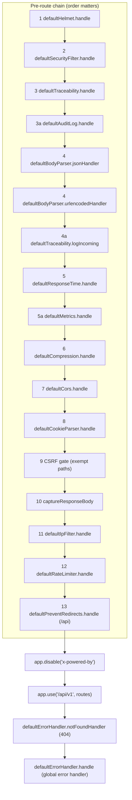

# The Express Middleware Chain & Request Lifecycle — Technical Documentation

> **Scope:** the ordered stack of Express middleware every HTTP request passes through in the CATHERINE template — what each numbered step does, why it sits where it sits, and what it adds to the request or the response — from the first security header to the global error handler.
> **Source:** `Backend/` (Node.js + Express v5 API). The authoritative file is `Backend/src/app.js`; the step implementations live under `Backend/src/middleware/` (`security/`, `traceability/`, `performance/`, `metrics/`, `parsing/`, `cache/`, `errorHandling/`, plus `authentication/` which mounts per-route, not in this chain).
> **Generated:** 2026-09-04. **Authority:** the code. Where `Backend/CLAUDE.md` disagrees with `app.js`, the code wins and the disagreement is recorded in [§8.1](#81-known-documentation-drift).
> **Rendering:** the ```mermaid fences below render in GitHub, GitLab, Obsidian and VS Code preview. A plain Markdown→PDF path (Chrome "print to PDF") prints them as code — pre-render with `npx @mermaid-js/mermaid-cli` if you need a PDF.

---

## 1. Overview

`Backend/src/app.js` builds one Express `app` and mounts a fixed, order-sensitive stack of middleware onto it before any route is reached. The file itself carries the ordering rule in a banner comment: **`MIDDLEWARE STACK (order matters — do not reorder)`**. Each `app.use` call is numbered in the source. Read from the file, the chain is **thirteen numbered steps** — `1` through `13` — plus **three sub-steps** — `3a`, `4a` and `5a` — for a total of **sixteen** `app.use` registrations in the pre-route chain, followed by the route mount and the two trailing error handlers.

A sub-step exists wherever a later addition had to land *inside* an existing step's ordering constraint rather than simply after it. Step `3a` (audit-log persistence) must run inside the traceability context opened at step `3`. Step `4a` (the incoming-request log line) must run *after* the body parsers of step `4` so the parsed body is available to log. Step `5a` (metrics collection) must run after the response-time middleware of step `5` so both measure from the same request-start origin.

Every request enters at step `1` and, if it survives the security gates, is handed to the router at `app.use("/api/v1", routes)`. Anything the router does not match falls to the 404 catch-all; anything that throws or rejects funnels to the single global error handler. Those two trailing handlers are mounted **last** on purpose — an Express error handler only catches what is registered before it.

The chain accumulates state on the request and headers on the response as it goes: a Snowflake request id and its `AsyncLocalStorage` context (step `3`), a parsed `req.body` (step `4`), an `X-Response-Time` header (step `5`), a compressed body (step `6`), CORS headers (step `7`), a parsed `req.cookies` (step `8`), CSRF validation (step `9`), and rate-limit accounting (step `12`). By the time a controller runs, the request carries everything the observability and security layers need, and the response is already wrapped to be logged, timed, measured and (on error) captured.

---

## 2. Flow & Architecture

### 2.1 One request through the numbered chain

```mermaid
sequenceDiagram
    autonumber
    participant C as Client
    participant H1 as "1 Helmet (headers)"
    participant S2 as "2 SecurityFilter"
    participant T3 as "3 Traceability.handle (req.id + ALS)"
    participant A3 as "3a AuditLog.handle (wrap res.end)"
    participant B4 as "4 BodyParser (json + urlencoded)"
    participant L4 as "4a Traceability.logIncoming"
    participant R5 as "5 ResponseTime (X-Response-Time)"
    participant M5 as "5a Metrics"
    participant Z6 as "6 Compression"
    participant O7 as "7 CORS"
    participant K8 as "8 CookieParser"
    participant X9 as "9 CSRF gate"
    participant P10 as "10 captureResponseBody"
    participant I11 as "11 IpFilter"
    participant RL as "12 RateLimiter"
    participant PR as "13 PreventRedirects (/api)"
    participant RT as "Router /api/v1"
    participant EH as "404 + global error handler"

    C->>H1: HTTP request
    H1->>S2: security headers set
    S2->>T3: not a scanner/traversal
    T3->>T3: req.id = snowflake.nextId(); res X-Request-ID; wrap res.json
    T3->>A3: next() inside requestContext.run()
    A3->>A3: wrap res.end (audit fires later)
    A3->>B4: next()
    B4->>L4: req.body parsed
    L4->>L4: log "[Incoming Request]" with parsed body
    L4->>R5: next()
    R5->>M5: response timer started
    M5->>Z6: per-route ring buffer armed
    Z6->>O7: response compression negotiated
    O7->>K8: CORS headers applied
    K8->>X9: req.cookies parsed
    X9->>P10: CSRF ok (or exempt path)
    P10->>I11: res.send/json wrapped for body capture
    I11->>RL: IP allowed (or filter disabled)
    RL->>PR: within rate limit
    PR->>RT: /api redirect guard armed
    RT-->>C: controller → response
    Note over T3,A3: on response: logCompletedRequest, then res.end → setImmediate audit insert
    RT->>EH: unmatched route or thrown error
    EH-->>C: 404 or sanitised error envelope
```

### 2.2 The stack as mounted (verbatim ordering)



There is one registration that precedes step `1` and is not itself a chain step: the **trust-proxy hint** (`app.set("trust proxy", …)`), guarded by the `TRUST_PROXY` env var. It is not middleware; it changes how Express derives `req.ip` from `X-Forwarded-For` so that every downstream step which reasons about the client address — rate limiting, IP filtering, security-filter blocking, audit logging — sees the real client rather than the proxy. It is documented here because it is a precondition for the correctness of steps `2`, `11` and `12`. In `app.js` its comment tags it **H1** ("trust proxy (H1)").

---

## 3. The numbered steps, in order

Each heading is the step number and name exactly as `app.js` comments it. The wiring line is copied from the file so the mount form (`.bind`, factory wrapper, path scope) is visible.

### 3.1 Step 1 — Security headers — `defaultHelmet.handle`

```js
app.use(defaultHelmet.handle.bind(defaultHelmet));
```

`HelmetMiddleware` sets the HTTP security response headers (the Helmet suite — CSP, `X-Content-Type-Options`, `Referrer-Policy`, HSTS and friends). It is first so that **every** response — including a `400` raised later by the body parser or a `403` from the security filter — still carries the hardening headers. A header layer mounted lower would leave early rejections un-hardened.

**Adds to the response:** security headers.

### 3.2 Step 2 — Security filter — `defaultSecurityFilter.handle`

```js
app.use(defaultSecurityFilter.handle.bind(defaultSecurityFilter));
```

`SecurityFilterMiddleware` blocks scanners, path-traversal and known malicious request shapes **EARLY** (the file's own emphasis). It runs before the request is parsed, logged or timed so that obviously hostile traffic is rejected with the least work done on its behalf — a scanner probe never reaches the body parser, the router, or the rate-limit accounting.

**Adds to the request:** nothing on the pass path; on the block path it short-circuits with a rejection.

### 3.3 Step 3 — Request ID + request/response logging — `defaultTraceability.handle`

```js
app.use(defaultTraceability.handle.bind(defaultTraceability)); // lgtm[js/missing-rate-limiting] Rate limiting is enforced by RateLimiterMiddleware (step 12)
```

`TraceabilityMiddleware.handle` mints a **Snowflake** request id (`req.id = snowflake.nextId()` — time-sortable and deconstructable, from `src/utils/snowflake`), sets it as the `X-Request-ID` response header, and patches `res.json` so every JSON body carries `requestId`. It then calls `next()` from *inside* `requestContext.run({ requestId: req.id }, …)` — an `AsyncLocalStorage` context — so that every `logger.*` call anywhere downstream is auto-tagged with `[<request id>]` without a single call site passing it.

This step must run near the top of the stack, and specifically **above the body parsers**, because a malformed-JSON `400` is raised *by* the parser (step `4`); mount `handle` any lower and such a request would lose its request id, its ALS context and its audit row. The completed-request log line is emitted on the response, and the *incoming* line is deliberately split out to step `4a` (see below).

**Adds to the request:** `req.id`, the ALS request context. **Adds to the response:** `X-Request-ID` header, `requestId` field in JSON bodies. The inline CodeQL suppression notes that rate limiting for this handler is enforced by step `12`, not here.

### 3.4 Step 3a — Audit log DB persistence — `defaultAuditLog.handle`

```js
app.use(defaultAuditLog.handle);
```

`AuditLogMiddleware.handle` wraps `res.end` so that, after the response has been sent, it builds a structured audit record and schedules its persistence via `setImmediate` — fire-and-forget, so the client already has its bytes before any database work happens. It is registered as `3a` because it must run **inside** the traceability context opened at step `3`: the audit record's request id and correlation come from that ALS context. It is mounted as `defaultAuditLog.handle` (no `.bind`) because its handler does not depend on `this`.

**Adds to the request/response:** an `res.end` wrapper; no synchronous change to the client-visible response.

### 3.5 Step 4 — Body parsing — `defaultBodyParser.jsonHandler` + `urlencodedHandler`

```js
app.use(defaultBodyParser.jsonHandler);
app.use(defaultBodyParser.urlencodedHandler);
```

`BodyParserMiddleware` mounts the JSON and URL-encoded parsers as two consecutive `app.use` calls (both part of numbered step `4`). They must run **before the route handlers** so that `req.body` is populated by the time a controller reads it. They sit after traceability (step `3`) so that a parser error — the classic malformed-JSON `400` — is still raised inside the request-id context and is still audited.

**Adds to the request:** `req.body`.

### 3.6 Step 4a — Incoming-request log line — `defaultTraceability.logIncoming`

```js
app.use(defaultTraceability.logIncoming);
```

`TraceabilityMiddleware.logIncoming` emits the `[Incoming Request]` trace line. It is split from step `3`'s `handle` and mounted **after** the body parsers on purpose: emitted any earlier, the line would print `[BODY @ req.body is undefined]` on every POST while the matching `[Request Complete]` line showed the real body. Mounting it at `4a` lets the incoming trace carry the parsed `[BODY @ …]`. `logIncoming` re-enters the ALS context if it is not already inside it, so the line is still tagged with the request id.

**Adds:** one log line per request (no request/response mutation).

### 3.7 Step 5 — Response-time tracking — `defaultResponseTime.handle`

```js
app.use(defaultResponseTime.handle.bind(defaultResponseTime));
```

`ResponseTimeMiddleware` records the request-start origin and, on completion, sets the `X-Response-Time` response header and records per-route timing metrics.

**Adds to the response:** `X-Response-Time` header. **Adds internally:** per-route timing.

### 3.8 Step 5a — Metrics collection — `defaultMetrics.handle`

```js
app.use(defaultMetrics.handle.bind(defaultMetrics));
```

`MetricsMiddleware` (from `src/middleware/metrics`) must run **after** `ResponseTimeMiddleware` so both measure from the same request-start origin. It maintains its own per-route ring buffers for `p50`/`p95`/`p99` percentile calculation — something `ResponseTimeMiddleware` does not provide. That dependence on the shared start origin is exactly why it is a sub-step of `5` rather than a step of its own.

**Adds internally:** per-route percentile ring buffers.

### 3.9 Step 6 — Compression — `defaultCompression.handle`

```js
app.use(defaultCompression.handle.bind(defaultCompression));
```

`CompressionMiddleware` negotiates gzip compression of the response body. It sits after the timing/metrics steps so those measure the handler, and before CORS and the router so the eventual response body is compressed.

**Adds to the response:** compression (and the corresponding `Content-Encoding` negotiation).

### 3.10 Step 7 — CORS — `defaultCors.handle`

```js
app.use(defaultCors.handle.bind(defaultCors));
```

`CorsMiddleware` applies the network-aware CORS policy — the allow-list of origins the browser is permitted to read the response from. Its allowed set is driven by env (`CORS_ORIGINS`, and in production it honours only that explicit list plus loopback; broad patterns require an explicit opt-in).

**Adds to the response:** CORS headers.

### 3.11 Step 8 — Cookie parsing — `defaultCookieParser.handle`

```js
app.use(defaultCookieParser.handle.bind(defaultCookieParser)); // lgtm[js/missing-csrf-middleware] CSRF is enforced at step 9 below
```

`CookieParserMiddleware` parses the `Cookie` header into `req.cookies` (and signed cookies). It must run **before** CSRF (step `9`) because the CSRF secret is delivered as a cookie that step `9` needs to read. The inline suppression records that CSRF enforcement is step `9`, not here.

**Adds to the request:** `req.cookies`.

### 3.12 Step 9 — CSRF protection — inline gate over `defaultCsrf.handle`

```js
const CSRF_EXEMPT_PATHS = ["/api/v1/csrf", "/api/v1/metrics/frontend"];
app.use((req, res, next) => {
    if (CSRF_EXEMPT_PATHS.some((p) => req.path.startsWith(p))) return next();
    defaultCsrf.handle.bind(defaultCsrf)(req, res, next);
});
```

`CsrfMiddleware` (double-submit cookie via `csrf-csrf`) is wrapped in a small inline gate rather than mounted bare, because two path prefixes must be exempt:

- **`/api/v1/csrf`** — the token-issuing endpoints. Enforcing CSRF here would be a catch-22: a valid token would be required to *obtain* a token.
- **`/api/v1/metrics/frontend`** — an unauthenticated, pre-auth web-vitals telemetry sink delivered via `fetch` + `keepalive` on the page-unload path, which cannot attach the `x-csrf-token` header. CSRF protects authenticated session-riding mutations; this endpoint has no session to ride, and abuse is bounded by its dedicated 30 req/min rate limiter.

`doubleCsrf` only enforces on state-changing methods (POST/PUT/DELETE/PATCH); safe methods (`GET /csrf/token` and the like) pass through automatically. Step `9` must come **after** cookie parsing (step `8`) so the secret cookie is readable. `CLAUDE.md` flags this as a security step that must not be dropped when the list is summarised.

**Adds:** rejects invalid state-changing requests; no mutation on the pass path.

### 3.13 Step 10 — Capture response body for logging — `defaultErrorHandler.captureResponseBody`

```js
app.use(defaultErrorHandler.captureResponseBody.bind(defaultErrorHandler));
```

`ErrorHandlerMiddleware.captureResponseBody` wraps the response so its body can be captured for downstream logging (the completed-request trace and error diagnostics). It is on the error-handler class because the captured body is what the error path and completion logging read back.

**Adds:** a response-body capture wrapper.

### 3.14 Step 11 — IP filtering — `defaultIpFilter.handle`

```js
app.use(defaultIpFilter.handle.bind(defaultIpFilter));
```

`IpFilterMiddleware` is a CIDR-aware IP allow-list, enabled via the `ENABLE_IP_FILTER` env var (a no-op when disabled). It relies on the trust-proxy setting so that `req.ip` is the real client address. It sits before rate limiting so a disallowed IP is rejected before consuming a rate-limit slot.

**Adds:** blocks disallowed client addresses when enabled.

### 3.15 Step 12 — Rate limiting — `defaultRateLimiter.handle`

```js
// lgtm[js/missing-rate-limiting]
app.use(defaultRateLimiter.handle.bind(defaultRateLimiter));
```

`RateLimiterMiddleware` is a custom **Sliding Window Counter** backed by `NodeCache`, keyed per client IP by default. The file notes that CodeQL may not recognise it as a rate limiter (it is not an npm package with a known call signature), and carries the suppression accordingly — the protection is real. It runs after IP filtering and near the end of the chain so that only requests that have passed every earlier gate are counted against the limit.

**Adds:** per-IP request accounting; rejects requests over the limit.

### 3.16 Step 13 — Prevent redirects on API routes — `defaultPreventRedirects.handle`

```js
app.use("/api", defaultPreventRedirects.handle.bind(defaultPreventRedirects));
```

`PreventRedirectsMiddleware` is the only chain step mounted with a **path scope** — `/api` — because redirect prevention should apply to API routes, not to any non-API surface. It guards against redirects being issued on API responses.

**Adds:** redirect suppression under `/api`.

### 3.17 After the chain — `x-powered-by`, routes, and the two error handlers

```js
app.disable("x-powered-by");
app.use("/api/v1", routes);
app.use(defaultErrorHandler.notFoundHandler.bind(defaultErrorHandler));
app.use(defaultErrorHandler.handle.bind(defaultErrorHandler));
```

`app.disable("x-powered-by")` removes the framework-advertising header. The router is mounted at `/api/v1`. Finally the **404 catch-all** and the **global error handler** are mounted last — an Express error handler catches only what precedes it, so these must be the final two registrations. The global handler is the single funnel that turns `AppError`, database and driver errors, JWT errors, body-parser errors and anything unexpected into the sanitised response envelope (documented in `error-handling.md`).

---

## 4. Subsystem sources

Every step is a class instance exported from a file under `Backend/src/middleware/`. The `authentication/` subsystem (`AuthMiddleware`) is **not** in this global chain — it mounts per route via `AuthMiddleware.authenticate` and `AuthMiddleware.requireAccess(predicate)` — so it is listed here for completeness but does not have a chain number.

| Step | Class | File |
| ---- | ----- | ---- |
| 1 | `HelmetMiddleware` | `security/HelmetMiddleware.js` |
| 2 | `SecurityFilterMiddleware` | `security/SecurityFilterMiddleware.js` |
| 3 | `TraceabilityMiddleware.handle` | `traceability/TraceabilityMiddleware.js` |
| 3a | `AuditLogMiddleware.handle` | `traceability/AuditLogMiddleware.js` |
| 4 | `BodyParserMiddleware` (`jsonHandler`, `urlencodedHandler`) | `parsing/BodyParserMiddleware.js` |
| 4a | `TraceabilityMiddleware.logIncoming` | `traceability/TraceabilityMiddleware.js` |
| 5 | `ResponseTimeMiddleware` | `performance/ResponseTimeMiddleware.js` |
| 5a | `MetricsMiddleware` | `metrics/` (index) |
| 6 | `CompressionMiddleware` | `performance/CompressionMiddleware.js` |
| 7 | `CorsMiddleware` | `security/CorsMiddleware.js` |
| 8 | `CookieParserMiddleware` | `parsing/CookieParserMiddleware.js` |
| 9 | `CsrfMiddleware` (inline gate) | `security/CsrfMiddleware.js` |
| 10 | `ErrorHandlerMiddleware.captureResponseBody` | `errorHandling/ErrorHandlerMiddleware.js` |
| 11 | `IpFilterMiddleware` | `security/IpFilterMiddleware.js` |
| 12 | `RateLimiterMiddleware` | `security/RateLimiterMiddleware.js` |
| 13 | `PreventRedirectsMiddleware` | `security/PreventRedirectsMiddleware.js` |
| — (404) | `ErrorHandlerMiddleware.notFoundHandler` | `errorHandling/ErrorHandlerMiddleware.js` |
| — (error) | `ErrorHandlerMiddleware.handle` | `errorHandling/ErrorHandlerMiddleware.js` |
| per-route | `AuthMiddleware` (`authenticate`, `requireAccess`) | `authentication/AuthMiddleware.js` |

The `cache/` subsystem is also not a numbered chain step. `app.js` calls `registry.registerAll({ … })` to register the cache stores (`adminList`, `auditLog`, `authProfile`) and `ClusterCacheSync.initWorker(registry)` to wire cross-worker invalidation, both **before** the chain is mounted. Caching is then applied per route by the `CacheMiddleware` factory, not globally.

---

## 5. Why the order is load-bearing

The banner comment `order matters — do not reorder` is not decorative. The constraints that force this exact sequence:

- **Helmet first** so early rejections (steps `2`, `4`, `9`, `11`, `12`) still ship hardening headers.
- **Security filter before parsing** so hostile traffic never reaches the parser or router.
- **Traceability above the parsers** so a parser `400` keeps its request id, ALS context and audit row.
- **Body parsers before the incoming log line** so the trace carries the parsed body — the reason `logIncoming` is split out to `4a`.
- **Response-time before metrics** so both timings share one start origin (`5` before `5a`).
- **Cookie parser before CSRF** so the CSRF secret cookie is readable (`8` before `9`).
- **IP filter before rate limiter** so a blocked IP does not consume a rate-limit slot.
- **Error handlers last** so they catch everything mounted before them.

---

## 6. What each step adds to the request / response

| Step | Adds to `req` | Adds to `res` / headers |
| ---- | ------------- | ----------------------- |
| pre-1 (trust proxy) | correct `req.ip` from `X-Forwarded-For` | — |
| 1 | — | security headers (Helmet suite) |
| 2 | — | — (blocks on hostile shapes) |
| 3 | `req.id`, ALS request context | `X-Request-ID`; `requestId` in JSON bodies |
| 3a | wrapped `res.end` | — |
| 4 | `req.body` | — |
| 4a | — | — (emits the incoming log line) |
| 5 | request-start origin | `X-Response-Time` |
| 5a | — | — (percentile ring buffers) |
| 6 | — | compressed body / `Content-Encoding` |
| 7 | — | CORS headers |
| 8 | `req.cookies` | — |
| 9 | — | rejects invalid state-changing requests |
| 10 | wrapped response for body capture | — |
| 11 | — | blocks disallowed IPs (when enabled) |
| 12 | — | rate-limit accounting / rejection |
| 13 (`/api`) | — | suppresses redirects |

---

## 7. Security

The security posture of this template is largely *the chain itself* — six of the sixteen chain registrations are security controls, deliberately spread across the stack rather than bundled:

- **Perimeter (early):** Helmet headers (`1`), scanner/traversal blocking (`2`).
- **Identity of the caller:** trust-proxy (pre-`1`) makes `req.ip` trustworthy, which is what the IP filter (`11`) and rate limiter (`12`) depend on for correctness.
- **Session-riding defence:** CSRF (`9`) sits after cookie parsing so it can read the double-submit secret, with two carefully justified exemptions rather than a blanket disable.
- **Abuse limiting:** the custom sliding-window rate limiter (`12`) is real protection that static analysis under-recognises — hence the explicit `lgtm`/CodeQL suppressions in the file, which are documentation of intent, not a bypass.
- **Information leakage:** `x-powered-by` is disabled; the global error handler sanitises every error into a stable envelope so raw SQL, driver codes and stacks stay in the log, not on the wire (see `error-handling.md`).
- **Forensics:** every request produces a Snowflake-correlated audit row (`3a`) and correlated log lines (`3`/`4a`), so any blocked or successful request can be reconstructed.

The two inline suppressions in `app.js` (`lgtm[js/missing-rate-limiting]` on steps `3` and `12`, `lgtm[js/missing-csrf-middleware]` on step `8`) each point at the real control's step number. They are safe because the control exists downstream — they are annotations that keep a scanner from flagging a false positive, not silencing of a real gap.

---

## 8. Appendix

### 8.1 Known documentation drift

Recorded per the authority rule: **the code wins**; each item is a place where `Backend/CLAUDE.md` (or a comment) does not match `app.js`/the middleware source as read on 2026-09-04.

- **Request-id generator: nanoid vs Snowflake.** `Backend/CLAUDE.md:954` describes the request-id middleware as *"Request ID middleware (nanoid, `X-Request-Id`)"*. The code uses **Snowflake**, not nanoid: `TraceabilityMiddleware.js:10` requires `{ snowflake }` from `../../utils/snowflake` and `TraceabilityMiddleware.js:125` calls `req.id = snowflake.nextId()`. The header name in code is `X-Request-ID` (`TraceabilityMiddleware.js:126`), spelled `X-Request-Id` in the CLAUDE.md line. **The code is authoritative: Snowflake, header `X-Request-ID`.**

- **Step 3 named "request/response logging" but the incoming line is at 4a.** `Backend/CLAUDE.md:636`–`659` (and `app.js`'s own step-3 comment) label step `3` "Request ID + request/response logging". In the code the *incoming* request line is not emitted at step `3`; it is emitted at step `4a` via `defaultTraceability.logIncoming` (`app.js` step `4a` comment; `TraceabilityMiddleware.logIncoming`). Step `3`'s `handle` mints the id, opens the ALS context and logs completion, but the incoming line is deliberately deferred so it can carry the parsed body. The CLAUDE.md sketch in `app.js`-quote form does list `4a` correctly at `CLAUDE.md:645`; the *count* there is stated as "17 `app.use` calls" — reading `app.js`, the pre-route chain is **16** `app.use` calls (steps `1`–`13` plus `3a`, `4a`, `5a`, where step `4` is two `app.use` calls). Counting the two trailing error handlers and the route mount separately, the discrepancy is in how the trailing handlers are included; **read `app.js` for the authoritative registrations rather than relying on any stated total.**

- **Pool names in the DB rules section.** `Backend/CLAUDE.md` (Database — OracleDB Adapter Rules, and `AuthMiddleware`/cache examples) references connections named `userAccount` and `unitInventory` and a "dual-pool pattern". The template's `src/config/database.js` registers exactly **one** connection, `appDb`; those names do not exist in the shipped template. This does not affect the middleware chain but is noted because the audit/cache steps reason about the single `appDb` pool. **The code is authoritative: one pool, `appDb`.**

### 8.2 Things noted but not asserted

- The precise internal behaviour of `HelmetMiddleware`, `CompressionMiddleware`, `CorsMiddleware`, `SecurityFilterMiddleware`, `ResponseTimeMiddleware` and `MetricsMiddleware` beyond their role and ordering was not read line-by-line for this document; the descriptions above are grounded in the `app.js` step comments and each class's stated purpose, and are intentionally kept to what those establish. Where a per-class detail matters for a change, read the class file directly.
