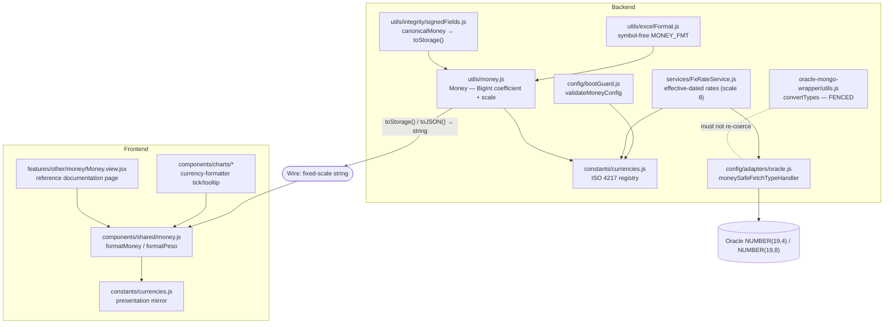
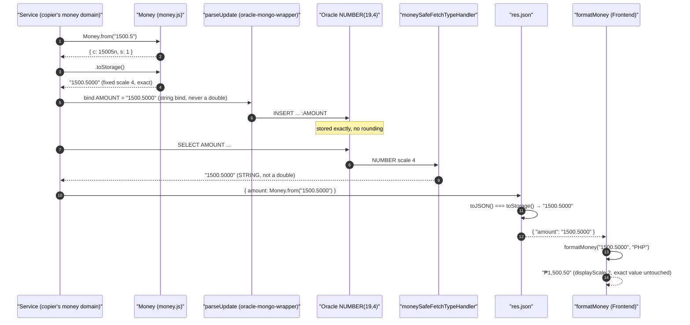
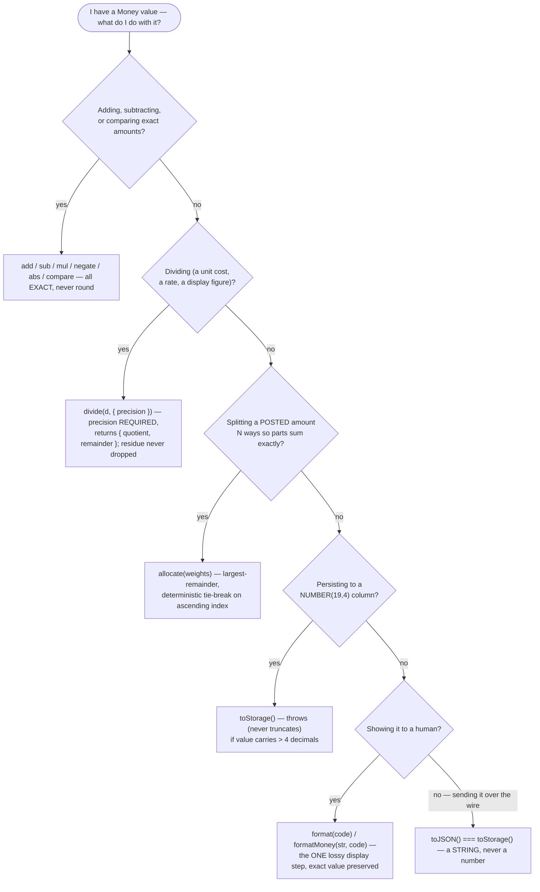
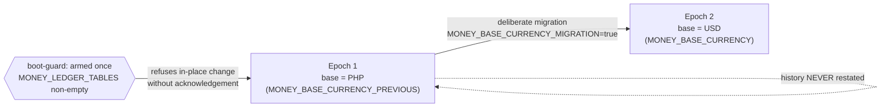

# Money & Currency — Technical Documentation

> **Scope:** the template's money *capability* — the exact-decimal `Money` value type, the ISO 4217 currency registry, the fixed storage/display scales, the config-driven base currency, the string wire format, the money-safe fetch fence, effective-dated FX rates, and money-aware presentation on both surfaces. This is a **capability, not a product**: there is no wallet, no ledger, no finance screen — only the parts a downstream project builds a money domain on top of.
> **Source:** `Backend/` (Node.js + Express v5 API) and `Frontend/` (React 19 + Vite SPA). Core is `Backend/src/utils/money.js`, `Backend/src/constants/currencies.js`, `Backend/src/services/FxRateService.js`, `Backend/src/config/adapters/oracle.js`; the presentation mirror is `Frontend/src/constants/currencies.js` and `Frontend/src/components/shared/money.js`.
> **Generated:** 2026-09-04. **Authority:** the code. Where `CLAUDE.md`, a JSDoc block, a source comment or a reference-view claim disagrees with the code, the code wins and the disagreement is recorded in [§7.5](#75-known-documentation-drift).
> **Rendering:** the ```mermaid fences below render in GitHub, GitLab, Obsidian and VS Code preview. A plain Markdown→PDF path prints them as code — pre-render with `npx @mermaid-js/mermaid-cli` if you need a PDF.

---

## 1. Overview

A JavaScript `Number` is an IEEE-754 double, and money is exactly the kind of value it gets wrong: `0.1 + 0.2 === 0.30000000000000004`, and an Oracle `NUMBER(19,4)` fetched as a double is *already rounded* before any application code sees it. This template does not paper over that with a `roundTo` helper on every operation — rounding on every step is still rounding, silently storing a value the caller never supplied. Instead it carries money as an **exact decimal value type**: `Money` (`Backend/src/utils/money.js`) is a `BigInt` coefficient `c` and an integer scale `s`, representing the exact rational `c / 10^s`. Nothing in that type ever rounds.

Four facts hold everywhere money exists in the template, and every rule below is a consequence of one of them:

1. **Storage scale is always 4.** A posted amount lives in `NUMBER(19,4)` — 15 integer digits, 4 decimals — for *every* currency, so two money columns are always summable and comparable without knowing a per-currency scale (`money.js:56` `STORAGE_SCALE = 4`). A rate is a different value type at `NUMBER(19,8)` (`FxRateService.js` `RATE_SCALE = 8`) and is never itself a posting.
2. **There is no currency column on a money row.** The base currency every stored amount is denominated in is a single **system fact** held in configuration (`MONEY_BASE_CURRENCY`), never a column, and a change to it is a new time-keyed epoch rather than a restatement of history (`bootGuard.js` `validateMoneyConfig`, IAS 21 prospective treatment).
3. **Money crosses the wire as a fixed-scale string, never a JSON number.** `Money.toStorage()` emits `"1500.0000"`, and `Money.toJSON()` returns exactly that string (`money.js`). Serialising money as a JSON number would re-round it through a double at the transport layer no matter how exact the arithmetic was.
4. **`displayScale` is presentation only.** Each registry entry carries a `displayScale` (0 for JPY/KRW, 2 for most, 3 for KWD/BHD/OMR) that decides how many places a formatter *shows* — it never governs storage and never rounds the stored value (`constants/currencies.js`). A currency that displays fewer places than are stored is formatted, not rounded; the exact value is still there behind the presentation.

The read path is protected by a fence in the driver adapter. node-oracledb returns a `NUMBER` as a double by default, so `moneySafeFetchTypeHandler` (`config/adapters/oracle.js`) asks the driver to hand back any `NUMBER` with `scale > 0` as a **string** — money and rate columns become exact strings, while scale-0 IDs and counts keep their ergonomic numeric type. The legacy `convertTypes`/`rowToDoc` helpers in the oracle-mongo-wrapper are deliberately **fenced** so they never coerce a decimal string back into a double and undo that protection (`oracle-mongo-wrapper/utils.js`).

The whole capability is **inert until a copier configures it.** With `MONEY_BASE_CURRENCY` unset the boot-guard is a no-op, no money tables are assumed, and `FxRateService` throws a clear `503` rather than querying a table that does not exist. CATHERINE declares no scaled `NUMBER` column in its shipped schema, so the fetch fence is dormant until a copier creates the first money column — at which point it activates automatically.

---

## 2. Flow & Architecture

### 2.1 The layer map



The two `currencies.js` files are a **deliberate mirror**. The frontend never persists money and never talks to Oracle, so it only needs the presentation facts — codes, display scales, symbols, locales. A currency added on the backend must be added to the frontend copy too, or `formatMoney` throws on a code the API can legitimately return (`Frontend/src/constants/currencies.js` header).

### 2.2 A posted amount, write to read to screen



Two boundaries in this diagram are load-bearing. The bind side never lets a double touch the value: `toStorage()` produces a canonical string and that string is what is bound. The fetch side never lets Oracle hand back a double: `moneySafeFetchTypeHandler` selects on `scale > 0` derived from the schema, so it protects money and rate columns without a hardcoded column list, and leaves integer keys alone. The one place a `Number` is allowed is the *display* boundary in `formatMoney` — after which nothing is stored or posted from it.

### 2.3 Choosing the right operation



The two operations that *cannot* be exact are made explicit rather than hidden. `divide` has no default precision — the working precision must be stated at the call site — and it returns the remainder so it is never silently dropped; a `divide` result is derived (a unit cost, a rate, a display figure), so nothing is posted and nothing is owed. `allocate` is exact partition, not rounding: it distributes at storage scale 4 by largest remainder so the parts sum to the original exactly, with a deterministic tie-break on the ascending index of a stable business key the caller supplies, so re-running an allocation is byte-identical.

---

## 3. The `Money` value type — `Backend/src/utils/money.js`

### 3.1 Representation and input discipline

`Money` is an immutable, frozen object of a `BigInt` coefficient `this.c` and an integer scale `this.s`. Construction goes through `Money.from(value)` or `Money.zero()`; the constructor is private by convention.

| `Money.from` input | Result | Rationale |
| --- | --- | --- |
| a **string** `"-123.4500"` | parsed exactly to `{ c, s }` | The canonical form — how a fetched `NUMBER`-as-string arrives. |
| a **`BigInt`** | whole units at scale 0 | An exact integer amount. |
| a **JS `number`** | **throws** `MoneyError` (500) | By the time money is a double it is already rounded; accepting one would launder that loss. |
| `NaN` / `Infinity` / non-decimal string | **throws** `ValidationError` (400) | Fail loud rather than store a value nobody supplied. |

`Money.from` does *not* itself cap decimals — a rate may legitimately carry more than four (`RATE_SCALE = 8`). The scale-4 ceiling is enforced only at `toStorage()`.

### 3.2 Exact arithmetic

`add`, `sub`, `mul`, `negate`, `abs`, `compare`, `equals`, `isZero`, `isNegative` are all exact and never round. `add`/`sub` re-base both operands to the larger scale (an exact multiply by a power of ten) via the private `_align`. `mul` retains the full mathematics — a 4-decimal amount times an 8-decimal rate yields a 12-decimal product — which is a read-time value and is never written to a money column at that scale.

### 3.3 The two inexact operations, made explicit

- **`divide(divisor, { precision })`** — `precision` is **required** (a non-negative integer, no default). BigInt division truncates toward zero at exactly `precision` places; the remainder is returned so that `this === quotient.mul(divisor).add(remainder)` holds exactly. Division by zero throws `ValidationError` (400).
- **`allocate(weights)`** — splits a posted amount into parts proportional to whole-unit `weights`, at storage scale 4 (smallest indivisible unit `0.0001`), by largest remainder so the parts sum to the original exactly. Fractional weights are **refused, never truncated** (`Math.trunc(0.5) === 0` would silently zero a weight); express a ratio in whole units (`50, 25, 25`, not `0.5, 0.25, 0.25`). Tie-break is deterministic on ascending index, and works for negative totals too (it places `±0.0001` per step until the leftover is exhausted).
- **`Money.assertBalanced(parts, total, label)`** — throws `MoneyError` (500) unless `parts` sum to `total` exactly. With no step-rounding this is a real guarantee, not a rounding-order convention.

### 3.4 Serialisation

| Method | Output | Notes |
| --- | --- | --- |
| `toStorage()` | fixed-scale-4 string, e.g. `"1500.0000"`, `"-0.5000"` | **Throws** `ValidationError` (400) rather than truncate if the value carries more than four non-zero decimals, or exceeds the 15-digit integer capacity of `NUMBER(19,4)`. Never call it on a rate. |
| `toJSON()` | `=== toStorage()` | Money JSON-serialises as the scale-4 **string**, never a number (fact 3). |
| `toString()` | `=== toStorage()` | Debug/diagnostic only. |
| `format(code, [locale])` | localised currency string, e.g. `"₱1,500.00"` | The one lossy display step. Resolves scale and locale from the registry via `getCurrency`; formats via `Intl.NumberFormat`. The exact value is unchanged behind it. |

`format` coerces to a `Number` at the display boundary only (`_toBoundedNumberForDisplay`), which is acceptable because `Intl.NumberFormat` formats to `displayScale` regardless and nothing is stored from it.

---

## 4. The currency registry — `Backend/src/constants/currencies.js`

The registry is the single source of truth for every currency the money layer can present. Each `CurrencyEntry` carries `code`, `displayScale`, `symbol`, `locale`, `name` — and **only `code` is ever persisted.**

- **Codes, never symbols.** A symbol such as `₱` has no code point in single-byte Oracle character sets (WE8ISO8859P15) and would corrupt silently if stored; `PHP` is pure ASCII and safe on any charset. Symbols are resolved from the registry at render/export time.
- **`displayScale ≠ storage scale.** Storage is fixed at 4 for every currency; `displayScale` (0–3) only decides how many places a formatter shows.

| API | Returns | On unknown code |
| --- | --- | --- |
| `CURRENCIES` | frozen `Record<string, CurrencyEntry>` | — |
| `CURRENCY_CODES` | frozen array of codes | — |
| `isValidCurrency(code)` | boolean (case-sensitive) | `false` |
| `getCurrency(code)` | the entry | **throws** — fail loud rather than guess a scale |
| `getDisplayScale(code)` | the display scale | throws via `getCurrency` |

The 16 shipped currencies span the three display-scale families: two-decimal (PHP, USD, EUR, GBP, AUD, CAD, CHF, CNY, HKD, SGD, INR), zero-decimal (JPY, KRW), and three-decimal (KWD, BHD, OMR).

---

## 5. FX rates — `Backend/src/services/FxRateService.js`

The template ships the **rate table shape, this service, and a documented adapter interface — and nothing more.** There is no provider integration: manual admin entry is the only shipped path, because a rate used for reporting conversion must be auditable (who set it, when, from what source, over what window), and a silent API pull satisfies that only if it records the same facts.

- **Scale 8.** A rate lives in `NUMBER(19,8)` (`RATE_SCALE = 8`) — more precision than a posted amount, and never itself a posting. It is read back as a string via the fetch fence, never a double.
- **The non-base side only.** A rate row carries `CURRENCY_CODE` (the non-base currency); the base side is the system fact `MONEY_BASE_CURRENCY`, never a column.
- **Append-only, effective-dated.** `rateAsOf(currencyCode, asOf)` resolves the newest effective window that still covers `asOf` — so a historical figure converts with the rate effective on *its own* date, and inserting a newer rate never changes a past report (rule 4, IAS 21). A correction closes the current window (`EFFECTIVE_TO`) and opens a new one; `recordRate` never updates a row in place.
- **Inert by default.** The table is named by `MONEY_FX_TABLE`. Unset and not in demo mode, `rateAsOf`/`recordRate` throw `ConfigurationError` (503). Under `DEMO_MODE=true` the service resolves against an in-memory fixture (`models/demo/demoStore.js`), so the whole conversion path is exercisable with zero schema.
- **`recordRate` guards input:** an unknown currency throws `ValidationError` (400); a rate that is not a fixed-scale numeric *string* throws `ValidationError` (400) — never a JS number.

A copier who wants a provider implements an adapter shaped `async fetchRate(currencyCode, asOf): Promise<{ rate: string, source: string, retrievedAt: Date }>`, schedules it (node-cron is already a dependency), and calls `FxRateService.recordRate(...)` with the result so the row lands append-only with its audit fields. The service never calls an adapter itself.

---

## 6. Money at the boundaries

### 6.1 The fetch fence — `config/adapters/oracle.js`

`moneySafeFetchTypeHandler(metaData)` returns `{ type: oracledb.STRING }` for any column where `metaData.dbType === DB_TYPE_NUMBER && metaData.scale > 0`, and `undefined` (default handling) otherwise. Selection is on **scale derived from the schema**, not a column allow-list, so:

- money → `NUMBER(19,4)` → scale 4 → returned as string ✓
- rate → `NUMBER(19,8)` → scale 8 → returned as string ✓
- IDs, counts, `STATUS_CODE` → `NUMBER` scale 0 → left as JS numbers ✓

It is placed on the frozen `EXECUTE_OPTIONS` object in the adapter. See [§7.5](#75-known-documentation-drift) for how this handler is actually reached on the live read path.

### 6.2 The fence in the wrapper — `oracle-mongo-wrapper/utils.js`

`convertTypes` (aliased `rowToDoc`) coerces numeric-looking strings back to numbers so `{ age: "25" }` becomes `{ age: 25 }`. It is **fenced**: any string containing a decimal point, exponent, or sign+fraction is left as a string, and only pure-integer strings that are safe integers are converted. `Number("50000.50")` is a double, which would silently re-round a value the fetch fence handed back as an exact string — the fence stops that. The helper is exported for API compatibility but called nowhere on the live read path.

### 6.3 Row signing — `utils/integrity/signedFields.js`

An HMAC only verifies when signer and verifier build a byte-identical field object, and JS interpolation drops trailing zeros on a `Number` (`1500.00 → "1500"`). So `canonicalMoney(v)` runs every field *named* as a money field through `Money.from(String(v)).toStorage()` before signing, and `null`/`undefined`/`""` canonicalise to `"0.0000"` — a missing money field is an exact zero, not an absent one. (Row signing's full treatment lives in the logging/integrity documentation; this is only the money seam.)

### 6.4 Export — `utils/excelFormat.js`

One presentation layer for every ExcelJS workbook. `MONEY_FMT` (`"#,##0.00;[Red]-#,##0.00"`) is deliberately **symbol-free**, because currency is not hard-coded in this template; `makeMoneyFmt("$")` builds a symbol-prefixed format when a copier's money domain has a single known currency. The rule is: never write a raw `Date` or hand-roll a money format string per service.

### 6.5 Frontend presentation — `Frontend/src/components/shared/money.js`

`formatMoney(value, currencyCode, opts)` renders any registered ISO 4217 code at its own display scale via `Intl.NumberFormat`, accepting the fixed-scale string directly (the canonical wire form) and coercing to a `Number` only at the display boundary. `getCurrency` throws on an unknown code — a formatter must never guess a scale. Non-finite input (`NaN`, `Infinity`, `null`, a non-numeric string) falls back to `opts.nullText` (default a zero rendered in the target currency), so the screen never shows `$NaN` or `¥∞` — a missing figure and an unusable one read the same to a human. `formatPeso(value, nullText)` is the legacy single-currency helper kept for un-migrated callers; prefer `formatMoney(value, "PHP")`.

Chart components (`AreaChart`, `BarChart`, `DonutChart`, `LineChart`) take a currency formatter so a money axis and its tooltip render `₱226.32` rather than `226.3155`.

---

## 7. Configuration & drift

### 7.1 Environment variables this capability depends on

All are **optional** — with `MONEY_BASE_CURRENCY` unset the money boot-guard is a no-op and no money tables are assumed (`Backend/.env.example` "Money" section; `bootGuard.js` `validateMoneyConfig`).

| Variable | Required | Default | Effect |
| --- | --- | --- | --- |
| `MONEY_BASE_CURRENCY` | no | — (unset ⇒ guard disabled) | The one functional/base currency every stored amount is denominated in. Must be a registered ISO 4217 code, or the boot-guard fails **fatally in every environment** when armed. |
| `MONEY_STORAGE_SCALE` | no | `4` (documented, not tunable) | Fixed at 4 by design; changing it is unsupported (the DDL, the fetch fence, and `toStorage` all assume scale 4). Kept commented as a reminder. |
| `MONEY_FX_TABLE` | no | — (unset ⇒ FX inert, 503) | Name of the append-only FX-rate table `FxRateService` reads. |
| `MONEY_LEDGER_TABLES` | no | — | Comma-separated real ledger tables. Declaring at least one **arms** the base-currency change guard. |
| `MONEY_BASE_CURRENCY_PREVIOUS` | no | — | The base previously in effect; set it when deliberately opening a new epoch so the guard can detect the change. |
| `MONEY_BASE_CURRENCY_MIGRATION` | no | `false` | Set `true` to acknowledge a deliberate base-currency migration past the guard. |

The change guard (`validateMoneyConfig`): once ledger tables exist, an in-place change (`MONEY_BASE_CURRENCY_PREVIOUS != MONEY_BASE_CURRENCY`) is **refused** unless `MONEY_BASE_CURRENCY_MIGRATION=true`, because a functional-currency change must be a new prospective epoch (IAS 21), not an edit that restates history.

### 7.2 The base-currency epoch, conceptually



### 7.3 What crosses the wire

Every money value on the API is a fixed-scale-4 **string** (`toJSON() === toStorage()`), and every rate a fixed-scale-8 string. There is no currency field on a money value in transit — the base is a system fact, and any non-base amount was converted at the read boundary via `FxRateService` using the rate effective on the row's own date.

### 7.4 What is *not* shipped (deliberately)

No wallet, no ledger table, no finance UI group, no FX provider integration, no scheduled rate pull, no scaled `NUMBER` column in the template schema. `Backend/sql/README.md` carries commented reference DDL (an FX-rate table, a base-currency epoch table, a single-entry ledger) for a copier to adopt when they build a money domain — not before.

### 7.5 Known documentation drift

The code is the authority. These are places where prose, a comment, or a claim disagrees with it.

| # | Location | Says | Code actually does |
| --- | --- | --- | --- |
| 1 | Documentation brief / general "money facts" | Registry `displayScale` for each currency **equals** `Intl.NumberFormat().resolvedOptions().maximumFractionDigits` | `Backend/src/constants/currencies.js:60-79` and `Frontend/src/constants/currencies.js:38-56` set `displayScale` as **hardcoded literals** on each entry. Nothing computes it from `Intl.NumberFormat(...).resolvedOptions()`; the file does not even reference `resolvedOptions`/`maximumFractionDigits` (only a passing mention of `Intl.NumberFormat` in the header comment at `:26`). The literals *happen to match* ISO 4217 minor units, but the equality is a maintenance convention, not something the code derives or enforces. |
| 2 | `Backend/src/config/adapters/oracle.js:198-238` (comment), `Backend/src/services/FxRateService.js:35`, `Frontend/src/features/other/money/Money.view.jsx:169` | The adapter's `moneySafeFetchTypeHandler` protects "the read side too" as if it were active on the wrapper's read path | The handler is defined and placed on the frozen `EXECUTE_OPTIONS`, but the oracle-mongo-wrapper read path passes its own options and `oracledb.fetchTypeHandler` is never set globally — so on today's schema the handler is **not actually reached** by wrapper reads. It is inert by design (CATHERINE has no scaled `NUMBER` column), but "the read side is exact too" overstates the *current* wiring. Cross-referenced in [`oracle-mongo-wrapper.md`](./oracle-mongo-wrapper.md) §6.9 and its drift row 6. **Escalation:** whether to wire `EXECUTE_OPTIONS` into the wrapper (or set the handler globally) is a backend/Oracle-adapter decision — flagged, not fixed here. |
| 3 | `Backend/src/utils/oracle-mongo-wrapper/utils.js:78-84` | `convertTypes`/`rowToDoc` are "exported for API compatibility but called nowhere" and marked lava-flow for deletion | Accurate as documentation of dead code, but recorded here because the fence's protection is only *latent*: if a copier does adopt the helper on the read path, the decimal-point fence is what keeps money safe. Not a contradiction — a standing caveat. |
| 4 | `Backend/.env.example:448` | Lists both `MONEY_ALLOW_BASE_CHANGE` and `MONEY_BASE_CURRENCY_MIGRATION` as the migration acknowledgement | `bootGuard.js:117` reads **only** `MONEY_BASE_CURRENCY_MIGRATION`. `MONEY_ALLOW_BASE_CHANGE` is named in the `.env.example` prose but is **not read anywhere in the code** — setting it has no effect. |

---

## 8. Security

### 8.1 What is done well

| Control | Implementation | Class addressed |
| --- | --- | --- |
| Currency codes are ASCII-only, symbols never persisted | `constants/currencies.js` persists `code` only; symbols are presentation | CWE-20 (charset corruption), data-integrity |
| Reject-don't-round at every input | `Money.from` rejects a JS number/NaN/Infinity; `toStorage` throws on >4 decimals; `allocate` refuses fractional weights | CWE-682 (incorrect calculation), silent value substitution |
| Rate input is a validated string | `recordRate` rejects a non-string / non-numeric rate and an unknown currency | CWE-20 |
| Base-currency change is gated | `validateMoneyConfig` refuses an in-place base change with ledgers present unless explicitly acknowledged | data-integrity / audit (IAS 21) |
| Fail-loud on unknown currency | `getCurrency` throws rather than guessing a display scale | CWE-670 |
| No `$NaN` / `¥∞` reaches the screen | `formatMoney`/`formatPeso` fall back to `nullText` on non-finite input | CWE-20 (output), UX-integrity |
| Money value type is immutable | `Money` instances are `Object.freeze`d | tamper-resistance |

### 8.2 Residual risks and things to know before shipping

1. **The fetch fence is dormant until wired.** On the current schema no wrapper read passes through `moneySafeFetchTypeHandler` (drift row 2). The moment a copier adds a `NUMBER(19,4)` money column they must confirm the handler actually runs on that read path — either by wiring `EXECUTE_OPTIONS` into the wrapper or setting `oracledb.fetchTypeHandler` globally — or an exact string will silently arrive as a rounded double. This is the single highest-value verification a money copier must do. **Owner: backend/Oracle-adapter.**
2. **`displayScale` is a hand-maintained mirror.** Two registries (backend + frontend) carry the same literals; they drift independently. A currency added on one side but not the other makes `formatMoney` throw on a code the API returns (frontend header states this). Keep them in lock-step.
3. **Rate rows are only as auditable as the copier's write path.** `recordRate` records `SET_BY`, `SOURCE`, `RETRIEVED_AT` — but nothing forces a copier's provider adapter to populate them honestly. A silent overwrite (an `UPDATE` instead of the append-only close-and-open) would rewrite history; the append-only rule is a discipline the code encourages, not one it can enforce on a raw table.
4. **`format`/`formatMoney` use `Number()` at the display boundary.** This is deliberate and safe (nothing is stored from it), but a copier must never feed that display `Number` back into arithmetic or storage.

---

## 9. Verification Q&A

Evidence is cited, not executed — every entry is marked **not run** unless stated otherwise. Backend suites are Vitest (`npm test` → `vitest run`).

> **Q:** Does exact addition avoid the classic double error?
> **A:** Yes. `Money.from("0.1").add(Money.from("0.2")).toStorage() === "0.3000"` exactly (BigInt coefficients, no double). **Evidence:** `Backend/src/utils/money.js` `add`/`_align`; asserted in the reference view example (`Money.view.jsx:110`). _Status: not run._

> **Q:** Can a JavaScript number ever become a stored money value?
> **A:** No. `Money.from` throws `MoneyError` on a `number`; `toStorage` binds a string; the fetch fence reads back a string. **Evidence:** `money.js:124-131` (reject number), `:test` for the `/^[+-]?\d+(\.\d+)?$/` guard. _Status: not run._

> **Q:** Does storing a >4-decimal value truncate silently?
> **A:** No — `toStorage()` throws `ValidationError` (400) unless the extra digits are exactly zero. **Evidence:** `money.js` `toStorage` factor check. _Status: not run._

> **Q:** Do allocated parts always sum to the original?
> **A:** Yes — largest-remainder distribution at scale 4, verifiable with `Money.assertBalanced`. **Evidence:** `money.js` `allocate` + `assertBalanced`. _Status: not run._

> **Q:** Is money exact on the read side today?
> **A:** The **type** is exact once it holds a string; whether the string arrives depends on the fetch fence being on the read path, which on the shipped schema it is **not** (drift row 2). **Evidence:** `oracle.js` `EXECUTE_OPTIONS` vs the wrapper's own options; [`oracle-mongo-wrapper.md`](./oracle-mongo-wrapper.md) §6.9. _Status: not run._

> **Q:** Does a base-currency change with ledgers present start clean?
> **A:** It is **refused** unless acknowledged. **Evidence:** `bootGuard.js:110-125` `validateMoneyConfig`. _Status: not run._
