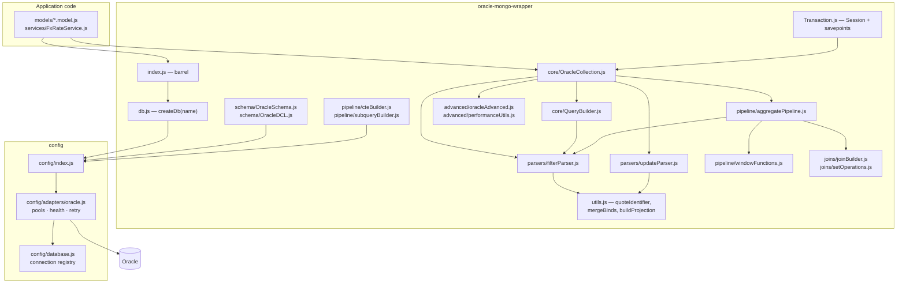
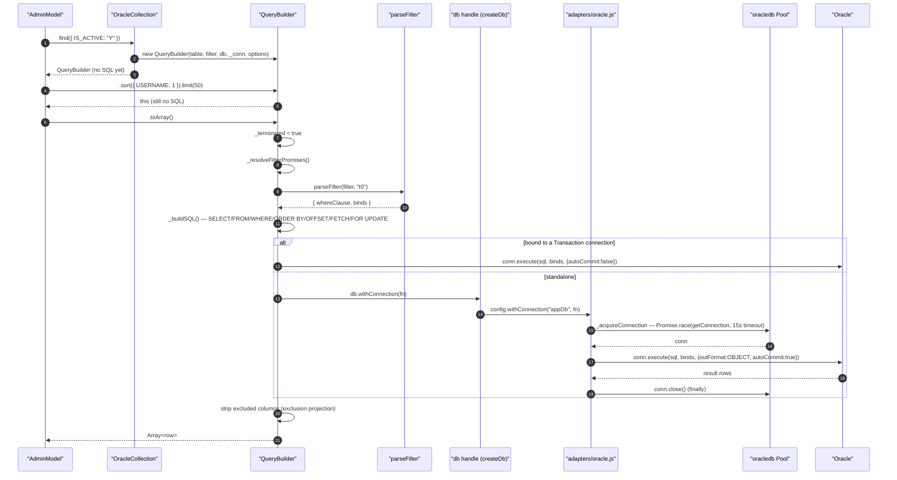
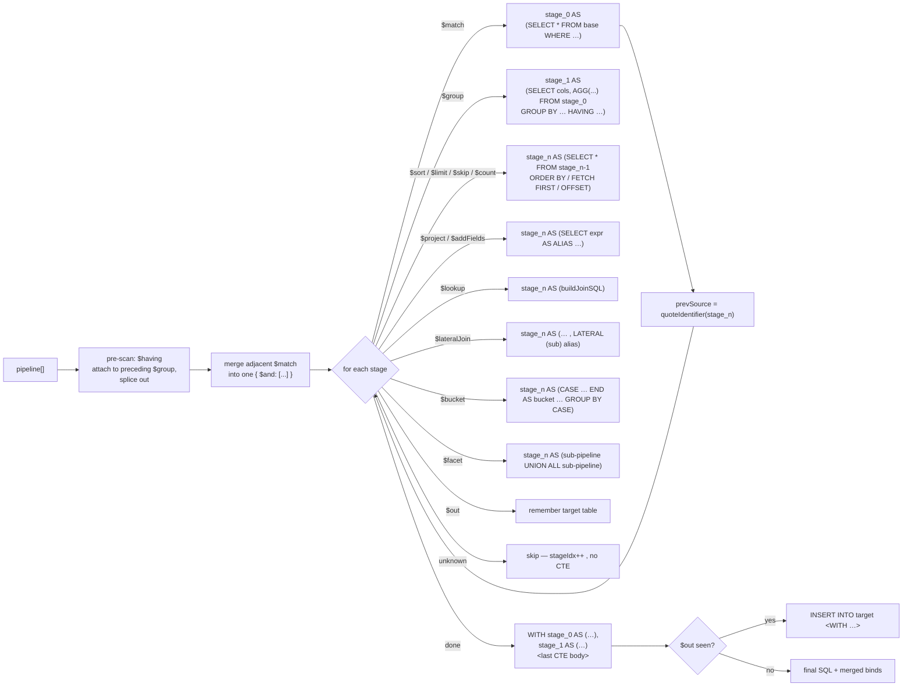
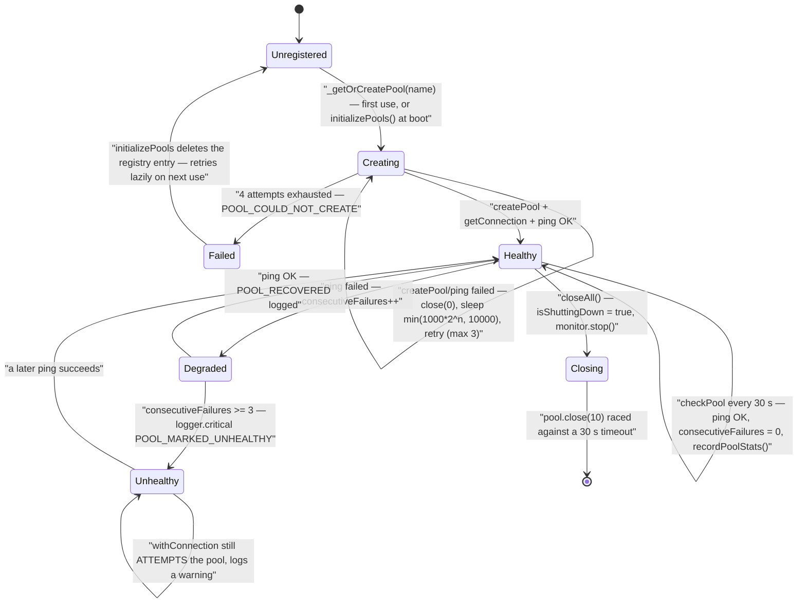
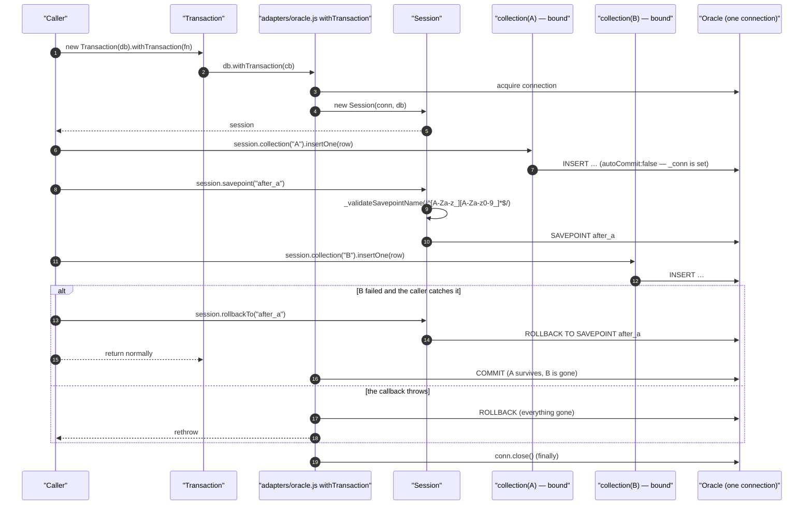

# The Oracle MongoDB-Style Wrapper — Technical Documentation

> **Scope:** `oracle-mongo-wrapper` — the MongoDB-shaped query layer the template puts over Oracle SQL — plus the pool adapter it runs on.
> **Source:** `Backend/src/utils/oracle-mongo-wrapper/` and `Backend/src/config/adapters/oracle.js`. Backend-only; there is no frontend half (see [§3](#3-frontend-implementation)).
> **Generated:** 2026-09-04. **Authority:** the code. Where `CLAUDE.md`, the library's own `README.md` or a JSDoc block disagrees with the code, the code wins and the disagreement is recorded in [§6.12](#612-known-documentation-drift).
> **Rendering:** the ```mermaid fences below render in GitHub, GitLab, Obsidian and VS Code preview. A plain Markdown→PDF path prints them as code — pre-render with `npx @mermaid-js/mermaid-cli` if you need a PDF.

---

## 1. Overview

Nobody writes SQL in this template. Models call `users.findOne({ USERNAME: name })` and `admins.updateOne({ ID: id }, { $set: { … } })`, and the wrapper translates those MongoDB-shaped objects into Oracle statements where **every caller-supplied value travels as a bind variable** and every identifier is double-quoted. That is the whole point of the layer: it is a parameterisation gate, not a convenience. A model physically cannot concatenate a value into a `WHERE` clause because there is no API that accepts one.

The library is eighteen JavaScript files plus its own `README.md`, in four groups. `db.js` produces a `db` handle bound to one named pool. `core/` holds `OracleCollection` (the MongoDB `Collection` surface) and `QueryBuilder` (a lazy cursor — `.find()` builds nothing until a terminal method runs). `parsers/` turns filters into `WHERE` clauses and update operators into `SET` clauses. `pipeline/`, `joins/`, `advanced/` and `schema/` cover aggregation, joins, window functions, hierarchical queries, DDL and DCL. `Transaction.js` wraps a single connection in a session with named savepoints.

Under all of it sits `Backend/src/config/adapters/oracle.js`: a lazy registry of named connection pools with exponential-backoff creation, a 30-second three-strike `PoolHealthMonitor`, a bounded acquire retry with an orphan-connection guard, and Thick-mode client initialisation. It also defines `moneySafeFetchTypeHandler`, which asks the driver to return any `NUMBER` with `scale > 0` as a **string** so an exact decimal never round-trips through an IEEE-754 double — a fence that is defined and unit-tested but, as shipped, is not actually attached to the wrapper's read path ([§6.9](#69-the-money-safe-fetch-fence-is-defined-but-not-wired-into-the-wrapper)).

The template uses a fraction of this. Five models (`admin`, `user`, `audit.log`, `serverAlertLog`, `serverAlertAck`) and `FxRateService` construct collections against **one** pool named `appDb`; the aggregation pipeline, joins, window functions, PIVOT, `CONNECT BY` and the DCL surface ship unused, for a downstream project to reach for.

---

## 2. Flow & Architecture

### 2.1 The layer map



Read the arrows into `utils.js`: **both** parsers funnel every identifier through `quoteIdentifier` (`utils.js:41`), which escapes an embedded `"` by doubling it. That single function is the identifier half of the injection defence; bind variables are the value half.

### 2.2 A `find()` round trip — nothing happens until a terminal method



Two details carry weight. `autoCommit` is `!this._conn` everywhere in the library (`OracleCollection.js:201`, `QueryBuilder.js:388`): a standalone call commits itself, a session-bound call defers to the enclosing transaction. And the connection is released in `withConnection`'s `finally` (`oracle.js:676-686`) — a callback that throws still returns its connection to the pool.

### 2.3 `parseFilter` — one field expression, every branch

```mermaid
flowchart TD
    In(["_parseFieldExpr(field, expr, binds, alias, counter)"]) --> Q["qField = quoteIdentifier(field)"]
    Q --> Kind{"typeof expr"}

    Kind -- "null / undefined" --> Null['qField IS NULL']
    Kind -- "string starting $outer." --> Outer['qField = quoteIdentifier(outerCol)']
    Kind -- "scalar / Date" --> Eq["bind :where_&lt;field&gt;_n<br/>qField = :bind"]
    Kind -- "object" --> Loop{"for each operator key"}

    Loop -- "$eq $ne $gt $gte $lt $lte" --> Cmp["qField OP :bind<br/>(or OP correlated subquery)"]
    Loop -- "$in" --> InN{"length &gt; 1000?"}
    InN -- "no" --> In1["qField IN (:b0 … )"]
    InN -- "yes" --> In2["(qField IN (…1000) OR qField IN (…))<br/>ORA-01795 split"]
    Loop -- "$nin" --> Nin["NOT IN, oversized lists AND-joined<br/>(De Morgan)"]
    Loop -- "$between / $notBetween" --> Btw["BETWEEN :min AND :max"]
    Loop -- "$exists" --> Ex["IS NOT NULL / IS NULL"]
    Loop -- "$regex (+ $options)" --> Rx["REGEXP_LIKE(qField, :pat[, :opts])"]
    Loop -- "$like" --> Lk["qField LIKE :bind"]
    Loop -- "$any / $all" --> Aa["qField = ANY/ALL (:b0, …)"]
    Loop -- "$case / $else" --> Cs["CASE WHEN … THEN :bind END"]
    Loop -- "$coalesce / $nullif" --> Co["COALESCE(...) / NULLIF(col, :bind)"]
    Loop -- "$subquery" --> Sq["(SELECT AGG(col) FROM t WHERE … )"]
    Loop -- "$inSelect" --> Is{"Array? QueryBuilder? string?"}
    Is -- "Array" --> IsA["IN (:b0, …) — empty ⇒ 1=0"]
    Is -- "QueryBuilder" --> IsQ["IN (sub._buildSQL().sql)"]
    Is -- "string" --> IsR["IN (raw SQL) ⚠ escape hatch"]
    Loop -- "$gtAny … $lteAll" --> Aq["qField OP ANY/ALL (SELECT col FROM t)"]
    Loop -- "anything else" --> Err["throw FILTER_UNSUPPORTED_OPERATOR"]

    Cmp --> Join["conditions.length &gt; 1 ⇒ wrap in ( … AND … )"]
    In1 --> Join
    In2 --> Join
```

The default branch **throws** (`filterParser.js:400`) rather than dropping an unrecognised key. That is what turns a typo — or a smuggled `{"$where": "..."}` — into a loud failure instead of a silently wider result set. The `$inSelect` raw-string arm (`filterParser.js:366-372`) is the one deliberate hole and is labelled as such in the source.

Top-level keys are handled separately in `parseFilter` itself (`filterParser.js:543-627`): `$and`, `$or`, `$nor`, `$not` recurse **sharing the same counter** so bind names stay unique across the whole tree, and `$exists` / `$notExists` build `EXISTS (SELECT 1 FROM …)`.

### 2.4 An aggregation pipeline becomes a CTE chain



Every stage is one CTE whose `FROM` is the previous stage's alias (`aggregatePipeline.js:319`). The last CTE is *not* wrapped in `WITH` — it becomes the outer `SELECT` (`aggregatePipeline.js:340-345`). Two optimisations run before the loop: `$having` is folded into the preceding `$group` because Oracle requires `HAVING` in the same query block as `GROUP BY`, and adjacent `$match` stages are merged into one `$and` so the optimiser sees a single predicate rather than chained single-predicate CTEs.

### 2.5 Pool lifecycle and the health monitor



Note the deliberate non-behaviour: an *unhealthy* pool is not fenced off. `withConnection` logs `Pool "<name>" is unhealthy — attempting anyway.` (`oracle.js:618-621`) and proceeds. The monitor is observability plus a `/health` signal, not a circuit breaker.

### 2.6 A transaction with a savepoint



`SAVEPOINT <name>` is the one statement in the library where an identifier is interpolated rather than bound — Oracle does not accept a bind there. `_validateSavepointName` (`Transaction.js:53-59`) is therefore load-bearing: the name must match `^[A-Za-z_][A-Za-z0-9_]*$` or it throws before the statement is built. `releaseSavepoint` is a documented no-op — Oracle has no `RELEASE SAVEPOINT`.

---

## 3. Frontend implementation

**N/A — this feature is backend-only.** The wrapper is a Node.js data-access library; nothing in `Frontend/src/` imports it, references it, or is aware that Oracle is the store. The heading is kept so the document's shape matches its companions.

The only frontend surface that touches this subject at all is the reference page `Frontend/src/features/other/money/Money.view.jsx`, which links to `/about/mira-orm` as a "where to go next" pointer — it documents the wrapper, it does not use it.

---

## 4. Backend implementation

### 4.1 File map

| File | Responsibility |
| --- | --- |
| `index.js` | Barrel. Re-exports 30 names — every class, parser, builder and util the library means to be public. |
| `db.js` | `createDb(connectionName)` → a handle with `withConnection`, `withTransaction`, `withBatchConnection`, `closePool`, `getPoolStats`, `isHealthy`, `oracledb`. Pure delegation to `config/index.js`. |
| `core/OracleCollection.js` | The MongoDB `Collection` surface — 32 public instance methods plus three static set operations. 2 203 lines. |
| `core/QueryBuilder.js` | Lazy chainable cursor returned by `.find()`. Five chain methods, six terminal methods, `then()` for thenability. |
| `parsers/filterParser.js` | `parseFilter(filter, tableAlias, _counter)` → `{ whereClause, binds }`. Also exports a no-op `resetBindCounter`. |
| `parsers/updateParser.js` | `parseUpdate(update)` → `{ setClause, binds }`. Seven operators; `$rename` throws. |
| `pipeline/aggregatePipeline.js` | `buildAggregateSQL(table, pipeline, db)` → `{ sql, binds }` via CTE chaining. |
| `pipeline/windowFunctions.js` | `buildWindowExpr(spec)` → `FN(...) OVER (PARTITION BY … ORDER BY … frame)`. |
| `pipeline/cteBuilder.js` | `withCTE`, `withRecursiveCTE`. |
| `pipeline/subqueryBuilder.js` | Scalar / `EXISTS` / `NOT EXISTS` / correlated / `IN (SELECT)` / `ANY`-`ALL` helpers. |
| `joins/joinBuilder.js` | `buildJoinSQL(source, $lookup)` — left / right / full / inner / cross / self / natural. |
| `joins/setOperations.js` | `SetResultBuilder` — `UNION`, `UNION ALL`, `INTERSECT`, `MINUS`. |
| `advanced/oracleAdvanced.js` | `buildConnectBy`, `buildPivot`, `buildUnpivot`. |
| `advanced/performanceUtils.js` | `createPerformance(db)` — `EXPLAIN PLAN`, `DBMS_STATS`, materialized views. |
| `schema/OracleSchema.js` | DDL — create/alter/drop tables and views. |
| `schema/OracleDCL.js` | DCL — `GRANT` / `REVOKE`. |
| `Transaction.js` | `Transaction` + `Session` (collection binding, raw `execute`, savepoints). |
| `utils.js` | `quoteIdentifier`, `convertTypes`, `rowToDoc`, `mergeBinds`, `buildOrderBy`, `buildProjection`. |
| `README.md` | The library's own tutorial + operator reference. Verified against the code in [§6.12](#612-known-documentation-drift). |

Supporting files outside the folder:

| File | Responsibility |
| --- | --- |
| `Backend/src/config/adapters/oracle.js` | Driver load, Thick-mode init, pool registry, health monitor, acquire retry, `withConnection`/`withTransaction`/`withBatchConnection`, `moneySafeFetchTypeHandler`. |
| `Backend/src/config/database.js` | The connection registry. One entry today: `appDb`. |
| `Backend/src/config/index.js` | Adapter factory — selects by `DB_TYPE` (default `oracle`) and re-exports the adapter + registry as one module. |
| `Backend/src/constants/messages/oracleWrapper.messages.js` | Every wrapper error string, including `wrapError(scope, err, sql, binds)`. |

### 4.2 `createDb` — the handle, and its stale default

```js
// Backend/src/utils/oracle-mongo-wrapper/db.js:60
function createDb(connectionName = "userAccount") { … }
```

The default is dead. `config/database.js:43-70` registers exactly one connection, `appDb`; `getConnectionConfig("userAccount")` throws `Unknown connection "userAccount". Registered: appDb` (`database.js:76-78`). Every live call site passes `"appDb"` explicitly — `admin.model.js:73`, `user.model.js:33`, `audit.log.model.js:43`, `serverAlertLog.model.js:75`, `serverAlertAck.model.js:71`, `FxRateService.js:212` and `:239`. `createDb()` with no argument produces a handle that fails on first use, not at construction.

The handle is a thin façade: each method forwards to `config.withConnection(connectionName, …)` etc. It also re-exports the raw driver as `db.oracledb` so collections can reach `OUT_FORMAT_OBJECT`, `BIND_OUT`, `NUMBER`, `STRING`, `DATE` without importing `oracledb` themselves — which is how the "never require `oracledb` outside the adapter" rule survives contact with `RETURNING` clauses and `executeMany` bind definitions.

### 4.3 `OracleCollection` — the two-mode execution pattern

Every method body is wrapped in `this._execute(fn)`:

```js
// OracleCollection.js:135-138
async _execute(fn) {
    if (this._conn) return fn(this._conn);   // transaction/session mode
    return this.db.withConnection(fn);       // standalone: borrow, run, release
}
```

That single branch is why there is no duplicated "transactional variant" of any method. `Session.collection(name)` (`Transaction.js:97-99`) constructs `new OracleCollection(tableName, this.db, this._conn)`, and from then on the same `insertOne` joins the surrounding transaction.

**Method surface** (`OracleCollection.js`, line of each definition):

| Group | Methods |
| --- | --- |
| Read | `find` (164) · `findOne` (194) · `findOneAndUpdate` (233) · `findOneAndDelete` (415) · `findOneAndReplace` (472) · `countDocuments` (537) · `estimatedDocumentCount` (575) · `distinct` (616) |
| Write | `insertOne` (664) · `insertMany` (805) · `bulkUpdateByKeys` (963) · `updateOne` (1088) · `updateMany` (1189) · `replaceOne` (1236) · `bulkWrite` (1289) · `deleteOne` (1375) · `deleteMany` (1441) · `drop` (1474) |
| Aggregation | `aggregate` (1515) |
| Indexes | `createIndex` (1559) · `createIndexes` (1590) · `dropIndex` (1607) · `dropIndexes` (1625) · `getIndexes` (1656) · `reIndex` (1687) |
| Upsert | `merge` (1740) · `mergeFrom` (1814) |
| Oracle-only | `connectBy` (1881) · `pivot` (1918) · `unpivot` (1950) · `insertFromQuery` (2042) · `updateFromJoin` (2122) |
| Static set ops | `union` (1988) · `intersect` (2004) · `minus` (2016) |

Three implementation choices are worth knowing before you use the class:

**"One row" means one `ROWID`.** `updateOne`, `replaceOne` and `deleteOne` do not `FETCH FIRST 1 ROW ONLY` — they target `WHERE ROWID = (SELECT ROWID FROM … <where> AND ROWNUM = 1)` (`OracleCollection.js:1110`, `:1249`, `:1394`). If the filter matches five rows, exactly one is touched, and *which* one is whatever Oracle returns first — there is no ordering. `findOneAndDelete` goes further and selects `t0.ROWID AS "MIRA_RID_"` alongside the row, deletes by that exact address, then strips the synthetic column before returning (`:419-429`).

> The `WHERE ROWID = (SELECT ROWID FROM … ${whereClause} AND ROWNUM = 1)` template concatenates ` AND ROWNUM = 1` onto the parsed clause. With an **empty** filter, `whereClause` is `""` and the SQL becomes `… ( SELECT ROWID FROM "T"  AND ROWNUM = 1)` — a syntax error. `updateOne({}, …)`, `replaceOne({}, …)` and `deleteOne({})` are therefore not usable; use `updateMany` / `deleteMany`.

**`findOneAndUpdate` has a MERGE fast path.** When `options.upsert` and `returnDocument: "after"` are both set *and* every filter value is a scalar, it emits a single `MERGE INTO … USING (SELECT :src_n AS "col" FROM DUAL) src ON (…) WHEN MATCHED THEN UPDATE … WHEN NOT MATCHED THEN INSERT …` (`:240-324`), then re-selects. Otherwise it falls back to select-then-update, which is **not atomic** — two callers can both read `null` and both insert.

**Bulk writes size their binds in bytes, not characters.** `insertMany` (`:850-862`) and `bulkUpdateByKeys` (`:1005-1019`) compute `Buffer.byteLength(String(v), "utf8")` across *every* row for each column, floored at 100. Sizing by `String#length` would truncate multi-byte values or raise `ORA-06502`. Both also scan all rows for the first non-null sample before inferring the bind type, so a column whose first row is `null` is still typed correctly.

`insertMany` takes `returning` (default `["ID"]`, pass `[]` for a table with no returnable key) and `batchErrors` (per-row error isolation). The two are **mutually exclusive** and the constructor-time check throws if both are set (`:812-814`). Both bulk methods join a surrounding transaction when the collection is session-bound and otherwise open their own: `return this._conn ? run(this._conn) : this.db.withTransaction(run)` (`:927`, `:1060`).

### 4.4 `QueryBuilder` — laziness, and what "terminated" means

`.find()` returns a builder that has executed nothing (`OracleCollection.js:164-178`). Chain methods (`sort`, `limit`, `skip`, `project`, `forUpdate`) mutate `this` and return `this`. Terminal methods set `this._terminated = true` and run.

The guard is one-directional. `_checkTerminated()` (`QueryBuilder.js:105-109`) is called by the **chain** methods only, so adding `.sort()` after `.toArray()` throws `QUERY_BUILDER_CHAIN_AFTER_TERMINAL` — but calling `.toArray()` twice does not. The second call simply re-executes the same SQL.

| Terminal | Behaviour |
| --- | --- |
| `toArray()` | All rows. Applies exclusion-projection stripping in JS after the fetch. |
| `next()` | Temporarily forces `_limit = 1`, executes, **restores the original limit**, returns `rows[0] ?? null`. |
| `hasNext()` | Same trick, returns `rows.length > 0`. |
| `forEach(fn)` | `conn.queryStream` — O(1) memory. Exclusion columns are `delete`d per row as they stream. |
| `count()` | Rebuilds a `SELECT COUNT(*)` from the filter alone. **Ignores sort, skip and limit** and hardcodes `autoCommit: true` even inside a session (`:548`). |
| `explain()` | Returns the SQL string without executing. |

`then(resolve, reject)` (`:367-369`) delegates to `toArray()`, which is why `await coll.find({…})` works with no terminal call. The cost is that a `QueryBuilder` is thenable everywhere — returning one from an `async` function silently awaits it.

`_buildSQL()` (`:205-328`) assembles: projection (including `$subquery` computed columns), table reference (with optional flashback `AS OF SCN`/`AS OF TIMESTAMP` or `SAMPLE(pct) SEED(n)`), `WHERE`, `ORDER BY`, `OFFSET n ROWS`, `FETCH FIRST n ROWS ONLY`, and `FOR UPDATE` / `NOWAIT` / `SKIP LOCKED`. `skip`, `limit`, `SCN` and `SAMPLE` percentage/seed are wrapped in `Number(...)` before interpolation — Oracle does not accept binds in those positions, so numeric coercion is the guard.

Exclusion projections (`{ password: 0 }`) are **not** an SQL feature here: `buildProjection` returns `columns: "*"` plus a list of excluded names, and the columns are deleted from each row in JavaScript after the fetch (`:392-402`, `:464-466`). The excluded column crosses the wire; it just does not reach the caller.

### 4.5 `parseFilter` — bind naming and concurrency

```js
// filterParser.js:97-104
function _createCounter() {
  let _count = 0;
  return { next(prefix) { return `${prefix}_${_count++}`; } };
}
```

The counter is created per top-level `parseFilter` call and threaded through every recursive call (`:538`), so two concurrent queries can never collide on a bind name and one query's `$or` branches never reuse a name. `resetBindCounter` survives as an exported no-op for API compatibility (`:113-115`).

Bind names are `where_<field>_<n>`; update binds are `upd_<field>_<n>` (`updateParser.js:67-74`). The two prefixes exist so `mergeBinds(filterBinds, updateBinds)` (`utils.js:140-149`) cannot silently overwrite — and if it ever could, it throws `MERGE_BINDS_KEY_COLLISION` rather than picking a winner.

The `$in`/`$nin` split at `ORACLE_IN_LIST_MAX = 1000` (`:74`) is the fix for `ORA-01795`. `$in` groups are OR-joined; `$nin` groups are AND-joined, which is De Morgan's law applied correctly (`:238-239`). An empty `$in` yields the literal `1=0` and an empty `$nin` yields `1=1` — both are semantically right and neither generates a bind.

### 4.6 `parseUpdate`

Seven operators, all bind-safe: `$set`, `$unset` (→ `= NULL`, no bind), `$inc`, `$mul`, `$min` (→ `LEAST`), `$max` (→ `GREATEST`), `$currentDate` (→ `SYSDATE`, no bind). `$rename` throws `UPDATE_RENAME_NOT_SUPPORTED` (`:179`) because Oracle cannot rename a column per-row. Anything else throws `UPDATE_UNSUPPORTED_OPERATOR` (`:181`). An update object with no recognised operator throws `UPDATE_NO_OPERATOR` (`:186`); an empty/non-object update throws `UPDATE_EMPTY` (`:116`).

There is no "replace the whole document" path here — that lives in `replaceOne`/`findOneAndReplace`, which build their own `SET` list and **exclude a column literally named `ID`** (`OracleCollection.js:484`, `:1239`). The exclusion is case-sensitive and hardcoded; a table whose primary key is `EMP_ID` will have it overwritten by a replace.

### 4.7 The aggregation pipeline

`buildAggregateSQL(tableName, pipeline, db)` (`aggregatePipeline.js:106`) supports 16 stages and roughly 20 expression operators. Beyond the CTE chaining shown in [§2.4](#24-an-aggregation-pipeline-becomes-a-cte-chain):

- **`_buildGroup`** (`:369`) handles `_id: null` (whole-table aggregate, no `GROUP BY`), `_id: "$col"`, `_id: { alias: "$col" }`, and Oracle's `ROLLUP` / `CUBE` / `GROUPING SETS`. Output aliases are upper-cased (`:429`).
- **`_buildAggExpr`** (`:482`) translates `$sum`/`$avg`/`$min`/`$max`/`$count`/`$first`/`$last` (the last two map to `MIN`/`MAX`, which is not MongoDB's semantics), arithmetic `$add`/`$subtract`/`$mul`/`$divide`, string `$concat`/`$toUpper`/`$toLower`/`$substr`, `$cond`, `$ifNull` → `COALESCE`, `$dateToString` → `TO_CHAR`, `$size` → `JSON_ARRAY_LENGTH`, and `$window` (delegated to `windowFunctions.js`).
- **`_fieldRefOrBind`** (`:594`) is the value/identifier discriminator: a string starting with `$` becomes `quoteIdentifier(rest)`; anything else becomes a bind. That is why `{ $add: ["$qty", 5] }` produces `("qty" + :agg_0)` and never `("qty" + 5)`.
- **`$facet`** runs each sub-pipeline through `buildAggregateSQL` recursively and `UNION ALL`s the results with a literal `'<facetName>' AS "facet_name"` — the facet name is single-quote-escaped (`:273`) but is otherwise the one literal string in the pipeline builder.
- **`$out`** does not create a CTE; it records a target table and the assembled statement is prefixed with `INSERT INTO <target>` (`:334`, `:347`).

`OracleCollection.aggregate()` (`:1515`) deep-clones the pipeline first via `_deepClone` (`:97-104`), which preserves `Date` instances — a `JSON.parse(JSON.stringify(...))` round trip would turn them into ISO strings and trigger `ORA-01843` when bound against a `DATE` column. The clone also protects the caller's array from the in-place `$having` splice and `$match` merge that `buildAggregateSQL` performs. **Calling `buildAggregateSQL` directly from the barrel does not get that protection** — see [§6.6](#66-buildaggregatesql-mutates-the-pipeline-array-it-is-given).

`aggregate()` returns a Promise that has been augmented with a `_buildSQL()` method (`:1547`) so `createMaterializedView` can extract the SQL from an already-issued aggregate.

### 4.8 Joins

`buildJoinSQL(source, lookup)` (`joinBuilder.js:52`) emits `SELECT <source>.*, <alias>.* FROM <source> <JOINTYPE> <from> <alias> ON <on>`. `_resolveJoinType` (`:98-117`) maps seven names and **defaults anything unrecognised to `LEFT OUTER JOIN`** — a misspelled `joinType: "inner "` silently becomes a left join.

Three join types short-circuit before the generic path: `self` re-aliases the same table as `t1`/`t2`, `natural` emits `NATURAL JOIN` with no `ON`, and `cross` emits `CROSS JOIN`. `select: ["COL", …]` narrows the right-hand column list, which is how you avoid `ORA-00918` when both sides carry a column of the same name. Multi-condition joins come from `on: [{ localField, foreignField }, …]`.

Set operations live in `joins/setOperations.js`; `OracleCollection.union/intersect/minus` are static factories returning a `SetResultBuilder` you finish with `.toArray()`.

### 4.9 Window functions

`buildWindowExpr(spec)` (`windowFunctions.js:55`) builds `FN(args) OVER (PARTITION BY … ORDER BY … <frame>)`. Fourteen named functions plus a default arm. Column names go through `quoteIdentifier`. Three inputs do **not**:

```js
case "NTILE":  return `NTILE(${n || 4}) ${overClause}`;              // :92
case "LAG":    return `LAG(${quoteIdentifier(field)}, ${offset || 1}) …`; // :94
if (frame) overParts.push(frame);                                    // :75-77
default:       return `${fnUpper}(${field ? quoteIdentifier(field) : ""}) …`; // :113-115
```

`n`, `offset`, `frame` and an unrecognised `fn` are interpolated raw. `frame` is by design — a frame clause (`ROWS BETWEEN 1 PRECEDING AND CURRENT ROW`) cannot be expressed any other way — but it means a `$window` spec must never be built from request data. See [§7](#7-security).

### 4.10 `Transaction` and savepoints

`Transaction` (`Transaction.js:192`) is a two-method class: a constructor taking the `db` handle, and `withTransaction(fn)` which delegates to `db.withTransaction`, wraps the raw connection in a `Session`, and calls `fn(session)`.

`Session` (`:72`) exposes:

| Member | Purpose |
| --- | --- |
| `collection(name)` | `new OracleCollection(name, db, this._conn)` — everything it does joins this transaction. |
| `execute(sql, binds, opts)` | Raw passthrough to `conn.execute`, for statements with no collection equivalent (`LOCK TABLE … NOWAIT`, `SELECT seq.NEXTVAL FROM DUAL`). |
| `savepoint(name)` | Validates, then `SAVEPOINT <name>`. |
| `rollbackTo(name)` | Validates, then `ROLLBACK TO SAVEPOINT <name>`. |
| `releaseSavepoint(name)` | No-op — Oracle has no such statement. |

Commit/rollback is not the `Session`'s job. `adapters/oracle.js:694-711` commits when the callback returns and rolls back when it throws, logging `ROLLBACK_FAILED` if the rollback itself fails and rethrowing the original error either way.

### 4.11 The pool adapter

**Driver load and Thick mode** (`oracle.js:150-171`). `_initOracleClient` is called unconditionally at module load — not only for compiled builds. If `ORACLE_INSTANT_CLIENT` validates (`oci.dll` plus `oraociei23.dll` *or* `oraociei.dll`) it calls `initOracleClient({ libDir })`; otherwise it tries the system `PATH`. `NJS-077` ("already initialised") is swallowed. The chosen mode is logged: `oracledb.oracleClientVersion` truthy ⇒ Thick, else Thin. This matters because Thin mode rejects some Oracle password verifiers (the `NJS-116` hint at `:487-488` says exactly that).

Under `pkg`, `_loadEnvForCompiled` (`:91-128`) reads `.env` from `process.cwd()` then from the exe's directory — deliberately **never** via `path.join(__dirname, ".env")`, because pkg's static analyser resolves that pattern and bakes the build machine's `.env` into the binary (CWE-798/CWE-540; the comment records that this was confirmed by byte-scanning a built exe).

**Pool defaults** (`:182-195`): `poolMin 10`, `poolMax 50`, `poolIncrement 5`, `poolTimeout 30`, `queueTimeout 15000`, `poolPingInterval 30`, `connectTimeout 15000`, `callTimeout 60000`, `stmtCacheSize 50`, `homogeneous true`. `database.js` overrides `poolMin`/`poolMax` for `appDb` from `APP_POOL_MIN` / `APP_POOL_MAX`, defaulting to **5 / 20**. `oracledb.fetchArraySize` is raised globally to 1000 (`:173`).

**Creation with backoff** (`_createPool`, `:371-436`). Up to four attempts (`MAX_RETRIES = 3` plus the first), delay `Math.min(1000 * 2 ** attempt, 10_000)` → 1 s, 2 s, 4 s. Each attempt gets a unique `poolAlias` (`${name}_pool_${Date.now()}_${attempt}`) to dodge `NJS-046` alias collisions, and a partially-created pool is `close(0)`d before the retry so the alias is freed. A pool is only considered created after `getConnection()` + `ping()` + `close()` succeed. The password and user are stripped from every log line.

**Acquire with a bounded retry and an orphan guard** (`_acquireConnection`, `:546-607`). Three attempts, backoff `150ms · 2^(n-1)`, and the retry fires only when `RetryPolicy.isTransientDbError(err)` — `ORA-12516` / `ORA-12537` bursts from the listener. The scope is deliberately the **acquire only**: `withTransaction` routes through `withConnection`, so re-running the callback could replay a partially-applied write, whereas a failed `getConnection()` has by definition executed nothing.

The orphan guard is the subtle half. `Promise.race` does not cancel the loser, so a `getConnection()` that resolves *after* the 15-second timeout fired hands back a connection nobody references — checked out of the pool and never closed, and `poolTimeout` only reaps *idle* connections. Lines `571-585` attach both handlers to the losing promise and close the connection if it ever arrives, logging `ACQUIRE_ORPHAN_CLOSED`.

**Error passthrough** (`withConnection`, `:635-675`). `if (err.isOperational) throw err;` is the first line of the catch. Without it, an `AppError` thrown by business logic *inside* a `withConnection` callback was re-wrapped in a plain `Error`, losing `statusCode`/`type`/`details`/`isOperational`, and `ErrorHandlerMiddleware` downgraded a deliberate 409 to an opaque 500. Genuine infrastructure errors carry no `isOperational`, are logged `critical`, and are wrapped with `originalError`, `connectionName` and `durationMs` attached. A callback slower than 5 s logs `SLOW_OP`.

**`withBatchConnection`** (`:719-751`) runs an array of operations on one connection and returns a per-operation `{ success, result | error, index }` array — it does *not* abort on failure, except for `ORA-00028` (session killed) and `ORA-00031` (marked for kill).

**The money-safe fetch handler** (`:223-235`):

```js
function moneySafeFetchTypeHandler(metaData) {
    if (metaData.dbType === oracledb.DB_TYPE_NUMBER && metaData.scale > 0) {
        return { type: oracledb.STRING };
    }
    return undefined;
}
const EXECUTE_OPTIONS = Object.freeze({
    outFormat: OUT_FORMAT_OBJECT, autoCommit: true,
    fetchArraySize: 1000, fetchTypeHandler: moneySafeFetchTypeHandler,
});
```

Selection is on **schema scale**, not a column allow-list: `NUMBER(19,4)` money → string, `NUMBER(19,8)` rate → string, `NUMBER` / `NUMBER(3)` IDs, counts and status codes (scale 0) → JS numbers. See [§6.9](#69-the-money-safe-fetch-fence-is-defined-but-not-wired-into-the-wrapper) for the gap between this definition and the live read path, and [`money.md`](./money.md) for why the fence exists.

---

## 5. How frontend and backend connect (the contract)

**N/A at the HTTP boundary — the wrapper has no wire contract of its own.** It produces JavaScript objects that a controller then hands to the standard response helpers, so what a client actually receives is the ordinary five-key success envelope documented in [`error-handling.md` §5.1](./error-handling.md#51-the-success-envelope--exactly-five-keys):

```json
{ "status": "success", "code": 200, "message": "…", "requestId": "…", "data": { } }
```

Two consequences of the wrapper leak into that contract and are worth stating:

1. **Column names are Oracle's, upper-case, unmapped.** There is no field-name translation layer. `data` carries `USERNAME`, `IS_ACTIVE`, `CREATED_AT` exactly as the table spells them, and the aggregation pipeline upper-cases every alias it generates (`aggregatePipeline.js:429`, `:674`, `:694`). A frontend consuming this feature reads upper-case keys.
2. **Wrapper failures never reach the client as themselves.** Every catch block throws a plain `Error` built by `MSG.wrapError(...)`, which carries no `isOperational`, `statusCode` or `type`. `ErrorHandlerMiddleware` therefore classifies it by `ORA-`/`NJS-` code sniffing or falls through to the generic 500. The SQL and bind values stay server-side — but they *do* land in the log line ([§7](#7-security)).

---

## 6. Technicalities

### 6.1 What is bound and what is interpolated

The rule the library actually enforces: **values are bound, identifiers are quoted, structural numbers are `Number()`-coerced.** The complete list of positions where a caller-supplied string reaches the SQL text without being bound:

| Position | File:line | Guard |
| --- | --- | --- |
| Every column / table name | all files | `quoteIdentifier` — doubles an embedded `"` (`utils.js:41-45`) |
| `SAVEPOINT` / `ROLLBACK TO SAVEPOINT` name | `Transaction.js:144`, `:164` | `_validateSavepointName` regex allow-list |
| `PIVOT … IN ('a' AS "a", …)` | `oracleAdvanced.js:168-173` | `.replace(/'/g, "''")` + `quoteIdentifier` for the alias. Oracle forbids binds here — the source calls this "the only intentional exception". |
| `OFFSET n ROWS`, `FETCH FIRST n`, `AS OF SCN`, `SAMPLE(pct) SEED(n)` | `QueryBuilder.js:279`, `:294`, `:308`, `:313` | `Number(...)` |
| `$limit` / `$skip` in a pipeline | `aggregatePipeline.js:175`, `:183` | `Number(...)` |
| `$substr` offsets | `aggregatePipeline.js:538` | `Number(...)` |
| `$dateToString` format | `aggregatePipeline.js:543` | `.replace(/'/g, "''")` |
| `$facet` name literal | `aggregatePipeline.js:273` | `.replace(/'/g, "''")` |
| `$window` `n`, `offset`, `frame`, unknown `fn` | `windowFunctions.js:92`, `:94`, `:75`, `:113` | **none** |
| `$inSelect` raw-string arm | `filterParser.js:371` | **none** — documented escape hatch |
| Bind *placeholder names*, derived from the field name | `filterParser.js:182`, `updateParser.js:128` | **none** — see [§6.10](#610-bind-placeholder-names-are-built-from-unsanitised-field-names) |
| DDL type/constraint strings | `schema/OracleSchema.js` | by nature — DDL is developer input |

### 6.2 `autoCommit` is `!this._conn`, everywhere

A standalone `insertOne` commits. The identical call on a session-bound collection does not. There is one inconsistency: `QueryBuilder.count()` hardcodes `autoCommit: true` (`:548`) even when `this._conn` is set. For a `SELECT COUNT(*)` that is harmless in practice, but it means a `count()` inside a transaction issues a commit on that connection — which ends the transaction. **Do not call `.count()` inside a `Transaction` session**; use `countDocuments` on the session-bound collection instead (`OracleCollection.js:544`, which correctly uses `!this._conn`).

### 6.3 The `convertTypes` fence

```js
// utils.js:79-88
typeof val === "string" && val !== "" && val.trim() !== "" &&
/^[+-]?\d+$/.test(val.trim()) && Number.isSafeInteger(Number(val))
```

`convertTypes` coerces numeric-looking strings back to JS numbers. The regex admits **only whole integers**: any decimal point, exponent or fraction is left as a string, and even a pure integer is left alone if it exceeds `Number.MAX_SAFE_INTEGER`. The comment block (`:49-74`) states the reason plainly — `Number("50000.5000")` is `50000.5`, an IEEE-754 double, which would silently re-round a value the money-safe fetch handler deliberately handed back as an exact string.

The helper is **exported for API compatibility and called nowhere in `Backend/src`**. The live read path returns `conn.execute(...).rows` untouched. `rowToDoc` is an alias for it. The file recommends deleting both.

### 6.4 Errors carry the SQL and the bind values

```js
// constants/messages/oracleWrapper.messages.js:10-11
wrapError: (scope, err, sql, binds) =>
  `[${scope}] ${err.message}\nSQL: ${sql}${binds !== undefined ? `\nBinds: ${JSON.stringify(binds)}` : ""}`,
```

Most call sites pass `binds`. `insertOne` passes `allBinds` (`OracleCollection.js:744`) — which, on a failed insert into `T_ADMINS_DEV`, includes the Argon2 password hash. The resulting `Error` is not `isOperational`, so `withConnection` logs it at `critical` with the full message before wrapping it. The client never sees it; the log file does. See [§7](#7-security).

### 6.5 `$in` above 1000, and other Oracle limits handled for you

`ORA-01795` caps an `IN` list at 1 000 expressions. `filterParser.js:222-232` chunks oversized `$in` lists into OR-joined groups and `:241-251` chunks `$nin` into AND-joined `NOT IN` groups. This is transparent; a 10 000-element `$in` produces ten groups and one query.

Not handled: Oracle's 65 535 bind limit per statement, and the fact that a 10 000-bind `IN` predicate is a poor plan regardless. For genuinely large sets, use `$inSelect` with a `QueryBuilder` so the set stays in the database.

### 6.6 `buildAggregateSQL` mutates the pipeline array it is given

```js
// aggregatePipeline.js:114-134
pipeline[i - 1]._having = pipeline[i].$having;   // writes into the caller's stage object
pipeline.splice(i, 1);                            // removes an element from the caller's array
pipeline[i] = { $match: { $and: [ … ] } };        // replaces an element
pipeline.splice(i + 1, 1);
```

`OracleCollection.aggregate()` shields callers by deep-cloning first (`:1520`). Anyone importing `buildAggregateSQL` from the barrel and reusing a pipeline constant gets a different SQL string on the second call, because the first call already consumed the `$having` and collapsed the `$match` stages. Treat a pipeline passed to `buildAggregateSQL` as consumed.

### 6.7 `_buildAggExpr` honours only the first operator in an expression

```js
// aggregatePipeline.js:483-569
if (typeof expr === "object") {
    for (const [op, val] of Object.entries(expr)) {
        switch (op) { case "$sum": return `SUM(…)`; … default: return _fieldRef(val); }
    }
}
```

Every arm `return`s inside the loop, so `{ $sum: "$a", $avg: "$b" }` yields `SUM("a")` and drops `$avg` without a warning. The `default:` arm also swallows an unrecognised operator into `_fieldRef(val)` rather than throwing — the opposite of `parseFilter`'s fail-loud default. `_fieldRef(undefined)` produces the identifier `"undefined"`, which surfaces as `ORA-00904: invalid identifier` at execution time rather than a clear error at build time.

### 6.8 `_buildMergeStage` is a stub

```js
// aggregatePipeline.js:743
… WHEN MATCHED THEN UPDATE SET tgt.updated = SYSDATE WHEN NOT MATCHED THEN INSERT VALUES (src.*)
```

The `$merge` stage hardcodes a column literally named `updated` and `INSERT VALUES (src.*)`, which Oracle does not accept in a `MERGE`. `$merge` is not usable as shipped. `OracleCollection.merge()` / `mergeFrom()` (`:1740`, `:1814`) are the working upsert path.

### 6.9 The money-safe fetch fence is defined but not wired into the wrapper

`moneySafeFetchTypeHandler` is exported and `EXECUTE_OPTIONS` carries it (`oracle.js:230-235`). But a repo-wide search for `EXECUTE_OPTIONS` and `fetchTypeHandler` in `Backend/src` finds **no consumer**: the only references are the adapter itself and `Backend/test/unit/moneyFetchTypeHandler.test.js`. `oracledb.fetchTypeHandler` is never assigned globally — only `oracledb.fetchArraySize` is (`:173`).

Every read in the wrapper passes its own options object:

```js
// OracleCollection.js:199-202 — representative of every read in the library
const result = await conn.execute(sql, binds, {
    outFormat: this.db.oracledb.OUT_FORMAT_OBJECT,
    autoCommit: !this._conn,
});
```

No `fetchTypeHandler`. Same at `QueryBuilder.js:386-389`, `:460-462`, `:546-549`, `OracleCollection.js:1529-1532`, and every other `conn.execute` in the library. As shipped, a `NUMBER(19,4)` read through `OracleCollection` would come back as a **JS double**, not the exact string the money layer expects.

This is inert on today's schema — `sql/01_schema.sql` creates `T_USERS_DEV`, `T_ADMINS_DEV`, `T_AUDIT_LOGS_DEV`, `T_SERVER_ALERT_LOG_DEV` and `T_SERVER_ALERT_ACK_DEV`, none of which declare a scaled `NUMBER`. It becomes live the moment a copier follows the reference DDL in `Backend/sql/README.md`. Reported, not fixed: this is a behavioural change and belongs to the Oracle/backend owner.

### 6.10 Bind placeholder names are built from unsanitised field names

```js
// filterParser.js:182-184
const bname = counter.next(`where_${field}`);
binds[bname] = expr;
return `${qField} = :${bname}`;
```

`field` is quoted for the *identifier* half but interpolated raw into the *placeholder* half. A filter key containing whitespace or punctuation produces a malformed placeholder and a broken statement. `updateParser.js:128` has the same shape.

Practical exploitability is low: the left-hand side is `quoteIdentifier(field)`, so the statement only parses if a column with that exact hostile name exists. And nothing in the template builds a filter key from request data — every model names its own columns. But a downstream project that does `coll.find({ [req.query.field]: value })` turns this from a syntax error into an injection surface. Prefer an allow-list of column names at the call site.

### 6.11 Environment variables this feature depends on

| Variable | Required | Default | Effect |
| --- | --- | --- | --- |
| `DB_TYPE` | no | `oracle` | Selects the adapter in `config/index.js`. Oracle is the only one implemented. |
| `APP_DB_USERNAME` / `APP_DB_PASSWORD` | yes (unless `DEMO_MODE=true`) | — | `appDb` credentials. Missing fields throw at pool creation, except a `development` config whose `user` contains `placeholder` (`oracle.js:353-369`). |
| `DB_HOST` / `DB_PORT` / `DB_APP_SERVICE_NAME` | yes | — | Fed into `buildTNSConnectString` — a two-`ADDRESS` `DESCRIPTION` with `LOAD_BALANCE=yes` and `FAILOVER_MODE (RETRIES=180, DELAY=5)`. |
| `APP_POOL_MIN` / `APP_POOL_MAX` | no | **5 / 20** | Override the global `poolMin 10` / `poolMax 50` for `appDb`. |
| `ORACLE_INSTANT_CLIENT` | no | — | Path to Instant Client. Present and valid ⇒ Thick mode; absent ⇒ Thin, which rejects some password verifiers (`NJS-116`). |
| `NODE_ENV` | no | — | `development` + a `placeholder` user relaxes config validation. |
| `DEMO_MODE` | no | `false` | Models branch before touching a collection, so **no pool is ever opened**. |

### 6.12 Known documentation drift

The code is the authority. These are places where prose currently disagrees with it.

| # | Location | Says | Code actually does |
| --- | --- | --- | --- |
| 1 | `Backend/CLAUDE.md:718` | "**Dual-pool pattern**: separate pools per named connection (`userAccount`, `unitInventory`, etc.)" | `config/database.js:43-70` registers **one** connection, `appDb`. The pattern is a lazy *named-pool registry* (`poolRegistry`, a `Map<string, Promise<Pool>>`), which supports N pools but ships with one. Neither `userAccount` nor `unitInventory` exists. |
| 2 | `Backend/CLAUDE.md:727` and `:741` | `withConnection("userAccount", …)` / `createDb("userAccount")` | Both throw `Unknown connection "userAccount". Registered: appDb` (`database.js:76-78`). |
| 3 | `Backend/CLAUDE.md:742` | `new OracleCollection("T_OPITS_USERS", db)` | No such table. The template's user table is `T_USERS_DEV` (`sql/01_schema.sql:64`). `T_OPITS_USERS` is a reference-system name. |
| 4 | `Backend/src/utils/oracle-mongo-wrapper/db.js:60`, and its JSDoc at `:22` and `:54`; `Transaction.js:197` | `createDb(connectionName = "userAccount")`, examples use `createDb("userAccount")` | The default is unusable. Every live call passes `"appDb"`. |
| 5 | `Backend/src/config/adapters/oracle.js:17-19` (file header) | "Backward-compatible shorthands: `withDbConnection(cb)`, `withDbConnectionUnit(cb)`" | Neither function exists in the file, and neither is in `module.exports` (`:845-870`). |
| 6 | `Backend/CLAUDE.md:805-807`; `Backend/sql/README.md:89-90`; `Backend/src/services/FxRateService.js:35`; `Frontend/src/features/other/money/Money.view.jsx:169` | The adapter "installs" a `fetchTypeHandler` that reads scaled `NUMBER`s back as strings, so "the read side is exact too" | The handler is defined and put in the exported `EXECUTE_OPTIONS`, but nothing in `Backend/src` uses `EXECUTE_OPTIONS`, and `oracledb.fetchTypeHandler` is never set globally. Every wrapper read passes its own options object without it. See [§6.9](#69-the-money-safe-fetch-fence-is-defined-but-not-wired-into-the-wrapper). |
| 7 | `oracle-mongo-wrapper/README.md:81` and `:118-119` | `poolMin`/`poolMax` "falls back to 2 / 10 when unset" | `database.js:55-56` defaults to **5 / 20**. |
| 8 | `oracle-mongo-wrapper/README.md:1092-1106` | `$coalesce` and `$nullif` shown inside `.project({ … })` | Both operators live in `filterParser` and are only reachable from a **filter**. `QueryBuilder._buildSQL` only recognises `$subquery` inside a projection (`:217`); any other object value falls through `buildProjection` and is emitted as a bare quoted column name → `ORA-00904`. |
| 9 | `oracle-mongo-wrapper/README.md:1080-1090` | `$case` shown as a filter: `.find({ tier: { $case: [ … ], $else: "Regular" } })` | `_parseFieldExpr` emits a bare `CASE … END` *expression* into the `WHERE` clause (`filterParser.js:320`). Oracle requires a boolean predicate there; the statement does not parse. |
| 10 | `oracle-mongo-wrapper/README.md:1162-1213` (Operator Reference) | Filter table lists 18 operators; aggregate table lists 14 | The code supports more than the tables show. Missing from the filter table: `$options`, `$any`, `$all`, `$case`/`$else`, `$coalesce`, `$nullif`, `$subquery`, `$inSelect`, `$gtAny`/`$ltAny`/`$gteAny`/`$lteAny`, `$gtAll`/`$ltAll`/`$gteAll`/`$lteAll`, `$notExists`, and the `$outer.` prefix. Missing from the aggregate table: `$add`, `$subtract`, `$mul`, `$divide`, `$size`, `$window`. The Update table is complete but omits that `$rename` throws. |
| 11 | `oracle-mongo-wrapper/README.md:528-545` (Pipeline Stages) | `$merge` documented as a working stage | `_buildMergeStage` (`aggregatePipeline.js:738-744`) hardcodes `tgt.updated = SYSDATE` and `INSERT VALUES (src.*)` — not valid Oracle. See [§6.8](#68-_buildmergestage-is-a-stub). |
| 12 | `Backend/CLAUDE.md:748` | "Full API documented in `src/utils/oracle-mongo-wrapper/README.md`" | True in outline, incomplete in fact — see rows 8–11. |
| 13 | `Backend/test/oracle-mongo-wrapper/test.js:9-13` | e2e suite "tests against REAL production tables … `DEV_BOOK`, `DEV_LOCATION`, `DEV_LOCK`, `DEV_MATERIAL`, `DEV_STOCKS`, `DEV_UNIT`, `T_OPITS_USERS`" | None of those tables exist in this template's schema. The suite is excluded from Vitest (`vitest.config.js`) and needs its own mocha/chai install plus a live reference database — so the wrapper's only end-to-end coverage cannot be run against CATHERINE as shipped. |
| 14 | `OracleCollection.js:530` | `@param {Object} [filter] - Filter criticaleria` | Typo for "criteria". Cosmetic; noted because the docblock is the API surface. |

---

## 7. Security

### 7.1 What is done well

| Control | Implementation | Class addressed |
| --- | --- | --- |
| Values never touch the SQL text | Both parsers bind every caller-supplied value; the aggregation builder discriminates `"$col"` (identifier) from a literal (bind) in `_fieldRefOrBind` | CWE-89 |
| Identifier escaping | `quoteIdentifier` doubles an embedded `"` before wrapping — the comment cites CWE-116 explicitly (`utils.js:42`) | CWE-89, CWE-116 |
| Fail-loud on unknown filter operators | `parseFilter` throws `FILTER_UNSUPPORTED_OPERATOR` rather than ignoring the key, so a smuggled operator cannot silently widen a result set | CWE-943, CWE-20 |
| Bind-name collision is fatal | `mergeBinds` throws instead of overwriting, so a filter bind can never be shadowed by an update bind | CWE-88 |
| Savepoint names are allow-listed | `^[A-Za-z_][A-Za-z0-9_]*$` before the only unbindable identifier in the transaction path | CWE-89 |
| PIVOT literals escaped | `.replace(/'/g, "''")` on the one position Oracle forbids binds, and the exception is documented in the file header | CWE-89 |
| Credentials never logged | `_createPool` deletes `password` and `user` from every log object (`:386-388`); `initializePools` does the same (`:469-471`) | CWE-532 |
| Compiled-build secret leak closed | `.env` is read from disk paths only, never `path.join(__dirname, …)`, so pkg cannot bake the build machine's secrets into the exe | CWE-798, CWE-540 |
| Connection leak closed | `_acquireConnection`'s orphan guard closes a connection that resolves after the race timeout | CWE-404 |
| Operational errors survive the adapter | `if (err.isOperational) throw err` keeps a deliberate 4xx from being downgraded to an opaque 500 | CWE-754 |
| Boot-time input validation upstream | `AuthMiddleware.validateRequiredFields` rejects objects and arrays before they reach `parseFilter` — the defence against `{"userId": {"$regex": ".*"}}` | CWE-943 |

### 7.2 Residual risks and things to know before shipping

1. **`MSG.wrapError` puts bind *values* into the error message** (`oracleWrapper.messages.js:11`), and `withConnection` logs that message at `critical` (`oracle.js:661-667`). A failed insert into `T_ADMINS_DEV` therefore writes the row's Argon2 hash into the log file; a failed lookup writes the username. `TraceabilityMiddleware.SENSITIVE_PATTERNS` redacts *request* logs, not this path. **CWE-532.** The client is unaffected — the wrapper's `Error` is not `isOperational`, so `ErrorHandlerMiddleware` returns a sanitised 500. Fix belongs to the backend/logging owner: pass bind *keys* only, or redact by name.
2. **Four unbound interpolation points in `windowFunctions.js`** (`n`, `offset`, `frame`, and the `default:` arm's `fnUpper`). `frame` cannot be bound and is a legitimate escape hatch; `n` and `offset` could trivially be `Number()`-coerced and are not. A `$window` spec must never be assembled from request data. **CWE-89.**
3. **`$inSelect`'s raw-string arm** (`filterParser.js:366-372`) concatenates caller SQL directly. The source labels it `SECURITY WARNING` and says the caller owns safety. Nothing in the template uses it. Treat any use as a review gate.
4. **Bind placeholder names come from field names** — [§6.10](#610-bind-placeholder-names-are-built-from-unsanitised-field-names). Low exploitability today, but it removes the "filter keys are safe" assumption for a downstream project that maps request fields to columns dynamically.
5. **`_resolveJoinType` defaults an unknown join type to `LEFT OUTER JOIN`** (`joinBuilder.js:114-115`). A typo therefore changes the *result set*, silently, rather than failing. In a permission-filtering join that is an access-control hazard, not a cosmetic one. **CWE-670.**
6. **Exclusion projections do not stop the data leaving the database.** `{ PASSWORD: 0 }` selects `*` and deletes the key in JavaScript (`QueryBuilder.js:392-402`). The hash is in the driver's buffer and in any query trace. For a genuinely sensitive column use an **inclusion** projection, which does narrow the `SELECT` list.
7. **`updateOne` / `deleteOne` pick an arbitrary row when the filter is not unique.** There is no `ORDER BY` inside the `ROWID` sub-select. Always filter on a key.
8. **`DROP TABLE … CASCADE CONSTRAINTS`, `GRANT`/`REVOKE`, `DBMS_STATS` and materialized-view creation are all one method call away.** `drop()`, `OracleDCL` and `createPerformance` are exported from the barrel. Whatever privileges the `appDb` schema user holds are reachable from application code; grant that account the minimum the app actually needs.
9. **An unhealthy pool is still used.** The monitor warns and proceeds (`oracle.js:618-621`). There is no bulkhead and no circuit breaker between the app and a degraded database — under a partial Oracle outage the app keeps queueing acquires until `queueTimeout` (15 s) fires per request. That is a resilience decision, not a bug, but it should be a deliberate one.

---

## 8. Verification Q&A

Evidence is cited, not executed — every entry is marked **not run** unless stated otherwise. Backend suites are Vitest (`npm test` → `vitest run`); the library's own end-to-end suite is mocha/chai and is **excluded** from Vitest (`test/oracle-mongo-wrapper/test.js:16-27`).

> **Q:** Does a filter value ever reach the SQL string?
> **A:** No — every supported operator binds. The one exception is the documented `$inSelect` raw-string arm.
> **Evidence:** `Backend/test/server/unit/constants/filterParser.test.js` asserts the emitted clause **and** the bind object for equality (`:30`), every comparison operator (`:51-77`), `$in`/`$nin` (`:84-103`), `$between`/`$notBetween` (`:138-148`), `$exists` (`:157-162`), `$regex` (`:169`), `$like` (`:179`), and all four logical operators (`:189-213`). `updateParser.test.js` does the same for the `SET` side. _Status: not run._

> **Q:** Is the `ORA-01795` 1 000-element `IN` cap actually handled?
> **A:** Yes, in both directions.
> **Evidence:** `filterParser.test.js:108` — *"$in with exactly 1000 values stays a single IN group"*; `:116` — *"$in with >1000 values splits into OR-joined IN groups (ORA-01795)"*; `:128` — *"$nin with >1000 values splits into AND-joined NOT IN groups"*. _Status: not run._

> **Q:** Can two concurrent queries collide on a bind variable name?
> **A:** No. The counter is created per `parseFilter` call and closed over.
> **Evidence:** `filterParser.test.js:246` — *"two separate calls produce independent bind names"*. `:258` confirms `resetBindCounter` is a no-op that does not throw. _Status: not run._

> **Q:** Does `insertMany` size string binds correctly for multi-byte data?
> **A:** Yes — by UTF-8 byte length, scanned across every row.
> **Evidence:** `Backend/test/server/unit/utils/oracleCollectionBulk.test.js:211` — *"sizes string binds by UTF-8 BYTE length, not character count"*; `:227` — *"scans all rows for a non-null sample when the first row's column is null"*; `:198` — *"infers NUMBER, DATE, and STRING bind types per column"*; `:235` covers the same for `bulkUpdateByKeys`. _Status: not run._

> **Q:** Do the bulk methods really join a surrounding transaction rather than opening their own?
> **A:** Yes, when the collection was built by `session.collection(...)`.
> **Evidence:** `oracleCollectionBulk.test.js:250` — *"insertMany runs on the bound connection (does NOT open a new transaction)"*; `:265` — *"insertMany without a bound conn routes through db.withTransaction"*; `:281` — the same pair for `bulkUpdateByKeys`. _Status: not run._

> **Q:** Are `returning` and `batchErrors` really mutually exclusive, and does `returning: []` omit the clause?
> **A:** Yes to both.
> **Evidence:** `oracleCollectionBulk.test.js:102` — *"rejects returning + batchErrors together (mutually exclusive)"*; `:77` — *"returning: [] omits the RETURNING clause entirely"*; `:46` — the `["ID"]` default; `:86` — reported batch-error offsets. _Status: not run._

> **Q:** Does `convertTypes` leave a money or rate string alone?
> **A:** Yes — anything with a decimal point stays a string, as does any integer past `MAX_SAFE_INTEGER`.
> **Evidence:** `Backend/test/unit/convertTypesFence.test.js:20` — *"leaves a scale-4 money string AS A STRING"*; `:26` — *"leaves a high-precision rate string AS A STRING"*; `:31` — *"still converts pure-integer ID/count strings to numbers"*; `:38` — *"leaves an unsafe-integer string as a string (no precision loss)"*; `:43` — `rowToDoc` behaves identically. _Status: not run._

> **Q:** Does the money-safe fetch handler select on scale rather than on a column list?
> **A:** Yes — and only for `NUMBER`.
> **Evidence:** `Backend/test/unit/moneyFetchTypeHandler.test.js:30` (scale 4 → STRING), `:35` (scale 8 → STRING), `:40` (scale 1 and 2), `:47` (scale-0 id/count untouched), `:52` (`NUMBER(3)` status code untouched), `:59-67` (VARCHAR2, DATE and a scaled non-NUMBER untouched), `:74`/`:79` (`EXECUTE_OPTIONS` wires it and is frozen). _Status: not run._

> **Q:** Is that handler actually applied on the wrapper's read path?
> **A:** **No — and ⚠ no test covers the gap.** `moneyFetchTypeHandler.test.js` proves the handler is correct and that `EXECUTE_OPTIONS` carries it, but nothing asserts that any read *uses* `EXECUTE_OPTIONS`. Reading `OracleCollection.js:199`, `QueryBuilder.js:386` and every other `conn.execute` in the library shows a hand-built options object without `fetchTypeHandler`. See [§6.9](#69-the-money-safe-fetch-fence-is-defined-but-not-wired-into-the-wrapper).
> *Proposed:* a unit test that stubs `db.oracledb` and `conn.execute`, runs `coll.find({}).toArray()`, and asserts the third argument to `execute` has `fetchTypeHandler === moneySafeFetchTypeHandler`. It would fail today. _Status: not run._

> **Q:** Does the pool honour `APP_POOL_MIN` / `APP_POOL_MAX` and its documented defaults?
> **A:** Partly covered.
> **Evidence:** `Backend/test/unit/config/database.poolConfig.test.js` exercises the `database.js` connection config. The 5/20 default is asserted there; the adapter's `POOL_DEFAULTS` merge order (`oracle.js:379-383`) is not separately tested. _Status: not run._

> **Q:** Is the exponential backoff on pool creation, or the acquire retry, tested?
> **A:** **⚠ No unit test covers either.** `RetryPolicy.isTransientDbError` — the predicate that gates the acquire retry — is tested at `Backend/test/server/unit/utils/retryPolicy.test.js`, and `Backend/test/server/reliability/db-reconnect.test.js` and `test/server/performance/pool.test.js` exercise reconnection and pool behaviour at the HTTP level against the fake Oracle harness (`test/server/helpers/fakeOracle.js`).
> *Proposed:* a unit test injecting a `createPool` stub that fails three times and succeeds on the fourth, asserting the observed delays are 1 000 / 2 000 / 4 000 ms; and one that resolves `getConnection` *after* the race timeout and asserts `conn.close()` was called (the orphan guard). _Status: not run._

> **Q:** Are the aggregation pipeline, joins, window functions, `CONNECT BY`, PIVOT or the DCL surface tested?
> **A:** **⚠ Not in the runnable suite.** They are exercised only by `Backend/test/oracle-mongo-wrapper/test.js`, which is excluded from Vitest, needs a separate mocha/chai install, and targets tables (`DEV_BOOK`, `T_OPITS_USERS`, …) that do not exist in this template's schema. Roughly half the library therefore has **no coverage that can run against CATHERINE as shipped**.
> *Proposed:* pure-function unit tests for `buildAggregateSQL`, `buildJoinSQL` and `buildWindowExpr` — none of them touch a connection, so they need no database. Such a test would have caught drift items 8, 9 and 11 in [§6.12](#612-known-documentation-drift) and the `$merge` stub in [§6.8](#68-_buildmergestage-is-a-stub). _Status: not run._

> **Q:** Is savepoint-name validation tested?
> **A:** **⚠ No test covers this.** `_validateSavepointName` is the only guard on the library's one interpolated identifier.
> *Proposed:* a unit test asserting `session.savepoint("a; DROP TABLE X --")` throws before any `execute` is issued, and that `savepoint("after_step_1")` passes. _Status: not run._

### Coverage summary

**Test-backed:** the whole `parseFilter` operator matrix including the `ORA-01795` splits and per-call bind isolation; the `parseUpdate` operator matrix; `insertMany` / `bulkUpdateByKeys` bind typing, byte sizing, `returning`/`batchErrors` semantics and session binding; the `convertTypes` fence in both directions; `moneySafeFetchTypeHandler`'s scale-based selection; and pool/reconnect behaviour at the HTTP boundary via the fake-Oracle harness.

**Gaps:** (a) nothing asserts the money-safe fetch handler is *used* — and it is not; (b) the aggregation pipeline, joins, window functions, subqueries, CTEs, `CONNECT BY`, PIVOT/UNPIVOT, set operations, DDL and DCL have no runnable coverage, because their only suite targets a foreign schema and is excluded from Vitest; (c) savepoint-name validation, the pool-creation backoff schedule and the acquire orphan guard are untested; (d) `QueryBuilder`'s laziness contract (`_checkTerminated`, `then()`, `next()`'s limit restore) has no unit test.

---

*Diagrams render in GitHub, GitLab, Obsidian and VS Code preview. For a PDF, pre-render the ```mermaid blocks with `npx @mermaid-js/mermaid-cli -i diagram.mmd -o diagram.svg` and embed the images.*
