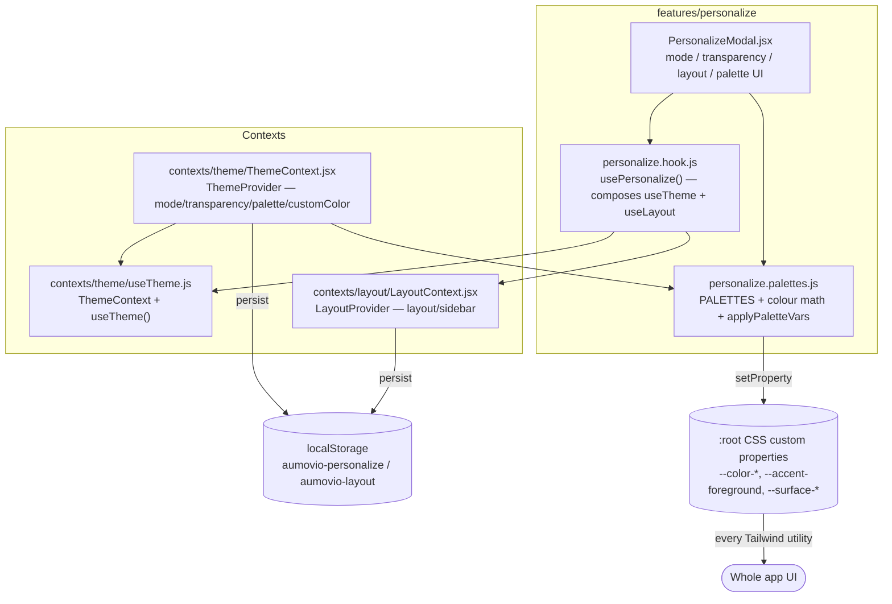
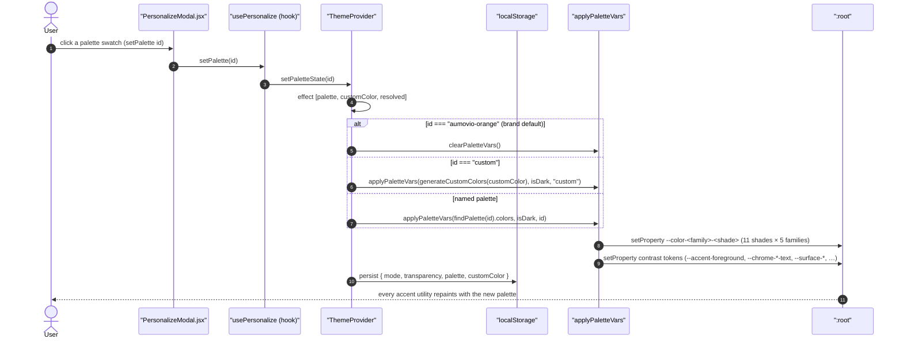
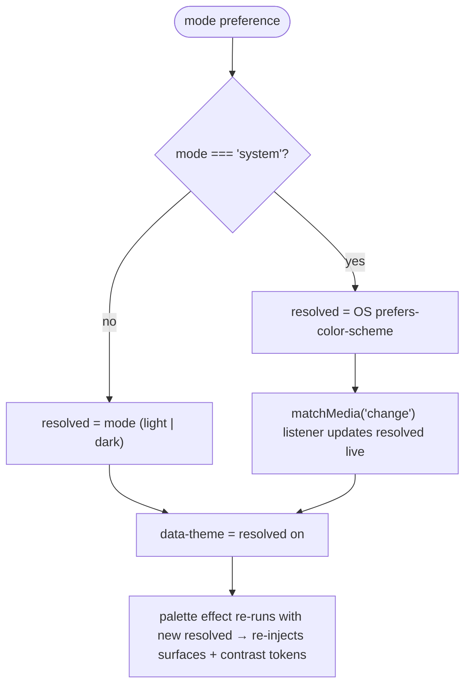

# Personalization — Technical Documentation

> **Scope:** the template's per-user appearance capability — colour-scheme mode (light / dark / system), the transparency toggle, the shell layout preference (sidebar / top bar), and the accent-palette system that regenerates the entire design-system colour vocabulary at runtime from five anchor colours, including the WCAG-driven contrast tokens that keep text and icons legible on every palette.
> **Source:** `Frontend/` (React 19 + Vite SPA). Core is `Frontend/src/features/personalize/personalize.palettes.js`, `Frontend/src/features/personalize/personalize.hook.js`, `Frontend/src/features/personalize/PersonalizeModal.jsx`, `Frontend/src/contexts/theme/ThemeContext.jsx`, `Frontend/src/contexts/theme/useTheme.js`, and `Frontend/src/contexts/layout/LayoutContext.jsx`.
> **Generated:** 2026-09-04. **Authority:** the code. Where `CLAUDE.md`, a JSDoc block or a source comment disagrees with the code, the code wins and the disagreement is recorded in [§6.4](#64-known-documentation-drift).
> **Rendering:** the ```mermaid fences below render in GitHub, GitLab, Obsidian and VS Code preview. A plain Markdown→PDF path (Chrome "print to PDF") will print them as code — pre-render with `npx @mermaid-js/mermaid-cli` if you need a PDF.

---

## 1. Overview

Personalization is entirely client-side — it touches no API and persists nothing on the server. Four preferences are involved: the colour-scheme **mode** (`light` / `dark` / `system`), a **transparency** toggle for backdrop-filter effects, the shell **layout** (`sidebar` / `top`), and the accent **palette**. The first three are simple stored flags. The palette is where the work is: choosing a named palette (or a single custom hex) regenerates the whole colour system at runtime.

The mechanism is CSS custom properties. Every palette defines **five anchor colours** — one per design-system colour family (primary/orange, secondary/purple, blue, turquoise, yellow). `applyPaletteVars()` (`personalize.palettes.js`) expands each anchor into a full 11-shade scale (`generateScale`) and writes them onto `:root` as `--color-<family>-<shade>` variables. Because every Tailwind utility in the app references those variables, `bg-orange-400`, `text-purple-400`, `border-blue-300` and the rest pick up the new colours without a single component changing. A custom colour is handled the same way: `generateCustomColors(hex)` derives the other four anchors by deterministic HSL hue rotation, so the same hex always produces the same five-colour scheme.

The hard part is legibility. A palette anchor that is near-black in dark mode or near-white in light mode would make raw `text-orange-400` invisible, so `applyPaletteVars()` additionally computes a family of **contrast tokens** — `--accent-foreground`, `--chrome-*-text`, `--on-accent-text`, semantic status colours, and a surface-elevation ladder — using WCAG 2.1 relative-luminance math (`getContrastRatio`, `relativeLuminance`, `pickOnColor`, `darkenToContrast` / `lightenToContrast`). Components that must meet contrast use these tokens (e.g. `text-(--accent-foreground)`) instead of a raw palette shade. Named palettes also ship three dark-mode anchors (`darkSurface` / `darkText` / `darkMuted`) so each palette generates its own dark theme rather than borrowing another's surfaces.

State lives in two contexts. `ThemeProvider` (`ThemeContext.jsx`) owns mode, transparency, palette, and custom colour, persists them to `localStorage`, and applies them to the DOM via `data-theme` / `data-transparency` attributes and the CSS-variable injection. `LayoutProvider` (`LayoutContext.jsx`) owns the shell layout preference. `usePersonalize()` composes both and exposes exactly what the `PersonalizeModal` needs.

---

## 2. Flow & Architecture

### 2.1 The layer map



### 2.2 Selecting a palette, end to end



The re-application dependency list is `[palette, customColor, resolved]` (`ThemeContext.jsx`), and `resolved` (the effective `light`/`dark`) is in it deliberately: toggling dark mode must re-inject the correct `--surface` / `--text` values and re-run the contrast math for the new scheme, so a palette that looks right in light mode is still legible in dark mode.

### 2.3 Resolving the effective colour scheme



`ThemeProvider` re-resolves `resolved` **synchronously during render** when `mode` changes (React's "adjust state when a prop changes" pattern) rather than in an effect, to avoid a flash of the previous theme (`ThemeContext.jsx`). When `mode === 'system'`, a `matchMedia("(prefers-color-scheme: dark)")` listener keeps `resolved` in sync with the OS live.

---

## 3. The palette system

### 3.1 Anchors → scales

A named palette entry is `{ id, name, colors }` where `colors` carries the five light-mode anchors (`primary`, `secondary`, `blue`, `turquoise`, `yellow`) and, for named palettes, three dark-mode anchors (`darkSurface`, `darkText`, `darkMuted`) (`personalize.palettes.js` `PALETTES`, `@typedef Palette`). The two brand palettes are `aumovio-orange` (primary `#ff4208`) and `aumovio-purple` (primary `#4827af`); the registry then continues with many named, dark-mode-extended palettes.

`generateScale(baseHex)` builds an 11-shade scale by mixing the anchor toward white for the light shades (50–300) and toward black for the dark shades (500–950), with the anchor itself at 400 — deterministic, so the same hex always yields the same scale. `applyPaletteVars()` runs `generateScale` for each anchor and writes `--color-<family>-<shade>` for all `50…950` across both the semantic family name and its alias (`orange`/`primary`, `purple`/`secondary`).

### 3.2 Custom colour derivation

`generateCustomColors(primaryHex)` derives a complete, self-contained palette from one hex using HSL hue rotation: `secondary` at +240°, `blue` at +205°, `turquoise` at +170°, `yellow` at +50°, each with clamped saturation/lightness. It also derives its own three dark-mode anchors from the primary hue so a custom palette generates its own dark theme instead of inheriting whichever named palette was selected before it (`personalize.palettes.js` `generateCustomColors`).

### 3.3 The contrast token family

Beyond the raw scales, `applyPaletteVars()` computes tokens that guarantee legibility regardless of the anchor:

| Token(s) | Purpose | Derived by |
| -------- | ------- | ---------- |
| `--accent`, `--accent-subtle`, `--accent-muted`, `--accent-on-dark` | interaction accents at safe opacities | anchor RGB + `lightenToLuminance` |
| `--on-accent-text`, `--text-on-accent`, `--on-secondary-text` | text colour on solid accent fills | `pickOnColor` (WCAG flip) |
| `--color-gradient-from/-to/-text` | gradient button tokens | anchors + midpoint `pickOnColor` |
| `--chrome-<from|to>-text/-muted/-faint/-hover*/-border/-ring/-glass*` | zone-adaptive chrome (navbar/sidebar gradient) foregrounds | `computeChromeTokens` |
| `--surface-0…4`, `--border-elevation`, `--border-subtle` | elevation ladder + boundaries | `generateDark/LightElevation` |
| status colours (`success`/`warning`/`danger`/`info`) | semantic — **not** part of the palette | `computeStatusColor` |

`pickOnColor(zoneHex)` decides white-vs-dark foregrounds by comparing the WCAG contrast ratio of each candidate against the zone, with a documented 15% bias toward white because light-on-dark reads perceptually stronger at equal ratios; the flip point is zone luminance ≈ 0.18, not 0.5 (`personalize.palettes.js` `pickOnColor`). Named palettes with problematic primaries redirect the light-mode background tint to a calmer family via `TINT_SOURCE_OVERRIDES`.

> The design-system rule (see `Frontend/CLAUDE.md` §Design tokens) is: use `text-(--accent-foreground)` / `--accent-icon` for accent icons and inline values on surfaces, **never** a raw `text-orange-400` / `text-primary-400`, because the raw anchor equals the palette primary and can be invisible for near-black or near-white primaries. Semantic status colours must not be swapped with the palette.

---

## 4. Persistence & DOM application

`ThemeProvider` reads preferences once on init (`loadPrefs`) from `localStorage` key `aumovio-personalize` (JSON `{ mode, transparency, palette, customColor }`), falling back to a legacy key `aumovio-theme` and then to `VITE_THEME` for mode, with defaults `mode: "system"`, `transparency: true`, `palette: "aumovio-orange"`, `customColor: null`. Corrupt or unavailable storage falls through to defaults.

DOM application uses three mechanisms:

- **`data-theme`** on `<html>` set to `resolved` — the light/dark switch (`ThemeContext.jsx`).
- **`data-transparency`** on `<html>` (`"on"`/`"off"`) set in a `useLayoutEffect` (before paint, no flash) — CSS targets `html[data-transparency="off"]` to disable all `backdrop-filter` effects.
- **CSS-variable injection** via `applyPaletteVars` / `clearPaletteVars` for the palette.

All four preferences are re-persisted whenever any of them changes.

### 4.1 Layout preference

`LayoutProvider` (`LayoutContext.jsx`) owns `layout` (`"sidebar"` | `"top"`) plus a mobile/tablet `sidebarOpen` overlay flag. It loads from `localStorage` key `aumovio-layout`, falls back to `VITE_LAYOUT_MODE` (`"top"` → top, else sidebar), and persists on change. On desktop (`lg+`) the sidebar is always visible via CSS; `sidebarOpen` only affects `< lg`. `useLayout()` throws if used outside the provider.

---

## 5. The Personalize modal

`PersonalizeModal.jsx` is a two-column modal driven entirely by `usePersonalize()`:

- **Mode selector** — three segmented buttons (`system` / `light` / `dark`) calling `setMode`.
- **Layout selector** — two buttons (`sidebar` / `top`) calling `setLayout`.
- **Transparency** — a `Toggle` bound to `setTransparency`.
- **Palette grid** — one swatch per entry in `PALETTES`, each rendering a five-segment `ColorStrip` of the palette's accent colours; the active swatch shows a check overlay. In dark mode a swatch also previews the palette's `darkSurface`.
- **Custom swatch** — opens a `ColorPicker` (with quick-pick presets); `generateCustomColors` shows the derived five-colour scheme live before it is applied.

`usePersonalize()` (`personalize.hook.js`) is the thin composition layer — it pulls `mode/isDark/transparency/palette/customColor` and their setters from `useTheme`, and `layout/setLayout` from `useLayout`, and returns exactly that set. The modal imports the hook, never the contexts directly.

---

## 6. Security & correctness notes

### 6.1 Client-only, no server trust

Personalization writes only to `localStorage` and `:root`; it makes no API calls and stores nothing server-side. A tampered `localStorage` value can only change the *appearance* of the current browser — `loadPrefs` validates `mode` against an allow-list and coerces types, and unknown palette ids resolve to the brand default via `findPalette` (`return PALETTES.find(...) ?? PALETTES[0]`).

### 6.2 No flash of wrong theme

Colour scheme is resolved during render and transparency is applied in `useLayoutEffect` (before paint), so a stored `dark` / transparency-`off` preference does not flash the previous state on load (`ThemeContext.jsx`).

### 6.3 Accessibility is the point

The entire contrast-token layer exists to keep the UI WCAG-legible across every palette. Contrast ratios are computed with correct relative-luminance math, foregrounds flip at the perceptually-correct luminance, and status colours are held separate from the accent so they never blend into palette identity (`computeStatusColor` hue-collision guard).

### 6.4 Known documentation drift

Documentation-only observations. **No code was changed.**

1. **No confirmed defects between code and its own docs.** The JSDoc, the `usePersonalize` return type, and the `ThemeContext.jsx` behaviour agree with the implementation as read. `Frontend/CLAUDE.md` §Design tokens describes the same `--accent-foreground` contrast rule this doc documents; no disagreement was found. *No owner action required.*
2. **Palette registry size is large and evolving.** This doc names the two brand palettes and the general structure of the named palettes rather than enumerating every entry in `PALETTES`, because the list is long and additive; treat `personalize.palettes.js` `PALETTES` as the authoritative, current list. *Documentation choice, not a defect.*
